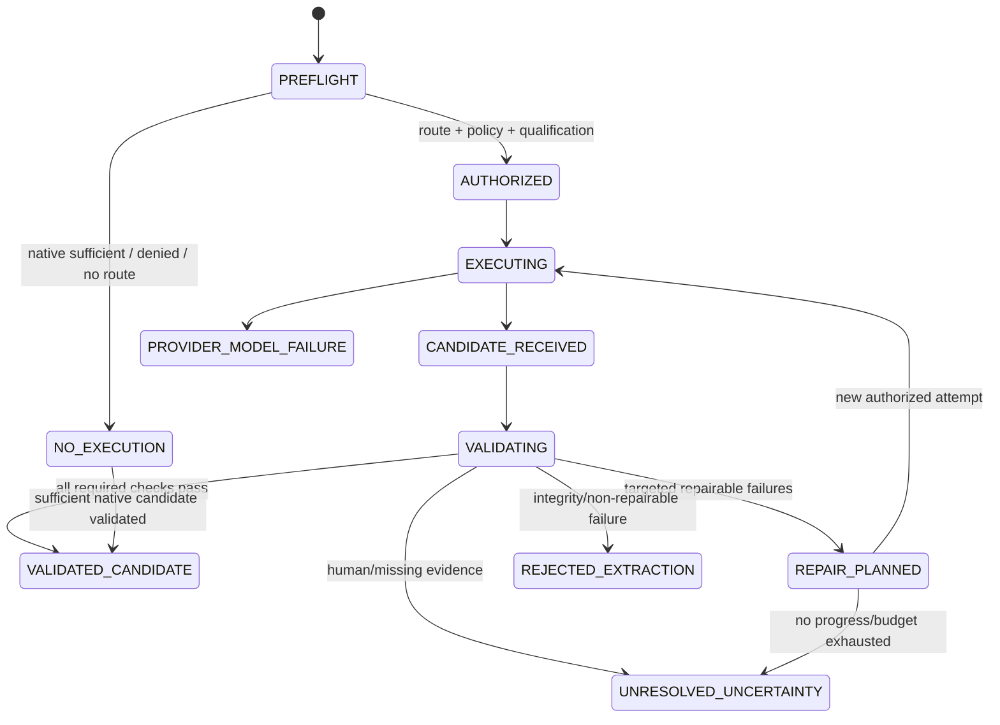

# АСД-КОНТУР — AI/VLM Execution & Verification Harness Specification v0.1

- **Статус документа:** `Accepted architecture baseline`
- **Дата:** 2026-08-21
- **Принято:** 2026-08-22 ведущим архитектором Codex по явным
  архитектурным полномочиям владельца продукта; qualification results,
  numerical floors/budgets и provider terms не приняты без evidence
- **Область:** объектно-независимое исполнение и проверка AI/VLM/OCR-
  извлечений во всех режимах `Tender`, `Support`, `Audit`, `Restoration`
- **Архитектурный статус положений:** `Invariant`, `Proposed`,
  `Owner Decision Required`, `Accepted`, `Rejected`, `Superseded`
- **Основания:** ADR-0006; `AUTHORIZATION_AND_AUDIT_MODEL_v0.1.md`;
  `DETERMINISTIC_RULES_CATALOGUE_v0.1.md`; принятые `RD-01…RD-05` и
  `DR-01…DR-04`; ADR-0007; ADR-0008

## 0. Назначение, нормативная сила и границы

Документ определяет логические контракты provider-neutral исполнения,
маршрутизации, валидации, ограниченного repair, reconciliation,
квалификации моделей и доказательной трассы AI/VLM/OCR-кандидатов. Он
является архитектурным входом для последующей Information Architecture и
Technical Architecture, но **не** разрешает реализацию.

### 0.1. Место в архитектуре

Harness расположен между источниками workspace и Candidate Lifecycle:

```text
SourceVersion + locator
  → deterministic preflight/native extraction
  → authorized routing
  → provider execution attempt
  → typed Candidate
  → deterministic validators
  → bounded targeted repair/reconciliation
  → terminal disposition
  → Candidate Lifecycle / human confirmation / deterministic rules
```

Для явно разрешённого platform-source ingestion тот же perception boundary
используется через физически отдельный platform ingestion ledger: exact
platform `SourceVersion/page/region → ProviderExecutionResult → platform
GuidanceCandidateVersion → validators → independent verification → human
curation → canonical ID Practice Intelligence`. Workspace execution relations
и nullable universal scope для этого не переиспользуются. Такой Candidate
может стать только ненормативным `methodological_practice`; он не становится
workspace Fact, NTD или RuleVersion. Qualification и Pass A/B доказывают метод
извлечения, но не превращают пособие в qualification corpus или benchmark.

Связи с нормативными документами:

- Source & Evidence Ledger задаёт identity, version, SHA-256 и locator;
- Authorization Model разрешает identity, capability, scope и egress;
- Rule Registry предоставляет pinned `RuleSetVersion`, validators и
  `RuleTrace`; semantic retrieval не определяет применимость;
- Knowledge Tool Gateway выдаёт только типизированный `EvidencePack`;
- Process/Event Specification оркестрирует команды и события без event
  sourcing;
- Lifecycle & Retention Specification управляет всеми request/response,
  render, Candidate, audit и cache artifacts;
- Domain Model остаётся единственным местом подтверждённых фактов.

### 0.2. Нормативные инварианты

1. Любой AI/VLM/OCR-ответ — только `Candidate` или draft, никогда не
   `confirmed_fact`, правило, финальный deliverable или human decision.
2. Ни model confidence, ни валидный JSON, ни совпадение двух прогонов не
   являются доказательством истинности поля.
3. Применимость нормы, обязательность документа, количество, геометрия,
   допуск, комплектность, конфликт, приоритет, блокировка и итоговый статус
   определяются утверждёнными правилами и/или уполномоченным человеком.
4. Native deterministic extraction выполняется до model execution, если
   формат позволяет; достаточный native result запрещает лишний VLM-вызов.
5. External egress — `default-deny`. Fallback не расширяет разрешение на
   данные, provider, model или destination.
6. Один execution attempt имеет неизменяемую identity всех profile/version
   компонентов. Любое изменение создаёт новый attempt.
7. Repair запускается только конкретными machine-readable failures,
   ограничен policy budget и не переписывает исходный Candidate.
8. Material operation fail-closed: `indeterminate`, `conflict`, missing
   critical evidence и validator failure не становятся `pass`.
9. Проектные artifacts всегда имеют `workspace_id`; cross-workspace batch,
   cache и контекст запрещены. Platform-source ingestion artifacts хранятся в
   отдельных platform relations без `workspace_id` и без live workspace links.
10. Qwen или другой provider не получает прямой SQL, прямой storage access,
    human authority или право менять RuleVersion.
11. Для исполнительной схемы AI не создаёт геометрию, координаты, размеры
    или объёмы. Схема строится только из подтверждённых исходных данных и
    детерминированных вычислений.

### 0.3. Что не проектируется

Документ не выбирает SDK, API transport, queue/broker, MLX runtime, Apple
framework, cloud vendor, OCR engine, физическую БД-схему, ORM, DSL, rule
engine, UI и конкретные numerical thresholds. Не создаются provider adapters,
промпты промышленного назначения, golden corpus или правила из содержания
неизученных НТД. Polza.ai — планируемый provider, но не архитектурная
зависимость.

### 0.4. Три результата и четыре режима

Один контракт применяется к договорным документам, ПД/РД и доказательной
геометрии для всех четырёх режимов. Различаются `ExtractionPurpose`,
`VerificationPolicy`, разрешённые providers и human confirmation matrix, но
не семантика Candidate, evidence, failure или terminal disposition.

### 0.5. Граница готовности продукта

`Accepted` — решение владельца продукта Олега Щербакова от 2026-08-21,
подтверждённое сообщением, начинающимся словами «Зафиксируй решение
владельца продукта Олега Щербакова от 2026‑08‑21» и формализованное
ADR-0007: готовность АСД-КОНТУР требует сквозной готовности `Tender`,
`Support`, `Audit` и `Restoration`.

Harness обязан иметь квалифицированные purpose/profile/validator paths для
всех VLM/OCR-задач, которые входят в E2E-контракт каждого режима. Успешная
qualification одной модели, одного purpose, Support-среза или корпуса ТМ-35
не доказывает готовность режима и тем более продукта. Information
Architecture должна показать mode-specific tasks, denied/unresolved states,
human confirmations и provenance, не меняя эти policy decisions.

## 1. Термины и четыре независимых измерения доверия

| Термин | Определение |
|---|---|
| `VlmExecutionProvider` | Provider-neutral integration boundary, способная исполнить утверждённый profile и вернуть унифицированный result либо typed failure. |
| `ProviderIdentity` | Стабильная identity организации/локального сервиса и его authorization principal; не URL и не название модели. |
| `ModelIdentity` | Семейство/назначение модели, независимое от конкретной ревизии и формата исполнения. |
| `ModelRevision` | Неизменяемая проверяемая ревизия весов/артефакта с digest или provider revision id. |
| `ExecutionProfile` | Версионированная композиция provider, endpoint profile, model revision, quantization/execution format, decoding/runtime limits и qualification identity. |
| `PreprocessingProfile` | Версия детерминированной подготовки: нормализация, crop/deskew/rotation/color handling без скрытого изменения источника. |
| `RenderingProfile` | Версия рендера: engine/version, DPI, color space, format, page box, rotation и coordinate transform. |
| `ExtractionPurpose` | Закрытый versioned код того, какие поля и для какого downstream process извлекаются. |
| `OutputSchemaVersion` | Неизменяемая typed schema Candidate для конкретной цели. |
| `VerificationPolicy` | Версионированный набор validators, critical fields, repair limits, terminal rules, human confirmation и budgets. |
| `ExecutionRequest` | Авторизованная неизменяемая команда на одну логическую попытку для указанного source scope. |
| `ExecutionAttempt` | Один вызов одного provider/model/profile по одному request payload; retry имеет новый attempt id и общий idempotency lineage. |
| `Candidate` | Неподтверждённое typed утверждение или draft, сохраняющее provenance каждого поля. |
| `FieldCandidate` | Одно типизированное значение, source locator, evidence, uncertainty и validation state. |
| `SourceLocator` | Точная адресация page/region/structural unit исходной `SourceVersion`; обязательна для материального поля. |
| `Validator` | Детерминированная проверка schema/type/range/unit/locator/rule/consistency, не принимающая human decision. |
| `ValidationFailure` | Machine-readable факт конкретного нарушения с кодом, target path, severity, evidence и repairability. |
| `RepairRequest` | Новый минимизированный request только для проваленных полей/regions, созданный из `ValidationFailure`, а не из абстрактного «проверь ещё раз». |
| `Reconciliation` | Детерминированное объединение immutable Candidate versions и validator outcomes без выбора «более красивого» ответа моделью. |
| `QualificationProfile` | Identity проверенного сочетания provider/model/revision/execution/preprocessing/rendering/prompt/schema/verification policy. |
| `GoldenCase` | Зафиксированный экспертами source scope с expected typed fields, допустимыми uncertainty и evidence locators. |
| `TerminalDisposition` | Финальный статус Harness: `validated_candidate`, `unresolved_uncertainty`, `rejected_extraction`, `provider_model_failure`. |

Четыре confidence не смешиваются:

| Измерение | Смысл | Может подтвердить факт? |
|---|---|---:|
| `model_self_confidence` | Самооценка provider/model | Нет |
| `extraction_quality_score` | Измеренный результат validators/qualification | Нет |
| `evidence_strength` | Класс и полнота source evidence | Нет, но является входом confirmation rule |
| `confirmation_status` | Результат authority/rule-driven Candidate Lifecycle | Только соответствующий переход может создать confirmed fact |

Отсутствующее измерение остаётся `unknown`, не получает `0`, `1` или default.

## 2. Provider и profile contract

### 2.1. Логический интерфейс `VlmExecutionProvider`

```text
describe_capabilities() -> ProviderCapabilities
health(profile_ref) -> ProviderHealth
submit(ExecutionRequest) -> ExecutionReceipt
poll(execution_id) -> ExecutionProgress
cancel(execution_id, reason) -> CancellationReceipt
fetch_result(execution_id) -> ProviderExecutionResult | ProviderFailure
```

`health=available` не означает `qualification=qualified`. Provider может
быть доступен, но запрещён для production profile. Contract обязан
поддерживать sync и async/batch реализации без изменения логического result.

`ProviderCapabilities` включает: provider identity/version, supported media,
schema/structured-output support, batch/cancel/idempotency support, payload
limits, region/page addressing, usage/cost reporting, declared processing and
retention policy reference. Credentials, endpoint secrets и workspace paths в
contract не раскрываются.

### 2.2. Полная identity исполнения

Результат уникально определяет tuple:

```text
(provider_identity, endpoint_profile_version, model_identity,
 model_revision, quantization_execution_format, execution_profile_version,
 prompt_template_version, output_schema_version,
 preprocessing_profile_version, rendering_profile_version,
 verification_policy_version)
```

Одинаковое marketing-name модели у локального и внешнего providers не делает
результаты эквивалентными. `Qwen3.8-27B` без provider/revision/format/profile
не является достаточной identity.

### 2.3. Пример локального profile

```json
{
  "execution_profile_id": "vlm.local.qwen-text-docs",
  "version": "proposed-example-v1",
  "provider_identity": "local-vlm-service",
  "endpoint_profile_ref": "local-authorized-profile",
  "model": {
    "identity": "Qwen3.8-27B",
    "revision": "required-content-digest",
    "quantization_execution_format": "MLX-8bit"
  },
  "capabilities": ["page_image", "typed_json"],
  "qualification_profile_ref": "required-before-production"
}
```

### 2.4. Пример внешнего batch-profile

```json
{
  "execution_profile_id": "vlm.external.mass-raster",
  "version": "proposed-example-v1",
  "provider_identity": "provider-neutral-external-vlm",
  "endpoint_profile_ref": "workspace-egress-allowlisted-profile",
  "model": {
    "identity": "qualified-qwen-compatible-vlm",
    "revision": "provider-declared-immutable-revision",
    "quantization_execution_format": "provider-declared"
  },
  "capabilities": ["async_batch", "page_image", "typed_json"],
  "qualification_profile_ref": "required-before-production"
}
```

Это логические примеры, не configuration, endpoint, ключи или признание
profile квалифицированным.

### 2.5. `ProviderExecutionResult`

Transport-level result не равен Candidate и не скрывает raw provider state:

```json
{
  "execution_id": "provider-or-local-opaque-id",
  "request_id": "uuid",
  "attempt_id": "uuid",
  "provider_identity": "...",
  "endpoint_profile_version": "...",
  "model_identity": "...",
  "model_revision": "...",
  "quantization_execution_format": "...",
  "execution_profile_version": "...",
  "provider_status": "completed|failed|cancelled|unknown",
  "finish_reason": "provider-code",
  "structured_output": "provider-payload-or-reference",
  "raw_response_digest": "sha256-or-null",
  "response_schema_claim": "...",
  "timings": {},
  "usage_cost": {},
  "provider_retention_receipt_ref": "policy-receipt-or-null",
  "received_at": "iso8601",
  "integrity": {"request_digest": "sha256", "response_digest": "sha256"}
}
```

Нормализация `ProviderExecutionResult → Candidate` выполняется trusted local
adapter по exact `OutputSchemaVersion`. Неизвестный status, missing identity,
digest mismatch или неразличимый partial response дают `ProviderFailure`, а
не Candidate с пустыми/default полями. OCR engine, если он недетерминирован и
возвращает probabilistic fields, использует тот же attempt/result contract;
детерминированный native parser фиксируется отдельным extraction method без
фиктивной model identity.

## 3. `ExecutionRequest`

Обязательный логический контракт:

```json
{
  "request_id": "uuid",
  "attempt_id": "uuid",
  "workspace_id": "uuid",
  "extraction_purpose": {"code": "typed-code", "version": "..."},
  "source": {
    "source_version_id": "uuid",
    "source_sha256": "sha256",
    "locators": [{"page": 1, "region": "typed-region-or-null"}],
    "payload_digests": ["sha256"]
  },
  "data_classification": "policy-code",
  "provider_identity": "...",
  "model_identity": "...",
  "execution_profile_ref": "...",
  "prompt_template_version": "...",
  "output_schema_version": "...",
  "preprocessing_profile_version": "...",
  "rendering_profile_version": "...",
  "verification_policy_version": "...",
  "pinned_rule_set_version": "...",
  "authorization_decision_id": "uuid",
  "workspace_egress_policy_version": "...",
  "idempotency_key": "opaque",
  "correlation_id": "uuid",
  "causation_id": "uuid",
  "budgets": {"time": "policy-ref", "tokens": "policy-ref", "cost": "policy-ref", "repair": "policy-ref"},
  "required_validators": ["validator-key/version"]
}
```

Guards:

- `attempt_id` уникален; retry/repair создаёт новый attempt и ссылается на
  parent attempt;
- source hash и locator сверяются до egress и после получения результата;
- external request содержит только разрешённые страницы/regions и minimum
  EvidencePack, никогда весь workspace «на всякий случай»;
- prompt injection в source не может менять provider, destination, scope,
  tool/capability, policy, page set, schema или budget;
- смешивание разных workspace в request/batch запрещено;
- отсутствие pinned RuleSet, authorization, policy или profile identity
  блокирует execution.

## 4. Унифицированный Candidate Result

```json
{
  "candidate_id": "uuid",
  "candidate_version": 1,
  "workspace_id": "uuid",
  "request_id": "uuid",
  "attempt_id": "uuid",
  "purpose": {"code": "...", "version": "..."},
  "source_version_id": "uuid",
  "source_scope": [{"page": 1, "region": "...", "render_digest": "sha256"}],
  "provider": {"identity": "...", "execution_profile": "..."},
  "model": {"identity": "...", "revision": "...", "format": "..."},
  "contract_versions": {
    "prompt": "...", "schema": "...", "preprocessing": "...",
    "rendering": "...", "verification_policy": "...", "rule_set": "..."
  },
  "fields": [
    {
      "path": "/typed/field",
      "value": "typed-value",
      "value_type": "schema-type",
      "unit": "explicit-or-null",
      "source_locators": [{"page": 1, "region": "..."}],
      "evidence_digest": "sha256",
      "model_self_confidence": null,
      "uncertainties": [],
      "validation_state": "pending"
    }
  ],
  "relations": [],
  "declared_omissions": [],
  "raw_response_digest": "sha256-or-null",
  "finish_reason": "provider-code",
  "timings": {},
  "usage_cost": {},
  "retry_repair_history": [],
  "candidate_status": "unverified"
}
```

Инварианты:

- материальное поле без locator — validation failure;
- source page в field locator обязан входить в authorized source scope;
- raw provider text не является typed field;
- неизвестная unit не подставляется; geometry без CRS/source lineage
  блокируется;
- declared omission отличима от отсутствующего поля и provider truncation;
- `candidate_status` не может иметь значение `confirmed_fact`.

## 5. Preflight: deterministic-first pipeline

Порядок обязателен и трассируется:

1. Проверить `workspace_id`, lifecycle state и source authorization.
2. Сверить `SourceVersion`, SHA-256, media type и locator boundaries.
3. Получить data classification и `WorkspaceEgressPolicy`.
4. Определить `ExtractionPurpose` до выбора provider.
5. Проверить наличие пригодного native text/structured layer.
6. Выполнить native parser/extractor в разрешённом source scope.
7. Провалидировать native result теми же typed validators.
8. Если native result достаточен для цели — завершить без VLM.
9. Иначе классифицировать страницы/regions детерминированными признаками и
   зафиксировать gaps, не «пустоту».
10. Выбрать минимальный page/region set.
11. Разрешить routing policy и provider/model/profile allowlists.
12. Проверить qualification status конкретного полного profile tuple.
13. Проверить resource/time/token/cost/repair budgets.
14. Создать immutable request, authorization decision и request digest.
15. Только затем вызвать provider.

Native text, OCR и VLM не образуют скрытую лестницу «при любой ошибке вызвать
следующий». Каждый переход имеет typed reason. Наличие шрифта само по себе не
доказывает пригодный text layer; отсутствие большого объёма текста не
доказывает, что страница требует внешнего provider.

## 6. Rendering и coordinate lineage

Каждый raster artifact имеет неизменяемый `RenderArtifact`:

```text
render_artifact_id, workspace_id, source_version_id, page_locator,
source_sha256, rendering_profile_version, renderer_name/version,
page_box, source_rotation, applied_rotation, dpi_x/dpi_y, pixel_width/height,
color_space, image_format, preprocessing_profile_version,
source_to_render_transform, render_to_source_transform, render_sha256
```

Требования:

- page numbering и crop box задаются явно; off-by-one недопустим;
- region locator хранится в своей coordinate space и имеет transform в
  координаты исходной страницы;
- resize, crop, deskew, rotation и tiling не теряют parent lineage;
- каждая tile имеет overlap/padding, parent region и digest;
- OCR/VLM bounding box без обратимого transform не может подтверждать
  геометрию;
- изменение DPI, renderer, rotation, page box или preprocessing создаёт новый
  render artifact и новый attempt;
- JPEG/PNG/другой формат — policy choice конкретного profile; мелкий текст и
  чертежи требуют qualification, а не архитектурного предположения;
- source bytes не заменяются render bytes в Evidence Ledger.

## 7. Routing Policy

### 7.1. Входы решения

Versioned `RoutingPolicy` учитывает:

- data classification и purpose;
- workspace lifecycle и egress policy;
- document/page type и пригодность native layer;
- page/region volume и task complexity;
- confidentiality, legal/contractual and executive-scheme relevance;
- latency/cost/resource budgets;
- provider/model/profile qualification and availability;
- required VerificationPolicy;
- legal hold, incident/quarantine и retry history.

### 7.2. Результаты routing

```text
native_only | local_ocr | local_vlm | authorized_external_vlm | no_execution
```

Предпочтительный порядок — deterministic native extraction, затем достаточный
локальный контур. Локальный Qwen3.8-27B является основным VLM operational
profile на MBP, но domain contract от него не зависит. External provider
разрешён для policy-permitted массовых растровых PDF; confidential, legal и
executive-scheme related data по умолчанию остаются локальными до явного
policy allow.

`RoutingTrace` фиксирует policy/rule versions, входные факты, рассмотренные
routes, выбранный route, rejected alternatives и authorization. Он совместим
с общим envelope `RuleTrace`, но не подменяет domain applicability rule.

### 7.3. Fallback

- provider unavailable не разрешает automatic external egress;
- fallback provider/model/profile проходит новую authorization и qualification
  проверку;
- payload scope не расширяется;
- provider switch создаёт новый request/attempt lineage;
- silent switch запрещён даже при одинаковом model name;
- если разрешённого route нет, итог `provider_model_failure` или
  `unresolved_uncertainty`, а не empty success.

## 8. Verification pipeline

Для каждого Candidate применяется policy-ordered pipeline:

1. Проверить transport/wire integrity и provider result identity.
2. Сверить request/attempt/source/workspace/correlation identity.
3. Проверить finish reason, truncation и обязательные response digests.
4. Выполнить JSON/schema validation без восстановления по догадке.
5. Проверить types, enum, nullability и required fields.
6. Проверить page/region locators и coordinate transforms.
7. Проверить field-level evidence и отсутствие locator вне authorized scope.
8. Проверить units, dimensions, number representation, precision и ranges.
9. Проверить cross-field dependencies.
10. Проверить cross-page consistency и duplicate/contradictory fields.
11. Сверить с пригодным native text/OCR без признания простого совпадения
    доказательством.
12. Сверить с canonical entities и exact source identities.
13. Получить применимые approved validators/rules по pinned RuleSetVersion.
14. Проверить edition/effective-date/applicability, когда цель затрагивает НТД.
15. Выполнить domain completeness, geometry и consistency validators.
16. Сформировать gaps, conflicts, missing inputs и uncertainties.
17. Для repairable failures сформировать targeted repair request.
18. После исчерпания policy cycles определить terminal disposition.

Любой skipped обязательный validator имеет typed reason и по умолчанию делает
материальный Candidate `unresolved_uncertainty`, не `validated_candidate`.

### 8.1. `ValidationFailure`

```json
{
  "failure_id": "uuid",
  "validator": {"key": "unit.validator", "version": "..."},
  "candidate_id": "uuid",
  "candidate_version": 1,
  "target_path": "/fields/3/value",
  "code": "UNIT_MISSING",
  "severity": "error",
  "actual": {"digest_or_safe_value": "..."},
  "expected_contract": "rule-or-schema-ref",
  "source_locators": [{"page": 4, "region": "..."}],
  "evidence_refs": ["..."],
  "repairability": "targeted_repair|human_required|not_repairable",
  "blocks_terminal_validation": true,
  "details_content_free": "machine-readable parameters"
}
```

Failure code — закрытый versioned vocabulary. Free-form message допустима
только как объяснение и не управляет repair.

### 8.2. Минимальный validator registry

| Validator | Проверяет | Пример failure |
|---|---|---|
| schema | output contract | `SCHEMA_REQUIRED_FIELD_MISSING` |
| type | typed value | `TYPE_MISMATCH` |
| unit | explicit/allowed unit | `UNIT_MISSING`, `UNIT_INCOMPATIBLE` |
| range | domain/rule boundary | `OUT_OF_RANGE` |
| required-field | purpose completeness | `PURPOSE_FIELD_MISSING` |
| locator | page/region/source lineage | `LOCATOR_INVALID` |
| duplicate | duplicate/conflicting instance | `DUPLICATE_CONFLICT` |
| cross-field | dependent fields | `CROSS_FIELD_INCONSISTENT` |
| cross-page | document-wide consistency | `CROSS_PAGE_CONFLICT` |
| edition | exact NormativeEdition/effective interval | `EDITION_UNAVAILABLE` |
| native comparison | native/OCR discrepancy | `NATIVE_TEXT_MISMATCH` |
| geometry | CRS, inputs, topology, tolerance | `GEOMETRY_INPUT_UNCONFIRMED` |
| domain consistency | approved rules/canonical entities | `DOMAIN_RULE_FAILED` |

## 9. State machine и bounded repair



### 9.1. Repair rules

1. Repair input формируется только из failure codes и минимальных relevant
   fields/pages/regions.
2. Исходный Candidate immutable; repair создаёт новую version и parent link.
3. Полный документ повторно не отправляется, если failure локален.
4. Repair не может менять purpose/schema/policy/RuleSet незаметно.
5. Каждый cycle уменьшает unresolved failure set либо фиксирует `no_progress`.
6. `no_progress`, повтор одного failure fingerprint или исчерпание budget
   завершает цикл.
7. Provider switch — не repair внутри attempt, а новый authorized route.
8. Self-reflection без deterministic validator feedback запрещена.
9. Два согласных model responses не отменяют source/validator/human checks.

### 9.2. Reconciliation

Детерминированный merge использует field path, source locator, schema version
и validator outcomes. Порядок попыток не является priority. Поле принимается
в следующую CandidateVersion только если:

- оно относится к запрошенному failed target;
- его locator входит в authorized scope;
- оно прошло обязательные validators;
- оно не создаёт новый неразрешённый conflict;
- предыдущая версия и причина замены сохранены.

При двух разных прошедших значениях возникает `FieldConflict`; модель не
выбирает победителя. ConflictPolicy или human authority определяет дальнейший
процесс.

## 10. `VerificationPolicy`

```text
verification_policy_id/version/status/effective_interval
purpose/schema compatibility
required/optional validator refs and order
critical field set
failure severity mapping
repairable failure codes
max attempts/cycles/no-progress rule
time/token/cost/page budgets
provider-switch policy
human confirmation matrix
terminal disposition rules
raw artifact policy
audit/retention refs
author/reviewer/approver/test suite
```

Policy version immutable после approval. Production request с отсутствующим
или неутверждённым policy блокируется. Конкретные counts, timeouts, token/cost
limits и quality thresholds устанавливаются только после benchmark и owner
decision `HV-*`; эта спецификация не зашивает числа.

## 11. Terminal dispositions

| Disposition | Условие | Downstream право |
|---|---|---|
| `validated_candidate` | Все required validators выполнены, blocking failures/conflicts отсутствуют | Может войти в Candidate Lifecycle; всё ещё не факт |
| `unresolved_uncertainty` | Недостаточны evidence/input, требуется human decision, исчерпан repair или есть formal conflict | Создать `Uncertainty`, блокировать material operation |
| `rejected_extraction` | Integrity/schema/source-scope violation либо non-repairable invalid output | Не использовать значения; сохранять failure provenance по retention policy |
| `provider_model_failure` | Provider unavailable/timeout/cancel/model failure/no authorized route | Retry только по policy; не трактовать как пустой документ |

Отдельный `no_execution` — технический preflight outcome: native path оказался
достаточен либо вызов запрещён/не нужен. Он преобразуется в один из четырёх
terminal dispositions после native validation или policy failure mapping.

## 12. Юридический/договорный profile

Для протокола разногласий и переработанного договора Harness:

- сначала извлекает native structured/text layer и точные clause locators;
- разделяет текст условия, source authority, proposed interpretation и draft;
- проверяет ссылки на НТД/законодательство через exact canonical identities и
  applicable editions, а не по упоминанию строки моделью;
- не объявляет договорный риск, precedence или обязательность без approved
  RuleVersion/ConflictPolicy либо qualified human decision;
- любое отсутствующее основание создаёт typed uncertainty;
- model-generated clause и explanation маркируются draft;
- finalization требует authority из Authorization Model и сохраняет
  RuleTrace/EvidencePack.

External processing юридических документов не разрешено blanket-политикой:
нужен отдельный allow соответствующей data class, purpose и page scope.

## 13. Граница исполнительных схем

AI/VLM может распознать кандидат оси/размера/отметки, классифицировать лист,
связать надпись с region и подготовить layout draft. Он не может создать
истинное числовое/геометрическое значение.

Обязательный gate геометрического поля:

```text
confirmed SourceVersion + exact region + coordinate lineage
→ typed value + explicit unit/precision
→ confirmed coordinate reference system
→ deterministic conversion/calculation
→ geometry/tolerance/cross-source validators
→ human/authority confirmation where required
→ versioned geometry fact
→ executive-scheme renderer
```

`model_self_confidence`, даже высокий, не заменяет ни один шаг. Если CRS,
масштаб, исходные точки, фактические измерения или применимый tolerance
отсутствуют, terminal result — `unresolved_uncertainty`; схема не финализируется.

## 14. Knowledge Tool Gateway

Локальный orchestrator Harness может вызывать минимум:

- `knowledge.get_applicable_rules`;
- `knowledge.trace_assertion`;
- `knowledge.explain_conflict`;
- `knowledge.get_required_documents`.

Gateway возвращает approved `RuleVersion`, pinned `RuleSetVersion`,
`EvidencePack`, exact locators, conflicts, gaps и uncertainties. Model получает
данные только как минимизированный tool result и не получает capability
изменить rule/applicability/confirmation.

External provider **не** вызывает Knowledge Tool Gateway напрямую. Trusted
локальный orchestrator до egress формирует минимальный allowlisted
`ExternalEvidencePack`, содержащий только сведения, разрешённые purpose и
WorkspaceEgressPolicy. Внешний ответ не может запросить новые tools/pages или
расширить pack через prompt injection.

## 15. Authorization и external egress

### 15.1. Identities и capabilities

- local provider — service identity с `vlm.local.invoke`;
- external provider — отдельная integration/service identity с
  `vlm.external.invoke`;
- router, renderer, validator, repair planner, queue worker и human confirmer
  имеют разные identities/capabilities;
- service/model identity не имеет human approval authority.

Перед external execution PDP обязан проверить: actor/service identity,
workspace membership, lifecycle state, atomic capability, purpose, source
scope, data class, WorkspaceEgressPolicy, provider/model/execution-profile
allowlists, qualification, provider processing/retention policy, payload
minimum, budget и correlation lineage.

External provider не получает direct SQL, storage credentials, storage URLs с
широким scope, произвольный document listing, other-workspace data, human
authority, Candidate confirmation, deliverable finalization или
PromotionDecision.

### 15.2. Prompt-injection boundary

Instruction-like content inside source рассматривается как data. Оно не может
изменить provider, destination, classification, page selection, tools,
credentials, retention, output schema, verification policy или budget. Эти
поля поступают только из trusted control plane и исключаются из model-editable
output.

### 15.3. Execution node и distributed route по ADR-0008

Harness различает provider/profile identity и `execution_node_identity`.
Перенос одного model/provider profile между MBP и VPS создаёт иной route
identity и требует отдельной qualification evidence: network boundary,
credentials, preprocessing/rendering, latency/failure behavior и artifact
retention могут отличаться. Model name и прежняя qualification не
переносятся автоматически.

Локальный Qwen3.8-27B исполняется на MBP authoritative node. External VLM
может вызываться только через provider-neutral boundary.
`TECHNICAL_ARCHITECTURE_v0.3.md` выбирает по `TA-TD-18` VPS controlled-egress
gateway; MBP direct не является production route этой редакции. До
утверждения exact route/profile policies, implementation и отдельной
qualification VPS route внешнее production execution denied.

Для любого маршрута одинаково обязательны HV-01…HV-08: fresh routing и
authorization, data-class×purpose allowlist, WorkspaceEgressPolicy, provider
terms, minimized page/region payload, execution/repair budget, qualification,
confirmation policy, raw-artifact policy, ordered fallback и cost envelope.
VPS receipt/S3 write/provider HTTP success не превращает result в Candidate
или Fact: trusted MBP flow должен принять exact `ProviderExecutionResult`,
проверить schema/digests/provenance и выполнить validators/confirmation.

External provider не получает direct access к MBP PostgreSQL, S3 workspace
namespace или Knowledge Gateway. Любые request/response/render artifacts на
MBP, VPS или S3 остаются workspace memory; platform/VPS logs содержат только
разрешённые identifiers, versions, digests, policy/outcome и не копируют
project payload.

## 16. Audit и retention

### 16.1. Content-minimized audit

Audit внешнего и локального вызова фиксирует:

- workspace/request/attempt/correlation/causation ids;
- source version и разрешённые page/region locators;
- provider/model/revision/execution profile;
- purpose, policy and authorization decision versions;
- prompt/schema/preprocessing/rendering/verification versions;
- request/response/render/candidate digests;
- timestamps, timings, usage/cost;
- outcome, terminal disposition, validation failure codes;
- retry/repair count, parent attempt и reconciliation result.

Audit не содержит API key, credential, full document, full project-bearing
prompt, full response, unrestricted path или данные другого workspace.

### 16.2. Workspace artifacts

Request payload, render/tile, native/OCR text, raw response, Candidate
versions, ValidationFailure detail, repair prompt и reconciliation artifacts —
workspace memory. Они подчиняются полному `RetentionProfile`, archive policy,
legal hold и deletion plan. После verified reset project artifacts не
сохраняются в platform audit; остаются только content-free audit и
`DestructionAttestation` по RD-03/A. Promotion Gate не является обходом этой
политики.

Provider-side retention/processing обязан быть известным policy fact. Если
provider не может подтвердить допустимую политику, egress запрещён. Неизвестная
provider deletion status отражается как residue/risk, а не как success.

## 17. Cache, deduplication и exact identity

Cache key обязан включать полный tuple:

```text
workspace_id + source_version_id + exact locator set + payload/render digest
+ purpose/version + provider + endpoint profile + model revision/format
+ prompt/schema/preprocessing/rendering/verification policy versions
+ pinned RuleSetVersion
```

Требования:

- cross-workspace Candidate/response/render cache запрещён;
- platform model weights и immutable platform artifacts отделены от request
  caches;
- cache hit повторно проходит current authorization, lifecycle, policy,
  qualification и applicability checks;
- cached Candidate не становится подтверждённым из-за прежнего validation;
- controlled RuleSet upgrade не переписывает старый result: создаётся новая
  evaluation/Candidate lineage;
- cache entry с неполной identity или integrity mismatch quarantined;
- dedup по source hash не даёт право доступа и не разрешает shared project
  artifact contrary RD-03.

## 18. Retry, idempotency и recovery

Различаются:

- **transport retry** — тот же immutable payload/idempotency key после
  неизвестного transport outcome;
- **execution retry** — новый attempt после typed transient failure;
- **repair** — новый минимальный payload из validator failures;
- **re-run** — новая business request по той же source version;
- **re-evaluation** — те же Candidate inputs под новой разрешённой
  RuleSetVersion/VerificationPolicy, с сохранением старого результата.

| Failure | Состояние | Допустимое действие | Запрещено |
|---|---|---|---|
| Timeout, outcome unknown | fenced/pending reconciliation | provider idempotency lookup, затем bounded retry | создать два независимых результата без reconcile |
| Rate/resource pressure | queued/deferred | retry по budget/backoff | silent provider switch |
| Invalid JSON/schema | validation failed | targeted repair, если policy разрешает | угадывать/дополнять поля parser-ом |
| Partial batch | item failures + resumable manifest | resume только missing/failed items | считать batch successful |
| Worker crash after provider success | recovery required | fetch by execution/idempotency id | повторить egress вслепую |
| Source changed | request stale | новый request на новую SourceVersion | прикрепить старый result к новым bytes |
| Policy/allowlist revoked | authorization denied | stop/cancel at safe point | продолжить по старому cache decision |
| Repair no progress | terminal unresolved | human/missing-input path | infinite self-reflection |

## 19. Batch contract

`BatchManifest` содержит один `workspace_id`, purpose/profile/policy versions,
общий authorization scope и items:

```text
item_id, source_version_id, exact page/region, source/render digest,
request/idempotency key, state, attempt ids, terminal disposition,
validation summary, cost/usage, checkpoint
```

Состояния item: `planned → authorized → submitted → running → received →
validating → terminal`; отдельно `cancel_requested/cancelled/recovery_required`.

Инварианты:

- batch с двумя workspace структурно невалиден;
- item-level failure не стирает успех других items, но batch success требует
  terminal disposition каждого обязательного item;
- missing page/item не считается empty document;
- checkpoint атомарен и не переписывает старые attempts;
- resume сверяет manifest/source/policy digests;
- cancel не удаляет уже полученный audit/result и не означает provider-side
  deletion;
- cost aggregation не скрывает per-item usage и policy overrun;
- reconciliation после partial provider response обязателен.

## 20. Локальный resource profile MBP

MacBook Pro M5 Max, 128 GB unified memory и локальный Qwen3.8-27B — текущий
operational profile, не domain invariant. До измеренной capacity qualification
применяется conservative policy: один heavy Metal inference session за раз;
parallel preflight/render/validation допускается только в пределах измеренных
resource budgets.

Наблюдаются: unified memory pressure, swap delta, Metal availability, model
load time, prompt/prefill и generation timings, render memory, queue depth,
temp/cache volume, thermal/throttling indicators и recovery cleanup. Numeric
thresholds задаются profile policy после benchmark. RAM availability не
разрешает egress, а свободный SSD не определяет retention.

Архитектура не зависит от Apple/MLX: `VlmExecutionProvider`, profile identity,
Candidate и validator contracts сохраняются при замене runtime/model/device.

## 21. Qualification Model

### 21.1. Identity и lifecycle

Квалифицируется полный profile tuple §2.2 для конкретных purpose/schema/data
strata. Состояния:

```text
draft → evaluation_ready → evaluated → reviewed → qualified
                                  └→ rejected
qualified → suspended → re_evaluation → qualified|rejected
qualified → superseded
```

Production routing разрешает только `qualified` profile в применимой области.
Изменение provider, endpoint profile, model revision, format/quantization,
prompt, schema, preprocessing, rendering или verification policy требует
отдельной qualification identity; нельзя переносить статус по имени модели.

### 21.2. Evaluation corpus

Object-independent corpus стратифицируется минимум по:

- native text / clean raster / degraded raster / mixed page;
- text, table, stamp/signature, handwriting, drawing/scheme;
- contract/legal clauses, PD/RD, ID, material/control evidence;
- page density, rotation, scan defects, multi-page dependencies;
- ambiguous/missing data, adversarial instruction content;
- geometry with and without sufficient CRS/source measurements;
- four product modes and three immutable product outputs.

TM-35 может позднее стать одним regression stratum, но не определяет schema,
thresholds, routing или catalogue и не замыкает qualification ни одного
режима. Для readiness evidence требуется трассируемое покрытие всех
применимых purpose/schema/data strata каждого из четырёх mode E2E-контрактов;
неприменимость конкретного VLM purpose должна быть доказана process contract,
а не отсутствием кейса в пилоте.

### 21.3. Metrics

Метрики считаются по field/type/purpose/stratum:

- schema-valid and locator-valid rate;
- precision/recall/exact match для typed fields;
- false-supported and false-confident rate;
- critical-field omission/hallucination rate;
- unit/range/edition/geometry violation rate;
- uncertainty/refusal quality;
- repair success, no-progress and regression rate;
- local/external agreement **только как diagnostic**;
- latency, memory, throughput, availability и cost.

Средняя метрика не может скрыть failure критических полей. Production
qualification требует owner-approved thresholds/floors и независимый review.

## 22. Golden cases и regression

Каждый `GoldenCase` содержит source version/digest, exact page/regions,
purpose/schema, expected typed values и locators, acceptable variants,
required uncertainties/refusals, critical fields, applicable RuleSet,
reviewers/authority и provenance. Полный source остаётся в управляемом
test/workspace scope, не копируется в audit.

Обязательные категории тестов:

- positive, negative, boundary, missing-field, invalid-type;
- wrong page/region, rotated/cropped/tiled coordinate lineage;
- native-text sufficiency and VLM-not-called;
- prompt injection and page-scope escalation;
- local/external profile comparison;
- malformed/truncated/extra-field response;
- unit/range/cross-field/cross-page conflicts;
- edition unavailable/cancelled/superseded;
- duplicate and contradictory Candidate fields;
- bounded repair success/no-progress/budget exhaustion;
- timeout/duplicate callback/worker crash/partial batch/resume;
- egress denied/revoked/fallback denied;
- geometry without CRS/source measurement;
- legal citation absent from canonical source;
- retention/reset and cross-workspace cache leakage.

Regression run сохраняет immutable report и qualification impact. Regression
failure suspends affected profile fail-closed; он не исправляется сменой
threshold «до зелёного» без нового reviewed policy version.

## 23. Commands, events и current state

Минимальные commands:

```text
PlanExtraction, AuthorizeExecution, SubmitExecution, CancelExecution,
RecordProviderResult, ValidateCandidate, PlanTargetedRepair,
AuthorizeRepair, ReconcileCandidate, DetermineTerminalDisposition,
QualifyExecutionProfile, SuspendExecutionProfile
```

Минимальные events:

```text
ExtractionPlanned, ExecutionAuthorized|Denied, ExecutionSubmitted,
ExecutionCompleted|Failed|Cancelled, CandidateReceived,
CandidateValidationCompleted, RepairPlanned|Exhausted,
CandidateReconciled, CandidateTerminallyDisposed,
ExecutionProfileQualified|Suspended|Rejected
```

Каждый command имеет `command_id`, actor/service identity, workspace scope,
expected lifecycle/version, idempotency/correlation/causation ids и policy
refs. Event — immutable факт material transition; audit — security/governance
record; job status — operational projection; Candidate — domain workspace
entity. Ни event, ни audit не являются system of record current state. Полный
event replay не требуется и event sourcing не вводится.

## 24. Threat model

| Угроза | Prevention | Detection | Recovery | Residual risk |
|---|---|---|---|---|
| Prompt injection меняет destination/tools | trusted control plane; source as data; atomic capabilities | policy/request diff, forbidden-output validator | cancel/quarantine, revoke credential | provider может интерпретировать content, но не получает control authority |
| Cross-workspace payload/batch | mandatory workspace scope; single-workspace manifest; scoped refs | leak tests, request digest/inventory | quarantine and incident review | operator misclassification requires audit/review |
| Silent external fallback | new authorization for every provider switch | RoutingTrace/provider identity mismatch | reject result, revoke profile | availability pressure may delay work |
| Model/provider spoofing | immutable revision/profile identity and signed/provider receipts | digest/revision/qualification mismatch | suspend profile, re-run qualified profile | external revision attestation quality varies |
| Truncated/malformed output accepted | finish/schema/required-field validators | failure codes and completeness check | targeted repair or reject | semantically wrong valid fields remain possible |
| Hallucinated evidence locator | locator/source-scope/digest validation | exact page/region comparison | unresolved/reject | visually ambiguous source may need human |
| High confidence treated as fact | separate confidence axes; Candidate lifecycle | audit rule/transition guard | revoke invalid confirmation, incident analysis | human may over-trust explanation |
| Duplicate callback/retry creates conflicting results | idempotency and attempt lineage | reconciliation inventory | quarantine duplicates, deterministic merge | provider idempotency may be imperfect |
| Cache leaks project data | full scoped key; no cross-workspace cache | residual/hash/fragment scan | purge adapter, incident/quarantine | backups/provider retention remain declared residues |
| Credential leakage | secret manager; never prompt/audit/archive | secret scanning and auth anomalies | revoke/rotate | third-party processing risk remains policy-bound |
| Geometry fabricated from drawing | confirmed-input/CRS gate; deterministic calculator | geometry validator and trace | block scheme, request measurements | source drawing itself may be wrong |
| Two model runs collude/agree wrongly | agreement never proof | independent source/rule validators | human/alternative evidence | correlated model errors persist |
| Provider retains payload | allowlisted policy/contract and minimization | provider receipt/audit/reconciliation | revoke provider, residue/incident handling | deletion may not be independently observable |
| Resource exhaustion on MBP | measured queue/budgets, one heavy session default | memory/swap/queue telemetry | cancel/recover/requeue | long latency under contention |

## 25. Логическое хранение и rebuildable projections

Будущий канон workspace включает immutable request/attempt metadata,
Candidate versions, validator outcomes, terminal disposition и evidence refs.
Raw responses/renders могут храниться как scoped artifacts по принятому
`RetentionProfile`/решению HV-06. Provider queues, progress views, compiled
schemas, render caches, request caches и evaluation dashboards — rebuildable
projections.

Platform memory хранит profile/policy/schema/prompt identities, approved
validator/rule references, qualification reports и content-free governance
audit. Project payload или live-link на уничтоженный workspace не становится
platform memory. PostgreSQL — будущий канон метаданных по Domain Model;
физическая схема, blob adapter и runtime будут определены позднее. Здесь ORM и
миграции не создаются.

ADR-0011 дополнительно закрепляет provider-independent practice memory.
Verified guide candidates are construction inputs for immutable typed
`ID Practice Intelligence`, not independent RAG chunks. Before every
ID-related provider attempt the trusted application boundary must run a pinned
deterministic `ContextAssemblyPolicy` and attach the resulting
`IDPracticeContextPack`. The provider cannot opt out, browse canonical memory,
or change selected unit identities. Missing context, normative conflict and
edition mismatch are typed pre-execution outcomes; no model-only fallback is
allowed. Changing the VLM/profile leaves canonical knowledge unchanged.

## 26. Сопоставление с текущим кодом `asd_kontur`

Статусы: «соответствует» — доказано кодом; «временно» — полезный пилотный
механизм без целевого governance; «противоречит» — нельзя переносить в Harness;
«отсутствует» — целевая capability ещё не реализована.

| Target capability | Existing file | Соответствует | Временно | Противоречит | Отсутствует |
|---|---|---|---|---|---|
| Source manifest/digest | `src/asd_kontur/corpus/models.py`, `scanner.py` | File SHA-256, relative locator, deterministic manifest, `UNKNOWN` text state | Local filesystem corpus | — | workspace/policy identity |
| Native-first routing | `src/asd_kontur/extraction/text_layer.py`; `tools/classify_with_local_vlm.py` | Page-scoped probe; usable native text prevents VLM; tests verify lazy no-call | Fixed heuristic thresholds and first page | Font/length alone cannot become universal policy | versioned purpose/routing policy |
| Local execution | `src/asd_kontur/extraction/mlx_vlm_adapter.py`; `_mlx_vlm_*runner.py` | Explicit wire schema, Metal check, runtime commit/version, typed failure, session/batch | MLX path/model config, pilot timeouts and one prompt | Runtime identity by path alone insufficient | provider-neutral contract and authorization |
| Render lineage | `mlx_vlm_adapter.py::render_pdf_page_to_png` | Page and DPI enter call; image hash later recorded | Filename-based temp PNG | No full transform/page-box/renderer identity | `RenderArtifact` contract |
| Typed Candidate schema | `candidate_mode.py`; `bridge/extraction_outcome.py` | Required fields, evidence quotes, review flag, provenance | Work-type-specific pilot schema | Model confidence remains a single scalar | generic FieldCandidate and confidence separation |
| Parse failure semantics | `candidate_mode.py`; `mlx_vlm_adapter.py` | Invalid JSON/schema becomes typed failure, not guessed value | Some validators return `None` rather than failure code | — | shared failure vocabulary |
| Candidate publication boundary | `bridge/build.py` | VLM label is not canonical key; quote must match mapping; ambiguous/unsupported is issue | Keyword JSON mapping is pilot configuration | Legacy `confidence` still enters domain candidate | full RuleVersion validators/human confirmation |
| Provenance | `bridge/build.py`, `domain/trace.py` | Source/hash/page/method/model/prompt/rule-set traces | Packed locator string; current timestamp in RuleTrace | — | typed locator/attempt/profile refs |
| Batch/session resilience | `mlx_vlm_adapter.py`; `tools/classify_with_local_vlm.py` | One model load, checkpoint/resume, per-file issue, idempotent close | File queue and relative-path last-wins | Session death stops remaining items; no reconciliation contract | BatchManifest/item state/recovery |
| Deterministic rules | `domain/service.py`, `trace.py` | Missing NTD lookup blocks confirmation; explicit uncertainty and traces | hard-coded pilot rule ids/threshold | `confidence >= 0.8` can confirm WorkType in current slice | approved RuleRegistry execution binding |
| NTD edition | `ntd/models.py`, `resolver.py`, `providers/minstroy.py` | Document/edition separation, effective date, exact typed failures, official source | Whole-document level | — | StructuralUnit and edition validator integration |
| Qualification | `tools/benchmark_tm35_vlm.py`, `qualify_tm35_vlm.py` | Schema checks, resource telemetry, false-confident diagnostic, per-model sessions | Pilot corpus and operational stop criteria | Performance qualification is not semantic production qualification | full profile lifecycle/owner thresholds |
| External execution/egress | — | Authorization document defines target boundary | — | — | adapter, policy enforcement, provider audit |
| Targeted repair/reconciliation | — | — | — | — | completely absent |
| Geometry verification | — | Rules catalogue defines target validators | — | — | confirmed CRS/source gate and scheme integration |

Тесты подтверждают, среди прочего: invalid JSON не угадывается
(`tests/extraction/test_mlx_vlm_adapter.py`), native-text route не вызывает
VLM (`tests/tools/test_classify_with_local_vlm.py`), failure одного файла
изолирован (`tests/bridge/test_isolation.py`), ambiguous mapping не выбирается
произвольно (`tests/bridge/test_build_extraction.py`), provenance сохраняется
(`tests/bridge/test_provenance.py`), batch count mismatch отклоняется
(`tests/extraction/test_mlx_vlm_batch_runner.py`), а NTD lookup без точной
редакции fail-closed (`tests/ntd/test_resolver.py`). Это evidence текущего
поведения, не доказательство реализации целевого Harness.

## 27. Миграционная карта опыта `mac_asd`

Пути относительны `/Users/oleg/mac_asd`.

| Идея mac_asd | Реальный файл | Полезное свойство | Риск | Решение АСД-КОНТУР |
|---|---|---|---|---|
| Multi-engine VLM | `src/core/vlm_classifier.py` | Выделенная граница provider и page result | Provider/model/version не образуют immutable profile; availability меняет engine | Сохранить boundary, модернизировать provider contract/identity |
| Cloud fallback | `src/core/vlm_classifier.py` | Продолжение работы при outage | Local failure молча переключает на DeepSeek/OpenAI и расширяет egress | Отвергнуть; fallback только новой authorization/policy |
| Страничная обработка | `src/core/vlm_classifier.py` | Per-page result/error, очистка JPEG | Temp directory остаётся; invalid JSON превращается в defaults; doc type первой страницы доминирует | Сохранить item isolation, модернизировать cleanup/validation/aggregation |
| Typed page prompts | `src/core/vlm_pd_pipeline.py` | Page classification выбирает purpose-like schema | Два model passes, fixed confidence 0.7/0.3, exceptions → `{}`, LLM aggregation усечена 30k | Сохранить purpose-specific schemas; отвергнуть fixed confidence/empty success |
| Native text first | `src/core/vlm_pd_pipeline.py` | Text layer избегает лишнего VLM | Длина 800 символов и label «OCR справится» не quality proof | Сохранить принцип, перенести threshold в qualified policy |
| PNG 300 DPI для чертежей | `src/core/vlm_pd_pipeline.py` | Lossless render защищает мелкий текст | Нет render digest/coordinate transform/version | Сохранить как candidate profile, квалифицировать и трассировать |
| Shared model queue | `src/core/model_queue.py` | Semaphore, priority, RAM gate, queue metrics, explicit full error | Key только model name; нет workspace/auth/idempotency/cancel lineage | Модернизировать как resource scheduler под ExecutionProfile |
| Geometry validation | `src/core/services/spatial_calc.py` | Range/opening checks и fail result до calculation | LLM dimension с confidence ≥0.85 считается `RESOLVED`; no metadata means trusted | Сохранить deterministic validators; отвергнуть confidence-as-evidence/default trust |
| OCR drawing extractor | `src/core/services/is_generator/project_data.py` | Typed geometry-like result and raw observations | OCR failure возвращает fabricated foundation stub; text length creates confidence | Полностью отвергнуть production stub; failure → uncertainty only |
| Normative reference guard | `src/core/services/legal_service.py` | Extract/reference lookup flags unknown citations | Index unversioned, fuzzy/partial match, validates summary not exact edition/locator | Сохранить validator idea, модернизировать через Canonical Knowledge/edition |
| LLM legal fallback | `src/core/services/legal_service.py` | Failure path exists | Empty/default JSON and first enum can resemble valid result | Reject default-as-success; typed provider failure/uncertainty |
| Prompt/runtime incident evidence | `docs/WORK_JOURNAL.md` | Зафиксированы missing chat template, wrong parameter, model/profile drift, no quality threshold | Runtime availability was mistaken for readiness | Qualification identity includes all versions; semantic thresholds owner-approved |
| VLM mapping tests | `tests/test_ingestion_vlm_mapping.py` | Closed mapping and unknown outcome | Naming variants outside map disappear into UNKNOWN without field evidence | Preserve explicit unknown, require purpose/locator/failure trace |
| Queue tests | `tests/test_model_queue.py` | Concurrency, priority, full queue, failure propagation tested | Resource test not authorization/quality test | Reuse test principles in future scheduler acceptance catalogue |
| Spatial tests | `tests/test_spatial_calc_validation.py` | Boundary and invalid inputs tested | Tests codify unsafe high-confidence LLM geometry acceptance | Keep boundary cases, replace trust premise with confirmed-source gate |

Главный переносимый урок: доступный model runtime и синтаксически корректный
ответ не означают качественный, авторизованный или доказанный результат.

## 28. Decision Register HV-01…HV-08

Все решения `HV-01/B…HV-08/B` приняты владельцем продукта Олегом Щербаковым
2026-08-21. Общее подтверждение для каждой карточки — сообщение владельца
продукта от 2026-08-21, начинающееся словами «Я, Олег Щербаков, владелец
продукта АСД‑КОНТУР, 21.08.2026 принимаю решения HV‑01…HV‑08».

Принятие архитектурных вариантов не разрешает production egress, не
квалифицирует provider/model/profile и не подставляет отсутствующие numerical
policy values. Зависимый путь остаётся fail-closed до утверждения точных
policy instances, benchmark/golden evidence и qualification результата.

HV являются нормативным входом Information Architecture. IA обязана
представить принятые policy states, но не может ослабить их или превратить
архитектурное принятие в operational authorization.

### 28.1. HV-01 — data classification и внешняя eligibility

**Выбранный вариант:** B — allowlist data classes и purposes.

**Нормативная формулировка:** передача данных внешнему VLM разрешается только
при одновременном выполнении условий: data class и purpose явно определены;
сочетание `data class × purpose` присутствует в versioned allowlist;
workspace имеет действующую `WorkspaceEgressPolicy`; provider, destination,
model и execution profile разрешены; payload минимизирован до необходимых
страниц/областей; authorization decision имеет outcome `allow`. По умолчанию
external egress запрещён.

Без отдельного разрешения external VLM запрещён для юридически
чувствительных материалов, договоров и приложений с конфиденциальными
условиями, персональных данных, credentials/секретов, закрытых сведений
заказчика, подтверждённых геометрических и геодезических данных, материалов
исполнительных схем и иных sensitive/restricted classes. Полный документ
нельзя отправлять, если достаточно pages/regions. Отсутствующая,
неоднозначная или просроченная классификация означает `deny`.

**Последствия:** внешний маршрут требует versioned classification/purpose
allowlist и exact authorization envelope; blanket/implicit egress и
classification fallback запрещены. IA показывает classification, eligibility,
pages/regions, destination и deny reason.

**Статус:** `Accepted`. **Владелец:** Олег Щербаков. **Дата:** 2026-08-21.
**Подтверждение:** общее сообщение владельца, раздел HV-01.

### 28.2. HV-02 — execution/repair budgets

**Выбранный вариант:** B — versioned budget matrix.

**Нормативная формулировка:** execution и repair ограничиваются
версионированной матрицей `purpose × execution profile × failure class`,
которая задаёт maximum attempts, maximum repair cycles, timeout, token limits,
page limits, cost limit, no-progress threshold, допустимость provider switch
и terminal outcome при exhaustion. Численные значения определяются после
benchmark и qualification; до их утверждения соответствующий production
profile не получает `qualified`. Отсутствие budget policy означает
fail-closed.

Repair прекращается при достижении лимита, повторении failure fingerprint,
отсутствии измеримого прогресса, превышении времени/стоимости или появлении
non-repairable blocker.

**Последствия:** бесконечные/self-reflection loops запрещены; каждый профиль
имеет воспроизводимый resource/cost boundary. IA показывает budget,
attempt/repair progress, exhaustion и terminal outcome.

**Статус:** `Accepted`. **Владелец:** Олег Щербаков. **Дата:** 2026-08-21.
**Подтверждение:** общее сообщение владельца, раздел HV-02.

### 28.3. HV-03 — qualification thresholds

**Выбранный вариант:** B — critical-field floors и zero-tolerance blockers.

**Нормативная формулировка:** production qualification определяется
per-field, per-document-class и per-stratum thresholds, locator accuracy,
omission/hallucination rate, unit/numeric/geometry/legal-source accuracy,
provider failure rate и zero-tolerance blocker classes, а не средней accuracy.

Минимальный zero-tolerance allowlist включает: cross-workspace leakage;
выдуманный source/locator; подмену `NormativeEdition`; выдуманную геометрию
или координаты; неправильную единицу или знак в critical field; превращение
Candidate в confirmed fact; обход egress policy; смешение документов/
workspace; сокрытие обязательной uncertainty; schema/result substitution.

Точные floors устанавливаются только по approved golden/regression corpus.
До утверждения floors и blocker tests профиль остаётся `unqualified` или
`evaluation`. Имя модели, доступность runtime или хороший average result не
дают production qualification.

**Последствия:** qualification становится profile/stratum-specific и
fail-closed; любой zero-tolerance failure запрещает production route. IA
показывает profile/stratum/status и точный blocker.

**Статус:** `Accepted`. **Владелец:** Олег Щербаков. **Дата:** 2026-08-21.
**Подтверждение:** общее сообщение владельца, раздел HV-03.

### 28.4. HV-04 — provider processing/retention policy

**Выбранный вариант:** B — allowlisted finite provider retention.

**Нормативная формулировка:** для внешнего provider обязательны запрет
использования данных для обучения; явное описание обработки; объявленная
processing/storage region; известные retention period, deletion mechanism и
subprocessor policy; версия условий provider; связь условий с execution
profile; audit применённой policy. Предпочтителен no-retention после
обработки.

Конечный ненулевой retention допускается только для явно разрешённого data
class через versioned provider policy profile, при известном сроке, учёте
внешней копии как residue, workspace approval и без sensitive/local-only
classes. Provider default terms без зафиксированной версии и анализа дают
`deny`. Изменение условий provider приостанавливает qualification до повторной
проверки.

**Последствия:** provider residue входит в lifecycle/retention ledger;
provider terms становятся частью qualification identity. IA показывает
применимые terms, region, retention и residue.

**Статус:** `Accepted`. **Владелец:** Олег Щербаков. **Дата:** 2026-08-21.
**Подтверждение:** общее сообщение владельца, раздел HV-04.

### 28.5. HV-05 — human confirmation matrix

**Выбранный вариант:** B — risk/field-class confirmation matrix.

**Нормативная формулировка:** human/domain-authority confirmation обязательно
для Candidate, влияющих на юридический эффект; обязательность/precedence
нормы; договорное обязательство; геометрию, CRS/координаты и фактические
измерения; объёмы/количества для предъявления, КС или оплаты; подписантов и
полномочия; material blockers; `PromotionDecision`; финализацию
исполнительной схемы; иные профессионально значимые решения. Проверка не
применяется ко всем полям подряд.

Автоматическое принятие допустимо только если field class разрешён versioned
`ConfirmationPolicy`, source подтверждён, active `RuleVersion` допускает
автоподтверждение, все validators пройдены, conflicts/uncertainties
отсутствуют, полный `RuleTrace` сохранён и действие не требует
профессионального/юридического полномочия. Low confidence не является
единственным основанием проверки, high confidence не позволяет её обойти.

**Последствия:** confirmation определяется классом риска, evidence, rules и
authority, а не confidence. IA проектирует role-scoped tasks, evidence,
blocker impact и Candidate/confirmed states.

**Статус:** `Accepted`. **Владелец:** Олег Щербаков. **Дата:** 2026-08-21.
**Подтверждение:** общее сообщение владельца, раздел HV-05.

### 28.6. HV-06 — raw request/response artifacts

**Выбранный вариант:** B — encrypted workspace-scoped raw artifacts, с
policy-вариантом A `no_raw_storage`.

**Нормативная формулировка:** raw request, response, prompt и render artifacts
могут временно сохраняться только в соответствующем workspace, с
role-scoped доступом, по `RetentionProfile`, с integrity metadata и
обязательным encryption-at-rest в production design; без full content в
audit/platform logs, с гарантированным purge/reset и без cross-workspace
reuse. Audit хранит только identifiers, versions, locators, digests, policy и
outcome.

Для purposes/data classes с `no_raw_storage` raw artifact не сохраняется;
остаются только разрешённые digests и typed Candidate. После reset raw
artifacts не сохраняются. Raw artifact не становится platform memory или
training corpus автоматически.

**Последствия:** raw artifacts становятся отдельным workspace data class и
обязательным storage adapter для purge/residual scan; platform logging full
content запрещён. IA показывает role-scoped access и retention/purge/residue.

**Статус:** `Accepted`. **Владелец:** Олег Щербаков. **Дата:** 2026-08-21.
**Подтверждение:** общее сообщение владельца, раздел HV-06.

### 28.7. HV-07 — fallback policy

**Выбранный вариант:** B — pre-authorized ordered fallback matrix.

**Нормативная формулировка:** fallback разрешён только через versioned matrix
`data class × purpose × primary profile → ordered allowed fallback profiles`.
Каждый switch требует новой routing и authorization decision, повторной
проверки classification/egress/qualification, нового immutable inference
attempt, отдельного provenance и audit причины.

Запрещены silent fallback, любой available provider, расширение external
egress, unqualified profile, перенос authorization primary profile на fallback
и смешение attempts без deterministic reconciliation. Для sensitive/
local-only classes fallback ограничен разрешёнными локальными profiles; их
недоступность даёт provider failure или unresolved uncertainty.

**Последствия:** availability не расширяет authority/egress; каждый switch
становится отдельным проверяемым действием. IA показывает switch, decision,
attempt, reason и provenance.

**Статус:** `Accepted`. **Владелец:** Олег Щербаков. **Дата:** 2026-08-21.
**Подтверждение:** общее сообщение владельца, раздел HV-07.

### 28.8. HV-08 — external cost authorization

**Выбранный вариант:** B — versioned cost envelope.

**Нормативная формулировка:** external batch использует versioned envelope с
workspace, purpose, provider/profile, currency, maximum committed cost,
maximum cost per page/item, validity interval, authorizing principal, warning
и stop thresholds, remaining amount и reservation/commit/release semantics.
Автоматическое выполнение разрешено только внутри действующего envelope.

Стоимость резервируется до вызова и reconciled после результата. При
недостаточном остатке новые items не запускаются, batch получает controlled
stop, выполняемые items reconciled, post-factum overrun не разрешается, а
увеличение envelope требует нового authority approval. Per-call human approval
внутри утверждённого envelope не требуется.

**Последствия:** batch automation получает bounded spending authority;
reservation и reconciliation становятся обязательными процессами. IA
показывает envelope, reserved/committed/remaining cost, stop и approval.

**Статус:** `Accepted`. **Владелец:** Олег Щербаков. **Дата:** 2026-08-21.
**Подтверждение:** общее сообщение владельца, раздел HV-08.

### 28.9. Owner Decision Packet

| ID | Выбранный вариант | Главное последствие | Зависимость от Information Architecture | Статус | Решение владельца |
|---|---|---|---|---|---|
| HV-01 | B: versioned data-class/purpose allowlist | Default-deny exact payload scope | classification/egress/pages/provider/deny | `Accepted` | B; Олег Щербаков; 2026-08-21; сообщение владельца §HV-01 |
| HV-02 | B: versioned budget matrix | Bounded attempts/repair/resources/cost | budget/progress/exhaustion/terminal | `Accepted` | B; Олег Щербаков; 2026-08-21; сообщение владельца §HV-02 |
| HV-03 | B: critical floors + zero-tolerance blockers | Profile/stratum qualification fail-closed | qualification status/stratum/blocker | `Accepted` | B; Олег Щербаков; 2026-08-21; сообщение владельца §HV-03 |
| HV-04 | B: allowlisted finite provider retention | Provider terms/residue enter policy identity | terms/region/retention/residue | `Accepted` | B; Олег Щербаков; 2026-08-21; сообщение владельца §HV-04 |
| HV-05 | B: risk/field-class confirmation matrix | Authority by impact, not confidence | role task/evidence/Candidate state | `Accepted` | B; Олег Щербаков; 2026-08-21; сообщение владельца §HV-05 |
| HV-06 | B: encrypted scoped raw; A for `no_raw_storage` | Raw is purgeable workspace data only | access/retention/purge/residue | `Accepted` | B; Олег Щербаков; 2026-08-21; сообщение владельца §HV-06 |
| HV-07 | B: ordered pre-authorized fallback | No silent provider/egress expansion | switch/decision/attempt/provenance | `Accepted` | B; Олег Щербаков; 2026-08-21; сообщение владельца §HV-07 |
| HV-08 | B: versioned cost envelope | Bounded batch spending authority | envelope/reservation/stop/approval | `Accepted` | B; Олег Щербаков; 2026-08-21; сообщение владельца §HV-08 |

## 29. Acceptance Test Catalogue будущей реализации

| ID | Тест | Критерий |
|---|---|---|
| HV-AT-01 | Native text sufficient | VLM/provider не вызывается; Candidate проходит shared validators |
| HV-AT-02 | Unusable text layer | Route reason typed; selected page minimum |
| HV-AT-03 | External default deny | Нет egress/side effect; denied audit |
| HV-AT-04 | Prompt injection | Provider/scope/tools/policy неизменны |
| HV-AT-05 | Cross-workspace batch | Manifest rejected before execution |
| HV-AT-06 | Same model name, different provider | Qualification/cache identities distinct |
| HV-AT-07 | Missing model revision/profile component | Production request blocked |
| HV-AT-08 | Invalid/truncated JSON | Rejected or targeted repair; no guessed fields |
| HV-AT-09 | Missing locator | Blocking `LOCATOR_INVALID` |
| HV-AT-10 | Locator outside payload | Candidate rejected and incident/audit recorded |
| HV-AT-11 | Unit/range/boundary | Exact machine failure and no pass |
| HV-AT-12 | Cross-page conflict | `conflict/indeterminate`, material flow blocked |
| HV-AT-13 | Model agreement | Still requires evidence/validators/confirmation |
| HV-AT-14 | Targeted repair | Only failed fields/regions sent; new immutable version |
| HV-AT-15 | Repair no progress | Stops at policy boundary, unresolved terminal result |
| HV-AT-16 | Provider switch | New authorization/request/attempt; no silent fallback |
| HV-AT-17 | Timeout and duplicate callback | One reconciled logical outcome |
| HV-AT-18 | Partial batch and resume | Missing items explicit; no false batch success |
| HV-AT-19 | Cache hit after policy revoke | Denied; cached value not returned |
| HV-AT-20 | Cross-workspace cache/hash | No metadata/content leak |
| HV-AT-21 | Raw artifact reset | Purged per RetentionProfile; content-free audit only |
| HV-AT-22 | Geometry without CRS/source | Unresolved; no final scheme |
| HV-AT-23 | Hallucinated legal citation | Exact edition/locator validator fails |
| HV-AT-24 | Qualified profile component changed | Qualification not inherited |
| HV-AT-25 | Critical field floor failure | Profile not production-qualified despite average score |
| HV-AT-26 | Model/service tries confirmation | Authorization denied |
| HV-AT-27 | Resource pressure | Queue/defer/cancel without hidden provider switch |
| HV-AT-28 | Worker crash after provider result | Recovery fetches/reconciles by idempotency id |
| HV-AT-29 | Rendering change | New artifact/attempt/profile identity |
| HV-AT-30 | Source version changes mid-run | Stale result cannot attach to new bytes |
| HV-AT-31 | Classification missing/ambiguous/expired | External request denied before side effect |
| HV-AT-32 | Production profile lacks numerical budget value | Profile cannot become qualified; execution fail-closed |
| HV-AT-33 | Repair repeats failure fingerprint/no progress | Repair stops with policy terminal outcome |
| HV-AT-34 | Any zero-tolerance blocker occurs | Profile rejected/suspended regardless of average metrics |
| HV-AT-35 | Provider terms change or version unknown | Qualification suspended; new egress denied pending review |
| HV-AT-36 | Auto-confirmation requested | Allowed only by active RuleVersion + ConfirmationPolicy + confirmed source + all validators + no conflict/uncertainty + no professional authority requirement |
| HV-AT-37 | Sensitive/local-only primary profile unavailable | Only allowed local fallback attempted; otherwise provider failure/unresolved, no external call |
| HV-AT-38 | Cost reservation exceeds remaining envelope | New item not started; batch controlled stop; active items reconciled |

## 30. Architecture gate и следующий шаг

### 30.1. Готовность документа

Эта редакция считается подготовленной, если:

- provider-neutral request/result/profile contracts определены;
- native-first preflight, policy routing и external default-deny формальны;
- validator failures machine-readable;
- repair bounded, targeted, immutable и policy-driven;
- terminal dispositions не содержат `confirmed_fact`;
- authorization, audit, retention, cache и recovery согласованы с RD/DR;
- legal и geometry boundaries fail-closed;
- qualification привязана к полному profile tuple;
- current code/mac_asd mapping честно отделяют факт от целевой архитектуры;
- принятые `HV-01/B…HV-08/B` записаны с owner evidence и не подменены
  operational defaults;
- отсутствующие numerical floors/budgets или policy instances остаются
  fail-closed и не считаются принятыми этим документом.

### 30.2. Что остаётся запрещено

До принятия необходимых HV policy и завершения очереди Blueprint запрещены
production implementation Harness, provider adapters, external egress,
qualification as production gate, ORM/migrations и изменения runtime.

`HV-01/B…HV-08/B` приняты и делают Harness нормативным входом следующего
архитектурного артефакта **Information Architecture v0.1**. IA должна
проектировать явные denied/unresolved/approval/budget/qualification states,
но не начинает production implementation. До benchmark и утверждения
numerical floors/budgets, точных policy instances и qualification results
соответствующий production path остаётся fail-closed.
