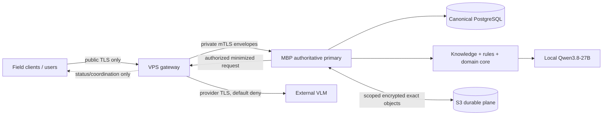

# АСД-КОНТУР — Deployment and Policy Profiles v0.1

- **Статус:** `Accepted architecture baseline`
- **Gate:** `G-02 Deployment and Policy Profiles — PASS (architecture/profile contract)`
- **Production instance readiness:** `BLOCKED`
- **Дата принятия:** 2026-08-22
- **Владелец:** Олег Щербаков
- **Принято:** ведущим архитектором Codex в пределах явного делегирования
  обычных архитектурных решений в задании от 2026-08-22
- **Область:** единые deployment и policy contracts для `Tender`, `Support`,
  `Audit`, `Restoration` и результатов R-1…R-3
- **Не является:** runtime configuration, deploy/runbook, provider approval,
  production qualification, ORM, DDL, миграцией или разрешением egress

## 0. Нормативная роль и результат gate

Документ закрывает точный контракт `G-02`, установленный
`IMPLEMENTATION_PLAN_v0.1.md` §5.2: versioned profile pack должен покрывать
MBP/VPS/S3, network zones, identities/certificates, S3 scope/encryption/
retention, inbox/outbox limits, backup/RPO/RTO, failover/fencing, provider
allowlists, classification, egress, retention, Basis Registry, confirmation,
qualification, budgets, fallback, cost и golden/regression governance.

Критерий G-02 допускает только два состояния каждого обязательного значения:

1. утверждено с evidence, owner, approver и validity;
2. явно `unset`/`blocked` с fail-closed последствием.

Поэтому результат разделён без подмены понятий:

| Проверяемая граница | Результат | Что это означает |
|---|---|---|
| G-02A: architecture и profile contract | **PASS, 2026-08-22** | Все обязательные profiles, policy families, поля evidence, unknown-value records и deny behavior определены. |
| G-02B: конкретная production local-first hybrid instance | **BLOCKED** | Нет утверждённых S3/VPS/security/recovery/retention/authority/resource instances и drill evidence. |
| Внешний VLM route, включая планируемый `polza.ai` | **BLOCKED / deny** | Provider terms, exact model/profile, region, retention, deletion, allowlist, budgets, cost и route qualification не подтверждены. |
| G-03 Contract Pack | **PASS, 2026-08-22** | Приняты `CONTRACT_PACK_v0.1.md` и `contracts/v0.1/`; G-02 production blockers сохранены. |
| Implementation/deployment authority | **CLOSED** | G-02 не разрешает ORM, DDL, migrations, infrastructure или application implementation. |

`Invariant`: architecture PASS нельзя отображать как production readiness.
`ProductReady` нельзя вывести из deployment health: обязательна конъюнкция
четырёх mode E2E, трёх результатов, security/recovery/lifecycle evidence и
всех последующих gates.

## 1. Evidence discipline

### 1.1. Классы утверждений

| Метка | Значение |
|---|---|
| `OBSERVED` | Получено read-only командой на текущем MBP или из сохранённого результата фактического прогона. |
| `OWNER_ACCEPTED` | Прямое решение Олега Щербакова, закреплённое ADR/RD/DR/HV. |
| `ARCHITECTURE_ACCEPTED` | Обычное архитектурное решение Codex в делегированных границах; не внешний или профессиональный факт. |
| `EVALUATION_ONLY` | Доказано на ограниченном test/pilot corpus; нельзя повышать до production qualification. |
| `UNSET` | Значение не установлено либо evidence отсутствует. |
| `BLOCKED` | Capability запрещена до появления перечисленного evidence и active compatible instance. |

Отсутствие упоминания или техническая доступность компонента не являются
evidence разрешения. Исторические числа из пилота не становятся production
thresholds, budgets, RPO/RTO или retention.

### 1.2. Evidence ledger текущей машины и проекта

| ID | Наблюдение / источник | collected_at | Допустимый вывод | Нельзя выводить |
|---|---|---|---|---|
| `G02-E-001` | Решения владельца и ADR-0006…0010 | 2026-08-21…22 | MBP-primary, VPS coordination, S3 durable plane, local-first hybrid, four-mode readiness и ID capability приняты | Реализацию, SLA, provider terms или production readiness |
| `G02-E-002` | `system_profiler SPHardwareDataType SPStorageDataType` | 2026-08-22 | Текущий Mac — MacBook Pro `Mac17,7`, Apple M5 Max, 128 GB; internal APFS SSD 2 TB, observed free 1.76 TB; SMART `Verified` | Постоянный disk reserve, encryption-at-rest, RPO/RTO или будущую ёмкость |
| `G02-E-003` | `sw_vers` | 2026-08-22 | macOS 26.6.2, build 25G83 | Независимость logical model от macOS или production OS qualification |
| `G02-E-004` | `/Users/oleg/mlx/models` и exact `config.json` digest | 2026-08-22 | Каталоги Qwen3.8 8-bit (28 GB) и bf16 (51 GB) существуют; 8-bit config: `model_type=qwen3_5`, affine 8-bit; config digest `8f80874a…a25d` | Полную identity весов, provider equivalence или production qualification по имени каталога |
| `G02-E-005` | `~/mlx/docs/MLX_VLM_INSTALL_AND_SMOKE_2026-08-20.md` | 2026-08-20 | Закреплённый MLX runtime загрузил 8-bit model через Metal и выдал schema-valid JSON на одной странице; runtime commit и versions записаны | Качество на классах документов, four-mode E2E, устойчивость или authority результата |
| `G02-E-006` | `TM35_VLM_QUALIFICATION_RESULTS_v0.1.md` | 2026-08-21 | Три локальные models прошли ограниченный технический Stage-0 на 3 control pages; Qwen3.8 8-bit observed peak 39.43 GB | Production qualification: corpus мал, thresholds были pilot protocol, professional impact не покрыт |
| `G02-E-007` | `TM35_VLM_BENCHMARK_RESULTS_v0.1.md` + raw JSON | 2026-08-21 | Qwen3.8 8-bit: 24/24 valid JSON/Metal, 0 runtime failures, selected for that TM-35 pilot; observed mean 68.5 s/page and 39.8 GB peak | Перенос latency/memory/quality на другие corpora, production floors или все четыре modes |
| `G02-E-008` | `pyproject.toml`, `uv.lock` | 2026-08-22 | Project contract Python `>=3.12,<3.13`; locked `python-docx 1.2.0`, `lxml 6.1.1`, `pytest 8.4.2` | Qualified DOCX/XLSX/PDF/DXF renderer stack; project dependencies его не содержат |
| `G02-E-009` | Accepted LDM/TA/Lifecycle/Auth/Harness/Rules/ID specifications | 2026-08-22 | Scope, SoR, authority, retention, candidate and topology contracts являются нормативными | Физическое наличие PostgreSQL/VPS/S3/KMS/certificates/backups |

Serial number, hardware UUID, credentials, private paths with project meaning
and secret values are deliberately excluded from this document.

### 1.3. Не подтверждено

Не существует retained evidence, достаточного для утверждения конкретных:

- production PostgreSQL instance, RLS или backup chain;
- VPS coordination/security instance;
- S3 provider, accounts/buckets, region/residency, object lock или recovery
  location;
- KMS/secret-store product, certificate inventory или rotation period;
- full restore/fencing/failover drill;
- provider terms и route qualification `polza.ai`;
- production RetentionProfile periods, Basis Registry codes, qualification
  floors, budgets, cost limits, geometry tolerances, renderer/font profiles,
  professional grants или alert routes.

Эти пробелы представлены ниже как records, а не скрыты под «TBD».

## 2. Непереоткрываемая topology



1. MBP M5 Max является единственным active `primary_authoritative` node.
2. Canonical PostgreSQL, НТД, rules, facts, confirmation, Promotion Gate и
   finalization располагаются на MBP.
3. VPS хранит только coordination ledger, bounded encrypted staging,
   allowlisted status projection, telemetry и controlled-egress state. Domain
   schema, logical/physical replica PostgreSQL и authority на VPS запрещены.
4. S3 хранит exact bytes, portable archives и recovery objects; он не current
   state, не database и не executable restore.
5. Automatic failover/promotion и active-active запрещены. Failover — только
   manual restore candidate → verification → fencing → human activation → new
   monotonic authority epoch.
6. Qwen3.8-27B — основной local VLM; внешний route предназначен только для
   policy-разрешённой массовой raster-PDF обработки.
7. Любой provider возвращает `ProviderExecutionResult`/Candidate/draft.
   Canonical knowledge, НТД, Knowledge Gateway, SQL и storage browsing вовне
   не передаются.
8. Topology и contracts provider-neutral и не зависят от macOS, MLX,
   `polza.ai` или конкретного S3 vendor.

### 2.1. Node и network-zone profiles

| Profile / zone | Узлы и доверительная граница | Разрешённая роль | Явно запрещено |
|---|---|---|---|
| `node.mbp-authoritative` / `zone.authoritative-private` | Единственный active MBP primary; local process/Unix-account boundary; private node ingress only | Canonical PostgreSQL, Knowledge Gateway, local object operations, Qwen, rules, confirmation, lifecycle и finalization | Public database/API exposure, second active primary, внешняя передача canonical knowledge/NTD |
| `node.vps-coordination` / `zone.coordination-private` | VPS service identities behind public ingress; private authenticated node route to MBP | Inbox/coordination ledger, bounded staging, stale-labelled status projection, controlled egress, content-minimal telemetry | Domain tables/replica, Fact/Rule/finalization authority, direct MBP database credentials |
| `node.s3-object-plane` / `zone.object-archive` | Exact provider accounts/tier/region remain `UNSET`; access only through scoped service identities | Durable platform/workspace objects, sealed archives and isolated recovery sets in separate namespaces/credentials | Current domain state, executable restore, wildcard cross-workspace listing, storage-path-based scope promotion |
| `node.field-client` / `zone.field-untrusted` | Intermittent device/human identity; public TLS ingress or separately approved private route | Encrypted offline collection and signed/versioned sync envelopes | SQL, canonical confirmation, last-write-wins, direct archive or provider access |
| `node.external-provider` / `zone.external-untrusted` | Exact endpoint/model/terms are untrusted until active policies; current allowlist empty | Only minimized, authorized raster payload and typed provider result after DP-05 gates | Knowledge Gateway, НТД/rules, storage browsing, credentials, automatic fact/finalization |
| `node.restore-candidate` / `zone.recovery-isolated` | Replacement hardware isolated from production writes until full verification and fencing | Restore, integrity/reconciliation tests and readiness evidence | Primary activation, external publication or canonical writes before independent activation decision |

Network-zone membership does not transitively grant access. Every route needs
an exact source and destination identity, capability, payload class and active
PolicyDecision; a public ingress route never makes its target a trusted domain
node.

## 3. Deployment Profile Registry

### 3.1. Контракт profile/version

`DeploymentProfile` имеет stable key; `DeploymentProfileVersion` immutable и
содержит:

```text
profile_key, profile_version, schema_version, status, readiness_state
environment, purpose, allowed_modes, allowed_data_classes
component_placements, canonical/derived/operational declarations
network_routes, trust_boundaries, identity/capability assignments
storage/encryption/key-reference profiles
backup/restore and residue profiles
observability and incident profiles
resource/admission limits
failure/degraded behavior, prohibited operations
entry criteria, exit criteria
owner, approver, evidence[], effective_interval, compatibility, supersedes
canonical_digest, tests[]
```

Mutable `latest` не является допустимой ссылкой production workspace.
Workspace pin exact compatible profile versions. Изменение placement, trust,
identity, storage, encryption, model route или retention создаёт новую version.

### 3.2. Сводка profiles

| ID / profile key | Назначение; допустимые modes | Placement и данные | Readiness |
|---|---|---|---|
| `DP-01 mbp.local-development` | Архитектура, code/unit work для всех modes на synthetic/sanitized data | Repo/uv/local test process на MBP; нет production canon/VPS/S3/external | `approved architecture`; current local instance `available_limited` |
| `DP-02 mbp.local-qualification` | Локальная evaluation/qualification Harness, renderers, rules и recovery components по всем mode strata | MBP isolated runtime; immutable corpus/results; production facts не создаются | `evaluation_only`; four-mode production qualification `blocked` |
| `DP-03 hybrid.pilot-evaluation` | Интеграционная pilot/evaluation topology всех modes | MBP canon candidate + VPS coordination + S3 test namespaces | Architecture `approved`; concrete instance `blocked` |
| `DP-04 hybrid.production-local-first` | Production local-first hybrid для всех modes/R-1…R-3/ID | MBP authoritative, VPS coordination/egress, S3 durable/archive/recovery | `blocked` |
| `DP-05 vlm.external-controlled-batch` | Authorized mass raster-PDF execution | MBP Harness → VPS egress → exact external provider; only minimized workspace payload | `blocked / deny` |
| `DP-06 recovery.backup-restore-verification` | Создание и проверка recovery sets без активации | MBP backup agent + isolated restore candidate + S3 recovery plane | `blocked` until provider/profile/drill |
| `DP-07 recovery.manual-failover` | Restore на replacement authoritative hardware и manual activation | Old primary fenced; restore candidate; VPS/S3 credentials/routes re-bound | `blocked` until verified drill and authorities |
| `DP-08 field.offline-sync` | Offline collection и later conflict-aware synchronization | Field encrypted local store → VPS ingress → MBP authoritative acceptance | Architecture `approved`; concrete client/contracts `blocked` |

### 3.3. `DP-01 mbp.local-development`

| Field | Contract |
|---|---|
| Purpose/modes | Documentation, Contract Pack design later, unit/property tests for Tender/Support/Audit/Restoration; no mode readiness claim. |
| Components/placement | Git workspace, Python/uv environment and tests on MBP. PostgreSQL/S3/VPS are not assumed. |
| Data | Synthetic/sanitized fixtures only. Real ОКС content is prohibited unless a separate classified workspace profile is active. |
| Routes/trust | Loopback/local process; network is not a prerequisite. Developer identity cannot self-grant production authority. |
| Storage/encryption | Local files/temp under OS account; because at-rest encryption evidence is not retained, sensitive data is denied. |
| Backup/restore | Source-control/draft recovery only; not product archive or production backup. |
| Observability/resources | Local test output; no project payload in logs. Ordinary tests have priority over optional heavy evaluation. |
| Failure/degraded | Missing optional tool yields explicit skip/block. It cannot enable fallback or alter acceptance. |
| Entry/exit | Exact lock available; synthetic classification proven. Exit requires removal of temp workspace data and preserved test result. |
| Prohibited | External egress, real lifecycle destruction, production finalization, secrets in config, production readiness claims. |
| Readiness | Current machine/repo evidence supports local documentation/unit work only. |

### 3.4. `DP-02 mbp.local-qualification`

| Field | Contract |
|---|---|
| Purpose/modes | Evaluate exact model/profile, validator, rule, renderer and restore tuple across declared purpose/schema strata of all modes. |
| Components/placement | Isolated runtime, exact immutable model/toolchain, corpus, telemetry collector and result store on MBP. Heavy sessions are sequential until another concurrency profile qualifies. |
| Data | Synthetic/sanitized goldens preferred; real pilot corpus remains one isolated evaluation workspace and never platform memory. |
| Routes/trust | Local-only by default. Any external comparison requires DP-05 and fresh authorization. |
| Storage/encryption | Raw/evaluation artifacts are workspace-scoped and follow an explicit test RetentionProfile; no cross-workspace cache. |
| Backup/restore | Results/digests retained by corpus governance; source content fate remains its workspace policy. |
| Observability/resources | Memory pressure, swap delta, Metal/device, latency, token/page counts, disk/temp and cleanup are captured. |
| Failure/degraded | Pressure, missing identity, invalid schema, absent budget/floor or zero-tolerance failure blocks qualification; no silent smaller model. |
| Entry/exit | Frozen tuple/corpus/threshold proposal and authority before run; independent review and immutable report after run. |
| Prohibited | Treating smoke/pilot as production, model agreement as fact, pilot thresholds as global, concurrent heavy models without qualification. |
| Readiness | Qwen3.8 8-bit has `OBSERVED` smoke and `EVALUATION_ONLY` TM-35 results, not production-qualified four-mode coverage. |

### 3.5. `DP-03 hybrid.pilot-evaluation`

| Field | Contract |
|---|---|
| Purpose/modes | Failure-injection and contract evaluation of the target distributed topology; mode data remains labeled pilot/test. |
| Components/placement | MBP candidate canonical plane; VPS test coordination/status; isolated S3 test accounts/tiers; no provider call unless DP-05 separately active. |
| Data | Canonical test state only on MBP; VPS operational and S3 object data carry exact environment/org/workspace scope. |
| Routes/trust | Private overlay+mTLS node path, TLS S3, VPS public test ingress only; exact node/service identities. |
| Storage/encryption | Separate environment credentials, client/envelope plus S3-side encryption for sensitive workspace objects. |
| Backup/restore | Test recovery sets and isolated restore candidates; no automatic activation. |
| Observability/resources | Content-minimal central telemetry; protected local detail; explicit status staleness. |
| Failure/degraded | VPS loss preserves local work; S3 loss blocks durable writes; MBP loss permits only bounded staging. |
| Entry/exit | Active compatible storage/security/limits/retention profiles and A/B isolation tests; exit reconciles/deletes all test residues. |
| Prohibited | Production users, domain replica on VPS, wildcard S3 credentials, implicit external egress, ProductReady claim. |
| Readiness | Concrete instance `blocked`: no retained test VPS/S3/security profile or drill evidence. |

### 3.6. `DP-04 hybrid.production-local-first`

| Field | Contract |
|---|---|
| Purpose/modes | Full production topology shared by all four modes and three results; ID Generation included. |
| Components/placement | MBP canonical PostgreSQL/core/knowledge/Qwen; VPS ingress/ledger/status/egress; S3 platform/workspace/archive/recovery tiers. |
| Data | Canonical vs derived vs operational placement follows §6; every workspace copy is inventory/retention managed. |
| Routes/trust | Only routes in §7; mTLS node identities, scoped service/integration capabilities, no public MBP canonical endpoint. |
| Storage/encryption | Scoped credentials, separate environment/scope/purpose tiers, envelope encryption plus provider-side defense in depth. |
| Backup/restore | Layered PITR/logical/object recovery set, measured restore drills, portable archives separately. |
| Observability/resources | Content-minimal central operations plus protected local detail; lifecycle/database resources protected from model pressure. |
| Failure/degraded | Explicit capability matrix: no node failure changes authority; unknown outcomes reconcile. |
| Entry/exit | All required active compatible policy instances, G-03+, isolation/threat/restore tests and explicit implementation/production authority. |
| Prohibited | Multi-primary, VPS replica, auto failover, silent fallback, unqualified renderer/model/template, external default allow. |
| Readiness | `blocked`; this architecture document does not satisfy production entry criteria. |

### 3.7. `DP-05 vlm.external-controlled-batch`

| Field | Contract |
|---|---|
| Purpose/modes | Only exact authorized purpose/data-class pages or regions from mass raster PDFs in any mode where process contract permits. |
| Components/placement | MBP native-first router/validators → VPS credentialed egress gateway → allowlisted provider → MBP verification/Candidate lifecycle. |
| Data | Minimized encrypted workspace request/response; no НТД canon, Knowledge Gateway, SQL, storage listing or cross-workspace batch. |
| Routes/trust | MBP↔VPS private mTLS; VPS↔provider authenticated TLS exact destination; separate IntegrationIdentity. |
| Storage/encryption | Raw governed by `no_raw_storage` or encrypted workspace class; provider residue explicitly tracked. |
| Backup/restore | Provider raw is not recovery data. Candidate/evidence follows workspace retention. |
| Observability/resources | Attempt, usage/cost, policy versions, digests and failure codes only; no full prompt/response centrally. |
| Failure/degraded | Missing/expired/ambiguous term, class, allowlist, budget, cost, qualification or audit = deny before payload. Fallback needs new decision. |
| Entry/exit | Exact terms/profile/route qualification + active egress/cost/raw/retention policies; exit reconciles all items and residues. |
| Prohibited | Blanket upload, external legal/geometry authority, provider storage/SQL access, use of HTTP 200 as Candidate/Fact. |
| Readiness | `blocked / default deny`; no `polza.ai` terms or route evidence accepted. |

### 3.8. `DP-06 recovery.backup-restore-verification`

| Field | Contract |
|---|---|
| Purpose/modes | Verify recoverability of mandatory classes/modes without conferring primary authority. |
| Components/placement | MBP backup agent; isolated recovery credentials/tier; isolated replacement/candidate environment; independent verifier. |
| Data | Physical base+WAL/PITR, logical export, object checkpoint/versions, release/schema/extensions, policy/rules, keys refs and audit checkpoint. |
| Routes/trust | MBP→recovery storage authenticated TLS; verifier reads exact versions; candidate has no production write routes. |
| Storage/encryption | Recovery-specific encryption and credentials; raw keys never enter manifest. |
| Backup/restore | Job success is insufficient; exact read, restore, isolation, object and functional checks mandatory. |
| Observability/resources | Duration, coverage, integrity, residue and missing dependency; no unsupported RPO/RTO claim. |
| Failure/degraded | Missing member/key/object/adapter or failed drill leaves recovery capability blocked. |
| Entry/exit | Approved RecoveryObjective/Storage/Security profiles; exit seals evidence and destroys/isolate test candidate by policy. |
| Prohibited | Treat backup as archive, restore into active primary, use unverified candidate, hide missing object versions. |
| Readiness | `blocked`: exact recovery provider/objectives and full measured drill absent. |

### 3.9. `DP-07 recovery.manual-failover`

| Field | Contract |
|---|---|
| Purpose/modes | Recover the one authoritative role on replacement hardware after failure. All modes pause material writes during ambiguity. |
| Components/placement | Verified RestoreCandidate; previous MBP; VPS/S3 route and credential controls; human activation authority. |
| Data | Verified canonical/object recovery set and content-minimal activation/fencing audit. |
| Routes/trust | Administrative path is private-overlay JIT; old node write routes/credentials revoked before activation. |
| Storage/encryption | Recovered keys through governed references; rotation/rebinding recorded. |
| Backup/restore | Uses DP-06 passed candidate; portable archive alone is insufficient. |
| Observability/resources | Primary claims, epoch, credential revocation and reachability monitored. |
| Failure/degraded | Unfenced or conflicting primary claim blocks all canonical writes and enters `RECOVERY_REQUIRED`/`QUARANTINED`. |
| Entry/exit | Disaster declaration, verified candidate, independent fencing evidence and authorized PrimaryActivationDecision; exit has one active epoch. |
| Prohibited | VPS promotion, automatic activation, timestamp winner, active-active, activation by backup service/model. |
| Readiness | `blocked`: no production recovery instance/drill/authority assignments. |

### 3.10. `DP-08 field.offline-sync`

| Field | Contract |
|---|---|
| Purpose/modes | Collect permitted operations/evidence offline and synchronize for any applicable mode; no separate field domain core. |
| Components/placement | Field client encrypted scoped store; VPS ingress/ledger; MBP authoritative validation/acceptance. |
| Data | Versioned operation envelopes, object manifests, device/source evidence and authorized projections; no PostgreSQL replica. |
| Routes/trust | Client→VPS public TLS with user/device identity; optional private client→MBP only if separately allowlisted; MBP pulls/re-authorizes. |
| Storage/encryption | Local encrypted cache with finite policy; VPS stream-encrypted bounded staging; S3 exact version. |
| Backup/restore | Offline queue is operational residue, not backup; acknowledged content follows canonical/archive policy. |
| Observability/resources | Queue age/count, base version, receipt/ack, stale projection and conflict status; content-minimal. |
| Failure/degraded | Offline collection may continue only within lease/policy; conflict is typed; no last-write-wins. MBP unavailable means pending, not accepted. |
| Entry/exit | G-03 envelope contracts, device/grant/policy, quota/TTL, conflict tests and cleanup; exit requires acknowledgement/reconciliation. |
| Prohibited | SQL credentials, direct fact confirmation, cross-workspace cache, silent merge, stale status as current. |
| Readiness | `blocked`: client/store/schemas/limits and integration evidence absent. |

## 4. Policy Profile Registry

### 4.1. Разделение records

| Record | Назначение; identity и mutability | Scope/relations |
|---|---|---|
| `PolicyDefinition` | Stable semantic key, field schema, units, constraints, merge/override semantics and fail-closed contract | Platform canon; one definition → many immutable versions |
| `PolicyVersion` | Immutable definition version with schema digest, compatibility and tests | Published by policy steward/reviewer; does not contain environment values |
| `PolicyInstance` | Exact values or explicit `UNSET/BLOCKED` values, owner/approver/evidence/effective interval/digest | Platform/environment/organization/workspace/purpose as allowed by definition |
| `PolicyAssignment` | Pins exact instance version to exact subject/scope/purpose with precedence and interval | Cannot widen scope or assign incompatible instance; append/supersede |
| `PolicyDecision` | Append-only allow/deny/block result over closed input tuple and exact policy versions | Same scope as request; decision is not reusable after tuple/version change |
| `PolicyEvidence` | Immutable provenance: owner decision, official terms, benchmark, drill, threat/legal review, digest and collected_at | Evidence class controls who may approve which instance |

These records refine, but do not replace, LDM entities such as
`RetentionProfile`, `WorkspaceEgressPolicy`, `ConfirmationPolicy`,
`CostEnvelope`, `QualificationProfile`, `ConflictPolicy` and
`RecoveryObjectiveProfile`.

### 4.2. Обязательный passport PolicyInstance

Каждый instance, включая deny-placeholder, содержит:

```text
stable_key
instance_version
scope = platform | environment | organization | workspace | purpose tuple
owner_identity_or_role
approver_identity_or_role
status
effective_from / effective_to
policy_schema_version
typed values, declared units and completeness state
PolicyEvidence refs + collected_at
compatibility ranges
supersedes exact instance version or null
fail_closed_outcome and blocked capabilities
test suite/version/result refs
canonical serialization digest
created/approved/activated/suspended timestamps and reasons
```

Permitted statuses:

| Status | Meaning and decision behavior |
|---|---|
| `draft` | Editable preparation; never selected. |
| `proposed` | Immutable review candidate; never authorizes production. |
| `approved` | Approved content but not yet effective/assigned; no implicit activation. |
| `active` | Effective, compatible, assigned and test-valid; may participate in decision. |
| `suspended` | New use denied; existing material work pauses/re-evaluates. |
| `superseded` | Historical; exact old decisions remain explainable, new use denied. |
| `retired` | No new use; retained for provenance only. |
| `unset` | Required typed value absent; dependent operation denied. |
| `blocked` | Value/evidence/authority/compatibility/test is known incomplete; dependent operation denied with reasons. |

`UNSET`, ambiguous, expired, suspended or incompatible never receives a
permissive default. `unset` and `blocked` placeholders are versioned and have
digests so that denial itself is reproducible.

#### 4.2.1. Metadata of the instance declarations in §5

The §5 rows are normative logical instance declarations, not deployable
configuration files. They inherit the following values unless a row narrows
them:

| Field | Architecture/deny declaration | Blocked production placeholder |
|---|---|---|
| `stable_key` | Exact `policy.*` key in the row | Same exact key; no alias/latest |
| `instance_version` | `architecture-2026-08-22.1` | `production-blocked-2026-08-22.1` |
| `scope` | Platform architecture bound, all environments/modes; downstream may only narrow | Exact production environment plus organization/workspace/purpose at assignment time |
| owner | Олег Щербаков | Named family owner in §8; unresolved person identity remains a blocker |
| approver | Олег Щербаков for direct RD/DR/HV/ADR values; Codex only for delegated architecture mechanics | Applicable security/legal/records/professional/provider authority; unresolved approver means `blocked` |
| status | `active` only where §5 explicitly says active; otherwise the row status controls | `unset` or `blocked` as stated in §5/§8 |
| effective interval | From 2026-08-22 until suspended/superseded for accepted architecture bounds | No effective permission interval until approval/activation |
| schema version | `policy-instance.v0.1` | `policy-instance.v0.1` or compatible accepted successor |
| values | Exact qualitative deny/constraint values in §5 | Exact missing field and constraint in §8; never an inferred number |
| provenance | `G02-E-*` plus exact ADR/RD/DR/HV/TA section cited by the row | Future retained official terms/benchmark/drill/legal/professional evidence |
| compatibility | LDM v0.1, TA v0.3, DPP v0.1; all four modes through one core | Must declare compatible deployment/profile/schema ranges before assignment |
| supersedes | None in v0.1 | Exact prior version or null; no rolling replacement |
| fail-closed | Deny bounds in §§5, 8, 10 | Exact blocked capabilities in §§5 and 8 |
| tests | Applicable `DP-AT-*` plus referenced RD/DR/HV/TA catalogues | Tests must pass before `approved/active` |
| `canonical_digest` | Required SHA-256 of canonical instance envelope | Required SHA-256 of canonical placeholder envelope |

G-02 specifies the digest field and covered semantic envelope. G-03 now defines
canonical serialization and machine-readable contract identities. Narrative
declarations still are not runtime PolicyInstances: only an exact approved
instance may emit its literal digest. Until that exists, the effective
operational result remains deny. This is the deliberate boundary between an
accepted contract and an activated policy value.

### 4.3. Resolution and precedence

1. Resolve exact environment, organization, workspace, purpose, class,
   resource version and operation time.
2. Load only assigned exact versions compatible with the request schema and
   current deployment profile.
3. Mandatory platform constraints are intersection/deny bounds and cannot be
   loosened by organization/workspace instance.
4. Where override is allowed, precedence is exact resource/workspace →
   organization → environment → platform, but only within the definition's
   declared variance. Equal-precedence conflict is `ambiguous → deny`.
5. Check status/effective interval, owner/approver, evidence validity,
   supersession, tests and digest.
6. Verify completeness of every required field. Unknown part makes the whole
   material decision `blocked`, not partial allow.
7. Emit immutable `PolicyDecision` with considered/selected/rejected versions,
   reason codes, input digest, correlation and expiry.

Policy activation uses optimistic expected-prior-version. There is no mutable
`latest`, rolling policy or silent rollback. Rollback activates a previously
approved compatible version through a new audited assignment/decision.

## 5. Policy families and current instance state

All rows inherit the passport §4.2. Owner is the named information/product/
security/records authority; Codex accepts schemas and fail-closed behavior but
does not impersonate provider, legal, professional or production approver.

### 5.1. Data, egress, AI/VLM and cost

| Stable key | Definition / mandatory values | Current evidence-backed instance | Production status and blocked operations |
|---|---|---|---|
| `policy.data-classification` | Closed taxonomy, assignment evidence, sensitivity/local-only flags, payload parts and review trigger | HV-01 architecture active; exact taxonomy/mappings `UNSET` | `blocked`: external egress, broad export and any operation needing unresolved class |
| `policy.workspace-egress` | Exact workspace×class×purpose×pages/regions×destination allow/deny | Active default-deny instance: no external destination allowed without explicit assignment | `active deny`; all external calls blocked by default |
| `policy.provider-allowlist` | Provider, destination, endpoint, exact model revision/profile, purpose/class | Active empty allowlist; no approved provider/model/profile entry | `active deny`; `polza.ai` and every external provider blocked |
| `policy.provider-terms` | Official version, no-training, processing, region, subprocessors, finite retention, deletion and change trigger | `UNSET`; no retained official `polza.ai` terms accepted | `blocked`: qualification and external invoke |
| `policy.execution-repair-budget` | purpose×profile×failure; attempts/cycles/time/token/page/cost/no-progress/switch/terminal | HV-02 schema active; all production numeric values `UNSET` | `blocked`: production qualification/invoke/repair |
| `policy.model-profile-qualification` | Exact tuple, strata, per-field floors, locator/omission/hallucination/provider rates, reviewers | TM-35 results are `EVALUATION_ONLY`; production corpus/floors `UNSET` | `blocked`: production route for local and external models |
| `policy.zero-tolerance-blockers` | Blocking categories independent of averages | Active HV-03 list: cross-workspace leak; invented source/locator/edition/geometry; wrong critical unit/sign; Candidate→Fact; egress bypass; document/workspace mixing; hidden uncertainty; schema/result substitution | `active` architecture bound; one occurrence rejects/suspends exact profile |
| `policy.human-confirmation` | field/risk/evidence/authority matrix, allowed deterministic auto-confirm and SoD | Active HV-05 deny bound: legal/normative/contract/geometry/measurement/volume/KS/payment/signer/material-blocker/promotion/executive-scheme require qualified human; concrete grants `UNSET` | Auto-confirm of these classes denied; professional finalization blocked until grants/qualifications |
| `policy.raw-vlm-artifact` | class/purpose storage mode, encryption/key, access, TTL, archive/reset/provider residue | Active safe fallback `no_raw_storage`; storage values `UNSET` | Raw persistence blocked; Candidate metadata allowed only by applicable local/evaluation profile |
| `policy.ordered-fallback` | class×purpose×primary → ordered exact profiles, new auth, terminal behavior | Active empty matrix; no allowed production fallback | `active deny`; unavailable primary ends blocked/unresolved |
| `policy.external-cost-envelope` | workspace/purpose/provider/profile/currency/max total/per-item/warn/stop/reserve/commit/release | `UNSET`; price/currency/budget evidence absent | `blocked`: external item cannot reserve or start |
| `policy.golden-regression-corpus` | scope, anonymization, rights, strata/modes, gold labels/authority, immutability, retention and leakage tests | TM-35 is pilot stratum only; production universal corpus `UNSET` | `blocked`: production model/template/renderer qualification |

### 5.2. Retention, archive, storage and destruction

| Stable key | Definition / mandatory values | Current evidence-backed instance | Production status and blocked operations |
|---|---|---|---|
| `policy.retention-profile` | Every data class: trigger, period/unit, archive, operational purge, backup/snapshot, provider residue, authority | RD-01/B schema and no-default active; calendar values `UNSET` | `blocked`: production workspace finalize, purge and destroy |
| `policy.basis-registry` | Closed code, applicability, evidence, authority, prerequisites, hold check and interval | RD-04/C contract active; no qualified basis codes | `blocked`: destructive authorization |
| `policy.legal-hold` | Subject, basis/evidence, issuer authority, interval, release/recheck and affected actions | Unknown hold state is active deny semantics; concrete source/instance `UNSET` | `blocked`: purge/destroy when hold cannot be checked |
| `policy.portable-archive` | RD-02 hybrid logical manifest/container/integrity/signature/rights/import and retention | Logical hybrid contract active; provider/container/profile values `UNSET` | Archive success and later purge blocked |
| `policy.purge-reset-destroy` | Exact DeletionPlan, adapter inventory, basis, hold, requester/confirmer/executor/verifier, receipts/residual scan | RD-03/A and RD-04/C safety contract active | Concrete destructive operation `blocked`; no production plan/authorities |
| `policy.backup-pitr-residues` | Base/WAL/logical/object/snapshot schedule, retention, expiry/crypto-erase, inventory and restore horizon | Layered TA mechanism active; numeric values/provider/drill `UNSET` | Backup readiness/RPO/RTO/destroy attestation blocked |
| `policy.object-storage-placement` | Environment×scope×class×purpose tier, region/residency, version/lock, credential and replication | MBP/S3 logical tiers active; exact S3 provider/accounts/regions `UNSET` | Production object admission/archive/recovery blocked |
| `policy.encryption-key-reference` | Data class, envelope/server encryption, algorithms/profile, DEK/KEK refs, escrow/recovery, rotation/revocation | Hybrid envelope requirement active; products/key refs/intervals `UNSET` | Sensitive S3/VPS movement and production backup blocked |
| `policy.archive-import` | Authorization, manifest/schema/signature/integrity/compatibility, new workspace, ID mapping and cleanup | IA-OD-03/B active: always new workspace; no implementation/profile | Import execution blocked until G-06 implementation and exact active policy |

### 5.3. Authority, rules, signatures, templates and geometry

| Stable key | Definition / mandatory values | Current evidence-backed instance | Production status and blocked operations |
|---|---|---|---|
| `policy.audit-content-allowlist` | Event/action fields by class, forbidden payload, post-reset allowlist, retention/integrity/access | RD-03/A active: content-free outcome/authority/basis/profile/residue counts only; filenames/text/prompts/responses/source hashes/live FK forbidden | `active` deny bound; exact retention/integrity mechanism `UNSET` blocks production audit readiness |
| `policy.authority-sod` | Roles, atomic capabilities, qualification, exact scope/interval, conflicts and independent actors | Architecture matrix active; specific professional/security/records grants `UNSET` | Rule approval, finalization, signature acceptance and destruction blocked |
| `policy.rule-review-approval` | Rule class, author, independent reviewer, class-qualified approver, evidence/tests/status | DR-02/B active; concrete grants/rules are operational data | Unqualified activation denied |
| `policy.ruleset-controlled-upgrade` | Source/target manifests, impact, compatibility, authority, atomic adoption and rollback | DR-01/B active; rolling rules denied | Upgrade denied without complete exact request |
| `policy.workspace-rule` | Same-workspace rule/evidence/tests/authority/interval/conflict/RuleSet membership/destruction | DR-04/B active | Free override, cross-workspace use and direct platform promotion denied |
| `policy.electronic-signature-verification` | Trust anchors, algorithm/profile, certificate chain/revocation/time, signed bytes, signer authority and evidence | IA-OD-06/B active boundary: verify external signatures only, never sign/store private signing key; exact trust profile `UNSET` | Legally/professionally signed finalization blocked |
| `policy.template-qualification` | Source authority/rights/edition, immutable bytes, schema/bindings, security, formats/goldens/applicability/reviewer | Specification active; no legacy asset auto-qualified; exact TemplateVersion instances `UNSET` | Official ID generation blocked per template |
| `policy.renderer-font-toolchain` | Adapter/tool/library/font/locale/timezone/viewer/options/resources/features/variance | Project has only locked `python-docx`; no qualified DOCX/XLSX/PDF/DXF tuple | `blocked`: print-ready and professional finalization |
| `policy.geometry-crs-precision-tolerance` | Exact CRS/frame/unit/precision/rounding/tolerance/boundary/source/authority per use | Hard geometry gate active; actual profiles/tolerances `UNSET` | Executive scheme/final geometry and affected findings blocked |
| `policy.print-ready-validation` | Format-specific structure/content/evidence/layout/render/page/font/formula/print area and exact review tuple | Qualitative gate active: file exists/openable never pass; exact validators/goldens `UNSET` | `blocked`: print-ready/finalized ID document |

### 5.4. Operations, coordination, recovery and observability

| Stable key | Definition / mandatory values | Current evidence-backed instance | Production status and blocked operations |
|---|---|---|---|
| `policy.coordination-limits` | Per workspace/class/purpose size, batch count, queue depth, TTL, retry/backoff/deadline, DLQ and residue | Semantics active; numerical limits `UNSET` | VPS ingress/staging and production sync blocked |
| `policy.node-certificate-identity` | Installation/node role, CA/trust, enrollment, purpose, validity, rotation/revocation and assurance | mTLS/node-role architecture active; concrete identities/certs `UNSET` | Inter-node production transfer blocked |
| `policy.incident-recovery-failover` | Incident classes, declaration/roles, containment, recovery candidate, fencing, activation epoch, rollback/review | Manual fencing semantics active; contacts/authorities/drill evidence `UNSET` | Production failover/activation blocked |
| `policy.recovery-objective` | Mode/data-class RPO/RTO, assumptions, measurement method, drill result, validity/review trigger | Mechanism active; every numeric objective `UNSET` | Production recovery and affected mode readiness blocked |
| `policy.observability-alert-routing` | Content-minimal signals, thresholds, severity, recipient/on-call, acknowledgement/escalation, retention | Telemetry allowlist active; numeric thresholds/routes/recipients `UNSET` | Production operational readiness blocked; telemetry must still not leak content |
| `policy.release-compatibility` | Signed release digest/SBOM/schema/wire/model/profile ranges and rollback | Signed-pull architecture active; production release source/keys/versions `UNSET` | Production node activation/sync blocked |

## 6. Data placement matrix

`System of record` below may be split between canonical metadata and exact
bytes; that split is explicit. Storage location never changes authority.

| Data class / placement | SoR or derived; scope | Encryption/replication/backup | Retention, reset/destroy and residues | Readers/writers; VPS/S3/provider |
|---|---|---|---|---|
| PostgreSQL on MBP | Canonical metadata/state for platform/org/workspace/process/audit/inbox/outbox; MBP only | At-rest/key profile `UNSET`; layered physical/logical backup required | Platform survives workspace reset; workspace rows purge by plan; WAL/backups declared residues | Local scoped service writers; no VPS/field/provider SQL |
| Local object/cache storage on MBP | Operational cache/temp/render/raw or transfer copy; never alternative durable SoR | Sensitive class requires envelope encryption; no cross-workspace physical dedup | Finite profile; enumerate temp/cache/render/multipart; purge/reset exact scope | MBP services only; neither VPS nor provider browses it |
| S3 `platform-active` | Durable exact platform source/template/model-independent artifact bytes; canonical identity/metadata on MBP | Versioning; qualified primary+recovery placement; exact provider `UNSET` | Platform retention; workspace destroy cannot reach; object/version residues inventoried | Scoped platform object identity; VPS external gateway has no browse grant |
| S3 `workspace-active/raw/export` | Durable workspace bytes; metadata/acceptance on MBP | Per-workspace credentials and envelope+server encryption; no cross-workspace dedup | RetentionProfile; versions/delete markers/multipart/replicas included; raw finite or no-store | Same-workspace services; VPS only exact staging/transfer; provider only minimized payload |
| Portable archives | Sealed logical workspace package is archive evidence, not active state | S3 archive/offline authorized copy; integrity/signature profile | Separate retention/basis; import new workspace; destruction separately attested | Archive-specific capability; not direct old-workspace read |
| Recovery backups | Recovery derivative, never archive/current authority | Isolated S3 recovery location; base/WAL/logical/object set, encrypted | Own retention/horizon; snapshot/WAL copies declared residues; restore candidate only | Backup agent writes; verifier reads; activation authority separate |
| VPS coordination ledger | Operational delivery/idempotency/ack/reconciliation records, not domain SoR | Separate store/credentials/backup profile; content-minimal | TTL/limits `UNSET`; purge envelopes/staging/logs; loss cannot lose canon | VPS coordination services; no domain writers/readers |
| VPS status projection | Derived, stale-capable, rebuildable | Minimal replicated fields; source checkpoint/expiry | Short finite policy `UNSET`; complete deletion/rebuild allowed | VPS publishes reads; only MBP authoritative projection publisher |
| Inbox/outbox | MBP canonical delivery ledger; VPS has separate operational receipts | Transactional MBP backup; scoped payload digest | Workspace content follows reset; content-minimal platform items survive by policy | Trusted handlers/dispatchers; at-least-once, no global order |
| Raw VLM artifacts | Workspace operational objects only or `no_raw_storage` | Encrypted, role-scoped; external residue separately declared | Finite RetentionProfile; reset purge from MBP/VPS/S3/provider; never platform memory | Harness/review role; central telemetry no content |
| FTS/pgvector/sparse/graph/cache | Derived rebuildable platform or workspace projections, never mixed | Rebuild from canonical versions; no recovery dependency | May be fully deleted/rebuilt; workspace projection always reset | Scoped builders/Gateway; not VPS initial placement, not provider |
| Append-only audit | Canonical scoped decision/action evidence on MBP | Integrity-protected backup; exact mechanism `UNSET` | Workspace content purge; only RD-03 content-free org governance record survives | Dedicated writer; scoped audit readers; central copy allowlisted only |
| Logs/metrics/traces | Operational/derived, not audit or domain SoR | Content-minimal central VPS telemetry; protected local detail | Finite policies/incident purge; filenames/text/prompts/secrets forbidden centrally | Ops/security identities; provider gets none except its own request metadata |

НТД, editions, assertions, rules, classifiers и qualified universal templates
остаются platform memory. ПД/РД, договор, регламент заказчика, people,
facts, measurements, geometry, generated documents и VLM artifacts всегда
workspace memory и не перемещаются в organization/platform по storage path.

## 7. Network, identities and secrets

| Connection | Initiator → destination; protocol class | Identity/capability/authn/authz | Allowed payload and audit | Failure behavior |
|---|---|---|---|---|
| MBP↔VPS node plane | MBP normally pulls/pushes → VPS private endpoint; HTTPS over private overlay + mTLS | NodeIdentity + ServiceIdentity; `node.data.receive/send`, envelope-specific decision; certificate refs only | Versioned envelopes, acks, status, minimized provider requests/results; IDs/digests/policies/outcome audited | Unknown → reconcile; revoked/expired/incompatible → deny; MBP local canon continues without VPS |
| MBP→S3 | MBP object/backup agent → exact S3 service; authenticated TLS | Scoped short-lived service role; exact tier/org/workspace/object/version operation | Ciphertext, manifest, exact receipt; audit identity/version/digest, not secret | Missing receipt/read verification → pending/failed, never accepted/archive success |
| VPS→S3 staging | VPS ingress → exact staging namespace; authenticated TLS | VPS staging identity limited to environment/workspace/purpose/write/read-own/delete-own | Stream-encrypted object and manifest; no general listing | Missing quota/TTL/key/profile → deny before persistence |
| VPS→external VLM | Egress gateway → exact allowlisted endpoint; provider TLS | Dedicated IntegrationIdentity, `vlm.external.invoke`, WorkspaceEgressPolicy, budget/cost reservation | Minimized pages/regions only; attempt/digest/terms/usage/residue audited | Any policy/terms/cert/redirect ambiguity → deny; no silent local/provider fallback |
| Field client→VPS | Client/device → public TLS ingress | Human+Device identity, short-lived scope/purpose capability, envelope signature | Typed offline operation/object manifest; no SQL or full status canon | VPS returns received/staged only; offline/MBP loss remains pending |
| Field client→MBP | Normally none; private-only optional route if separately approved | Same actor/device plus MBP re-authorization | Same versioned contract, not database replication | Route absence is normal; use VPS or remain offline, no authority change |
| Administrative access | Named human → MBP/VPS private-overlay JIT endpoint | Strong auth, active time-bound admin/break-glass capability, target NodeIdentity | Command metadata/reason/outcome; no credential/payload in audit | Expiry/revoke/public route → deny; break-glass post-review required |
| Restore/failover | Verifier/activation authority → isolated candidate/VPS/S3 controls | Separate `restore.verify` and `primary.activate`; human SoD; fencing evidence | Recovery manifest, checks, epoch and content-minimal activation record | Unfenced old primary or incomplete verify → writes denied on candidate |

Secrets are never policy values. Records contain opaque references such as
`secret://<store>/<purpose>/<version>` conceptually; actual URI syntax belongs
to G-03/implementation. Secret owner, purpose, rotation/revocation and recovery
requirements are mandatory. API keys, passwords, private keys, raw DEK/KEK and
signing keys are forbidden in configuration documents, audit, logs and
archives.

## 8. Unknown-value and qualification register

The following exact fields are deliberately not guessed. `Constraint` is a
schema constraint, not a chosen value.

| Field | Unit / constraint | Future evidence source | Owner / required test | State | Blocks |
|---|---|---|---|---|---|
| `retention_period` per data class/trigger | time; finite or explicitly qualified indefinite, non-negative; no global default | Qualified legal/records/contract source retained in PolicyEvidence | Records/legal authority; trigger/hold/expiry tests | `UNSET/BLOCKED` | workspace finalize/purge/destroy |
| Basis Registry codes | closed codes + evidence/authority/interval, never free text | Qualified legal/contract review | Legal/records owner; unknown/expired/hold-race tests | `UNSET/BLOCKED` | destructive plan authorization |
| S3 primary/recovery provider, region, residency | exact provider/account/location and compatibility | Official provider contract + threat/residency assessment | Security/storage owner; isolation/encryption/restore/delete tests | `UNSET/BLOCKED` | durable admission/archive/backup |
| S3 versioning/object-lock/noncurrent retention | enum + time by tier/class; raw cannot become undeletable by default | Storage qualification | Storage/records authorities; version/delete-marker/multipart tests | `UNSET/BLOCKED` | archive/recovery/destruction claims |
| KEK/DEK/secret-store/certificate profiles | exact products/algorithms/key refs; validity and rotation time | Threat model, crypto/key recovery test | Security owner; revoke/rotate/restore/lost-key tests | `UNSET/BLOCKED` | inter-node/sensitive storage/backup |
| VPS staging quota/TTL/max item/batch | bytes, items, time; positive bounded values per class/purpose | Load/threat/residue benchmark | Operations/security; quota/expiry/multipart cleanup | `UNSET/BLOCKED` | remote ingress/staging |
| Inbox/outbox retry/backoff/deadline/DLQ | count/time; finite, idempotency/reconciliation required | Failure-injection benchmark | Integration owner; lost-ack/duplicate/poison-message tests | `UNSET/BLOCKED` | production sync |
| RPO/RTO per mode/data class | time; non-negative, assumptions explicit | Business impact analysis + measured full restore drills | Product/operations; repeated restore under failure | `UNSET/BLOCKED` | recovery and production mode readiness |
| PostgreSQL memory/CPU/connection/IO reserve | bytes/count/rate; must preserve lifecycle/audit writes | Representative DB/load benchmark on MBP | DB/operations; pressure/starvation/failure tests | `UNSET/BLOCKED` | production workload admission |
| MBP disk free reserve | bytes and/or percent; fail-closed before unsafe admission | Capacity run with source/render/model/backup/index mix | Operations; low-disk admission/cleanup/recovery tests | `UNSET/BLOCKED` | production ingest, batch, backup |
| MBP memory-pressure/headroom thresholds | OS pressure class + bytes; lifecycle/DB priority over models | Sustained mixed workload benchmark | Operations/ML; pressure/swap/cancel/recovery tests | `UNSET/BLOCKED` | heavy production model/batch concurrency |
| Heavy model concurrency | positive integer qualified for exact tuple | Mixed workload/thermal/memory benchmark | ML/operations; concurrent model+DB+lifecycle test | Active conservative value: **one heavy Metal session**; >1 `BLOCKED` | concurrent heavy inference |
| Execution/repair limits | attempts/cycles/time/tokens/pages/cost/no-progress | Representative purpose/stratum benchmark and risk review | Harness/policy owner; exhaustion/repeat-fingerprint tests | `UNSET/BLOCKED` | production inference/repair |
| Model/profile floors | per-field rate/error/latency/availability; zero blockers remain absolute | Approved object-independent four-mode golden corpus | Model qualification owner; independent regression | `UNSET/BLOCKED` | production local/external route |
| External provider exact model revision | immutable provider ID/revision/format | Provider statement + result identity/qualification | Provider/model owner; revision change/same-name tests | `UNSET/BLOCKED` | external route |
| Provider processing region/retention/deletion/subprocessors/no-training | versioned official terms; retention finite if allowed | Retained official terms and legal/security analysis | Provider-policy authority; terms-expiry/residue tests | `UNSET/BLOCKED` | all external egress |
| External pricing/SLA/cost envelope | currency/unit/cost/time/availability; exact validity | Official price/SLA + approved spending authority | Financial/provider owner; reserve/commit/reconcile/overrun tests | `UNSET/BLOCKED` | external batch |
| Confirmation qualifications/grants | human class/jurisdiction/document/field/interval | Professional credentials and organization grants | Qualified authority owner; wrong/expired/SoD tests | `UNSET/BLOCKED` | affected fact/finalization/rule decisions |
| E-signature trust/revocation/time profile | trust anchors, algorithms, revocation/time rules | Qualified PKI/legal/security source | Signature authority; valid/expired/revoked/wrong-role tests | `UNSET/BLOCKED` | signed deliverable verification/finalization |
| Template authority/edition/rights | exact source/version/effective interval/rights | Official retained source + professional review | Template authority; provenance/withdrawal/rights tests | `UNSET/BLOCKED` per template | official form activation |
| Renderer/font/viewer variance | exact versions/features; permitted layout delta | Representative format goldens and print comparison | Template/render owner; pagination/font/clipping/formula tests | `UNSET/BLOCKED` | print-ready/finalized ID |
| CRS/unit/precision/tolerance | exact definitions/unit/decimal/boundary by geometry class | Confirmed RD/measurement/NTD and professional decision | Geometry authority; transform/boundary/source tests | `UNSET/BLOCKED` | executive schemes/geometric claims |
| Alert thresholds/routes/escalation | rates/counts/time + named role destinations; no secrets | Threat/operations tests and service ownership | Operations/security; injection/delivery/expiry exercises | `UNSET/BLOCKED` | production operations readiness |

## 9. MBP resource governance

### 9.1. Priority and admission

| Workload | Priority / preemption contract | Current evidence | Production gate |
|---|---|---|---|
| PostgreSQL canonical writes, authorization/audit, lifecycle/fencing | Highest; model/batch cannot starve or preempt | Placement accepted; runtime not deployed | Resource profile and mixed-load tests `BLOCKED` |
| Object admission, inbox/outbox reconciliation, archive integrity | High; failure is visible and blocks dependent transition | Architecture accepted | Quota/IO/S3 profiles `BLOCKED` |
| Backup/PITR/restore verification | Scheduled but must yield to integrity-critical canon; cannot be skipped silently | No production drill | Recovery/resource profiles `BLOCKED` |
| DOCX/XLSX/PDF/DXF render/validation | Bounded workers, exact temp/disk/font/tool profile; finalization waits | Only `python-docx` locked in project; no qualified render tuple | `BLOCKED` |
| FTS/pgvector/sparse/graph indexing | Rebuildable, pausable, lowest data-authority; checkpoints scoped | Architectural projection model only | Limits/checkpoint profile `BLOCKED` |
| Embeddings/reranker | Bounded derived work; may pause under DB/lifecycle pressure | No target profile evidence | `BLOCKED` |
| Local Qwen3.8-27B | Managed heavy Metal class; one session until concurrency qualification; Candidate only | Installed, smoke/pilot evaluation observed | Production tuple/corpus/floors/budgets `BLOCKED` |
| External raster batch | Only after native-first and every egress/provider/budget/cost gate | No approved route | `deny` |

### 9.2. Fail-closed resource behavior

- Admission checks disk reserve, memory pressure/headroom, swap delta,
  database/lifecycle queue health, temp/cache capacity and applicable budgets.
- Missing threshold is not interpreted as infinite capacity. For production
  heavy work it blocks admission; local bounded evaluation uses its exact
  evaluation profile and cannot publish production qualification.
- Pressure during a safe-cancellable model/render/index job produces
  `deferred/cancelled/recovery_required` with cleanup receipt. It cannot kill
  or corrupt an authoritative transaction.
- Heavy Metal models do not run concurrently unless the exact combination of
  models, render/index/DB load and machine profile has passed qualification.
- Free SSD never determines retention or deletion. Cleanup only follows an
  authorized data-class policy; destructive cleanup cannot be triggered by a
  model or capacity alarm.
- Mass raster routing to external provider is an authorization decision, not
  an automatic relief valve for local pressure.

## 10. Failure and degraded-mode matrix

| Failure | Still permitted | Explicitly blocked / residue behavior |
|---|---|---|
| VPS lost | MBP local canonical work and qualified local paths on available objects | Remote ingress/status/integrations/external VLM; no canonical loss |
| S3 lost | Canonical metadata reads/writes not requiring object side effect | New durable admission, required object read, export/archive/backup; no silent archive success |
| MBP lost | VPS may retain only already-authorized bounded encrypted staging and stale-labelled status | Facts/rules/confirmation/finalization/destruction/canonical ack |
| External provider unavailable/terms expired | Local path only if separately selected and qualified by active routing policy | No inherited fallback; external attempt blocked and residue reconciled |
| Budget/cost exhausted | Existing in-flight items reconciled | New attempt/item/repair; controlled terminal outcome |
| Classification ambiguous | Local quarantined/manual classification process if authorized | Egress/export and downstream policy requiring class |
| Renderer/template unqualified | Evidence/fact preparation may continue | Print-ready, professional finalization and official export |
| Recovery set incomplete | Existing fenced primary may continue if safe | Restore readiness, activation, RPO/RTO claim |
| Conflicting primary claims | Protected investigation reads only | All canonical writes until fence/authority restored |
| RetentionProfile/Basis/hold check missing | Non-destructive active work where otherwise authorized | Finalize as production-complete, purge, reset, destroy and verified attestation |

## 11. Acceptance scenarios

`Design result` checks that the profile/policy contract has an unambiguous
expected outcome. `Instance evidence` remains blocked where a real drill or
implementation is required.

| ID | Scenario | Required observable result | Design result / instance evidence |
|---|---|---|---|
| `DP-AT-001` | MBP authoritative-primary enforcement | Only active MBP epoch can commit canon; VPS/S3/provider write cannot | `PASS` / `BLOCKED` implementation |
| `DP-AT-002` | VPS attempts domain replica/current Fact write | Schema/credential/profile deny; critical audit | `PASS` / `BLOCKED` implementation |
| `DP-AT-003` | Manual failover candidate before fencing | Activation denied regardless of restore integrity | `PASS` / `BLOCKED` drill |
| `DP-AT-004` | Two active-primary claims | All canonical writes stop; `RECOVERY_REQUIRED/QUARANTINED` | `PASS` / `BLOCKED` drill |
| `DP-AT-005` | S3 archive object altered/missing/extra | Manifest/integrity fail; no archive success/purge | `PASS` / `BLOCKED` provider test |
| `DP-AT-006` | Backup job green, restore/read fails | Recovery remains blocked; no RPO/RTO claim | `PASS` / `BLOCKED` full restore |
| `DP-AT-007` | VPS lost during local work | MBP canon continues; remote capabilities degraded explicitly | `PASS` / `BLOCKED` failure injection |
| `DP-AT-008` | S3 unavailable during archive/admission | Operation pending/failed, never silently local-success | `PASS` / `BLOCKED` failure injection |
| `DP-AT-009` | External VLM requested with current registry | Deny before payload because allowlist/terms/budgets/cost/qualification blocked | `PASS`; current policy result `deny` |
| `DP-AT-010` | Classification missing/ambiguous/expired | External/export decision deny; no default class | `PASS` / future policy tests |
| `DP-AT-011` | Provider terms expire/change | Qualification suspended; new calls denied pending review | `PASS` / future provider test |
| `DP-AT-012` | VLM execution/repair budget exhausted | No new attempt; controlled unresolved/provider failure; in-flight reconcile | `PASS` / future Harness test |
| `DP-AT-013` | Fallback target requires external egress | New route/auth/qualification/cost decision; no inherited permission | `PASS` / future integration test |
| `DP-AT-014` | Raw artifact after reset | No MBP/VPS/S3/provider raw content; only allowed content-minimal audit/residue status | `PASS` / future retention E2E |
| `DP-AT-015` | Workspace A row/object/index/job/cache requested by B | Deny without existence disclosure; no digest-based access | `PASS` / future RLS/object A/B suite |
| `DP-AT-016` | WAL/snapshot/noncurrent/multipart/provider residue remains | Attestation incomplete and residue ledger explicit | `PASS` / future adapter suite |
| `DP-AT-017` | Legal hold appears between plan and delete | Fresh check denies/pauses; old authorization invalid | `PASS` / future race test |
| `DP-AT-018` | Production workspace lacks complete RetentionProfile | Finalize/purge/destroy denied | `PASS`; current production instance blocked |
| `DP-AT-019` | Model/profile only installed or smoke-tested | Remains evaluation/unqualified for production | `PASS`; Qwen evidence classified correctly |
| `DP-AT-020` | Template or renderer unqualified | Generation may not become print-ready/finalized | `PASS`; current production instance blocked |
| `DP-AT-021` | Four mode infrastructure health green but one mode E2E absent | ProductReady remains false | `PASS` / E2E evidence future |
| `DP-AT-022` | Tender, Support, Audit, Restoration all use deployment | Same canonical core/profiles with mode-scoped assignments; no mode database/topology fork | `PASS` architecture / future E2E |
| `DP-AT-023` | Field client syncs stale/conflicting edit | Typed conflict; no timestamp/last-write-wins | `PASS` / G-03+ implementation blocked |
| `DP-AT-024` | Alert/central telemetry includes prompt/source/secret | Schema reject, incident/quarantine and governed purge | `PASS` / future observability test |
| `DP-AT-025` | Archive import requested | Verify exact package, authorize and create new workspace/new scoped IDs | `PASS` / G-03+ implementation blocked |

## 12. Four modes, results and ID Generation

| Capability | Deployment/policy dependency |
|---|---|
| Tender / R-1 | Same MBP canon; exact contract/NTD sources, legal confirmation, e-sign verification and template/render policies. External legal content remains default-local/deny. |
| Support / R-1…R-3 | Same canon plus field/offline, material/control/measurement, geometry and proactive ID profiles. No confirmed geometry from model. |
| Audit / R-2 and R-1/R-3 verification | Same canon, immutable corpus scope, completeness/conflict rules and evidence-safe exports. Missing corpus/profile stays explicit. |
| Restoration / R-2/R-3 and R-1 implications | Same canon, verified archive import to new workspace, gap/uncertainty and professional gates. No fabricated recovery. |
| ID Generation & Template Platform | Exact active TemplateVersion, FieldSchema/BindingRule, Renderer/Validation/Print profiles and authority. One fresh document per GenerationRun; file creation ≠ print-ready ≠ finalization. |

No mode may override platform/workspace isolation, topology, authority or
retention. A mode-specific PolicyAssignment may narrow permitted purpose/data
but cannot create another database, rules core or permissive default.

## 13. Accepted architecture decisions in this document

The following ordinary decisions are `Accepted`, owner Олег Щербаков, date
2026-08-22, basis — delegated architecture authority in the current task:

| ID | Decision and reason |
|---|---|
| `DPP-01` | G-02 is split into normative profile completeness and concrete production readiness; this preserves the Implementation Plan's “complete or fail-closed” criterion without a false production claim. |
| `DPP-02` | Policy schema/version/instance/assignment/decision/evidence are separate records; otherwise mutable values and provenance cannot be pinned. |
| `DPP-03` | `unset` and `blocked` are immutable digestable policy instances, not comments; denial therefore remains reproducible. |
| `DPP-04` | Mandatory platform policies combine by intersection/deny and cannot be loosened downstream; this protects isolation and AI/authority boundaries. |
| `DPP-05` | Eight deployment profiles share one logical core and differ by placement/purpose/readiness only; modes do not receive their own topology. |
| `DPP-06` | Current Qwen evidence is `EVALUATION_ONLY`; installation, smoke and TM-35 selection do not meet the accepted production QualificationProfile contract. |
| `DPP-07` | Safe empty provider/fallback allowlists and `no_raw_storage` are active deny instances; unknown provider values are not converted into zero-retention or free-cost claims. |
| `DPP-08` | Until concurrency qualification, one heavy Metal session is the only allowed heavy-model admission profile; database/lifecycle/audit work has higher priority. This follows existing Harness conservative policy and observed single-session evidence. |
| `DPP-09` | Local development accepts only synthetic/sanitized data unless a separate classified workspace profile is active; unverified disk encryption cannot be assumed. |
| `DPP-10` | No new ADR is required: decisions instantiate ADR-0006/0008 and RD/DR/HV/LDM boundaries without changing topology or product scope. |

These decisions do not approve any retention period, provider term, budget,
threshold, professional capability or infrastructure instance.

## 14. G-02 acceptance and next boundary

| Exact G-02 requirement | Evidence in this document | Result |
|---|---|---|
| MBP/VPS/S3 node, network and identity/certificate profiles | §§2, 3, 7 | `PASS architecture`; certificates `BLOCKED` |
| S3 scope/encryption/retention and object placement | §§5.2, 6, 8 | `PASS architecture`; provider instance `BLOCKED` |
| Inbox/outbox limits | §§5.4, 8 | Complete schema; numeric values `UNSET/BLOCKED` |
| Backup/RPO/RTO and failover/fencing | DP-06/07, §§5.4, 8, 10 | `PASS architecture`; measured instance `BLOCKED` |
| Provider allowlists, classification and egress | §§5.1, 7 | Active default deny/empty allowlist; external route `BLOCKED` |
| RetentionProfile and Basis Registry | §5.2 and §8 | RD contract present; values/codes `UNSET/BLOCKED` |
| Confirmation, qualification, budgets, fallback and cost | §5.1 and §8 | HV semantics present; production values `UNSET/BLOCKED` |
| Golden/regression corpus governance | §5.1; DP-02 | Contract complete; TM-35 evaluation only; production corpus `BLOCKED` |
| Evidence metadata for every value | §§1, 4.2, 8 | Source/collected_at/scope/owner/approver/validity/test/digest required |
| Missing/expired/conflicting values deny | §§4.3, 10, 11 | Machine-testable fail-closed behavior defined |

`G-02 Deployment and Policy Profiles = PASS` on 2026-08-22 for its exact
architectural acceptance: every required value is either evidence-backed or
explicitly blocks its dependent capability. This closes the missing normative
artifact, not the blocked capability.

The production local-first hybrid instance, external VLM route, recovery/
failover, field sync, print-ready ID and professional paths remain `BLOCKED`
until their concrete instances are approved and tested. `G-03 Contract Pack`
закрыт отдельным accepted artifact. G-04 implementation, ORM, DDL, migrations,
PostgreSQL/S3/VPS deployment и application code остаются запрещены до
отдельной authority.
