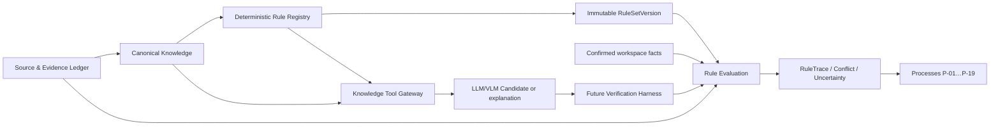
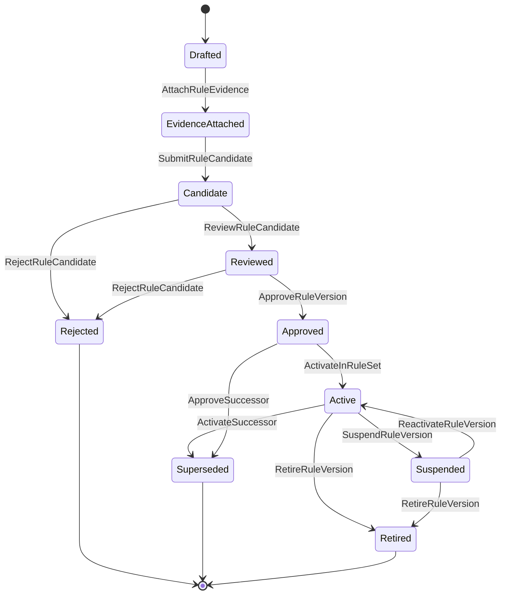

# АСД-КОНТУР — Deterministic Rules Catalogue v0.1

- **Статус документа:** `Accepted architecture baseline`
- **Дата:** 2026-08-21
- **Принято:** 2026-08-22 ведущим архитектором Codex по явным
  архитектурным полномочиям владельца продукта; RuleVersion утверждает
  только предусмотренный DR-02 qualified human approver
- **Владелец продукта:** Олег Щербаков
- **Область:** объектно-независимое детерминированное ядро для режимов
  `Tender`, `Support`, `Audit`, `Restoration`
- **Следующий артефакт:** Harness Specification подготовлена; следующий пункт
  Blueprint — `Information Architecture v0.1`

## 0. Нормативная роль и границы

Этот документ определяет логическую архитектуру `Deterministic Rule Registry`,
контракты `Rule`, `RuleVersion`, `RuleSetVersion`, `RuleEvaluation`,
`RuleTrace`, `RuleEvidence` и `RuleConflict`, а также начальный
объектно-независимый каталог классов правил. Он является пунктом 5 очереди
`ARCHITECTURE_BLUEPRINT_v0.1.md` §11.

Каталог конкретизирует, но не заменяет:

- `DOMAIN_AND_KNOWLEDGE_MODEL_v0.1.md` — канонические сущности, разделение
  platform/workspace memory, Source & Evidence Ledger, Promotion Gate и
  Knowledge Tool Gateway;
- `KNOWLEDGE_AND_MEMORY_ARCHITECTURE_v0.1.md` — каноническое знание и
  перестраиваемые retrieval/graph projections;
- `PROCESS_AND_EVENT_SPECIFICATION_v0.1.md` — процессы P-01…P-19, command,
  evaluation и failure semantics;
- `AUTHORIZATION_AND_AUDIT_MODEL_v0.1.md` — identities, atomic capabilities,
  approval authority и audit;
- `LIFECYCLE_AND_RETENTION_SPECIFICATION_v0.1.md` — pin RuleSetVersion,
  archive/reset и судьбу workspace-derived knowledge;
- `AI_VLM_EXECUTION_AND_VERIFICATION_HARNESS_SPECIFICATION_v0.1.md` —
  принятые `HV-01/B…HV-08/B`, execution/qualification/confirmation contracts;
- ADR-0003, ADR-0005 и ADR-0006 — provenance, hard isolation и границу AI.

Статусы положений:

| Метка | Значение |
|---|---|
| `Invariant` | Обязательное свойство любой будущей реализации. |
| `Proposed` | Архитектурное решение этой редакции, подлежащее review. |
| `Owner Decision Required` | Продуктовая развилка, которую нельзя принять техническим default. |
| `Accepted` | Решение, явно принятое владельцем с датой и подтверждением. |
| `Rejected` | Явно отвергнутый вариант. |
| `Superseded` | Историческое положение, заменённое последующим решением. |

`Invariant`:

1. Каноническими являются утверждённые `RuleVersion`, неизменяемые manifest
   `RuleSetVersion`, их evidence и approval records. Код движка, compiled
   representation, cache, FTS/vector/graph index каноном не являются.
2. Только `active RuleVersion`, включённая в утверждённую и закреплённую за
   workspace `RuleSetVersion`, может влиять на промышленный результат.
   `approved` означает готовность к включению/активации, но не разрешает
   исполнение вне утверждённого RuleSet.
3. Retrieval и semantic similarity находят кандидатов правил, но не определяют
   применимость. Применимость вычисляет versioned predicate по подтверждённым
   typed inputs.
4. `indeterminate`, `conflict`, missing evidence и validator failure не
   преобразуются в `pass`.
5. OCR/VLM/LLM создают только domain `Candidate`, explanation, draft либо
   предложение для Promotion Gate. Модель не создаёт Workspace RuleVersion,
   не review/утверждает правило, не выбирает редакцию/precedence, не вычисляет
   нормативное количество и не подтверждает геометрию.
6. Любой материальный результат имеет `RuleTrace` с точными версиями входов,
   правил, источников и расчётной политики.
7. ТМ-35 не определяет сущности, rule keys, applicability, формулы, пороги или
   содержание этого каталога.

### 0.1. Что пока не проектируется

Не выбираются DSL, parser, rule engine/runtime, язык выражений, ORM, таблицы,
миграции, PostgreSQL RLS, API transport, compiled format и deployment topology.
Не создаются исполняемые нормативные правила и не утверждается содержание СП
48, СП 70 или СП 543. Их содержание может появиться только после официального
ingestion, структурирования и review конкретной редакции.

## 1. Место Rule Registry в архитектуре



| Слой | Ответственность | Не вправе |
|---|---|---|
| Source & Evidence Ledger | immutable SourceVersion, SHA-256, acquisition/extraction method, locator | объявлять требование применимым |
| Canonical Knowledge | NormativeDocument/Edition/StructuralUnit, assertions, definitions, links | исполнять неутверждённый rule candidate |
| Rule Registry | versioned typed decision logic, evidence, tests, status | хранить скрытое project content как platform rule |
| RuleSet Registry | воспроизводимый immutable состав активных версий | молча менять открытый workspace |
| Evaluation service | чистое вычисление и trace | подтверждать входной Candidate или разрешать authority conflict |
| Process layer | координация evaluation и human decisions | менять правило или обходить fail-closed outcome |
| Authorization/Audit | authority, SoD, decisions, digest audit | подменять доменную применимость правом доступа |
| Knowledge Gateway | typed rules/EvidencePack/conflicts/gaps модели | давать модели SQL или mutation authority |
| Verification Harness | вызывать validators и формировать targeted repair failures | превращать model agreement/confidence в факт |

Domain rules и system/security guards используют совместимый envelope
`RuleEvaluation/RuleTrace`, но имеют разные namespaces, source layers,
authority и lifecycle. Нормативное правило не маскируется под security guard,
а security guard не получает фиктивный locator НТД.

## 2. Термины

| Термин | Нормативное определение |
|---|---|
| Rule | Стабильная смысловая идентичность одного правила независимо от редакций реализации и evidence. |
| RuleVersion | Неизменяемая после approval версия Rule с typed contract, applicability, evidence, tests и implementation binding. |
| RuleSet | Стабильная идентичность согласованного набора правил для профиля/режима. |
| RuleSetVersion | Неизменяемый manifest точных RuleVersion, conflict policies, schemas и compatibility constraints. |
| Applicability | Трёхзначный детерминированный вывод `applicable / not_applicable / indeterminate` по подтверждённым данным. |
| Predicate | Версионированное типизированное логическое выражение применимости или проверки; отсутствие входа даёт declared missing/indeterminate behavior. |
| Typed input | Значение с schema/type, semantic meaning, unit/CRS при необходимости и immutable version reference. |
| Typed output | Результат с закрытым outcome code и schema, не свободный текст модели. |
| RuleEvidence | Нормализованная связь RuleVersion с точным источником, утверждением и locator; не копия полного источника. |
| RuleTrace | Машиночитаемое объяснение одного evaluation: rule/version, applicability, inputs, evidence, steps, boundaries, outcome и fingerprint. |
| RuleEvaluation | Workspace- или platform-scoped попытка исполнения точной RuleVersion над immutable input snapshot. |
| RuleConflict | Типизированное неразрешённое или разрешённое столкновение применимых правил/источников/результатов. |
| Priority | Значение, применимое только внутри named conflict group по explicit policy; не глобальный ранг источника. |
| Precedence | Версионированная политика разрешения конкретного класса конфликта с предметом, authority и evidence. |
| Effective interval | Полуинтервал/интервал действия версии правила или источника с явной boundary semantics; не время загрузки. |
| Boundary condition | Точное включение/исключение порога, даты, диапазона, допуска или геометрической границы. |
| Uncertainty | Typed запись о неизвестном/неоднозначном input, applicability или authority, которая не равна `false`. |
| Validator | Чистая проверка schema/type/unit/range/consistency/evidence, возвращающая machine-readable failures. |
| Calculation | Детерминированное преобразование typed numeric inputs по versioned formula/rounding/unit policy. |
| Constraint | Проверяемое ограничение на одно или несколько значений/состояний. |
| Completeness rule | Сопоставляет обязательный набор и подтверждённое наличие, сохраняя gaps и coverage scope. |
| Classification rule | Присваивает canonical class только по явным typed признакам; model suggestion остаётся Candidate. |
| Derivation rule | Получает новый typed result из подтверждённых facts/evidence без human guess. |
| Blocking rule | При известном нарушении запрещает обозначенную material operation. |
| Advisory rule | Формирует предупреждение/рекомендацию, но не может скрыто изменить обязательный status. |

### 2.1. Нельзя смешивать источники правил

| Категория | Что это | Требуемая атрибуция | Допустимое влияние |
|---|---|---|---|
| Нормативное требование | assertion точной редакции НТД/акта | edition, StructuralUnit, official source, locator, effective interval | только после applicability и approval RuleVersion |
| Договорное требование | условие точной версии договора | clause locator, parties/scope/date, negotiability/mandatory conflict | workspace result по explicit policy |
| Правило заказчика | требование точной версии регламента | customer authority, version, scope, locator | в разрешённой области, без автоматического overriding mandatory norm |
| Инженерный расчёт | формула, units, precision, assumptions | formula authority, version, test suite | typed numeric/geometric output |
| Системный guard | lifecycle/security/isolation/retention invariant | platform policy/specification/version | fail-closed технический transition |
| Экспертная рекомендация | проверенное профессиональное мнение | author/qualification, scope, date | advisory или human decision input |
| Судебная практика | case-specific legal evidence | court, case/version/date, exact proposition, applicability review | legal evidence/advisory; не universal auto-precedence |
| AI-предложение | Candidate/draft/explanation | provider/model/profile/prompt/schema/evidence | только input последующей validation/review |

## 3. Логический контракт RuleVersion

### 3.1. Обязательные поля

| Поле | Требование |
|---|---|
| `rule_key` | Стабильный namespaced key; не меняется между версиями. |
| `version` | Уникальна внутри key; semantic meaning зафиксирован manifest digest. |
| `title`, `purpose` | Краткий смысл и material decision boundary. |
| `rule_class` | Один класс из §5; cross-class composition выражается dependencies. |
| `status` | Состояние lifecycle §4. |
| `scope` | `platform` либо `workspace`; workspace scope требует обязательный `workspace_id` и соблюдение принятого `DR-04/B`. |
| `applicability_predicate` | Typed predicate с three-valued outcome и missing-input policy. |
| `typed_inputs`, `typed_outputs` | Schemas, cardinality, units/CRS, nullability, version requirements. |
| `required_evidence` | Типы evidence и минимальная достаточность до evaluation. |
| `source_authority` | Атрибутированный слой §7, authority metadata и scope. |
| `rule_evidence[]` | Ссылки на immutable RuleEvidence §8. |
| `effective_interval` | Начало, конец, inclusion semantics и temporal basis. |
| `priority` | Только named value внутри `conflict_group`; вне группы `not_applicable`. |
| `conflict_group` | Тип конфликта и допустимая `conflict_resolution_policy`. |
| `uncertainty_behavior` | Какие missing/ambiguous inputs дают indeterminate/block/advisory. |
| `failure_behavior` | Fail-closed/fail-safe outcome по классу операции; material operation — fail-closed. |
| `test_suite_ref` | Immutable manifest обязательных tests §13 и digest. |
| `author`, `reviewer`, `approver_authority` | Human identity/grant references; reviewer не author, approver — другая class-qualified human identity; model/service запрещены. |
| `created_at`, `reviewed_at`, `approved_at` | Audit timestamps; время не участвует в fingerprint результата. |
| `supersedes` | Точная предыдущая RuleVersion или null; история не перезаписывается. |
| `implementation_binding` | Версия чистой исполняемой проекции/adapter contract, не source of truth. |
| `schema_version` | Версия самого RuleVersion contract. |

Дополнительно обязательны `dependencies`, `compatibility`, `determinism_profile`,
`boundary_policy`, `integrity_digest` и `approval_decision_ref`. Они устраняют
скрытые runtime/default зависимости.

### 3.2. Пример нормативной RuleVersion

Пример показывает форму, а не содержание конкретного СП:

```json
{
  "schema_version": "rule-version/1.0",
  "rule_key": "NTD.REQUIRED_DOCUMENT.DERIVE",
  "version": "0.1.0-candidate",
  "title": "Определение обязательного вида документа",
  "purpose": "Получить typed requirement только из применимой утвержденной нормы",
  "rule_class": "required_document",
  "status": "candidate",
  "scope": {"kind": "platform"},
  "applicability_predicate": {
    "binding": "predicate-ref:required-document-applicability@1",
    "outcomes": ["applicable", "not_applicable", "indeterminate"],
    "missing_input": "indeterminate"
  },
  "typed_inputs": [
    {"name": "work_type", "schema": "WorkTypeRef/1", "confirmed": true},
    {"name": "edition", "schema": "NormativeEditionRef/1", "confirmed": true},
    {"name": "event_date", "schema": "LocalDate/1", "required": true}
  ],
  "typed_outputs": [
    {"name": "requirement", "schema": "RequiredDocumentRequirement/1"}
  ],
  "required_evidence": ["normative_structural_unit", "edition_status", "applicability_basis"],
  "source_authority": ["ntd"],
  "rule_evidence": ["rule-evidence:placeholder-not-approved"],
  "effective_interval": {"from": null, "to": null, "boundary": "[from,to)"},
  "conflict_group": "required-document-for-work-context",
  "priority": "not_assigned",
  "conflict_resolution_policy": "policy-ref:subject-specific-placeholder",
  "uncertainty_behavior": "block_material_output",
  "failure_behavior": "fail_closed",
  "test_suite_ref": "test-manifest:placeholder",
  "author": "human:unassigned",
  "reviewer": null,
  "approver_authority": "grant:unassigned",
  "created_at": "2026-08-21T00:00:00Z",
  "approved_at": null,
  "supersedes": null,
  "implementation_binding": null,
  "integrity_digest": "sha256:placeholder"
}
```

Статус `candidate`, placeholders и отсутствие official evidence запрещают
промышленное использование этой записи.

### 3.3. Пример system guard

```json
{
  "schema_version": "rule-version/1.0",
  "rule_key": "SYS.LIFECYCLE.PURGE.ACTIVE_WORKSPACE_DENY",
  "version": "1.0.0",
  "rule_class": "retention_lifecycle_guard",
  "status": "approved",
  "scope": {"kind": "platform"},
  "applicability_predicate": {"workspace_state": "ACTIVE"},
  "typed_inputs": [{"name": "workspace_state", "schema": "WorkspaceState/1"}],
  "typed_outputs": [{"name": "decision", "schema": "GuardDecision/1"}],
  "source_authority": ["platform_invariant"],
  "rule_evidence": ["spec:LIFECYCLE_AND_RETENTION_SPECIFICATION_v0.1#invariant"],
  "uncertainty_behavior": "deny",
  "failure_behavior": "fail_closed",
  "test_suite_ref": "test-manifest:future-lifecycle-guards",
  "implementation_binding": null
}
```

Даже approved guard не исполняется в production до включения его точной
версии в approved/active RuleSetVersion.

## 4. Lifecycle RuleVersion



| From → to | Command | Authority | Evidence/tests | Audit/effective date | Использование |
|---|---|---|---|---|---|
| — → `drafted` | `CreateRuleDraft` | authorized human curator | purpose/class/scope | creator, rationale | запрещено |
| `drafted → evidence_attached` | `AttachRuleEvidence` | evidence curator | complete provenance refs | evidence digest | запрещено |
| `evidence_attached → candidate` | `SubmitRuleCandidate` | author | typed contract complete | submission snapshot | только review/sandbox |
| `candidate → reviewed` | `ReviewRuleCandidate` | independent qualified human reviewer, не author | tests executed; conflict/impact analysis | review decision | только review |
| `candidate/reviewed → rejected` | `RejectRuleCandidate` | reviewer/approver | reason code | immutable rejection | запрещено |
| `reviewed → approved` | `ApproveRuleVersion` | другой human `rule.approve`; class-qualified для exact rule class | all mandatory tests pass, evidence/applicability/conflict policy valid | approval, validity start | eligible, не active |
| `approved → active` | `ActivateInRuleSet` | RuleSet publisher distinct where policy requires | approved RuleSet manifest and compatibility | publication/activation | разрешено только через pinned RuleSet |
| `active → suspended` | `SuspendRuleVersion` | authorized safety/normative authority | incident/evidence invalidation | suspension time/reason | новые evaluation запрещены |
| `suspended → active` | `ReactivateRuleVersion` | approver | remediation + full regression | new decision | через new RuleSetVersion либо exact allowed manifest operation |
| `active/approved → superseded` | `ActivateSuccessor` | approver/publisher | successor approved, impact analysis | exact successor ref | history only |
| `active/suspended → retired` | `RetireRuleVersion` | approver | retirement reason | date/rule sets affected | history only |

Approved RuleVersion immutable. Исправление payload, evidence, predicate,
boundary, formula, tests или implementation binding создаёт новую version.
`rejected`, `superseded` и `retired` не удаляются из provenance.

LLM/VLM/OCR, `ServiceIdentity`, queue и background worker не имеют
`rule.approve`. Service может выполнить approved test/evaluation, но approval
decision принимает только разрешённая human authority.

## 5. Каталог классов правил

| № | Класс | Назначение | Scope/layer | Material outcome |
|---:|---|---|---|---|
| 1 | Source admission | Проверить identity, format, hash, ownership, version conflict и допустимость источника | domain/system boundary | admitted/rejected/quarantined |
| 2 | Document classification | Получить canonical document class по проверяемым признакам | domain | class/indeterminate |
| 3 | NTD applicability | Проверить object/work/material/stage/jurisdiction scope нормы | normative domain | applicable/not/indeterminate |
| 4 | Edition applicability | Выбрать точную действовавшую edition на event date с transition basis | normative domain | edition ref/conflict |
| 5 | ОКС structure | Проверить/вывести typed structure из confirmed facts | engineering domain | structure version/gaps |
| 6 | Work type classification | Сопоставить confirmed признаки canonical WorkType | domain | WorkTypeRef/conflict |
| 7 | Work dependency | Определить versioned dependency/prerequisite | process domain | dependency/block |
| 8 | Volume calculation | Вычислить quantity с units, formula, precision и provenance | engineering calculation | typed Quantity |
| 9 | Material/MTR requirement | Вывести требуемый MTR и relation to work/specification | engineering domain | requirement/gap |
| 10 | Control operation | Определить required control and timing | normative/customer/project | ControlRequirement |
| 11 | Required evidence | Определить evidence kinds/locators/acceptance conditions | cross-source domain | EvidenceRequirement |
| 12 | Required document/ID | Определить document kinds/forms/count conditions | cross-source domain | DocumentRequirement |
| 13 | Signer/authority requirement | Проверить требуемые роли и действительность authority на дату | legal/process domain | pass/block/indeterminate |
| 14 | Completeness | Сопоставить required set и confirmed evidence coverage | domain | complete/incomplete/indeterminate |
| 15 | Sequence/prerequisite | Проверить порядок работ, controls и evidence | process domain | pass/block |
| 16 | Geometry | Вычислить/сопоставить geometry только из confirmed coordinates/dimensions/CRS | engineering calculation | geometry/conflict |
| 17 | Tolerance | Проверить boundary по exact unit/precision/inclusion policy | normative/project | within/outside/indeterminate |
| 18 | Cross-document consistency | Сопоставить versions, identifiers, dates, quantities и facts между источниками | domain | pass/conflict/gaps |
| 19 | Contract risk | Детектировать versioned risk condition; legal conclusion may require authority | legal domain | finding/uncertainty/advisory |
| 20 | Contract precedence | Разрешить только формализуемый conflict по explicit policy | legal domain | resolved/conflict |
| 21 | Presented volume/КС/payment trace | Связать confirmed work/evidence/ID/presented/KS/payment | commercial domain | traced/gap/block |
| 22 | Audit delta | Сравнить required matrix с actual scoped corpus | Audit overlay | delta/coverage/gaps |
| 23 | Restoration | Проверить, можно ли восстановить artifact из existing lawful evidence | Restoration overlay | restorable/unrecoverable |
| 24 | Deliverable finalization | Проверить completeness, blockers, uncertainty policy и authority | cross-mode domain | allow/deny |
| 25 | VLM/OCR extraction validation | Валидировать Candidate schema/evidence/consistency | AI boundary | validated/rejected/repair failure |
| 26 | Retention/lifecycle guard | Защитить freeze/finalize/archive/purge/reset/destroy invariants | system guard | allow/deny |
| 27 | Authorization guard | Проверить atomic capability/scope/purpose/SoD/egress | security guard | allow/deny |

Domain classes 1–25 и system/security guards 26–27 не образуют один
неатрибутированный слой. Общими остаются version identity, typed evaluation,
trace, tests, audit и fail-closed semantics.

## 6. Applicability Model

### 6.1. Измерения

Applicability predicate явно принимает только релевантные измерения:

- `mode` и process P-01…P-19;
- `workspace_id` и pinned `RuleSetVersion`;
- тип ОКС, construction element/zone;
- `WorkType`, material/MTR и process stage;
- exact contract version и clause scope;
- exact customer regulation version;
- jurisdiction и source authority;
- evaluation/event date и effective interval;
- exact `NormativeEdition` и edition status;
- наличие, статус и version evidence;
- применимую строго scoped workspace decision/RuleVersion по `DR-04/B`.

Не каждое правило обязано использовать все измерения, но contract обязан
объявить используемые и намеренно неприменимые dimensions. Отсутствующий
обязательный input даёт `indeterminate`, а не `false` и не default value.

### 6.2. Алгоритм

1. Проверить целостность RuleSet/RuleVersion и authorization исполнения.
2. Отфильтровать exact keys/type candidates без semantic inference.
3. Получить immutable confirmed input versions и evidence availability.
4. Вычислить temporal/edition/source authority conditions.
5. Вычислить declared predicate с three-valued logic.
6. При нескольких applicable rules создать/разрешить conflict только по
   versioned policy §12.
7. Зафиксировать applicability trace независимо от основного result.

Vector/FTS/graph/reranker может предложить список кандидатов. Совпадение текста,
embedding score, popularity, последнее изменение или ответ Qwen не являются
applicability predicate.

## 7. Source authority и precedence

### 7.1. Атрибутированные слои

| Source layer | Минимальная identity | Особенность |
|---|---|---|
| Законодательство/обязательный акт | exact act/edition/StructuralUnit/jurisdiction/date | mandatory status требует evidence, не выводится из названия |
| НТД | NormativeDocument + NormativeEdition + StructuralUnit | cancelled edition сохраняется, применяется только по temporal basis |
| ПД/РД | logical source + immutable version + approval/status | project-specific design requirement, не «ниже» автоматически любого другого слоя |
| Договор | exact contract/version/clause/parties/effective interval | negotiability/mandatory conflict must be explicit |
| Регламент заказчика | issuer/version/clause/scope/date | не меняет договор/mandatory norm без законного formal basis |
| Подтверждённый факт | FactVersion + evidence + authority | описывает reality, но не создаёт нормативную обязанность |
| Судебная практика | court/case/act/version/date/proposition | applicability and legal weight require reviewed policy |
| Экспертная рекомендация | qualified author/version/scope | advisory unless separately approved as exact rule source |
| Platform rule | approved RuleVersion/evidence/tests | reusable, no project memory |
| Workspace-specific decision | DecisionVersion/workspace/authority/evidence/effective interval | только в scope и pinned RuleSetVersion данного workspace; не global rule |

### 7.2. Запрет ложной иерархии

Нет универсального порядка «закон > НТД > ПД/РД > договор > регламент» для
всех предметов. Conflict resolution учитывает одновременно:

- предмет регулирования и type конфликтующих assertions;
- обязательность/диспозитивность и допустимость договорного изменения;
- jurisdiction, authority и scope каждого источника;
- event date, edition и переходные положения;
- специальную и общую норму только по подтверждённому policy basis;
- approval/status ПД/РД и договора;
- explicit conflict policy/version.

Числовое `priority` без named conflict group и evidence запрещено. «Последнее
правило побеждает», «более новый файл побеждает» и «более высокий semantic
score побеждает» запрещены. Неформализуемый юридический конфликт становится
`RuleConflict` + `Uncertainty` и authority task, но не решением LLM.

Точная модель precedence принята как `DR-03/B` (§23): каждая conflict group
ссылается на версионированную subject-specific `ConflictPolicy`; универсальная
глобальная иерархия запрещена.

## 8. RuleEvidence и изменение НТД

`RuleEvidence` содержит минимум:

```text
RuleEvidence {
  rule_evidence_id
  rule_key + rule_version
  source_artifact_id + source_version_id
  source_authority_layer
  normative_document_id? + normative_edition_id?
  structural_unit_id? + locator
  exact_fragment_digest
  extraction_method + method_version
  normalized_assertion_id + assertion_version
  applicability_basis
  source_effective_interval + rule_effective_interval
  curator + reviewer + approval refs
  integrity_digest
}
```

Evidence payload не копирует полный НТД/договор/ПД в RuleVersion. Canonical
source и structural units остаются в Source & Evidence Ledger/Canonical
Knowledge, а RuleEvidence хранит точные references и digests.

Для нормативного правила обязательны `NormativeDocument`, точная
`NormativeEdition`, `StructuralUnit`, официальный source URL, retrieval time,
SHA-256, locator, effective interval, edition status и explicit revision/
supersession links. Отменённая edition не удаляется из provenance, но не
применяется после своего interval без явного переходного основания.

Изменение edition не mutates RuleVersion. Оно создаёт:

1. impact analysis всех RuleEvidence/RuleSet/workspace dependencies;
2. новую candidate RuleVersion;
3. новую evidence set;
4. полный edition/effective-date/regression test suite;
5. independent approval;
6. новый RuleSetVersion и controlled adoption по §9.

Официальный каталог Минстроя — приоритетный source для управляемого ingestion.
СП 48, СП 70 и СП 543 — priority source families для последующей обработки,
но этот документ не приписывает им ни одного непроверенного требования.

## 9. RuleSetVersion и воспроизводимость

### 9.1. Manifest

```text
RuleSetVersion {
  rule_set_key + version
  schema_version
  immutable_manifest_digest
  exact RuleVersion refs + integrity digests
  exact conflict-policy refs
  validator/calculation schema refs
  effective_interval
  mode/profile
  compatibility constraints
  approval decision + authorities + timestamps
  supersedes
  rollback compatibility
}
```

Manifest сортируется канонически и hashируется. Транзитивные dependencies,
unit registries, rounding policies и implementation bindings входят в digest;
иначе одинаковая строка RuleSetVersion могла бы дать разные результаты.

Каждый промышленный workspace обязан pin точный RuleSetVersion до material
evaluation. Platform publication не меняет открытый/замороженный/архивный
workspace молча. Archive package сохраняет RuleSet manifest, exact versions,
digests и RuleTrace references.

### 9.2. Pin и controlled upgrade — `DR-01/B`, `Accepted`

Каждый workspace при создании получает pinned `RuleSetVersion`; по умолчанию
он не изменяется в течение lifecycle. Controlled upgrade разрешён только к
утверждённому target `RuleSetVersion` и проходит как отдельная fail-closed
процедура:

`impact preview → schema/implementation compatibility check → fix source and
target manifests → enumerate affected RuleEvaluation and deliverables →
authority approval → scoped recomputation into new result versions → preserve
old RuleTrace/results → integrity and delta verification → atomically adopt
target pin`.

До успешного завершения всей процедуры действует прежний pin. Incompatible
schema/implementation, unresolved conflict или недостаточность данных блокируют
upgrade. Переоценка никогда не переписывает прежний результат. `archived`,
`reset` и `destroyed` workspace не обновляются; rolling rules без pin и явной
процедуры запрещены. Rollback также создаёт новую workspace revision и новые
evaluation records, не меняя архивную или историческую версию in place.

## 10. RuleEvaluation и RuleTrace

### 10.1. Вход evaluation

```json
{
  "schema_version": "rule-evaluation-request/1.0",
  "evaluation_id": "eval_01...",
  "workspace_id": "ws_01...",
  "rule_set": "support-core@2026.1",
  "rule": "COMPLETENESS.REQUIRED_SET@1.2.0",
  "confirmed_input_refs": ["fact-version:..."],
  "source_version_refs": ["source-version:..."],
  "applicable_edition_refs": ["normative-edition:..."],
  "evaluation_timestamp": "2026-08-21T10:00:00Z",
  "subject_event_date": "2026-08-20",
  "actor_or_service_identity": "service:rule-evaluator",
  "correlation_id": "proc_01...",
  "causation_id": "cmd_01..."
}
```

Candidate ID может присутствовать только для validator/classification rules,
которые возвращают Candidate validation outcome; он не подменяет confirmed
input для quantities, geometry, applicability и material finalization.

### 10.2. Result

```json
{
  "applicability": "applicable",
  "outcome": "blocked",
  "typed_output": {"schema": "CompletenessResult/1", "missing_count": 2},
  "rule_trace_id": "trace_01...",
  "evidence_refs": ["rule-evidence:...", "fact-evidence:..."],
  "calculations": [],
  "uncertainties": [],
  "missing_inputs": ["evidence-kind:..."],
  "conflicting_rule_refs": [],
  "deterministic_fingerprint": "sha256:..."
}
```

Допустимые независимые axes:

- applicability: `applicable | not_applicable | indeterminate`;
- rule outcome: `pass | fail | blocked | conflict | not_evaluated`.

`not_applicable` не равно `pass`; `indeterminate` требует explicit uncertainty
и не запускает material downstream transition.

### 10.3. RuleTrace

Trace содержит exact RuleSet/RuleVersion/policies, applicability basis,
canonical typed input values и version refs, normalized units/CRS, source and
evidence locators, intermediate named calculation steps, boundary decisions,
conflict policy, output, missing inputs, uncertainties, evaluator binding,
timestamps и deterministic fingerprint.

Fingerprint строится из canonical serialization логически значимых inputs,
rule/policy/schema/implementation digests. `computed_at`, actor display name,
random evaluation ID и порядок map keys исключаются. Повтор одинаковых
входов одной RuleVersion обязан дать тот же applicability, outcome, typed
output и fingerprint.

## 11. Calculations, units и geometry

`Invariant`:

1. Numeric type выбирается явно: integer base units, fixed-point Decimal или
   rational representation. Binary float запрещён там, где он меняет
   нормативную границу, деньги, quantity, tolerance или координату.
2. Unit registry/version, input units, conversion path, result unit, scale,
   precision и rounding mode входят в RuleVersion/Trace.
3. Неявные conversion, locale-dependent parsing и silent truncation запрещены.
4. `null`, missing, zero, not_applicable и below-detection-limit — разные
   typed states.
5. Boundary указывает `>`, `>=`, `<`, `<=`, closed/open interval и поведение
   ровно на пороге.
6. Геометрия требует confirmed source coordinates/dimensions, CRS/version,
   axes/origin, units, transform version, measurement method, accuracy и
   tolerance. Без них outcome `indeterminate/blocked`.
7. LLM/VLM не вычисляет quantity/geometry и не заполняет недостающие размеры.
   Модель может предложить Candidate значения с locators для проверки.
8. Rounding выполняется только в named step; presentation rounding не меняет
   canonical value.

Calculation trace хранит formula/binding version, operands, unit conversions,
intermediate exact values, rounding steps, boundary comparison и result.
Reproducibility включает одинаковый result на другом заменяемом runtime.

## 12. RuleConflict и разрешение конфликтов

| Conflict class | Детерминированное разрешение | Required evidence | Block/status |
|---|---|---|---|
| Две editions одного документа | Да, если event date, intervals, status и transition chain полны и однозначны | обе editions, chain, dates, official provenance | ambiguity → conflict/block |
| Две применимые нормы | Только по approved subject-specific policy | exact assertions, mandatory status, scope/date/authority | unresolved → conflict |
| НТД vs ПД/РД | Иногда; зависит от предмета, mandatory status и design approval | exact units/clauses/project version | no policy → conflict |
| Договор vs mandatory norm | Только при доказанном legal classification; договор не выигрывает автоматически | clauses, norm status, jurisdiction/date | unresolved legal conflict |
| Регламент заказчика vs договор | Только explicit contractual incorporation/precedence policy | both versions/clauses/authority | unresolved → conflict |
| Два platform rule | Да только внутри named conflict group/policy | both versions, evidence, activation status | otherwise integrity conflict |
| Platform rule vs workspace RuleVersion/decision | Только по `DR-03/B` ConflictPolicy и ограничениям `DR-04/B` | обе RuleVersion, authority/evidence/scope | mandatory higher applicable authority или отсутствие policy → block |
| Confirmed facts vs ПД/РД | Не «исправляет» источник; создаёт typed as-built/design discrepancy | fact evidence + project locator/versions | finding/conflict |
| Calculation mismatch | Да при одинаковых inputs/formula/unit policy; иначе impact diagnosis | both traces/fingerprints | integrity/block |

`RuleConflict` хранит conflict ID/type/subject, participating rule/source
versions, applicability traces, exact conflicting propositions/typed outputs,
policy attempted, resolution authority, decision/evidence либо unresolved
reason, blocker scope и timestamps. Human decision создаёт versioned
resolution; LLM может объяснить конфликт, но не принять решение.

## 13. Rule approval tests

Каждая approved RuleVersion обязана иметь immutable test manifest и как
минимум:

- positive tests;
- negative tests;
- exact boundary tests;
- missing-input/null tests;
- conflicting-input tests;
- edition and supersession-chain tests;
- effective-date and transition-day tests;
- unit/conversion/rounding tests;
- regression tests;
- provenance/integrity tests;
- determinism tests across repeated runs and compatible runtimes;
- authorization/scope tests, если rule material/security relevant.

Для geometry дополнительно: correct/incorrect CRS, transform version,
tolerance equality, degenerate geometry, inconsistent axes, insufficient
measurements и forbidden model-only coordinates.

Для contract/legal rules: applicability boundary, mandatory vs negotiable,
conflicting clause, absent authority, edition/date/jurisdiction mismatch и
mandatory human decision path.

Test failure блокирует approval/publication. «Тест будет добавлен после
выкатки» недопустим. Golden result без RuleEvidence/provenance не является
валидным rule test.

## 14. Интерфейс Verification Harness

Каталог предоставляет validators, а подготовленный Harness оркестрирует их. Minimum
registry:

| Validator | Пример machine failure code |
|---|---|
| schema | `SCHEMA_REQUIRED_PROPERTY_MISSING` |
| type | `TYPE_MISMATCH` |
| unit | `UNIT_UNKNOWN`, `UNIT_CONVERSION_FORBIDDEN` |
| range | `VALUE_OUT_OF_RANGE`, `BOUNDARY_UNRESOLVED` |
| required-field | `REQUIRED_FIELD_EMPTY` |
| cross-field | `CROSS_FIELD_INCONSISTENT` |
| cross-page | `CROSS_PAGE_VALUE_CONFLICT` |
| edition | `EDITION_UNAVAILABLE`, `EDITION_NOT_EFFECTIVE` |
| locator | `LOCATOR_NOT_RESOLVABLE`, `QUOTE_DIGEST_MISMATCH` |
| duplicate | `DUPLICATE_CANDIDATE_CONFLICT` |
| geometry | `CRS_MISSING`, `GEOMETRY_INPUT_UNCONFIRMED` |
| domain consistency | `CANONICAL_ENTITY_CONFLICT`, `REQUIREMENT_GAP` |

Validator result:

```json
{
  "validator_key": "UNIT.VALUE",
  "validator_version": "1.0.0",
  "outcome": "fail",
  "failures": [{
    "code": "UNIT_UNKNOWN",
    "field_path": "$.dimensions[2].unit",
    "source_locator": "source-version:...#page=7;region=...",
    "expected": "registered length unit",
    "actual_digest": "sha256:...",
    "repair_scope": {"fields": ["$.dimensions[2].unit"], "pages": [7]}
  }]
}
```

Targeted repair формируется только из exact failures и не может расширять
pages, purpose, provider или egress authorization. Bounded cycles и terminal
outcomes определены Harness Specification; этот документ сам Harness не
создаёт.

По принятым `HV-03/B` и `HV-05/B`:

- validator/test registry обязан различать critical field/document/stratum и
  zero-tolerance blockers, включая fabricated source/locator,
  `NormativeEdition` substitution, geometry/CRS invention, critical unit/sign
  error, Candidate→Fact bypass, cross-workspace mix, hidden uncertainty и
  schema/result substitution;
- average quality не может компенсировать zero-tolerance failure;
- автоматическое confirmation — не свойство model confidence. Оно допустимо
  только при versioned `ConfirmationPolicy`, confirmed source, active
  RuleVersion с exact allowance, полном validator pass, сохранённом
  `RuleTrace`, отсутствии conflict/uncertainty и отсутствии требуемого
  professional/legal authority;
- legal effect/precedence/contracts, geometry/CRS/measurements,
  quantities/KS/payment, signer authority, material blockers,
  PromotionDecision и executive-scheme finalization всегда направляются
  qualified human/domain authority.

## 15. Knowledge Tool Gateway

| Tool | Вход | Выход | Ограничение модели |
|---|---|---|---|
| `knowledge.get_applicable_rules` | workspace, RuleSetVersion, typed subject/date/mode | approved active RuleVersion refs + applicability traces/gaps | модель не объявляет applicable |
| `knowledge.trace_assertion` | assertion/source/locator/version | EvidencePack + RuleEvidence/edition chain | no direct SQL/source mutation |
| `knowledge.explain_conflict` | RuleConflict ID/version | typed sides, attempted policy, evidence/gaps | explanation only, no resolution |
| `knowledge.get_required_documents` | confirmed context + RuleSetVersion | evaluated requirements/traces/conflicts | не создаёт requirement из similarity |

Gateway возвращает exact approved versions, EvidencePack, RuleTrace,
conflicts, gaps и uncertainties. Full source content выдаётся только по
отдельной authorized request/purpose. Tool response не даёт модели права
изменить RuleVersion, RuleSet, applicability или FactVersion.

## 16. Seed Catalogue v0.1

Все записи имеют статус `seed-placeholder`: это будущие identities/classes,
не опубликованные правила. `Expected source family` не утверждает содержание.

| Proposed stable key | Rule class / purpose | Required inputs | Typed output | Source layer / expected family | Process | Product result | Mode | Blockers |
|---|---|---|---|---|---|---|---|---|
| `SRC.ADMISSION.INTEGRITY` | Source admission: integrity/version/ownership | bytes digest, metadata, workspace, prior versions | AdmissionDecision | platform + source policy | P-02 | all | all | source policy, security contract |
| `DOC.CLASSIFICATION.CANONICAL` | Document classification | admitted source, deterministic features, validated Candidate optional | DocumentClassCandidate/Conflict | classifier registry | P-03/P-04 | all | all | taxonomy, authority policy |
| `NTD.APPLICABILITY.CONTEXT` | NTD applicability | confirmed OKS/work/material/stage/date/jurisdiction, edition | ApplicabilityResult | official NTD; priority families SP 48/70/543 | P-08/P-09/P-12 | 1/2/3 | all | official ingestion, approved ConflictPolicy instance |
| `NTD.EDITION.EFFECTIVE` | Edition applicability | exact edition chain, event date, transition basis | EditionApplicability | official NTD metadata | P-04/P-08 | all | all | complete edition chain |
| `OKS.STRUCTURE.CONSISTENCY` | ОКС structure | confirmed project facts/elements/relations | OksStructureVersion/Gap | ПД/РД + confirmed facts | P-05 | 2/3 | all | domain schemas |
| `WORK.TYPE.CLASSIFICATION` | Work type classification | confirmed textual/structural features, taxonomy version | WorkTypeRef/Conflict | classifier + PД/РД; NTD links later | P-06 | 2/3 | all | taxonomy; confidence not authority; platform/workspace scope chosen explicitly |
| `WORK.DEPENDENCY.PREREQUISITE` | Work dependency | WorkType refs, structure/stage, applicable assertions | DependencySet | НТД/ПД/РД/PPR/customer | P-06/P-08 | 2/3 | Support/Audit/Restoration | official evidence, approved ConflictPolicy instance |
| `VOLUME.CALCULATION.TYPED` | Volume calculation | confirmed dimensions/quantities, units, formula context | Quantity | engineering formula + ПД/РД | P-06/P-10 | 2/3 | all | formula approval, unit registry |
| `MTR.REQUIREMENT.DERIVE` | Material/MTR requirement | work, specification/project facts, applicable rule | MtrRequirement/Gap | ПД/РД/НТД | P-07 | 2/3 | all | official/project evidence |
| `CONTROL.OPERATION.REQUIRED` | Control operation | work/MTR/stage/applicable assertions | ControlRequirement | НТД/customer/contract/ПД | P-08 | all | all | source ingestion, approved ConflictPolicy instance |
| `EVIDENCE.REQUIRED.FOR_CONTROL` | Required evidence | control/work/MTR/authority context | EvidenceRequirement | NTD/customer/contract | P-08/P-09 | all | all | source ingestion |
| `ID.DOCUMENT.REQUIRED` | Required document/ID | work/control/applicability/date | RequiredDocumentRequirement | official NTD, contract/customer; SP 48/70/543 priority families | P-08/P-09 | all | all | official clauses, approved ConflictPolicy instance |
| `SIGNER.AUTHORITY.VALID` | Signer requirement | document kind, signer role/grant, event date | AuthorityRequirementResult | legislation/NTD/contract/policy | P-09/P-16 | 1/2/3 | all | Auth policy, legal review |
| `ID.COMPLETENESS.REQUIRED_SET` | Completeness | exact requirement set, confirmed evidence inventory | CompletenessResult | evaluated requirements | P-09/P-14 | all | all | preceding rules active |
| `WORK.SEQUENCE.PREREQUISITE` | Sequence | confirmed predecessor/control/evidence states | SequenceDecision | evaluated dependency rules | P-08/P-10 | 2/3 | Support/Audit | dependency evidence |
| `GEOMETRY.INPUT.CONFIRMED` | Geometry guard | project/actual geometry versions, locators, CRS | GeometryInputDecision | ПД/РД + confirmed survey facts | P-12/P-13 | 2/3 | Support/Audit/Restoration | geometry schema/authority |
| `GEOMETRY.TOLERANCE.CHECK` | Tolerance | confirmed geometry, exact tolerance assertion, units/CRS | ToleranceResult | official NTD/ПД/РД | P-12/P-13 | 2/3 | all | official source, decimal/CRS policy |
| `CROSSDOC.IDENTITY.CONSISTENCY` | Cross-document consistency | source/document versions, identifiers/dates/quantities | ConsistencyResult | all workspace sources | P-04/P-09/P-12 | all | all | canonical identifiers |
| `CONTRACT.RISK.CONDITION` | Contract risk | contract clause, project/NTD evidence, policy | RiskFinding/Uncertainty | contract + legislation/NTD | P-11 | 1 | Tender/Support | legal review, approved ConflictPolicy instance |
| `CONTRACT.PRECEDENCE.CONFLICT` | Contract precedence | exact conflicting clauses/assertions/authority/date | RuleConflict/Resolution | contract/customer/mandatory sources | P-11 | 1 | Tender/Support/Audit | subject-specific ConflictPolicy and qualified human fallback |
| `VOLUME.PRESENTED.TRACE` | Presented volume trace | confirmed work/quantity/evidence/presentation | TraceStatus/Gap | workspace facts/contracts | P-10 | 1/2 | Support/Audit | quantity/evidence rules |
| `KS.VOLUME.CONSISTENCY` | KS trace | presented volume, KS source version, identifiers | KsConsistency | contract/KS/facts | P-10 | 1/2 | Support/Audit | contract mapping |
| `PAYMENT.ENTITLEMENT.TRACE` | Payment trace | KS/acceptance/payment facts, contract conditions | PaymentTrace/Conflict | contract + confirmed facts | P-10/P-11 | 1/2 | Support/Audit/Tender | legal/financial policy |
| `AUDIT.REQUIRED_ACTUAL.DELTA` | Audit delta | scoped required matrix + actual evidence | AuditDelta | evaluated domain results | P-14 | all | Audit | scope/coverage policy |
| `RESTORATION.EVIDENCE.ADMISSIBLE` | Restoration | gap, existing lawful evidence, source/date/authority | RestorabilityResult | workspace sources + rules | P-15 | 2/3 | Restoration | admissibility policy |
| `DELIVERABLE.FINALIZATION.GUARD` | Finalization | deliverable inputs, traces, blockers, authority | FinalizationDecision | platform/domain policies | P-16 | all | all | uncertainty/authority policy |
| `VLM.CANDIDATE.SCHEMA` | VLM Candidate validation | provider result, schema, locators, digests | ValidationFailures/ValidatedCandidate | verification policy | P-03/P-04 | all | all | next Harness spec |
| `VLM.CANDIDATE.DOMAIN_CONSISTENCY` | Domain validation | typed Candidate + canonical refs/applicable rules | ValidationFailures | approved RuleSet/knowledge | P-04/P-17 | all | all | next Harness spec |
| `SYS.LIFECYCLE.TRANSITION.GUARD` | Retention/lifecycle guard | workspace state/version, command, deletion plan | GuardDecision | Lifecycle/RD-01…05 | P-19 | all | all | implementation later |
| `SEC.AUTHORIZATION.ATOMIC_GUARD` | Authorization guard | closed authorization tuple, policy versions | AuthorizationDecision | Authorization Model | P-01…P-19 | all | all | Auth model approval/policy data |

## 17. Promotion Gate: observation → rule candidate

Workspace observation не становится Rule из-за повторения, high confidence,
model agreement, human note или semantic cluster. Разрешённая цепочка:

`workspace observation → PromotionCandidate → anonymization → RD-05/B
Evidence Capsule → evidence verification → applicability definition → typed
Rule contract → conflict analysis → positive/negative/boundary/regression tests
→ authorized approval → new platform RuleVersion → RuleSet publication`.

Обязательные ограничения:

- PromotionCandidate разрешён только до purge и подчинён workspace retention;
- Rule candidate не содержит project document, prompts/responses, embeddings,
  filename, detailed pseudonymized project fact или live-link к workspace;
- Evidence Capsule содержит только минимальную доказательную основу, принятую
  RD-05/B;
- unresolved/rejected candidate уничтожается по RetentionProfile;
- approval выполняет human authority и не совпадает автоматически с author;
- publication создаёт новую RuleVersion, но не меняет existing RuleSet или
  workspace;
- Promotion Gate не используется для обхода RD-03/reset.

## 18. Authorization и audit

| Действие | Atomic capability / authority | Запрет |
|---|---|---|
| создать Rule draft/candidate | proposed `rule.create` / qualified human curator | модель не actor authority |
| прикрепить evidence | proposed `rule.evidence.attach` | source locator/digest обязательны |
| review | proposed `rule.review` / independent human reviewer | reviewer is not author or approver; service/model/queue denied |
| approve | existing `rule.approve` / class-qualified human approver | active authority for exact rule class; reviewer is a different identity |
| suspend/retire | proposed `rule.suspend`/`rule.retire` | reason/effective date mandatory |
| include in RuleSet | proposed `ruleset.publish` | only approved compatible versions |
| controlled workspace upgrade | proposed `workspace.ruleset.upgrade` | only approved target, impact/compatibility checks, authority approval and non-terminal workspace |

Точные capability names являются proposed API vocabulary; Authorization Model
синхронизирует их с принятыми `DR-01/B` и `DR-02/B`. Human-only approval,
class qualification и независимость reviewer/approver — invariant.

Audit фиксирует rule/ruleset IDs и versions, status transition, actor active
role/grant, policy versions, evidence/test/manifest digests, decision/reason,
effective dates, correlation/causation и outcome. Audit не копирует полный НТД,
договор, ПД/РД, workspace evidence или secret. Workspace evaluation audit
подчинён RD-03; platform approval audit не содержит project content.

## 19. Failure semantics

| Failure | Outcome | Retry/recovery | Запрещено |
|---|---|---|---|
| missing input | `indeterminate` + exact missing list | после новой confirmed input version | default/pass |
| invalid type/schema | `not_evaluated/blocked` | исправленный input/new evaluation | coercion без policy |
| unavailable edition | `indeterminate/blocked` | official ingestion/review | выбрать похожую/последнюю |
| ambiguous applicability | `indeterminate` + Uncertainty | authority/evidence resolution | false/pass |
| rule conflict | `conflict` | exact conflict policy/decision | last-write-wins |
| calculation failure | `blocked` | same inputs after runtime repair or new rule version | partial numeric result as success |
| evidence unavailable/integrity failure | `blocked/quarantine` | restore/reverify evidence | execute from copied text |
| stale RuleSetVersion | `blocked` or explicit archived reproduction | controlled adoption only | silent current rules |
| incompatible schema/binding | `not_evaluated/blocked` | compatible runtime or new RuleVersion | lossy coercion |
| validator failure | typed `fail` | targeted repair/new Candidate | vague self-reflection |
| unauthorized rule/evaluator | deny + security audit | new authorization | execute then audit |
| suspended/retired rule | blocked for new evaluations | active approved successor | fallback to any version |
| trace/fingerprint persistence failure | operation failed | retry logical evaluation | material result without trace |

Material operation — quantity acceptance, geometry, completeness, conflict
resolution, finalization, payment readiness, purge/destroy и professional fact
— всегда fail-closed.

## 20. Логическое mapping на storage

| Canonical object | Scope | Future system of record | Rebuildable derivatives |
|---|---|---|---|
| Rule | platform либо строго workspace-scoped по DR-04/B | PostgreSQL canonical record | search index |
| RuleVersion | platform/workspace scoped | PostgreSQL + Source/Evidence refs | compiled expression/cache |
| RuleEvidence | platform or workspace candidate | PostgreSQL refs to ledger | EvidencePack/search projection |
| RuleSetVersion | platform manifest | PostgreSQL immutable manifest/artifact | loaded runtime bundle |
| RuleEvaluation | workspace unless platform governance test | PostgreSQL canonical evaluation | reporting/index |
| RuleTrace | same scope as evaluation | PostgreSQL/artifact contract | explanation render/cache |
| RuleConflict | workspace or platform governance | PostgreSQL canonical conflict | graph/report projection |
| Test manifest/result | platform; synthetic/regression corpus scoped | PostgreSQL/artifact registry | CI cache |
| Compiled rule/cache | derived | none | fully rebuildable |

PostgreSQL — будущий канон, но schema/ORM сейчас не определяются. Rule engine,
compiled runtime, NetworkX/Neo4j graph, FTS, pgvector, sparse index и cache
заменяемы и удаляются без потери canonical rules/evidence/tests. Ни runtime,
ни prompt, ни Python constant не является source of truth.

## 21. Сопоставление с текущим кодом `asd-kontur`

«Соответствует» ниже означает подтверждённое наблюдаемое свойство, не
готовность к промышленной persistence.

| Target capability | Existing file | Соответствует | Временно | Противоречит | Отсутствует |
|---|---|---|---|---|---|
| Stable WorkType identity | `src/asd_kontur/domain/identifiers.py` | UUID v5 — чистая функция canonical key | namespace зашит в код | нет | versioned taxonomy/alias governance |
| Work type classification | `src/asd_kontur/bridge/mapping.py`, `bridge/build.py` | unique deterministic keyword match; ambiguity → issue | pilot JSON mapping и substring matcher | mapping entry одновременно несёт required document/control без RuleEvidence | canonical RuleVersion/applicability |
| Candidate boundary | `src/asd_kontur/domain/study.py`, `extraction/candidate_mode.py` | immutable Candidate, schema validation, evidence quote | lifecycle не сохранён | нет | full Candidate states/authority decision |
| Candidate → WorkType | `src/asd_kontur/domain/service.py` | low confidence создаёт uncertainty | hard-coded `0.8` | high confidence автоматически даёт `CONFIRMED`, что не является authority/evidence confirmation | validated/confirmed separation |
| MatrixEntry | `src/asd_kontur/domain/matrix.py` | typed status и mandatory trace | UUID v4 and small schema | candidate payload supplies document/control before canonical rule evidence | BasisRequirementRef/versioned completeness |
| RuleTrace | `src/asd_kontur/domain/trace.py` | immutable inputs, rule/version, locators/result | `rule_version` фактически получает whole `rule_set_version`; time nondeterministic | нет | applicability, evidence IDs, units/CRS, fingerprint, policies, workspace |
| Study orchestration | `src/asd_kontur/domain/service.py` | exact blockers, typed partial uncertainty | single function/vertical slice | service itself auto-confirms candidate status | RuleEvaluation/RuleSet/authority boundary |
| NTD domain port | `src/asd_kontur/domain/ntd_ports.py` | domain depends on Protocol | boolean availability only | может инициировать external lookup inside applicability call | exact edition/assertion EvidencePack contract |
| NTD edition resolution | `src/asd_kontur/ntd/models.py`, `ntd/resolver.py`, `ntd/lookup.py` | Document/Edition split, effective dates, supersedes, exact failures, incomplete chain blocked | `is_current` + intervals simplified; in-memory registry | downloaded availability equated with sufficient applicability evidence | StructuralUnit, SHA-bound canonical text/status review |
| Official source | `src/asd_kontur/ntd/registry.py`, `ntd/providers/minstroy.py` | explicit source URL and edition chain concepts | manually seeded SP 543 identity/metadata; adapter current branch | hard-coded seed cannot be treated as approved RuleEvidence | managed relevance registry and review workflow |
| Source admission/inventory | `src/asd_kontur/corpus/scanner.py` | SHA-256, deterministic manifest, explicit scan issues | filesystem/pilot scope | no workspace ownership | admission RuleVersion, ledger persistence |
| Geometry/completeness rules | current `src/asd_kontur` | — | only matrix first slice | — | formula/unit/CRS/tolerance/completeness registry |
| Rule lifecycle/RuleSet | current `src/asd_kontur` | Study stores opaque string | CLI passes `--rule-set-version` | no manifest prevents proof of exact composition | all contracts §3–§10 |

Current tests confirm useful behavior in
`tests/domain/test_study_of_construction_object.py`,
`tests/ntd/test_resolver.py`, `tests/bridge/test_determinism.py`,
`tests/bridge/test_provenance.py` and `tests/bridge/test_isolation.py`: stable
WorkType IDs, visible missing sources/edition conflicts, deterministic bridge
IDs and locators. They do not test production RuleVersion lifecycle,
RuleSet manifest, approval authority, units/CRS, conflict policy or workspace
hard isolation.

## 22. Опыт `mac_asd`

| Идея `mac_asd` | Реальный файл | Полезное свойство | Риск | Решение АСД-КОНТУР |
|---|---|---|---|---|
| Construction rules graph | `src/core/knowledge/construction_rules_graph.py` | typed rule families and useful query shapes; LLM declared interpreter, not rule owner | built-in mutable edges have no RuleVersion, edition identity, approval/tests; pickle graph can become SoR | сохранить taxonomy/query idea; Rule Registry canonical, graph rebuildable projection |
| NormativeClause KAG | `src/db/models.py`, `src/core/knowledge/normative_clause_service.py` | exact citation before semantic, locator/page/context/cross-ref | unique `(doc_code, clause_ref)` loses edition identity; `status` string and semantic results can mix revisions; evidence not SHA-bound | modernize into NormativeDocument/Edition/StructuralUnit + exact evidence; retrieval never applicability |
| IDRequirementsRegistry | `src/core/services/id_requirements.py`, `tests/test_id_requirements.py` | explicit matrix and deterministic delta/completeness | fuzzy match and permissive defaults invent required docs; YAML provenance/version/approval absent; tests bless fallback | retain required-vs-actual algorithm; reject defaults/fuzzy applicability; create approved RuleVersions |
| DomainTrap | `src/db/models.py`, `src/scripts/ingest_blc_telegram.py` | captures operational/legal risk candidates with source/channel | global content/embedding without workspace; LLM confidence threshold directly persists trap | only Candidate + Promotion Gate/Evidence Capsule; never active rule by confidence |
| Lessons Learned | `src/db/models.py`, `src/core/lessons_service.py` | explicit verification count and reusable context idea | global project content; unverified lessons enter prompt; no applicability/evidence version | workspace observation until Promotion Gate; platform Evidence Capsule only |
| Skill Mutation | `src/core/lessons_service.py` | recognizes need to turn experience into repeatable controls | threshold `2` sets `auto_rule` and generated prompt text; no tests/conflict/authority | reject automatic mutation; only new reviewed RuleVersion |
| Evidence Graph | `src/core/evidence_graph.py`, `tests/test_evidence_graph.py` | typed evidence relations and forensic queries | global GML, confidence nodes, save failure only warns; `remove_project_nodes` heuristically discovers WorkUnits from Document links | keep typed graph projection; mandatory workspace on every node/edge, rebuild and residual tests |
| Three unrelated graph models | `src/core/evidence_graph.py`, `src/core/knowledge/construction_rules_graph.py`, `src/core/knowledge/graph_rag_service.py` | evidence, rules and normative GraphRAG each explored useful views | NetworkX DiGraph/GML, MultiDiGraph/pickle and Neo4j have different identities/semantics; Neo4j may return empty on error | one canonical relational model; typed rebuildable projections with explicit degraded failure |
| Temporal normative registry | `src/core/knowledge/normative_registry.py`, `tests/test_normative_registry.py` | edition-by-date, supersession chain, cancelled provenance, cycle guard, wrong-edition avoidance | YAML/manual status can still lack canonical source SHA/StructuralUnit; `get_current` fallback is permissive | preserve temporal resolver and tests; bind exact official provenance and three-valued applicability |
| Cancelled-order work keys | `config/work_types_632.yaml`, `docs/DEPLOYMENT_PLAN.md` | preserves legacy key continuity and explicitly documents 292 internal keys/272 items | identifiers derive from repealed Order №624; legacy codes can masquerade as current classification | retain only as versioned alias/migration evidence; never current normative authority |
| Explicit conflict config | `config/normative_priority.yaml`, `src/core/knowledge/normative_conflict.py` | conflict subject, chosen source and reason are visible | policy lacks RuleVersion/edition/effective interval/approval; universal-looking YAML can overreach scope | modernize into approved subject-specific ConflictPolicy with evidence/tests |
| Deterministic spatial calculator | `src/core/services/spatial_calc.py`, `tests/test_spatial_calc_validation.py` | pure formulas, input checks, boundary/error tests and explicit discrepancy status | hard-coded formulas/tolerance, binary float, no CRS/source/rule versions; high LLM confidence can mark geometry `RESOLVED` | preserve pure calculation/test discipline; require Decimal/units/CRS/confirmed geometry; reject confidence-as-proof |
| Smeta formulas | `src/agents/skills/smeta/calc.py`, `tests/test_smeta_calc.py` | formula separation and correction history are visible/testable | normative assertions/constants/defaults embedded in code; permissive fallback percentages; float/rounding policy implicit | extract only after source verification into RuleVersion + unit/rounding/test manifest; no unapproved default |
| Weighted confidence decisions | `src/core/decision_engine.py` | transparent scoring and veto separation | agent/LLM confidence affects product verdict; weights/thresholds are code constants without authority/evidence | allow only explicit advisory profiles; material rule outcomes use confirmed inputs and approved policies |
| KAG test seeds | `tests/test_kag_normative_clauses.py` | tests exact/semantic separation and status behavior | “realistic” clause text in tests is not official canonical evidence and may be synthetic/inaccurate | keep synthetic fixtures clearly marked; never promote test text to NTD/rule evidence |

### 22.1. Миграционный вывод

- **Сохранить:** exact-before-semantic retrieval, typed rule families,
  temporal edition resolver, explicit conflicts, deterministic calculations,
  delta/completeness structure, positive/boundary tests и graph query views.
- **Модернизировать:** каждую полезную идею через stable RuleVersion,
  official evidence, effective interval, applicability, approval, tests,
  RuleSet pin и typed trace.
- **Отвергнуть:** permissive/fuzzy defaults, rules in prompts/graphs/Python
  constants as SoR, silent empty/degraded results, automatic promotion,
  confidence-as-authority и использование 292 legacy keys как действующей
  нормативной классификации.

## 23. Decision Register

Решения ниже приняты владельцем продукта и являются нормативными в границах
этого Catalogue. Принятие Decision Card не переводит весь документ из
`Proposed` в `Accepted` и не разрешает реализацию.

### DR-01 — RuleSetVersion pin и controlled upgrade

- **Выбранный вариант:** B — controlled upgrade.
- **Точная нормативная формулировка решения:**
  - каждый workspace при создании получает pinned `RuleSetVersion`;
  - по умолчанию RuleSetVersion не изменяется в течение lifecycle workspace;
  - controlled upgrade разрешён только если существует утверждённый целевой
    RuleSetVersion, выполнен impact preview, проверена schema/implementation
    compatibility, зафиксированы исходный и целевой manifests, определён
    перечень затрагиваемых RuleEvaluation и deliverables, получено необходимое
    authority approval, сохранены прежние RuleTrace и результаты, а переоценка
    создаёт новую версию результата, не переписывая старую;
  - при несовместимости, unresolved conflict или недостаточности данных upgrade
    блокируется;
  - archived, reset или destroyed workspace не обновляется;
  - rolling rules без pin и явного upgrade запрещены;
  - до завершения controlled upgrade продолжает действовать прежний pinned
    RuleSetVersion.
- **Последствия:** обязательны versioned upgrade procedure/capability, два
  manifests, impact/delta report, compatibility contract, scoped authority,
  immutable historical results и crash-safe atomic adoption нового pin.
- **Статус:** `Accepted`.
- **Владелец решения:** Олег Щербаков.
- **Дата:** 2026-08-21.
- **Подтверждение:** явное сообщение владельца продукта в текущем диалоге,
  начинающееся словами «Я, Олег Щербаков, владелец продукта АСД-КОНТУР,
  21.08.2026 принимаю решения DR-01…DR-04»; раздел «DR-01 — вариант B:
  controlled upgrade».

### DR-02 — authority approval rules

- **Выбранный вариант:** B — class-qualified approver и independent reviewer.
- **Точная нормативная формулировка решения:**
  - RuleVersion утверждается уполномоченным специалистом соответствующего
    класса правил при независимой проверке;
  - RuleVersion имеет `rule_class`, для класса определена необходимая domain
    authority, а approver имеет действующую class-qualified authority;
  - reviewer является другой human identity и не является автором RuleVersion;
  - model/service identity не может быть authorizing reviewer или approver;
  - evidence, applicability, conflict policy и обязательные tests должны быть
    завершены;
  - Product Owner управляет системой полномочий и может принимать отдельные
    owner-level решения, но не обязан вручную утверждать каждое правило;
  - изменение evidence, predicate, output contract, effective interval или
    conflict policy создаёт новую RuleVersion и требует новой проверки;
  - для безопасных технических draft/candidate правил независимое утверждение
    не требуется, пока они не получают статус `approved/active` и не влияют на
    промышленный результат.
- **Последствия:** необходимы versioned class-authority/qualification registry,
  независимые grants reviewer и approver, conflict-of-interest guard, audit
  обеих human identities и новый approval cycle для material change.
- **Статус:** `Accepted`.
- **Владелец решения:** Олег Щербаков.
- **Дата:** 2026-08-21.
- **Подтверждение:** то же явное сообщение владельца продукта; раздел
  «DR-02 — вариант B: class-qualified approver и independent reviewer».

### DR-03 — precedence договора, регламента, ПД/РД и НТД

- **Выбранный вариант:** B — subject-specific `ConflictPolicy` с human
  fallback.
- **Точная нормативная формулировка решения:**
  - универсальная глобальная иерархия источников запрещена;
  - каждая conflict group ссылается на версионированную subject-specific
    `ConflictPolicy`, учитывающую предмет регулирования, обязательность,
    jurisdiction, effective date, NormativeEdition, source authority, scope,
    специальную и общую норму, договорную возможность изменения и тип
    подтверждённого факта;
  - если ConflictPolicy детерминированно разрешает конфликт, результат и
    основания фиксируются в RuleTrace;
  - если конфликт формально неразрешим, outcome — `conflict/indeterminate`,
    материальный процесс блокируется и создаётся explicit Uncertainty;
  - решение может принять только human actor с требуемой domain authority и
    фиксирует его как отдельное типизированное scoped decision с evidence,
    applicability, сроком действия и audit;
  - LLM не разрешает конфликт;
  - human fallback не превращается в универсальное правило без Promotion Gate
    и применяется только как формальный fallback, а не для каждого конфликта.
- **Последствия:** обязателен registry versioned ConflictPolicy и typed human
  decisions; отсутствие применимой policy или authority является блокировкой,
  а не поводом применить rank/LLM/default.
- **Статус:** `Accepted`.
- **Владелец решения:** Олег Щербаков.
- **Дата:** 2026-08-21.
- **Подтверждение:** то же явное сообщение владельца продукта; раздел
  «DR-03 — вариант B: subject-specific ConflictPolicy с human fallback».

### DR-04 — workspace-specific rules

- **Выбранный вариант:** B — строго scoped workspace RuleVersion.
- **Точная нормативная формулировка решения:**
  - workspace-specific rules разрешены только как формальные, утверждённые и
    строго scoped RuleVersion;
  - обязательны `workspace_id`, stable rule key, immutable version, typed
    inputs/outputs, applicability predicate, evidence, effective interval,
    conflict group/policy, positive/negative/boundary tests, требуемая domain
    authority, audit и включение в конкретный pinned RuleSetVersion этого
    workspace;
  - Workspace RuleVersion не может отменить обязательную норму более высокой
    применимой authority, молча изменить platform RuleVersion, быть доступна
    другому workspace или автоматически стать platform rule;
  - она уничтожается вместе с workspace согласно RetentionProfile;
  - переход в platform memory возможен только через Promotion Gate,
    обезличивание, Evidence Capsule, повторную проверку и новое platform
    approval;
  - free-form override запрещён;
  - LLM не может создать или утвердить Workspace RuleVersion.
- **Последствия:** identities, composite references, authorization, RLS,
  RuleSet manifest, archive/purge и residual tests обязаны учитывать
  workspace ownership; Promotion Gate создаёт новую platform RuleVersion, а не
  переносит workspace record.
- **Статус:** `Accepted`.
- **Владелец решения:** Олег Щербаков.
- **Дата:** 2026-08-21.
- **Подтверждение:** то же явное сообщение владельца продукта; раздел
  «DR-04 — вариант B: строго scoped workspace RuleVersion».

### 23.1. Compact Owner Decision Packet

| DR | Вопрос | Варианты | Рекомендация | Главное последствие | Статус | Решение владельца |
|---|---|---|---|---|---|---|
| DR-01 | RuleSet pin/upgrade | A lifecycle pin; B controlled upgrade; C rolling | B | pin сохраняется до полного verified upgrade | Accepted | B, Олег Щербаков, 2026-08-21 |
| DR-02 | Кто approves rules | A owner; B class-qualified + reviewer; C board | B | qualification registry и human SoD | Accepted | B, Олег Щербаков, 2026-08-21 |
| DR-03 | Source precedence | A global; B subject policies; C human-only | B + human fallback | ConflictPolicy вместо глобальной rank table | Accepted | B, Олег Щербаков, 2026-08-21 |
| DR-04 | Workspace rules | A forbid; B scoped approved; C free override | B | hard isolation/retention/RuleSet ownership | Accepted | B, Олег Щербаков, 2026-08-21 |

## 24. Будущие acceptance tests и gate

Минимальный catalogue будущих сквозных tests:

1. одинаковые inputs/RuleVersion/RuleSet → одинаковый result/fingerprint;
2. RuleVersion payload изменён под тем же version → integrity failure;
3. candidate/reviewed/approved, но не active rule → production evaluation deny;
4. missing input → indeterminate, никогда pass;
5. exact boundary equality для каждого comparator/rounding mode;
6. unavailable/cancelled/wrong edition → block или exact temporal result;
7. semantic retrieval нашёл rule, predicate отверг применимость;
8. conflicting rules без policy → RuleConflict и material block;
9. workspace pinned RuleSet не меняется после platform publication;
10. controlled upgrade сохраняет прежний pin до успешного конца, создаёт новые
    result versions и блокируется для archived/reset/destroyed workspace;
11. RuleSet manifest/digest воспроизводится независимо от map order;
12. Decimal/unit conversion/rounding и incompatible unit failure;
13. geometry without confirmed CRS/source measurements → block;
14. VLM high confidence/model agreement → только Candidate;
15. validator failure даёт exact field/page repair scope;
16. retired/suspended/unauthorized rule не исполняется;
17. workspace A rule/evaluation недоступны B;
18. исходная workspace RuleVersion всегда уничтожается по RetentionProfile;
    completed Promotion Gate создаёт новую platform RuleVersion, а не сохраняет
    workspace record;
19. promoted RuleVersion не содержит live-link/project content;
20. author не может review собственную RuleVersion, model/service не может
    review/approve, а approver без active class-qualified authority получает deny;
21. отсутствие применимой ConflictPolicy даёт conflict/indeterminate; human
    fallback сохраняет точный scope/evidence/interval и не становится global;
22. workspace RuleVersion не отменяет mandatory higher applicable authority и
    недоступна другому workspace;
23. cancelled Order №624 legacy key не считается current authority;
24. compiled cache/graph удалён и полностью перестроен из canonical registry;
25. RuleTrace persistence failure блокирует material transition;
26. archive сохраняет exact RuleSet/RuleVersion/evidence/test digests;
27. rollback создаёт новую revision и сохраняет прежние traces.

Эта спецификация не разрешает implementation. Принятые `DR-01/B…DR-04/B`
закрыли продуктовые развилки Catalogue; подготовленная Harness Specification
и принятые `HV-01/B…HV-08/B` конкретизируют execution, qualification и
confirmation boundary. Catalogue и Harness вместе готовы как нормативный
вход Information Architecture.

До завершения архитектурной очереди, утверждения numerical budgets/floors,
точных policy instances и qualification results, Implementation Plan и явного старта реализации
запрещено создавать ORM, миграции, PostgreSQL schema/RLS, rule
engine/DSL/parser, compiled runtime,
provider adapter или исполняемые нормативные правила.
