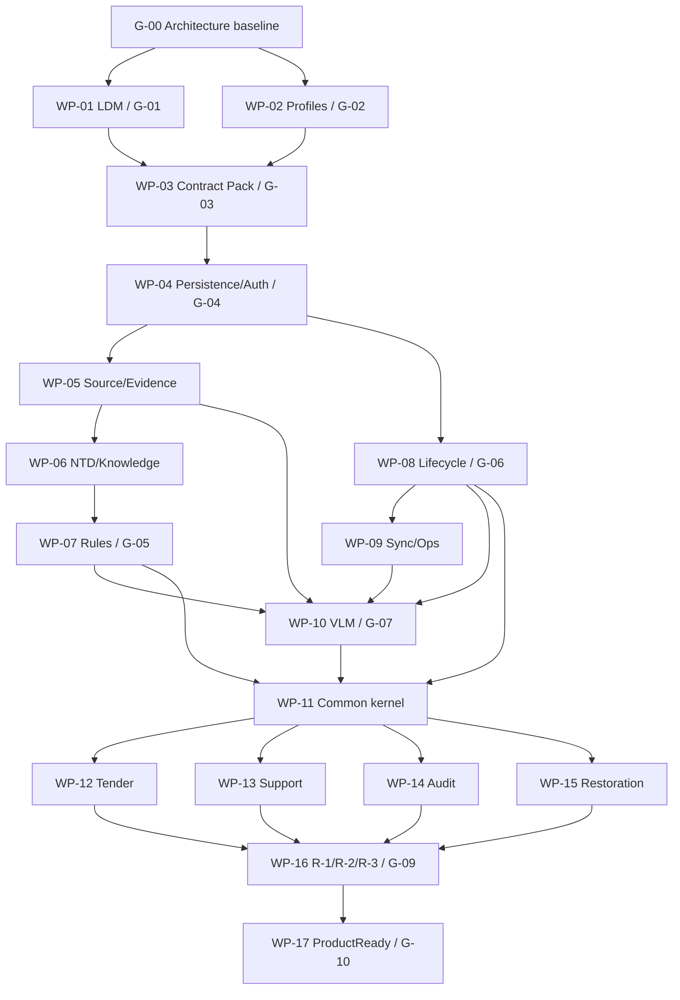

# АСД-КОНТУР — Implementation Plan v0.1

- **Статус:** `Accepted planning baseline`
- **Дата:** 2026-08-22
- **Владелец продукта:** Олег Щербаков
- **Ответственный за архитектуру:** ведущий архитектор Codex
- **Область:** весь объектно-независимый комплекс; `Tender`, `Support`,
  `Audit`, `Restoration`; не план одного пилота, модели, БД или узла
- **Не является:** реализацией, календарным планом, ORM/DDL, migration set,
  deployment runbook, provider approval или заявлением о ProductReady

## 0. Решение, полномочия и граница применения

Владелец продукта Олег Щербаков 2026-08-22 явно разрешил Codex закрывать
архитектурные решения, если они сохраняют цели АСД-КОНТУР, объектную
независимость, четыре режима, три постоянных результата, изоляцию ОКС,
evidence/provenance, Candidate-only boundary AI/VLM, одно логическое ядро и
принятые RD/DR/HV/ADR. На этом основании приняты IA-OD-01…06, IA-TD-01 и
TA-TD-01…22 и легитимизирована Technical Architecture v0.3.

Полномочие не позволяет Codex подтверждать факт конкретного ОКС,
профессиональное/юридическое решение, RuleVersion вместо DR-02 qualified
human approver, destructive production operation, external egress, расход,
provider policy или evidence-dependent retention period, qualification floor,
budget и cost envelope. При конфликте с прямым решением владельца действует
решение владельца, а конфликт фиксируется.

Этот план не открывает implementation gate. `G-00=PASS`, `G-01=PASS` и
`G-02=PASS` на уровне полного fail-closed profile contract; конкретная
production instance G-02 остаётся `BLOCKED`, а `G-03` закрыт принятым
`CONTRACT_PACK_v0.1.md` и `contracts/v0.1/`. До отдельной implementation
authority запрещены ORM, DDL, migrations и
persistence implementation; production deployment и external egress также
запрещены до active evidence-backed instances.

## 1. Неизменяемый продуктовый контракт

АСД-КОНТУР последовательно выполняет:

`provision workspace → admit sources/facts → common core → results → finalize
→ export/archive → verified reset/destruction → next ОКС`.

Граница готовности — конъюнкция `Tender ∧ Support ∧ Audit ∧ Restoration`, а
не Support, ТМ-35 или иной pilot slice. Все режимы используют одно ядро и
цепочку:

`ПД/РД + договор + регламент заказчика + НТД → структура ОКС → виды/объёмы
работ → МТР → контроль → доказательства → ИД → предъявленные объёмы → КС →
оплата`.

Постоянные результаты:

- `R-1` — подрядчико-защитный протокол разногласий и переработанный договор;
- `R-2` — анализ ПД/РД: пропущенные работы/МТР, конструктивные и
  геометрические коллизии, ошибки и риски;
- `R-3` — исполнительные схемы только из подтверждённых проектных и
  фактических геометрических данных.

MBP M5 Max — единственный active authoritative primary. VPS — coordination,
integration и controlled-egress node с ledger/status projections, но без
domain replica. S3 — durable object/archive/recovery plane, но не доменное
ядро. Failover ручной, после verified restore и fencing; silent fallback и
автоматическое promotion запрещены.

## 2. Evidence review и результат G-00

Полностью изучены README, Product Scope, Functional Model, Blueprint,
Domain/Knowledge, Knowledge/Memory, Lifecycle/Retention, Process/Event,
Authorization/Audit, Rules Catalogue, VLM Harness, Information Architecture,
Technical Architecture v0.2/v0.3, Implementation Baseline и ADR-0001…0008.
Проверены `pyproject.toml`, `domain`, `ntd`, `corpus`, `extraction`, `bridge`,
CLI и соответствующие tests. В `mac_asd` проверены PostgreSQL/pgvector/FTS,
KAG/RAG/MCP, normative clauses, rule/evidence graphs, Lessons/DomainTrap,
lifecycle/reset, archives/manifests, object storage, audit/events, geometry и
VLM/workflow routing. Исторический код рассматривается только как evidence.

| Проверка | Результат |
|---|---|
| ADR-0001…0008 | ADR-0002 `Superseded` ADR-0007; остальные действующие ADR `Accepted`; статусы ADR-0001/0003/0004 нормализованы без изменения смысла |
| ADR-0008 | Существует; согласован с v0.3; дубликат и новый ADR не требуются |
| IA-OD-01…06 | `Accepted` 2026-08-22; полный record — Information Architecture §21 и §3 этого плана |
| IA-TD-01, TA-TD-01…22 | Все `Accepted`; per-decision validation — §4 |
| RD/DR/HV | Не переоткрыты; direct owner decisions сохранены |
| Противоречия | Исправлены workspace=one-mode, archive reuse, SourceArtifact semantics и устаревшие status statements |
| G-00 | `PASS`; это architecture-ready, не implementation/product readiness |

## 3. Validation records IA-OD-01…IA-OD-06

Общие реквизиты каждой записи: `Accepted`, 2026-08-22, Codex по явным
полномочиям владельца. Все варианты проверены против четырёх режимов, R-1…R-3,
platform/workspace isolation, RD/DR/HV/ADR и отсутствия второго ядра.

| ID | Проблема и варианты | Выбрано и основание | Последствия и инварианты | Migration/rollback | Acceptance и проверка противоречий |
|---|---|---|---|---|---|
| IA-OD-01 | A one-org install; B shared multi-tenant; C logical multi-tenant + dedicated/shared profiles | C: одна information model без fork по deployment | `organization_id` обязателен; tenant scope поверх workspace; dedicated не отменяет isolation | Single-org становится dedicated profile; shared включается только после tenant tests | IA-AT-003; RLS/object/key/backup negative tests. Конфликтов с ADR-0008 нет |
| IA-OD-02 | A one workspace/one mode; B one workspace/many modes; C many lifecycle workspaces, governed ModeExecution | C: repeat engagements и mode reuse выразимы без четырёх ядер | ОКС не data container; mode принадлежит ModeExecution; explicit concurrency/sharing | legacy `workspace.mode` → первый ModeExecution; unsafe concurrency откатить в sequential policy | IA-AT-026…029; revision conflict/leak tests. Исправлено противоречие Domain/Lifecycle/Process |
| IA-OD-03 | A no reuse; B verified import to new workspace; C direct old archive/cross-read | B: provenance и ownership без скрытой памяти | integrity/schema/auth check; новые versions/lineage; no in-place activation | Неактивированный import workspace удаляется по lifecycle plan; fallback — fresh intake | IA-AT-019, 021…024. Согласовано RD-02/03/05 |
| IA-OD-04 | A platform only; B approved versioned org overlay; C unrestricted dictionaries | B: customer terms без загрязнения platform canon | deterministic precedence, provenance, steward/approver, no project facts | Old dictionaries quarantine как candidates; rollback pin previous overlay version | IA-AT-001/003/008…011; overlay conflict/isolation tests |
| IA-OD-05 | A human every fact; B device/schema confirms all; C risk/field-class matrix | C: assurance proportional risk без передачи authority машине | confidence/schema/device не подтверждают факт; geometry/volume/legal fail closed до qualified policy | Old observations import only as Candidate; policy rollback pins prior matrix | IA-AT-004/005/007; device/calibration/custody/authority tests. Numeric floors deferred G-02 |
| IA-OD-06 | A record claims; B verify external signatures, signing external; C product signing | B: нужная verification evidence без private-key/legal expansion | chain/revocation/time/signer authority canonical; no signing capability/key in v0.1 | Claims stay unverified; signing only future ADR and threat/legal design | valid/expired/revoked/wrong-role/no-key tests. Не выполняет professional/legal confirmation |

Затронутые документы синхронизированы: Domain, Information,
Authorization, Process, Lifecycle, Technical Architecture и Blueprint. Новый
ADR не создан: решения полно оформлены Decision Cards и не меняют ADR-0008.

## 4. Decision validation records Technical Architecture v0.3

Для каждой записи ниже статус `Accepted`, дата 2026-08-22, authority — Codex
по правилу §0. Все влияют на четыре режима и R-1…R-3 через одно ядро. Общий
rollback: не менять исторические данные, pin предыдущий compatible contract/
profile/release, quarantine неподтверждённое состояние и выполнить новую
versioned migration. Общая security-проверка: least privilege, exact scope,
default deny, no secret/content in telemetry. Общая retention-проверка: любой
созданный объект/attempt/residue имеет class, owner, profile и deletion proof.

| ID | Исходная проблема; рассмотренные варианты | Принято и основание | Isolation/retention/security и последствия | Migration/rollback; acceptance; противоречия/документы |
|---|---|---|---|
| IA-TD-01 | UUID/ULID/bigint; deterministic identity vs random entity identity | UUIDv7 default; typed UUIDv5 only with namespace+canonicalization version; SHA-256 only digest | Scope входит в reproducible input/idempotency; digest не capability | Migrate UUIDv4 by mapping table, preserve v5 aliases; ID collision/scope/canonicalization tests; current code UUIDv4/v5 requires refactor. IA, Domain, TA |
| TA-TD-01 | A manual activation; B lease/epoch; C quorum | A + monotonic epoch/fencing: MBP must work without VPS lease | One active primary; no auto promotion; activation audit retained content-minimal | Revert to fenced previous primary only after verification; TA-AT-007…009; no ADR-0008 conflict. TA, Auth, Process |
| TA-TD-02 | A no VPS reads; B filtered projection; C physical replica | B: remote status without second SoR | Workspace/org filters, staleness metadata, retention-minimal projection | Disable/rebuild projection; TA-AT-013 and no-domain-replica test. TA, IA |
| TA-TD-03 | A metadata-only; B encrypted scoped ingress; C general store | B: resilient intake with bounded residue | No plaintext on VPS; exact workspace/class/purpose; deletion receipt | Stop intake and purge staging; TA-AT-003/010/012. Lifecycle, Auth, TA |
| TA-TD-04 | A global quota; B policy quota/TTL; C ad hoc | B: versioned workspace/class/purpose limits | Missing/expired policy denies persistence; quota/TTL auditable | Pin previous profile or deny; TA-AT-012. Lifecycle, TA |
| TA-TD-05 | A HTTPS; B broker+manifest; C managed sync | A HTTPS + transactional inbox/outbox/manifests: smallest mechanism preserving semantics | At-least-once, idempotency, ack/reconcile; queue is not SoR | Versioned protocol can add broker later without domain change; TA-AT-004…006. Process, TA |
| TA-TD-06 | A private overlay; B site VPN; C public mTLS | A: smallest attack surface for node plane | MBP canonical endpoints private; network metadata follows security retention | Replace overlay via profile and dual-trust migration; node reachability/deny-public tests. Auth, TA |
| TA-TD-07 | A VPS-only public; B selected MBP private; C mixed direct | VPS public only + selected MBP private endpoints | No public MBP canonical API; public ingress cannot confer authority | Disable gateway/private endpoint independently; endpoint exposure test. ADR-0008, TA |
| TA-TD-08 | A TLS+tokens; B node mTLS; C service mesh | B: strong node identity without service-mesh dependency | Node and user/delegation identities separate; certificate lifecycle audited | Rotate/revoke with overlap; TA-AT-014. Auth, TA |
| TA-TD-09 | A OS store; B KMS; C hybrid envelope | C: recoverability and compromise-radius balance | No secrets in config/log; wrapped DEK/versioned KEK; provider remains profile | Rewrap keys, retain old decrypt path until verified; loss/rotation/recovery tests. Auth, TA |
| TA-TD-10 | A S3-side; B client-side; C both | C for sensitive workspace objects | S3 cannot read plaintext solely by service access; keys independently scoped | Re-encrypt exact object versions with manifest; encryption/restore/delete tests. Lifecycle, TA |
| TA-TD-11 | A one region; B primary+recovery; C self-hosted | B generalized as qualified primary + recovery location profile | No vendor/region/residency assumption; absence blocks S3 production | Provider-neutral copy/verify/cutover; policy qualification tests. No factual provider chosen. TA, IA |
| TA-TD-12 | A shared prefixes; B workspace buckets; C account/bucket tiers | C: strongest practical blast-radius separation | Credentials and listing scope by env/scope/purpose; hash never address right | Versioned namespace copy and exact receipt reconciliation; TA-AT-010/011. Lifecycle, TA |
| TA-TD-13 | A none; B versioning; C lock+versioning | Class-specific: B active, C archive/backup, finite raw noncurrent | Evidence durability without making raw legally undeletable; exact versions residues | Policy migration per class; archive immutability/raw purge tests. RD-01…04, TA |
| TA-TD-14 | A dumps; B PITR; C layered | C: logical archive/export distinct from physical/PITR recovery | Backup is residue, not archive/current state; consistent metadata/object set | Restore to candidate then verify; TA-AT-020. Lifecycle, TA |
| TA-TD-15 | A global RPO/RTO; B class/mode profiles; C best effort | B, but numbers only after measured drills | No unsupported availability claim; profile retention/security scoped | Pin prior measured profile or state unavailable; TA-AT-020. No numbers invented. TA |
| TA-TD-16 | A manual checklist; B automated verify+human activate; C automatic | B: separates integrity from authority | Restore cannot activate itself; fencing and isolation required | Reject candidate, retain evidence, retry from prior backup; TA-AT-008/009/020. ADR-0008 |
| TA-TD-17 | A stop; B bounded staging; C VPS processing | B for authorized classes only | VPS cannot confirm facts/finalize; staging expires/deletes | Disable staging and require MBP online; TA-AT-003/012. IA, TA |
| TA-TD-18 | A MBP direct; B VPS gateway; C policy route | B: central controlled egress consistent topology | Exact egress identity/policy; provider gets no storage/SQL; route separately qualified | Disable external route, no silent local/external fallback; TA-AT-015/016. ADR-0006, Harness |
| TA-TD-19 | A local only; B central minimal; C full logs | B + protected local detail | Central schema excludes project content/prompt/response/secret; logs have retention | Quarantine schema/release and purge leakage; TA-AT-017. Auth, Lifecycle |
| TA-TD-20 | A manual; B signed pull; C central push | B: controlled supply chain without arbitrary push | Signature/compatibility required; config secrets excluded | Roll back to signed compatible release; TA-AT-018. TA, Process |
| TA-TD-21 | A none; B private JIT; C public admin | B: recoverability with bounded exposure | Strong human+node auth, time-bound grant, audit; no public admin | Revoke session/cert and return to local-only admin; public/JIT expiry tests. Auth, TA |
| TA-TD-22 | A upload-only; B bidirectional contracts; C DB replica | B: field usability without replica/second core | Scoped versions, conflicts explicit, unsupported schema blocked | Upload-only degraded mode; TA-AT-019 and conflict/no-LWW tests. Process, TA |

Ни одно selected решение не противоречит четырём режимам, R-1…R-3, RD, DR,
HV или ADR. Единственные выявленные противоречия были статусно-семантическими
в соседних документах и исправлены. TA-TD-11/15 намеренно не принимают
provider/region или численные RPO/RTO. TA-TD-18 не разрешает реальный egress.

## 5. Gates G-00…G-10

| Gate | Вход и обязательный evidence | Acceptance / blocker | Authority | Статус |
|---|---|---|---|---|
| G-00 Architecture Baseline | Blueprint, Domain/Knowledge, Knowledge/Memory, Lifecycle, Process, Authorization, Rules, Harness, ID Generation, IA, TA v0.3, ADR-0001…0010, IA/TA decisions | Документы согласованы; four-mode/R-1…R-3/one-core/isolation/Candidate invariants traceable | Codex architecture authority; direct owner RD/DR/HV/ADR preserved | `PASS 2026-08-22` |
| G-01 Logical Data Model v0.1 | G-00; accepted identity/scope/SoR/retention/process contracts | Отдельный reviewed normative artifact; до него нет ORM/DDL/migration | Architecture approval; policy values referenced, not invented | `PASS 2026-08-22` |
| G-02 Deployment and Policy Profiles v0.1 | G-00 and G-01 scopes; evidence from provider terms, benchmarks, threat/recovery analysis | Complete profiles or fail-closed values; no production deploy/egress without them | Architecture + applicable security/professional/provider-policy authority | `PASS 2026-08-22` profile contract; production instances `BLOCKED` |
| G-03 Contract Pack | G-01/G-02; schema registry/versioning rules | Machine-readable contracts pass compatibility, negative-scope and round-trip tests | Architecture/API/security owners | `PASS 2026-08-22` |
| G-04 Persistence Foundation | G-01…03 | PostgreSQL schemas/migrations/repositories/RLS/audit/object ledger/inbox-outbox adapters and isolation tests | Implementation authority after gates | `PASS 2026-08-23` |
| G-05 Platform Knowledge Foundation | G-04 | Source/Evidence Ledger, official registry, NTD editions/units, canon, rules, FTS/vector/typed graph, Gateway, Promotion Gate | Knowledge/rule authorities; RuleVersion only qualified human | `PASS 2026-08-23` |
| G-06 Workspace Lifecycle Foundation | G-04 and required G-05 source contracts | Provision/isolate/ModeExecution/archive/export/reset/destroy/restore/import; distributed residue tests | Lifecycle request/confirm/verify separation | `PASS 2026-08-23` |
| G-07 AI/VLM Harness | G-03…06, approved qualification/policy profiles | native-first, local Qwen3.8-27B, provider-neutral controlled route, Candidate lifecycle, validators/repair/budgets/raw retention | Harness/security/qualified confirmation authorities | `G-07A PASS 2026-08-23`; `G-07B BLOCKED` |
| G-08 Four-mode Product Slices | G-04…07 and common process kernel | Four separate E2E suites through same core; no mode-specific core/store | Product acceptance authorities per mode | `BLOCKED` |
| G-09 Three Product Deliverables | G-08 | Industrial acceptance R-1, R-2, R-3; R-3 geometry gate is hard blocker | Qualified legal/engineering/geometry roles as applicable | `BLOCKED` |
| G-10 ProductReady | G-00…09 plus cross-mode, recovery, security and operations evidence | `ProductReady=true` only if every mode and cross-mode scenario passes; infra health is insufficient | Product owner on evidence; no AI authority | `BLOCKED` |

### 5.1. G-01 exact content

`docs/architecture/LOGICAL_DATA_MODEL_v0.1.md` must define, without ORM/DDL:

- platform/organization/ОКС/workspace/ModeExecution cardinalities and ownership;
- canonical entities, immutable versions, current/derived projections;
- composite workspace-scoped references and default-deny RLS model;
- Source/Evidence Ledger, SourceArtifact/SourceVersion/object metadata;
- NormativeDocument/Edition/StructuralUnit/assertions/cross-references;
- Rule/RuleVersion/RuleSetVersion/evidence/trace/conflict/approval;
- Candidate/Fact/Uncertainty lifecycles and confirmation records;
- geometry, CRS, units, precision, measurements, transformations and lineage;
- commands/events/process/current state/idempotency/inbox/outbox;
- identities, grants, authorization decisions and content-minimal audit;
- VLM requests/attempts/results/validators/repair/qualification;
- archive/export/import/reset/destruction plans, receipts and attestations;
- FTS/vector/sparse/typed-graph projection registries and rebuild lineage.

Acceptance: every object has identity, scope, owner, SoR, immutable/current
semantics, provenance, authorization, retention, state transitions and
deletion fate; every workspace FK includes workspace scope; no polymorphic
escape hatch; Candidate cannot become Fact by confidence; archive import
creates new workspace; four-mode/R-1…R-3 traceability is complete; all IA/RD/
DR/HV/TA acceptance catalogues map to entities/constraints. The artifact must
be independently reviewed before any ORM or migration is designed.

### 5.2. G-02 exact content and evidence procedure

One versioned profile pack must cover MBP/VPS/S3 node profiles, network zones,
identity/certificate profiles, S3 scope/encryption/retention, inbox/outbox
limits, backup/RPO/RTO, failover/fencing, provider allowlists,
ClassificationTaxonomy, WorkspaceEgressPolicy, RetentionProfile, Basis
Registry, ConfirmationPolicy, qualification floors, execution/repair budgets,
FallbackMatrix, CostEnvelope и golden/regression corpus governance.

Each value records source/evidence, collected_at, applicable scope, owner,
approver, validity interval, review trigger and fail-closed behavior. Provider
terms come from retained official terms; performance/floors/budgets from
versioned representative benchmarks and risk analysis; recovery objectives
from measured restore drills and business impact; retention/basis from
qualified legal/records authority. Unknown values remain `UNSET/BLOCKED`, not
guessed defaults.

### 5.3. G-03 exact content

Machine-readable, versioned contracts: entity schemas; command/event schemas;
Knowledge Tool Gateway and EvidencePack; VlmExecutionProvider;
StorageAdapter/object receipts; synchronization envelope/ack/reconciliation;
authorization envelope/decision; archive/export/import; destruction plan/
receipt/attestation. Acceptance requires canonical examples, invalid/hostile
examples, compatibility ranges, schema fingerprints, deterministic
serialization where needed, workspace/organization scope tests, property
tests, round-trip tests and no silent coercion/fallback.

## 6. Work package contract

Every WP below is product capability, not a code-volume target. `M4` means all
four modes; `R123` means all three results. Unless stated otherwise, every WP
forbids pilot-only entities, paths, RuleVersion and readiness claims; TM-35 may
enter only as labeled test data after universal contracts.

### WP-01 — Logical Data Model / G-01

| Field | Plan |
|---|---|
| Capability; inputs; scope | Logical data contract; G-00; M4/R123 |
| Dependencies / DoR | Accepted IA/Domain/Lifecycle/Process/Auth/Rules/Harness/TA and resolved terminology |
| Actions / artifacts | Create only `LOGICAL_DATA_MODEL_v0.1.md` with §5.1 content and traceability matrix |
| Tests | Model review, invariant walkthroughs, cross-workspace FK/RLS thought tests, archive/reset and geometry lineage scenarios |
| DoD | G-01 acceptance complete; no ORM/DDL/migration exists |
| Risks / rollback | Premature physical choices; revise document/version, never patch schema first |
| Memory / retention | Explicit platform vs organization vs workspace ownership; fate of every class documented |

### WP-02 — Deployment and Policy Profiles / G-02

| Field | Plan |
|---|---|
| Capability; inputs; scope | Evidence-backed MBP/VPS/S3 and policy profiles; G-00 plus G-01 scopes; M4/R123 |
| Dependencies / DoR | Threat model questions, provider terms acquisition plan, benchmark/drill protocols, policy authorities named |
| Actions / artifacts | Profile schemas, evidence ledger and approval workflow listed in §5.2; no real deployment/policy instance in this task |
| Tests | Missing/expired/conflicting values deny; tenancy, encryption, retention, budget, failover tabletop tests |
| DoD | Every required value either approved with evidence or explicitly blocks capability |
| Risks / rollback | Invented numbers/vendor lock-in; pin previous valid profile or fail closed |
| Memory / retention | Platform policies versioned; workspace references pinned profile versions; profile history retained per class |

### WP-03 — Contract Pack / G-03

| Field | Plan |
|---|---|
| Capability; inputs; scope | Machine-readable boundaries; G-01/G-02; M4/R123 |
| Dependencies / DoR | Stable logical entities/scopes and policy references |
| Actions / artifacts | Contracts and fixtures from §5.3; schema registry and compatibility policy |
| Tests | Round-trip, property, hostile payload, downgrade, schema-range, tenant/workspace scope tests |
| DoD | Contract versions accepted; producers/consumers can be implemented without semantic invention |
| Risks / rollback | Divergent schemas; keep prior compatible version and quarantine unsupported payload |
| Memory / retention | Payload class declares platform/workspace memory, raw policy, archive/delete fate |

### WP-04 — Persistence and authorization foundation / G-04

| Field | Plan |
|---|---|
| Capability; inputs; scope | Canonical PostgreSQL transaction boundary, RLS, repositories, audit, object ledger, inbox/outbox; M4/R123 |
| Dependencies / DoR | G-01…03 PASS and explicit implementation authority |
| Actions / artifacts | `src/asd_kontur/{contracts,domain,persistence,settings}`, Alembic `0001_g04`, tests, CI and `docs/implementation/G04_PERSISTENCE_FOUNDATION_v0.1.md` |
| Tests | Migration up/down-forward path, composite-scope FK, RLS negative matrix, append-only audit, idempotency/reconciliation |
| DoD | G-04 suite passes; no canonical state on VPS/S3; source/object admission atomic by contract |
| Risks / rollback | Premature ORM, data leaks, split SoR; forward migration or restore verified backup, never destructive reset |
| Memory / retention | Separate platform/workspace schemas; content-minimal audit; object/WAL/backup residues inventoried |

### WP-05 — Source and Evidence Ledger

| Field | Plan |
|---|---|
| Capability; inputs; scope | Admission, immutable versions, locators, evidence/lineage and official-source registry; M4/R123 |
| Dependencies / DoR | G-04 and source/object contracts |
| Actions / artifacts | SourceArtifact/Version/Locator, acquisition attempts, evidence links, object receipts, Minstroy registry workflow |
| Tests | Digest/locator/version conflicts, official-source provenance, S3 unavailable, duplicate admission, cross-workspace denial |
| DoD | No fact/result without source lineage; byte write alone never domain acceptance |
| Risks / rollback | Path-as-identity, incomplete NTD, object residue; immutable re-admission/new version |
| Memory / retention | NTD platform; project sources workspace; archive and purge exact object versions |

### WP-06 — Canonical NTD and Knowledge Gateway / G-05 part A

| Field | Plan |
|---|---|
| Capability; inputs; scope | Editions, structural units, assertions, FTS/vector/typed graph and EvidencePack gateway; M4/R123 |
| Dependencies / DoR | WP-05; managed NTD source/evidence and projection contracts |
| Actions / artifacts | Canon, exact citation, applicability inputs, rebuild registry, gateway tools and gap/conflict output |
| Tests | Edition/effective-date/conflict, exact cite, projection rebuild equivalence, missing knowledge explicit, no direct LLM SQL |
| DoD | Canon independent of retrieval/model; cancelled editions remain provenance; empty index is not “no rule” |
| Risks / rollback | Canon/retrieval mixing, incomplete NTD, silent empty fallback; rebuild projection or pin previous canon version |
| Memory / retention | Canon/projections platform; workspace retrieval index strictly scoped and purgeable |

### WP-07 — Rule Registry and deterministic runtime / G-05 part B

| Field | Plan |
|---|---|
| Capability; inputs; scope | RuleVersion/RuleSet pin, evidence, conflict, trace, controlled upgrade; M4/R123 |
| Dependencies / DoR | WP-06; DR-01…04; G-03 rule contracts |
| Actions / artifacts | Registry/runtime/compiler interface, seed classes, approval/regression workflow, workspace-rule scope |
| Tests | Determinism/fingerprint, applicability unknown, conflict policy, qualified review/approval, rollback/pin, no AI promotion |
| DoD | Every decision cites exact RuleVersion/evidence; RuleSet reproducible; current hard-coded thresholds removed through migration |
| Risks / rollback | RuleSet drift/obsolete inherited rules; pin prior accepted RuleSet and preserve traces |
| Memory / retention | Accepted global rules platform; workspace rule strictly workspace and destroyed; promotion only through Gate |

### WP-08 — Workspace lifecycle, isolation and verified import / G-06

| Field | Plan |
|---|---|
| Capability; inputs; scope | Provision, ModeExecution, close, export/archive, reset/destruction, restore/import; M4/R123 |
| Dependencies / DoR | WP-04/05; Lifecycle/Auth contracts; distributed adapters |
| Actions / artifacts | Lifecycle services, plans/receipts/attestation, tombstones, verified new-workspace import, leak scanner |
| Tests | A/B leak matrix across rows/objects/indexes/jobs/logs/backups/provider residues; delayed replay; restore/fencing/import |
| DoD | `verified` impossible with unchecked adapter/residue; next ОКС starts clean; platform survives |
| Risks / rollback | Destructive overreach/residues/restore illusion; dry-run, independent confirmation, stop before delete, restore only as candidate |
| Memory / retention | Workspace content archive/delete per profile; only RD-03 content-free audit/attestation survives |

### WP-09 — MBP/VPS/S3 synchronization and operations

| Field | Plan |
|---|---|
| Capability; inputs; scope | Envelopes, status projection, ingress staging, ack/reconcile, health/degraded semantics; M4/R123 |
| Dependencies / DoR | WP-04/08, approved node/network/key/storage profiles |
| Actions / artifacts | Sync adapters, coordination ledger, signed release/compatibility, content-minimal telemetry, recovery procedures |
| Tests | Duplicate/lost ack/unknown result, node outages, stale status, cert revoke, split brain, exact-version residue |
| DoD | VPS/S3 never become domain SoR; all failures visible; restore/activation drill evidence exists |
| Risks / rollback | Split brain, staging residues, false success; fence, quarantine, disable route, signed release rollback |
| Memory / retention | VPS only bounded envelopes/projections; S3 bytes/archive/recovery; MBP canon; all residues profiled |

### WP-10 — AI/VLM Verification Harness / G-07

| Field | Plan |
|---|---|
| Capability; inputs; scope | Native-first extraction, local Qwen3.8-27B, provider-neutral external route, validators/repair/qualification; M4/R123 |
| Dependencies / DoR | G-07A local/synthetic foundation: WP-05…08 and fail-closed G-02 policy contracts; G-07B distributed external route: additionally WP-09 and active G-02B qualification/budget/egress/raw policy instances |
| Actions / artifacts | Provider contract implementations, router, immutable attempts, Candidate lifecycle, targeted bounded repair, corpus governance |
| Tests | Prompt scope attack, provider 200 invalid/false, qualification identity, budget exhaustion, no silent fallback, raw purge, Candidate-no-Fact |
| DoD | Only typed Candidate/draft exits Harness; every route qualified; geometry/legal/volume confirmation remains outside AI |
| Risks / rollback | False confirmation, retention/egress, model drift/cost; disable route, pin profile, retain evidence, manual review |
| Memory / retention | Models/prompts/schema platform; request/render/raw/result workspace and purgeable; minimal audit only |

### WP-11 — Common domain process kernel

**Implementation status 2026-08-23:** `PASS — accepted implementation foundation`.
Implementation record: `docs/implementation/WP11_COMMON_DOMAIN_PROCESS_KERNEL_v0.1.md`.

| Field | Plan |
|---|---|
| Capability; inputs; scope | Shared chain structure→work→MTR→control→evidence→ID→volume→KS→payment; M4/R123 |
| Dependencies / DoR | WP-04…10; accepted process/entity/rule contracts |
| Actions / artifacts | Common commands/current state/events/services, deliverable lifecycle, uncertainty/blocking and calculation interfaces |
| Tests | Cross-mode invariant suite, concurrency/idempotency, source→result lineage, no mode-specific store/core |
| DoD | All mode overlays invoke same kernel; common scenario is reproducible and workspace-isolated |
| Risks / rollback | Four cores or generic untyped facts; contract version rollback and quarantine conflicting workflow |
| Memory / retention | Common platform definitions; executions/facts/results workspace; finalized archive then governed destruction |

### WP-12 — Tender slice

| Field | Plan |
|---|---|
| Capability; inputs; results | Tender E2E through common kernel; primarily R-1/R-2, geometry blockers surfaced; not standalone product |
| Dependencies / DoR | WP-11 and Tender contract/RuleSet/authority/fixtures |
| Actions / artifacts | Admit lot sources, contract/PD/RD analysis, risks/conditions, draft disagreement/revised contract and evidence pack |
| Tests | Missing/contradictory terms, NTD edition, cost/volume uncertainty, qualified legal confirmation, archive/reset |
| DoD | Terminal Tender conditions pass without fabricated legal/factual closure |
| Risks / rollback | Legal overclaim/pilot hard-code; draft only until authority, pin prior result version |
| Memory / retention | Templates/rules platform; lot/project data and drafts workspace; archive/delete governed |

### WP-13 — Support slice

| Field | Plan |
|---|---|
| Capability; inputs; results | Support E2E, R-1/R-2/R-3 where confirmed data exists; not MVP boundary |
| Dependencies / DoR | WP-11 and field/confirmation/geometry contracts |
| Actions / artifacts | Planned/performed work, MTR, controls, evidence, proactive ID drafts, claimed volumes/KS/payment readiness |
| Tests | Offline conflicts, missing field evidence, calibration/authority, hidden work, material custody, archive/reset |
| DoD | Full chain traceable; no confidence-based fact or executive geometry |
| Risks / rollback | TM-35 coupling/field false fact; quarantine Candidate and revert ModeExecution version |
| Memory / retention | Field facts/media workspace; reusable rule/templates platform only via Promotion Gate |

### WP-14 — Audit slice

| Field | Plan |
|---|---|
| Capability; inputs; results | Audit E2E, mainly R-2 and verification of R-1/R-3 evidence; three linked but independent outputs: `Document Delta`, `Causal Readiness Delta` from MTR/incoming control through ID/KS/payment, and `Package/Signing/Handover Readiness` |
| Dependencies / DoR | WP-11 and WP-13 causal entities; shared collection/admission/object-ledger capability; deterministic physical-object/page preflight; resource-aware exact ProcessingPlan; page/shard receipt reconciliation and evidence-rated CorpusSnapshot; exact Audit scope; completeness/conflict/geometry rules; typed document-occurrence/page-boundary reconciliation; Package/Volume/Book/Membership and ActionRequest semantics; pinned RuleSet/ConflictPolicy/authority; Audit/Restoration boundary; G-07 partial-result and G-06 reset semantics |
| Actions / artifacts | Common four-mode CollectionMission/Scope/Source, AcquisitionBatch/CustodyReceipt, streamed PhysicalObjectInspection, page-addressable ProcessingPlan/Shard/Receipt, validated container→logical-document boundaries and exact CorpusSnapshot; required↔found↔recognized↔classified↔versioned↔evidence-bound↔applicable Document Delta; MTR→control→admission→work→evidence→ID→presentation→KS→payment impact paths; package/book/order/copies/review/signature/handover/acceptance delta; typed ActionRequests; gaps/conflicts/uncertainties/blockers; Customer/PTO rebuildable projections; evidence-rated audit report |
| Tests | Organized and hostile/chaotic intake through one capability; streaming preflight; synthetic 360 MiB/726-page metadata plan without large fixture; mixed native/raster route; bounded adaptive shards; page resume/checkpoint; incomplete receipts/all-shard failure/unknown/duplicate results; uncertain/out-of-range/gapped/overlapping boundaries; exact snapshot without whole-ОКС completeness claim; package many-to-many membership; copy/signature/handover gaps; ActionRequest SoD/closure; false 100% readiness; reclassification missing attrs; no last-write-wins/confidence Fact; duplicate bytes vs authority; conflicting versions; untimely incoming-control evidence; batch/work/ID/KS/payment impact; dashboard rebuild; geometry without CRS; archive/reset/A-B isolation |
| DoD | AT-PE-43 proves shared acquisition→preflight→plan→receipts→reconciliation→CorpusSnapshot and all three Audit deltas end to end on synthetic corpus; each delta has exact scope, own versioned denominator, source/locator/rule/authority/fingerprint lineage; partial/unknown/unreadable/unassigned states visible; external-unavailable huge work is blocked/deferred rather than hidden local fallback; downstream impact traced without unsupported legal conclusion; Audit never performs Restoration or fabricates completeness |
| Risks / rollback | Retrieval/file count/process status mistaken for canon; rebuild projection, pin prior source/rule/result versions, quarantine boundary/integrity conflict and issue a new immutable audit result |
| Memory / retention | Audit definitions platform; inspected corpus/findings workspace; final report archive/delete policy |

#### WP-14 evidence-informed DoR and acceptance refinement

The pre-implementation evidence assessment is recorded in
[`LEGACY_PDFPIPELINE_AUDIT_EXPERIENCE_v0.1.md`](../reports/LEGACY_PDFPIPELINE_AUDIT_EXPERIENCE_v0.1.md)
and
[`WP14_PDFPIPELINE_ARCHITECTURE_IMPACT_ASSESSMENT_v0.1.md`](../reports/WP14_PDFPIPELINE_ARCHITECTURE_IMPACT_ASSESSMENT_v0.1.md).
Legacy Levashovo observations are practical evidence, not platform rules or a
ready architecture.

Before implementation, WP-14 must have:

1. a synthetic object-independent qualification corpus and immutable corpus
   inventory;
2. typed distinction among physical bytes/file occurrence, semantic source,
   immutable version, exact page/region locator and derived render/attempt;
3. document/container/page integrity and partial-result reconciliation;
4. exact `DocumentRequirement` coverage dimensions, including signer/authority;
5. causal evaluation from MaterialBatch and incoming control through admission,
   work/evidence, ID/signing, PresentedVolume, KS and PaymentClaim readiness;
6. separate Package/Volume/Book identity, ordered many-to-many document
   membership, required copies/registers, professional review, signer,
   handover and acceptance states;
7. typed `ActionRequest` with initiator/executor/verifier authority, closure
   evidence, deadline, escalation and supersession;
8. three-valued applicability and typed downstream gap/conflict/blocker/
   uncertainty, never an unsupported legal conclusion;
9. projection-only Customer/PTO dashboard contracts and typed correction
   commands;
10. workspace RLS/lifecycle/archive/reset coverage for all Audit artifacts.
11. one shared four-mode acquisition model that accepts both organized and
    chaotic inputs without prior complete manual sorting;
12. streaming deterministic preflight and resource policy able to plan a
    synthetic 360 MiB/726-page raster container without loading or committing it;
13. immutable one-based page/shard/receipt checkpoints, bounded resume and exact
    reconciliation before any `CorpusSnapshot`;
14. an explicit statement that a snapshot proves the observed collection scope,
    not completeness of the whole construction object.

Mandatory scenarios supplement `AT-PE-43`: thousands of files and successful
recognition do not imply completeness; unlinked or untimely incoming-control
evidence does not admit a batch; one logical document is not split and multiple
documents/workspaces are not mixed; duplicate bytes do not imply authority;
conflicting versions remain visible; provider partial/all-window failure cannot
become empty-success; missing applicable АВК/АОРПИ/journal evidence traces to
affected MTR/work/ID/KS/payment readiness; GeneratedDocumentCandidate or filled
folders are not signed ID; package/book/section are distinct and one document
may join multiple packages; missing copy, signer authority, handover or
acceptance remains visible; stop-code closure requires typed ActionRequest,
evidence and policy authority; reclassification appends a version and reruns
validators; last upload and high confidence create no authority; PTO
corrections append versions/audit; false signed-readiness formulas are rejected;
projection rebuild preserves canonical fingerprints; Audit does not perform
Restoration; project-specific rules are not promoted automatically. The
complete normative scenario list and refined DoD are in the impact assessment
§§11–12.

Implementation evidence and the exact migration/contract boundary are recorded
in [`WP14_AUDIT_SLICE_v0.1.md`](../implementation/WP14_AUDIT_SLICE_v0.1.md).

### KG-ID-01 — ID Practice Guide Knowledge Ingestion

| Field | Plan |
|---|---|
| Capability; inputs; results | Cross-cutting native-first construction of permanent, model-independent ID Practice Intelligence: verified source knowledge → typed practice model → deterministic Context Assembly → Knowledge Gateway → any VLM; never NTD, RuleVersion or workspace Fact |
| Dependencies / DoR | G-05 platform source/evidence ledger and Knowledge Gateway; G-07A exact local Qwen profile, Candidate-only boundary, validators and retention; verified source bytes/custody; owner curator authority |
| Actions / artifacts | Exact PageManifest and bounded extraction evidence; deterministic grounding/integrity; independent candidate verification; immutable reconciliation; typed principles/workflows/form-field guidance/attention/variants/rationale/failures/checklists/dependencies/examples/playbooks; permanent source/canon; versioned ContextAssemblyPolicy; exact/FTS Gateway; scenario memory acceptance |
| Tests | 425 terminal receipts and candidate terminal states; malformed/empty/duplicate/conflict handling; model/service publication denial; NTD/practice/workspace separation; reset/destroy survival; model/provider independence; projection rebuild; backup/restore fingerprints; mandatory context; at least 25 scenario exact-citation tasks plus adversarial gaps/conflicts/edition/authority cases |
| DoD | Verified source subset is converted to canonical versioned Practice Intelligence; every ID-related VLM path requires deterministic Context Assembly; permanent local instance serves exact source-pinned context to a new interchangeable VLM; reset/destroy and retrieval rebuild preserve canon; source content absent from Git |
| Risks / rollback | Methodological example mistaken for norm, model hallucination, partial pass claimed complete, source leakage; suspend exact edition/profile, retain immutable candidates/receipts, rebuild projections, never auto-activate rules |
| Memory / retention | Source PDF in platform object plane and canonical intelligence in PostgreSQL platform schema have `permanent_platform_core`; retrieval projections are rebuildable, runtime packs ephemeral; raw prompts/responses/renders follow separate processing retention; no live workspace links |

KG-ID-01 is a prerequisite inserted by owner decision before WP-15. Its exact
implementation and measured local-Qwen evidence are recorded in
[`KG_ID_PRACTICE_GUIDE_INGESTION_v0.1.md`](../implementation/KG_ID_PRACTICE_GUIDE_INGESTION_v0.1.md).
Production model qualification, G-07B, embeddings and professional ID authority
remain separate blocked capabilities.

### NTD-SEED-01 — bounded official NTD memory from the Practice Guide

| Field | Plan |
|---|---|
| Capability; inputs; results | Separate `normative_authority` layer for the exact 25 stable identities discovered on guide PDF pages 15–19; the guide is discovery evidence only |
| Dependencies / DoR | Completed KG-ID permanent guide edition and geometry; G-05 Source/Evidence Ledger and normative canon; official Minstroy `/docs/` source |
| Actions / artifacts | 37 immutable guide references; official-only bounded acquisition receipts; stable documents and immutable editions/artifacts; provision candidates and verified versions; explicit activation/applicability; Gateway gaps/conflicts; backup/projection manifests |
| Tests | Manifest reconciliation; official-only fail-closed acquisition; idempotent/new editions; timeline/as-of; provision locator; RLS/reset; backup/restore; projection rebuild; provider independence; fresh-session non-fabrication |
| DoD | Every seed identity has an evidence-backed terminal outcome; only exact official verified subsets publish; missing official access remains a typed gap and never empty success |
| Current status | `PARTIAL 2026-08-25`: 25/25 `official_access_blocked`, 0 editions/artifacts/provisions published; permanent-memory contracts and fail-closed acceptance pass |

The bounded implementation evidence is recorded in
[`NTD_SEED_FROM_PRACTICE_GUIDE_v0.1.md`](../implementation/NTD_SEED_FROM_PRACTICE_GUIDE_v0.1.md).
No recursive NTD expansion, TM-35 processing or G-07B work is authorized by
this item.

### UNIFIED-HARNESS-01 — Unified Construction Harness

| Field | Value |
|---|---|
| Objective | One deterministic `ProjectDefinition → ConstructionWorkPackage → WorkRequirementMatrix` process shared by Tender, Support, Audit and Restoration |
| Memory boundary | Workspace project/contract/customer facts + permanent Practice Intelligence + verified NTD + qualified RuleVersion; no new knowledge subsystem |
| AI boundary | Mandatory source-pinned `ConstructionHarnessContextPack`; typed Knowledge Gateway only; model/provider-independent canonical memory |
| Customer overlay | Additive workspace-only requirements; no normative weakening, edition replacement or cross-workspace reuse |
| NTD gap behavior | Preserve work structure and perform only evidence-sufficient calculations; return explicit knowledge gap and no normative confirmation/rule activation |
| Current status | `PASS (bounded implementation) 2026-08-25`; Contract Pack v1.8, migration `0017_unified_harness`, 350 local tests including PostgreSQL integration |
| ProductReady | `false` |

The existing KG-ID and NTD historical PARTIAL decisions remain immutable. The
previously parsed `king25` work-type artifact and future CAD/Drawing Intelligence
are technical debt, not inputs or blockers for this bounded implementation.

### WP-15 — Restoration slice

| Field | Plan |
|---|---|
| Capability; inputs; results | Restoration E2E, R-2/R-3 and contract implications R-1 |
| Dependencies / DoR | WP-11, verified import, professional confirmation and geometry gates |
| Actions / artifacts | Day-0 inventory, gap plan, evidence acquisition, draft reconstruction, hostile check, final package |
| Tests | Missing dates/signatures/measurements, indirect evidence, impossible reconstruction, new-workspace import, reset |
| DoD | Fabricated data rejected; unrecoverable gaps explicit; only confirmed geometry reaches R-3 |
| Risks / rollback | Plausible fabrication/legacy contamination; downgrade to Candidate/gap and reissue package |
| Memory / retention | Restoration evidence/drafts workspace; only approved promoted capsule may reach platform |

### WP-16 — Three deliverables industrial acceptance / G-09

| Field | Plan |
|---|---|
| Capability; inputs; scope | R-1/R-2/R-3 across applicable modes, not document generation alone |
| Dependencies / DoR | All four WP-12…15 suites and cross-mode common-kernel evidence |
| Actions / artifacts | Finalization contracts, evidence indexes, unresolved issue registers, export/archive packages |
| Tests | R-1 exact clause/edition/authority; R-2 omissions/collisions/risks; R-3 CRS/unit/precision/measurement/transformation/qualified authority |
| DoD | Each result reproducible, signed/confirmed only externally/by qualified role, archived and reset-safe |
| Risks / rollback | Polished unsupported document; block finalization, preserve draft/evidence, issue new immutable version |
| Memory / retention | Templates/rules platform; deliverables/evidence workspace until archive, then profile-governed destruction |

### WP-17 — ProductReady qualification / G-10

| Field | Plan |
|---|---|
| Capability; inputs; scope | Full product qualification; M4/R123 |
| Dependencies / DoR | G-00…09, security/recovery/operations evidence, no open blocker |
| Actions / artifacts | Cross-mode acceptance matrix, failure injection, restore/import/reset cycles, readiness attestation |
| Tests | Every architecture catalogue plus four E2E and cross-mode scenarios; infra-health false-readiness negative test |
| DoD | `ProductReady=true` only when every required cell passes with authority/evidence |
| Risks / rollback | Infrastructure called product or one-mode MVP; remain at lower maturity, no readiness flag |
| Memory / retention | Qualification corpus governance and evidence retained by profile; project test workspaces destroyed and verified |

## 7. Dependency graph и critical path

G-01 и evidence-acquisition work для G-02 могут идти параллельно, затем
обязаны сойтись в G-03; это безопаснее последовательного ожидания и не
создаёт реализацию. Critical path по зависимостям:

`G-00 → G-01/G-02 → G-03 → G-04 → Source Ledger → NTD/Knowledge → Rules →
Lifecycle/Sync → VLM Harness → Common Kernel → slowest of four mode slices →
three deliverables → ProductReady`.

Ни один календарный срок не назначен. Размер оценивается относительно после
G-01/G-03 по числу contracts, invariants, adapters и acceptance scenarios.

## 8. Migration map текущего `asd-kontur`

| Existing component | Target capability | Disposition | Prerequisite gate | Migration risks | Required tests |
|---|---|---|---|---|---|
| `domain/identifiers.py` UUIDv5 + UUIDv4 | Typed UUIDv5 + UUIDv7 identity registry | Refactor/retain principle | G-01/G-03 | Unversioned namespace/canonicalization; ID remap | Stable typed v5, scope collision, legacy alias, v7 ordering/non-authority |
| `domain/study.py` Candidate value | Durable CandidateVersion lifecycle | Refactor | G-01/G-04 | Candidate shape loses attempt/validator/authority | Candidate never Fact; immutable transitions/evidence |
| `domain/service.py` `CONFIDENCE_THRESHOLD=0.8` | ConfirmationPolicy + rules/qualified authority | Replace unsafe promotion | G-02/G-05 | False confirmed facts; tests currently encode behavior | High confidence stays Candidate; class-specific confirmation |
| `domain/trace.py` RuleTrace | Full RuleTrace/RuleEvaluation | Refactor | G-01/G-05 | `rule_version` currently receives RuleSetVersion; missing evidence/fingerprint/authority | Exact RuleVersion+RuleSet, reproducibility, conflict/upgrade |
| `ntd/models.py`, resolver/registry/provider | NTD canon and official-source workflow | Retain/refactor | G-01/G-04/G-05 | In-memory, simplified edition/status/provenance; incomplete registry | Edition chain, structural unit, exact locator, fail-closed official source |
| `corpus/scanner.py` manifest/hash | Source admission preflight | Refactor | G-03/G-04 | `source_root`/relative path as identity, no workspace/class/retention | Relocation stability, content digest, scope, symlink/error, ledger admission |
| `corpus/candidates.py` `PilotSectionCandidate` + TM-35 defaults | Generic configured corpus selection | Retire pilot entity; preserve deterministic ranking only | G-03/G-05 | Pilot folders become domain model | Generic fixtures; no TM-35 defaults in platform package |
| `extraction/mlx_vlm_adapter.py` and runners | Local provider adapter under Harness | Refactor/retain local runner evidence | G-03/G-07 | No workspace/purpose/class/budget/qualification/raw policy; local path coupling | Provider contract, timeout/kill, provenance, budgets, purge, Candidate-only |
| `extraction/candidate_mode.py`, text layer | Native-first candidate extraction | Retain/refactor | G-03/G-07 | Page confidence and schema treated too strongly | Native usability, field locator, validator failures, repair bounds |
| `bridge/*` | Admission→Candidate mapper | Refactor/replace pilot mappings | G-01/G-03/G-05 | Hard-coded `01_ПД/02_РД`, path IDs, packed string locator, RuleSet misuse | Provider-neutral mapping, typed locator, deterministic IDs, ambiguity/leak |
| CLI `tools/*tm35*`, classify/bridge | Test/ops clients of contracts | Retain only as test tools; retire product semantics | G-03/G-07 | Hard-coded paths/models/corpus; mass run bypasses budgets | Dry-run, no network/model by default, policy enforcement, generic corpus |
| Current tests | Prototype regression stratum | Refactor/extend | Per target gate | Tests assert confidence auto-confirm and pilot-only layout | Negative isolation, four modes, lifecycle, geometry, auth, recovery, deliverables |
| Missing persistence/`workspace_id`/RLS | G-04 | Build only after G-01…03 | G-01…03 | Leakage and schema invention | Composite FK/RLS/object/index/job/audit A/B matrix |
| Missing four-mode contracts | G-08 | Build after common kernel | G-03/G-04…07 | Four divergent implementations | Four E2E suites + shared-kernel structural test |
| Missing geometry/CRS lineage | R-2/R-3 geometry capability | Build typed model/rules, not VLM fields | G-01/G-03/G-05 | Unsupported executive schemes | CRS/unit/precision/measurement/source/transform/authority gate |

No code migration begins in this task. Existing green tests are evidence of
prototype behavior, not acceptance of the target behavior.

## 9. Migration map `mac_asd`

| Component/idea | Evidence path | Target WP | Decision | Reason / migration gate |
|---|---|---|---|---|
| PostgreSQL/pgvector/FTS | `src/db/models.py`, `infrastructure/docker-compose.yml`, Alembic | WP-04/06 | Modernize | Preserve relational+hybrid principles; reject fixed 1024 embedding as canon, weak scope/default credentials; G-01…04 |
| KAG exact citation | `src/core/knowledge/normative_clause_service.py` | WP-06 | Modernize | Exact clause+FTS useful; add Edition/StructuralUnit/provenance/conflict; G-05 |
| RAG/GraphRAG | `src/core/rag_service.py`, `graph_rag_service.py` | WP-06 | Preserve projection idea, reject silent empty/Neo4j truth | Projections rebuildable and failures explicit; G-05 |
| Knowledge MCP | `mcp_servers/asd_core/server.py` tools group 21 | WP-03/06 | Modernize to Knowledge Gateway | Tool boundary useful; require authorization, workspace, EvidencePack, gaps; G-03/G-05 |
| Normative clauses | `src/db/models.py::NormativeClause` | WP-05/06 | Modernize | Page/text/cross-ref useful; `(doc_code, clause)` lacks edition identity; G-01/G-05 |
| Evidence Graph | `src/core/evidence_graph.py` | WP-06/11 | Reject as SoR; preserve typed relation vocabulary | Global GML, swallowed failures, heuristic deletion violate isolation; G-05 |
| Construction rule graphs | `src/core/knowledge/construction_rules_graph.py` | WP-07 | Modernize as compiled projection | Avoid second Rule Registry/graph core; G-05 |
| Lessons Learned mutation | `src/db/models.py::LessonLearned`, `src/core/lessons_service.py` | WP-06/07 | Reject automatic mutation; preserve candidate taxonomy | Threshold 2 creates auto rule without applicability/regression/approval; Promotion Gate required |
| DomainTrap | `src/db/models.py::DomainTrap`, `traps/default_traps.yaml` | WP-06/07 | Quarantine/modernize | Needs provenance, applicability, approval and no project leakage; G-05 |
| Lifecycle/reset role | `src/core/lifecycle/reset.py`, reset-role migration | WP-08 | Preserve dry-run/role separation; replace whole-layer truncate | One object layer cannot support independent workspaces; distributed plan/receipt/postscan required; G-06 |
| Archive manifests | cancelled `src/core/archive/manifest.py`, `layout.py` | WP-03/08 | Preserve hash/inventory/restore-test principles only | File explicitly cancelled; new RD-02 contract and new-workspace import required; G-03/G-06 |
| Local object storage | `src/core/objects/local_store.py` | WP-04/05/08 | Modernize behind StorageAdapter | Project prefix/full SHA useful; local layout/path not domain contract; G-03/G-04 |
| AuditLog | `src/db/models.py::AuditLog` | WP-04 | Replace payload model | Global input/output JSON leaks content past reset; scoped content-minimal append-only audit needed |
| Events/workflow | `src/core/event_sourcing.py`, `src/agents/workflow_router.py` | WP-03/11/12…15 | Preserve mode/process evidence; reject event SoR/multiagent basis | Four modes and states useful; in-memory JSONL/no scope and agent architecture not target; G-03/G-08 |
| VLM execution | `src/core/llm_engine.py`, `vlm_classifier.py`, `vlm_pd_pipeline.py` | WP-10 | Reject silent/automatic fallback; preserve adapters/telemetry ideas | Runtime switches/fallbacks lack egress/qualification/retention policy; G-07 |
| Geometry calculations | `src/core/services/spatial_calc.py` | WP-07/11/16 | Preserve deterministic math only after evidence | “LLM does not calculate” correct; floats, built-in tolerance, no CRS/source lineage; G-01/G-05/G-09 |
| Legal processing | MCP jurist tools, traps, arbitration/contract services | WP-07/12/16 | Quarantine/modernize | No copied legal claims/norms without official evidence and qualified authority; G-05/G-09 |

`mac_asd` multiagent organization, global singletons and competing graph stores
are not revived as product foundation.

## 10. Four-mode slices and three deliverables

| Slice | Mandatory common-core proof | Primary outputs | Blocking evidence |
|---|---|---|---|
| Tender | Source/edition/rule/contract/PD-RD chain; uncertainty and authority | R-1, tender R-2, conditions/decision draft | Legal conflict, missing source, unconfirmed quantities/risks |
| Support | Structure→work→MTR→control→evidence→ID→volume→KS→payment | R-1 updates, R-2 continuous analysis, R-3 when geometry proven | Field confirmation, calibration/custody, missing hidden-work evidence |
| Audit | Corpus inventory and PD/RD/NTD/fact cross-check through same rules | R-2 and evidence assessment of R-1/R-3 | Incomplete NTD/corpus, conflicting versions, geometry/signature gaps |
| Restoration | Verified intake/import, gap planning, reconstruction drafts, hostile check | R-2, qualified R-3, R-1 implications | Fabricated date/signature/measurement/geometry; unrecoverable gap |

R-1 requires exact clause/edition/evidence, RuleTrace and qualified legal/
commercial confirmation; ASD drafts but does not perform legal signing. R-2
must distinguish detected issue, uncertainty and confirmed fact. R-3 requires
confirmed source, CRS, units, precision, measurement method/device/calibration/
custody, transformations, deterministic calculation and qualified authority;
VLM output is never geometry evidence.

## 11. ТМ-35 governance

ТМ-35 разрешён только после universal contracts/foundations как один labeled
test stratum для corpus ingestion, Candidate extraction, workspace isolation,
Support/Audit scenarios, regression corpus и performance observations.

Запрещены hard-coded TM-35 paths/entities, TM-35 RuleVersion в platform
registry, Support/TM-35 как MVP, перенос его completeness в product contract и
mass VLM run до qualification, budget, retention и egress gates. Findings из
ТМ-35 остаются workspace evidence до Promotion Gate.

## 12. Maturity и release/readiness model

| Level | Required gates/evidence/tests | Blockers | Authority |
|---|---|---|---|
| Architecture-ready | G-00; accepted docs/decisions and traceability | Unresolved contradiction or owner conflict | Architecture authority |
| Contract-ready | G-01…03; reviewed LDM/profiles/contracts and negative fixtures | Missing policy evidence/schema compatibility | Architecture + security/policy owners |
| Foundation-ready | G-04…07; persistence/knowledge/lifecycle/Harness suites | Isolation, restore, rule, egress or Candidate boundary failure | Technical acceptance authorities |
| Mode-slice-ready | One named G-08 slice passes common kernel E2E | Any mode-specific blocker; never called MVP/ProductReady | Mode acceptance authority |
| Integration-ready | All four slices plus inter-node/failure/recovery integration | Divergent cores, unverified restore, residue | Integration/security authorities |
| Production-qualified | G-09, approved profiles, drills, operational evidence | Any R-1/R-2/R-3 or professional gate failure | Qualified product/engineering/legal authorities |
| ProductReady | G-10; all four modes, cross-mode scenarios and R123 pass | Any missing mode/scenario; infra health alone | Product owner on complete evidence |

No level is assigned by code/test counts, model install, server health, tables,
dashboard or OCR/VLM volume. No calendar dates are promised before measured
throughput and scoped estimation.

## 13. Risk register

| Risk | Mitigation | Detection | Blocking gate |
|---|---|---|---|
| Premature ORM/DDL | G-01…03 hard prerequisite; review checklist | DB/ORM/dependency diff before gate | G-01/G-03 |
| Isolation unresolved | Composite scope, RLS, object/key/index/job controls | Full A/B negative matrix | G-01/G-04 |
| Workspace content leakage | Ownership graph, scoped adapters, leak scanner | Search rows/objects/logs/indexes/backups/provider residues | G-06/G-10 |
| Canon mixed with retrieval | Canonical SoR and rebuildable projection registry | Rebuild/digest equivalence; outage test | G-05 |
| Candidate falsely confirmed | Type/state separation and ConfirmationPolicy | High-confidence/model-agreement negative tests | G-05/G-07 |
| NTD incomplete/outdated | Official registry, editions, conflict/applicability gaps | Coverage/status/provenance report | G-05/G-09 |
| Geometry unproven | Hard geometry gate and qualified authority | CRS/unit/precision/source/transformation checks | G-09 |
| Provider retention/egress | Exact allowlist/terms/profile; minimized payload | Policy expiry/residue scan/audit | G-02/G-07 |
| MBP unavailable | Bounded staging only, backup/restore candidate, manual activation | Failure injection and restore drill | G-06/G-10 |
| VPS/S3 split-brain/residue | No domain replica, epoch/fencing, exact-version inventory | Conflicting claims, multipart/version/delete-marker scan | G-06/G-10 |
| Restore unverified | Automated verify + independent activation | Restore/functional/isolation drill | G-06/G-10 |
| Pilot hard-coding | Universal contracts before fixture | Static/config review and alternate-corpus tests | G-03/G-08 |
| Four modes diverge into cores | Shared kernel/store/rules, overlay-only contracts | Architecture dependency and package-boundary tests | G-08/G-10 |
| Infrastructure called product | Separate maturity and ProductReady guard | All-health-green but E2E-fail negative test | G-10 |
| Dirty worktree mixes history | Preserve initial status, no commit/reset/stash, scoped diff review | Initial/final status comparison | Current task handoff |

## 14. Stop conditions, next artifact and acceptance

G-03 Contract Pack закрыт принятым `CONTRACT_PACK_v0.1.md` и
`contracts/v0.1/`. G-04 Persistence Foundation закрыт PostgreSQL/Contract
Pack implementation evidence от 2026-08-23. Каждый следующий gate всё ещё
требует свою DoR и authority. G-02
Deployment and Policy Profiles принят как complete fail-closed profile
contract; concrete production instances остаются blocked. External egress,
provider use, deployment и destructive production actions остаются отдельно
blocked.

Следующий gate critical path после отдельного разрешения на реализацию:

`G-06 Workspace Lifecycle Foundation` закрыт 2026-08-23 по local PostgreSQL 17
и canonical PostgreSQL 18 evidence. `G-07A AI/VLM Harness Foundation` закрыт
2026-08-23 по synthetic/local implementation evidence; `G-07B` distributed
external execution остаётся `BLOCKED` до WP-09 и G-02B. Следующий work package
— WP-11 Common domain process kernel — принят по local PostgreSQL 17 и зелёному
canonical PostgreSQL 18 CI. WP-12 Tender slice принят 2026-08-23: AT-PE-41,
authority/lineage, five typed outputs, archive/reset and A/B isolation passed
on disposable PostgreSQL 17 and canonical PostgreSQL 18 CI. WP-13 Support
принят 2026-08-23: AT-PE-42, required local PostgreSQL 17 evidence и canonical
PostgreSQL 18 CI прошли. WP-14 не начинается автоматически.

`LOGICAL_DATA_MODEL_v0.1.md` closes G-01, and
`DEPLOYMENT_AND_POLICY_PROFILES_v0.1.md` closes the architectural G-02
acceptance while preserving explicit production blockers. The implementation
sequence, gates, WP DoR/DoD/tests, migration paths, maturity and risk controls
remain normative; no later WP is thereby complete. G-04 PASS не начинает G-05.
