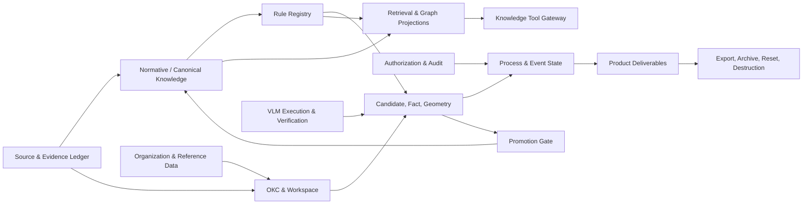
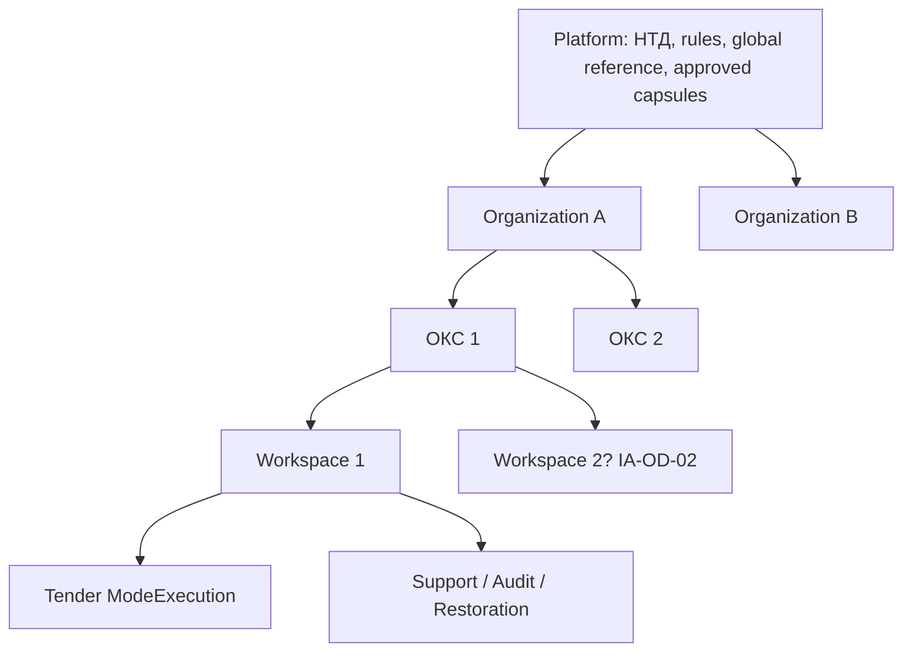
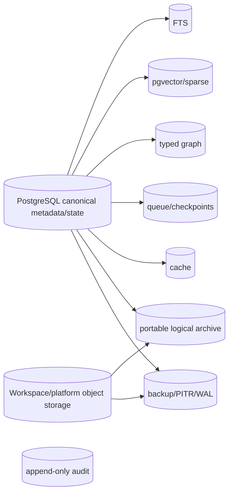
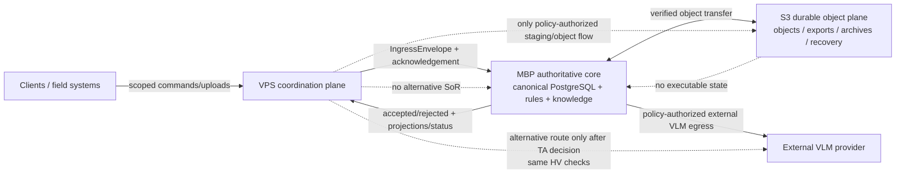
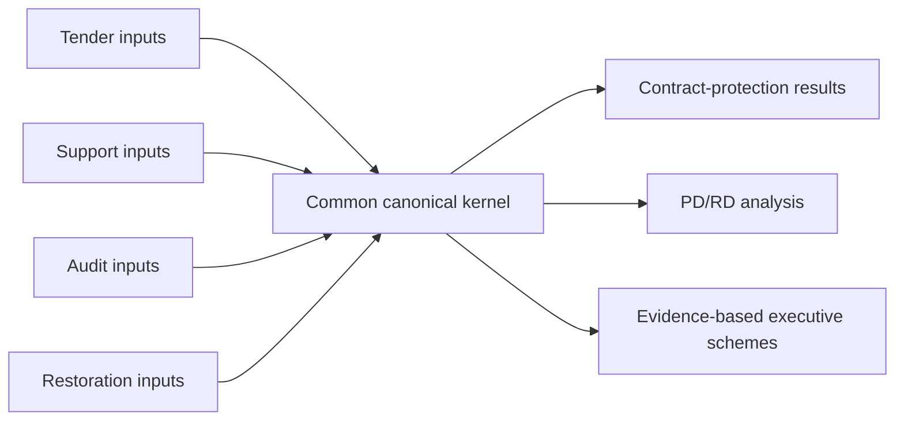

# АСД-КОНТУР — Information Architecture v0.1

**Статус:** `Accepted architecture baseline`

**Дата:** 2026-08-21

**Владелец документа:** системный и информационный архитектор

**Владелец продукта:** Олег Щербаков

**Принято:** 2026-08-22 ведущим архитектором Codex в пределах явно
делегированных владельцем продукта архитектурных полномочий. Принятие не
подтверждает факты конкретного ОКС, не утверждает численные policy values и
не открывает implementation, production egress или deployment gate.

**Область:** единое информационное ядро режимов `Tender`, `Support`, `Audit`, `Restoration`

## 0. Назначение, нормативная сила и границы

Документ определяет логическую информационную архитектуру АСД-КОНТУР: информационные объекты, их владельцев и системы истины, области видимости, идентичность и версии, provenance и lineage, информационные потоки, классификацию, качество, retention и контракты обмена. Это **не** архитектура интерфейса, рабочих мест, меню или экранов и **не** физическая модель данных.

Нормативными входами являются `ARCHITECTURE_BLUEPRINT_v0.1.md`, `DOMAIN_AND_KNOWLEDGE_MODEL_v0.1.md`, `KNOWLEDGE_AND_MEMORY_ARCHITECTURE_v0.1.md`, `LIFECYCLE_AND_RETENTION_SPECIFICATION_v0.1.md`, `PROCESS_AND_EVENT_SPECIFICATION_v0.1.md`, `AUTHORIZATION_AND_AUDIT_MODEL_v0.1.md`, `DETERMINISTIC_RULES_CATALOGUE_v0.1.md`, `AI_VLM_EXECUTION_AND_VERIFICATION_HARNESS_SPECIFICATION_v0.1.md` и ADR-0001…ADR-0008.

Здесь:

- `Invariant` — обязательное архитектурное ограничение;
- `Accepted input` — принятое решение RD, DR, HV или ADR, не переоткрываемое этим документом;
- `Proposed` — рекомендуемый контракт v0.1;
- `Owner Decision Required` — историческая отметка выбора, который до
  2026-08-22 требовал владельца; теперь архитектурный вариант может быть
  принят Codex в пределах делегированных полномочий, а фактические policy
  values по-прежнему требуют evidence и предусмотренной authority;
- `Technical Decision Required` — техническая детализация следующего артефакта, не меняющая логические границы.

`Invariant`: все четыре режима обязательны для промышленной готовности продукта и проходят через одно каноническое ядро. Поэтапная разработка допустима, но Support и ТМ-35 не являются границей MVP. `Invariant`: ни OCR, ни VLM, ни retrieval, ни граф, ни событие, ни archive/backup не становятся источником подтверждённого факта сами по себе.

Документ намеренно не задаёт ORM, DDL, физические таблицы, партиционирование, конкретный формат UUID/ULID, параметры FTS/pgvector, rule runtime, брокер, детальные network/deployment mechanisms и UI. Accepted physical authority baseline MBP/VPS/S3 задаётся ADR-0008 и настоящим документом; его техническая реализация относится к Technical Architecture v0.3. Принятие Information Architecture само по себе не открывает implementation gate.

## 1. Термины

| Термин | Однозначное значение |
|---|---|
| Information object | Типизированная единица информации с identity, scope, schema, owner, lifecycle и правилами доступа. |
| Canonical record | Авторитетная запись текущего или исторического состояния объекта, из которой строятся проекции. |
| System of record (SoR) | Единственное логическое место, уполномоченное хранить каноническое состояние класса объектов. |
| SourceArtifact | Логическая идентичность принятого первоисточника; не файл, не версия и не извлечённый текст. |
| SourceVersion | Неизменяемая версия содержимого SourceArtifact с digest, provenance и периодом действия. |
| Locator | Версионированный, проверяемый адрес страницы, области, структурной единицы или иного фрагмента SourceVersion. |
| Evidence | Типизированная связь утверждения/результата с SourceVersion, locator, методом, проверкой и authority; не синоним источника. |
| Provenance | Доказуемое происхождение одного объекта: источник, создатель, метод, версии и время. |
| Lineage | Направленная цепочка преобразований между версиями информационных объектов. |
| Immutable version | Версия, содержимое которой после публикации не переписывается; исправление создаёт следующую версию. |
| Current projection | Удобное представление последней применимой версии; может быть пересчитано и не заменяет историю. |
| Derived projection | Перестраиваемое представление канона: FTS, vector, graph, cache, compiled rules. |
| Platform memory | Постоянные НТД, канонические знания, правила, справочники, шаблоны и опубликованные Evidence Capsule. |
| Workspace memory | Изолированные данные одного рабочего цикла ОКС, всегда с `workspace_id`. |
| Reference/master data | Управляемые классификаторы и реестры с владельцем, версией, областью и периодом действия. |
| Operational data | Current state процессов, jobs, checkpoints, reservations и прочих исполняемых операций. |
| Audit data | Минимальная доказательная запись действия и решения; не копия project content и не event store состояния. |
| ArchivePackage | Portable logical archive с manifest и доказанной целостностью; не active workspace. |
| Backup/recovery copy | Физическая копия для recovery/PITR; не доказательный архив. |
| ExternalProviderResidue | Известная временная копия payload/result у внешнего provider по зафиксированным terms. |
| DataClassification | Версионированное назначение класса чувствительности объекту или payload конкретной версии. |
| InformationSchema / SchemaVersion | Идентифицированный контракт структуры / его неизменяемая версия. |
| Information owner | Роль, отвечающая за смысл, допустимое использование и жизненный цикл класса информации. |
| Steward | Уполномоченная роль, поддерживающая качество, metadata и справочники от имени owner. |
| Organization/tenant | Граница организационного владения и политик; cardinality следует accepted IA-OD-01/C. |
| ОКС | Устойчивая identity объекта капитального строительства; не контейнер всех его project data. |
| Workspace | Изолированная операционная область одного управляемого цикла обработки ОКС. |
| ModeExecution | Версионированный экземпляр процесса Tender, Support, Audit либо Restoration внутри разрешённого workspace. |
| Deliverable | Версионированный продуктовый результат с lineage, RuleSetVersion, confirmation и finalization state. |
| Event | Неизменяемое сообщение о произошедшем; не команда, не audit и не canonical current state. |

Слова «документ», «факт», «знание», «архив» и «событие» не взаимозаменяемы. Например, PDF — `SourceVersion`, распознанное поле — `CandidateVersion`, подтверждённое значение — `WorkspaceFact`, а сообщение о подтверждении — event.

## 2. Базовые информационные инварианты

1. Один информационный класс имеет один логический SoR; копии объявляются secondary/derived.
2. Любой workspace-объект, его связь, job, индексная запись и workspace-аудит содержат `workspace_id`; одна ссылка не может пересекать workspace без отдельного разрешённого exchange contract.
3. Platform, organization, ОКС, workspace и ModeExecution — разные scopes. Более широкий scope не наследует project content снизу.
4. Candidate и confirmed fact — разные типы и lifecycles; confidence не меняет тип.
5. Версии источника, правила, policy, schema, provider/profile и результата закрепляются ссылками, а не строкой «актуальный».
6. Канон НТД и структурные единицы не зависят от embedding-модели; отменённая редакция остаётся в provenance.
7. Retrieval находит кандидатов; применимость решает active `RuleVersion` из pinned `RuleSetVersion`.
8. Event log не заменяет current state; audit не хранит уничтожаемое содержимое; backup не заменяет archive.
9. Геометрия, объёмы, единицы, допуски и юридически значимые выводы воспроизводимы по evidence и rules либо блокируются.
10. После `reset verified` остаются только разрешённые content-free audit и `DestructionAttestation`; platform memory не повреждается.

## 3. Карта информационных областей



| Область | Ответственность и canonical owner | SoR / writers / readers | Scope, входы и выходы | Retention и запрещённая обратная зависимость |
|---|---|---|---|---|
| Source & Evidence Ledger | Приём, identity, версии, bytes, locators, digests; Evidence Steward | PostgreSQL metadata + object storage bytes; intake writes; rules/users/services read | platform или workspace; выдаёт SourceVersion/Locator/EvidenceLink | По RetentionProfile; extractor не меняет источник задним числом. |
| Normative Knowledge | НТД, редакции, структурные единицы, assertions; Knowledge Steward | PostgreSQL + разрешённые official bytes; только governed ingestion/publish | platform; даёт RuleEvidence/EvidencePack | Platform retention; retrieval/VLM не пишет канон. |
| Canonical Domain Knowledge | Онтология, типизированные сущности и утверждения | PostgreSQL; governed steward/approver | platform; связывает WorkType/Element/Material/control/docs | Promotion Gate обязателен; workspace observation не является writer. |
| Rule Registry | Rule/versions/sets/conflicts/traces; class-qualified authorities | PostgreSQL; author/reviewer/approver по DR-02 | platform + строго scoped workspace rules | Rule runtime/cache не SoR; LLM не утверждает. |
| Organization & Reference Data | Org identity, roles, overlays и policy assignments | PostgreSQL; org steward/authority | organization; входит в auth, classification, routing | Project content здесь запрещён. |
| ОКС & Workspace | Identity, boundaries, lifecycle, pinned profiles | PostgreSQL; lifecycle services под human authority | organization/ОКС/workspace | Archive/reset по RD; ОКС identity не даёт implicit cross-workspace read. |
| Candidate & Fact Management | Candidate lifecycle, confirmations, uncertainty/blocker | PostgreSQL; extraction creates candidates, qualified humans/rules confirm | workspace | Всё project-specific purge; VLM не writer facts. |
| Geometry & Measurements | Measurements, CRS, units, precision, calculations | PostgreSQL + permitted source bytes; qualified survey/engineering writer | workspace | Model image/draft не geometry evidence. |
| Process & Event State | ProcessInstance, command result, events, jobs/checkpoints | PostgreSQL current state + append events + queue | workspace/ModeExecution | Events не SoR current state; queue не создаёт authority. |
| Authorization & Audit | principals, capabilities, decisions, SoD, content-minimal audit | PostgreSQL/policy registry + append-only audit | platform/org/workspace | Audit не копирует source/prompt/response. |
| VLM Execution & Verification | Attempts, provider result, validation/repair | Workspace operational store + encrypted raw storage when allowed | workspace | Candidate only; provider не получает storage/SQL. |
| Retrieval & Graph Projections | FTS/vector/sparse/graph/cache | Rebuildable stores; projection builders only | platform или workspace, никогда смешанно | Полностью удаляемы; не становятся evidence. |
| Promotion Gate | Candidate, Evidence Capsule, decision, publication | PostgreSQL; promotion authorities | workspace → platform через one-way gate | Не обходит RD; live workspace link запрещён. |
| Product Deliverables | Версии трёх результатов, gates, exports | PostgreSQL metadata + object storage artifacts | workspace | Draft ≠ finalized; lineage обязателен. |
| Export/Archive/Destruction | manifest, archive, deletion plan, receipts, attestation | Archive store + lifecycle canonical records | workspace/external controlled copy | Backup не archive; reset без residual scan невозможен. |

## 4. Scopes, tenancy и hard isolation



Обязательная иерархия ссылки: `organization_id → oks_id → workspace_id → mode_execution_id`. Она не означает автоматической видимости вниз или вбок. Каждая workspace-строка и производная запись содержит `workspace_id`; ссылки на workspace-сущность используют эквивалент составного FK `(workspace_id, entity_id)`. Будущие RLS и repository guards — default-deny. Неограниченные запросы, cross-workspace batches, shared caches и использование контента другого workspace как model context запрещены.

Физическая cross-workspace deduplication project blobs запрещена принятыми retention-следствиями: одинаковые bytes разных workspace имеют отдельное владение и физическую lifecycle boundary. Platform artifact может иметь собственный platform blob; workspace лишь ссылается на разрешённую platform identity, но не приобретает право удалить её. `SourceArtifact` project scope всегда включает `workspace_id`.

File/container boundary не задаёт semantic document identity. Один physical
object может содержать zero/one/many logical source occurrences, а один
logical source может иметь несколько immutable representations/versions.
Logical occurrence связывается с exact parent `SourceVersion` и immutable
page/region `SourceLocator`; derivation/materialization сохраняет parent,
boundary, tool/profile and input/output digests. Filename/path остаются
locators/attributes, SHA-256 подтверждает только equality bytes. Gap, overlap,
mixing, out-of-range page или unresolved materialization запрещают трактовать
row как доступный/полный document. Изменение boundary/classification создаёт
новую version/decision, а не переписывает прежнюю запись. Это уточнение
подтверждено legacy pdfpipeline assessment и не вводит правило
`one document = one file`.

Package/folder, Volume/Book, section and physical container are also distinct.
One exact document version may have ordered typed memberships in several
packages without duplicating source identity. Reclassification appends a
classification version, invokes the target type validators and exposes missing
attributes; latest upload and model confidence confer no authority. Package,
signing and handover readiness is an independent canonical evaluation, not a
file-count projection or an average with document/causal readiness.

Повторная работа с тем же ОКС не открывает прежний archive автоматически. Нужны отдельная authorization decision, archive integrity verification и выбранный IA-OD-03 import/read contract. После reset прямой поиск по workspace ID, hash и текстовому фрагменту не должен раскрывать project content.

## 5. Полный информационный каталог

Обозначения: `C` — canonical, `D` — derived, `I` — immutable version, `M` — mutable current record с version/audit. Во всех строках workspace scope подразумевает обязательный `workspace_id`; schema ID/version, timestamps, actor/service identity, correlation/causation и classification обязательны там, где применимы.

### 5.1. Identity, sources, НТД и master data

| Объект и назначение | Identity / scope | C/D, SoR, versioning | Metadata, provenance, authority, validation | Lifecycle, retention, egress, EvidencePack, modes |
|---|---|---|---|---|
| Organization/Tenant | stable organization key; organization | C/PostgreSQL; M | legal/display identity, policy links; platform authority | Survives workspaces; no project content; no egress payload; all modes. |
| ОКС | stable OKS key within organization | C/PostgreSQL; M identity + immutable versions | external identifiers separately, owner/steward, classification | Identity fate per RD-03 and IA-OD; no implicit archive access; all modes. |
| Workspace | opaque workspace key | C/PostgreSQL; lifecycle M | oks/org, state, pinned RuleSet/Retention/Profile policies, legal hold | Archive/reset/destroy per RD; never EvidencePack content; all modes. |
| ModeExecution | stable execution key inside workspace | C/PostgreSQL; immutable attempts + current state | mode, process/schema versions, RuleSet pin, actors | Workspace retention; no cross-mode DB fork; one or more governed modes per accepted IA-OD-02/C. |
| SourceArtifact | stable semantic source key; platform or workspace | C/PostgreSQL metadata | type, owner, origin, classification; intake authority | Versions persist per scope; egress only policy; EvidencePack by reference; all modes. |
| SourceVersion | immutable version key + SHA-256 | C/PostgreSQL + scoped object bytes; I | retrieval/intake time, media/schema, source URL/channel, supersedes | Source retention; page/region egress only; primary EvidencePack reference. |
| SourceLocator | stable locator key within SourceVersion | C/PostgreSQL; I | page/region/structural path, render params, locator digest; resolvability test | Follows source; egress may include approved locator; in EvidencePack. |
| Render/Page/Region | version identity from source+render profile+region | C for permitted render artifact; indexes D | source locator, renderer/version, DPI/rotation/crop, digest | Encrypted workspace raw or platform ingestion; purge; only minimized region egress. |
| NormativeDocument | stable normative identity; platform | C/PostgreSQL; M identity | designation/title/authority type, official source family | Platform memory; not inferred from filename; all modes. |
| NormativeEdition | immutable edition key; platform | C/PostgreSQL+official bytes; I | official URL, retrieval time, SHA-256, effective interval/status, supersession/amendments | Never deleted merely because cancelled; egress per source rights; EvidencePack. |
| StructuralUnit | stable key within edition; platform | C/PostgreSQL; I | exact locator/digest, hierarchy, extraction+verification | Edition retention; exact retrieval; all modes. |
| Definition/Requirement/Exception/CrossReference/KnowledgeAssertion | stable assertion key + immutable version | C/PostgreSQL; I | StructuralUnit, exact fragment digest, semantics, applicability, approver | Platform; only published assertions in EvidencePack; all modes. |
| ManagedRelevanceEntry | stable source-family key; platform | C/PostgreSQL/policy registry; versioned | relevance reason, target entities/modes, owner, status | Drives controlled ingestion, never mass crawl; no project egress. |
| WorkType, ConstructionElement, Material | semantic keys; platform or approved org overlay | C/PostgreSQL; versioned | provenance, applicability, aliases as data not identity | Platform/org retention; never auto-created by model; all modes. |
| ControlOperation, RequiredDocumentType | semantic keys; platform/org overlay | C/PostgreSQL; versioned | source evidence, stages, authority, status | EvidencePack eligible when applicable; all modes. |

### 5.2. Rules, facts, geometry and evidence

| Объект и назначение | Identity / scope | C/D, SoR, versioning | Metadata, provenance, authority, validation | Lifecycle, retention, egress, EvidencePack, modes |
|---|---|---|---|---|
| Rule / RuleVersion | semantic rule key / immutable version; platform or strict workspace | C/PostgreSQL | class, predicate, I/O, evidence, effective interval, ConflictPolicy, reviewer/approver/tests | Only approved/active affects production; workspace version purged unless promoted; EvidencePack. |
| RuleSetVersion | immutable manifest ID/hash; platform + workspace pin | C/PostgreSQL; I | exact RuleVersion refs, compatibility, approval | Pinned; controlled upgrade creates new evaluations/results; all modes. |
| ConflictPolicy | stable subject key/version | C/PostgreSQL; I | subject, authority, precedence predicate, human fallback | DR-03; no global hierarchy; EvidencePack when used. |
| RuleEvaluation | evaluation ID + deterministic fingerprint; workspace | C/PostgreSQL; I per attempt | inputs/versions, timestamp, actor, outcomes, missing/conflicts | Workspace retention; not egress by default; summarized in EvidencePack. |
| RuleTrace / RuleConflict | immutable trace/conflict key; workspace, platform only for platform rule tests | C/PostgreSQL; I | RuleVersion, evidence refs, calculations, uncertainty, policy | Preserved with result/archive, purged on reset; EvidencePack allowed scoped. |
| Candidate / CandidateVersion | stable candidate key/version; workspace | C/PostgreSQL; I versions + lifecycle current | extraction attempt, locators, typed value, confidence as metadata, validators | Never fact; raw/detail egress governed; purge; all modes. |
| WorkspaceFact | fact key + immutable fact version; workspace | C/PostgreSQL | confirmation authority, source/evidence, effective/recorded times, supersession | Purge/reset; egress default-deny; EvidencePack within same workspace; all modes. |
| Confirmation | decision ID; workspace | C/PostgreSQL; I | ConfirmationPolicy, actor authority, subject version, outcome/reason | Cannot be model identity; archive with facts; purge. |
| Uncertainty / Blocker | stable issue key + versions; workspace | C/PostgreSQL | missing inputs, severity, affected operation, owner, resolution | Cannot be hidden or coerced to pass; deliverable policy; all modes. |
| ActionRequest / version | governed remediation request; workspace | C/PostgreSQL; I versions | initiator, addressee/executor, affected version, action, evidence, deadline, impact, verifier/SoD, supersession | Queue removal is not closure; performed requires separate evidence/authority verification; audit and workspace reset. |
| FieldObservation / Measurement | observation/version identity; workspace | C/PostgreSQL | device/human/source, locator, time, unit, precision, conditions | Candidate until confirmation; sensitive/local-only where classified. |
| Unit / CRS | semantic registry/version; platform | C/PostgreSQL/reference registry | authority, definitions, conversions/effective status | Platform; no model-created units/CRS. |
| GeometryEntity / GeometryVersion | geometry identity/version; workspace | C/PostgreSQL + permitted binary/vector object | confirmed inputs, CRS, units, precision, topology, calculation trace, professional authority | Blocked if evidence missing; no external egress by HV-01 default; executive-scheme input. |
| EvidenceLink | immutable typed edge; matching scope | C/PostgreSQL | subject version → source/locator/rule/confirmation, relation type | Follows subject retention; no dangling link after reset. |
| EvidencePack | generated package ID/schema; request/workspace scoped | D, generated from canonical stores | source/edition/locator/rule/conflict/gap refs, classification, timestamp | Ephemeral or retained per profile; content-minimized; all modes. |

### 5.3. VLM execution and verification

| Объект и назначение | Identity / scope | C/D, SoR, versioning | Metadata, provenance, authority, validation | Lifecycle, retention, egress, EvidencePack, modes |
|---|---|---|---|---|
| ExtractionAttempt | immutable attempt ID; workspace | C operational/PostgreSQL | source/page, purpose, provider/profile/model/revision/quantization, prompt/schema/preprocess/render/verification versions | Workspace retention; never fact; all modes. |
| ProviderExecutionResult | result ID tied 1:1 attempt | C operational/PostgreSQL + encrypted raw object if allowed | transport status, typed output, timings/cost, request/response digests | Candidate input only; raw obeys HV-06; no platform logs. |
| ValidationFailure | failure fingerprint/version; workspace | C/PostgreSQL | validator, field/locator, code, expected/actual safe metadata, repairability | Drives targeted repair; never generic self-reflection. |
| RepairAttempt | immutable child attempt | C operational/PostgreSQL | parent, exact failures, budget use, result, no-progress fingerprint | Bounded HV-02; purge. |
| QualificationProfile/Result | profile/version; platform/org policy | C policy registry | corpus, per-field/stratum floors, zero-tolerance tests, validity | Unqualified means no production; no provider assumption. |
| ExecutionBudgetPolicy / FallbackMatrix / CostEnvelope | immutable policy version / envelope identity | C policy/operational PostgreSQL | purpose×profile×failure; reservations/commit/release; authorities | Missing policy fails closed; numeric instances are later policy data. |
| RawArtifact | attempt-scoped object; workspace | C permitted bytes, encrypted | classification, access role, digest, retention/no_raw_storage | Never platform memory; guaranteed purge/reset; no EvidencePack raw payload. |
| ExternalExecutionAuthorization | decision ID; workspace | C/PostgreSQL | exact data class×purpose, provider/destination/model/profile, locators, policy versions, allow/deny | New decision for each fallback; audit digest only. |
| ExternalProviderResidue | residue ID; workspace | C/PostgreSQL metadata | provider terms version, region, retention deadline, deletion mechanism/status | Remains incomplete residue until expiry/deletion evidence; in attestation, not EvidencePack content. |

### 5.4. Process, authorization and policies

| Объект и назначение | Identity / scope | C/D, SoR, versioning | Metadata, provenance, authority, validation | Lifecycle, retention, egress, EvidencePack, modes |
|---|---|---|---|---|
| Command / CommandResult | command ID + idempotency key; workspace | Request contract + C result | actor, capability, expected state/version, correlation | Not event; result retained per process profile. |
| DomainEvent | immutable event ID; workspace/platform as applicable | Append event log secondary to current state | aggregate/version, occurred/recorded, causation/correlation, schema | Not sole SoR; workspace event content purged per RD. |
| ProcessInstance / CurrentState | process ID; workspace/ModeExecution | C/PostgreSQL; versioned mutable | process definition version, state, blockers, RuleSet | Canonical operational state; all modes. |
| Job / Retry / DLQ / Checkpoint | scoped operation ID; workspace | C operational queue + PostgreSQL checkpoint | payload reference not content, attempt, lease, idempotency | Cancel/purge; cannot recreate data after reset. |
| Principal / ServiceIdentity / Role / CapabilityGrant | stable identity/version; platform/org | C authorization store | issuer, scope, effective interval, revocation, SoD | Service/model has no human authority. |
| AuthorizationDecision | immutable decision ID; relevant scope | C/PostgreSQL/audit | principal, capability, resource, policy versions, allow/deny/reason | Content-minimal; required before writes/egress/archive read. |
| AuditRecord | immutable audit ID; scope | C append-only audit | identifiers, versions, actor, digests, outcome; no secrets/content | RD-03 allowlist after reset; all modes. |
| ClassificationTaxonomy / Assignment / Purpose | policy/version; assignment to object version | C policy registry/PostgreSQL | authority, evidence, validity/expiry, ambiguity state | Missing/ambiguous/expired = deny. |
| WorkspaceEgressPolicy / EgressAllowlistVersion | policy/version; org/workspace | C policy registry | data class×purpose, providers/profiles/destinations, validity | HV-01 default-deny; no blanket egress. |
| ProviderTermsProfile | provider terms version | C policy registry | source/version, region, retention, training/subprocessors/deletion | Unknown/change = deny/suspend qualification. |
| ConfirmationPolicy | versioned risk/field matrix | C policy registry | field classes, automatic/human rules, authorities | HV-05; high confidence cannot bypass. |
| RetentionProfile / BasisRegistry entry | immutable policy versions | C policy registry | per-class triggers/periods/archive/purge/backup and deletion basis | Missing applicable value blocks finalize/purge/destroy. |
| CollectionMission / Scope / Source | mission and immutable scope versions; workspace | C/PostgreSQL; I versions | collector, locations/media, original/copy claim, custody, declared collection coverage | Shared Tender/Support/Audit/Restoration intake; location is provenance, not identity; reset scoped. |
| PhysicalObjectInspection / PageManifest | physical object/version and one-based pages; workspace | C/PostgreSQL; I inspection | streaming digest/magic/readability/encryption/page box/rotation/native/raster/signature claims | Deterministic preflight before model; no whole huge-file memory requirement. |
| ProcessingPlan / Shard / Receipt | exact immutable profile/plan/version and page list | C/PostgreSQL; I versions/receipts | resource route, provider/egress qualification, costs, idempotency, attempts, validation | Shard is not document; partial/unknown remain visible; resume skips validated pages. |
| BoundaryCandidate / LogicalDocumentOccurrence | container SourceVersion and exact page range; workspace | C/PostgreSQL; I candidate/decision | method/confidence, receipt evidence, validator, authority, SourceArtifact/Version/Locator | Confidence never accepts boundary; unresolved segment is preserved. |
| CorpusSnapshot | immutable reconciled observed corpus; workspace | C/PostgreSQL; I versions | objects/pages/logical occurrences/duplicates/conflicts/unreadable/unresolved, denominator, receipts, fingerprint | Input to all mode analysis; does not claim whole-ОКС completeness; archive/reset scoped. |

### 5.5. Promotion, deliverables and lifecycle artifacts

| Объект и назначение | Identity / scope | C/D, SoR, versioning | Metadata, provenance, authority, validation | Lifecycle, retention, egress, EvidencePack, modes |
|---|---|---|---|---|
| PromotionCandidate | candidate ID; workspace | C/PostgreSQL | anonymization plan, proposed applicability, source evidence refs | Must resolve before purge by policy; never auto-promoted. |
| PromotionDecision | immutable decision ID; platform+origin workflow | C/PostgreSQL | qualified human, outcome, tests/conflicts/applicability | Content-minimal audit survives as allowed; rejected/unresolved project payload purged. |
| EvidenceCapsule | platform artifact/version | C/PostgreSQL/object only if needed | RD-05 minimal assertion, source type/version, locator/digest, applicability, anonymization, tests, decision/authority/validity | No full document, project memory, embeddings or live workspace link. |
| Package / VolumeBook version | assembled document-set and nested ordered structure; workspace | C/PostgreSQL; I versions | exact purpose/stage/scope/rules, register hierarchy, copy requirements; distinct from section/container | Support/Audit/Restoration; archive/reset scoped; object-specific layout only by evidence. |
| DocumentMembership version | exact document occurrence in package/book; workspace | C/PostgreSQL; I | document/finalized version, role/order/copies, membership evidence/effective interval | Many-to-many without source duplication; correction appends version. |
| PackageReadinessEvaluation | package/signing/handover delta; workspace | C/PostgreSQL; I evaluation | own denominator, structure/copies/review/signers/signatures/handover/acceptance, blockers/rules/fingerprint | Audit/Support; never averaged with Document/Causal Delta; reset with workspace. |
| DisagreementProtocolVersion | deliverable version; workspace | C/PostgreSQL metadata + object output | clauses, proposed changes, legal evidence, rules, authorities, uncertainty | Tender primarily; versioned/finalized/exported/archived/purged. |
| RevisedContractVersion | deliverable version; workspace | C + object output | source contract lineage, changes, authority, RuleSet | Tender; unresolved legal blocker prevents finalization. |
| PDRDAnalysisVersion | deliverable version; workspace | C + object output | collisions, omissions, risks, evidence, calculations, uncertainties | Tender/Audit/Support; explicit gaps. |
| ExecutiveSchemeVersion | deliverable version; workspace | C + vector/document output | confirmed design/as-built geometry, CRS/units/precision, deterministic calculations, professional approval | Support/Restoration; blocked without geometry evidence. |
| Presentation/KSPaymentTraceVersion | deliverable/supporting result | C/PostgreSQL + output | work/volume/evidence/ID/KS/payment lineage | Support/Audit; no unsupported quantity. |
| ExportManifest / ExportPackage | immutable manifest/package ID | C lifecycle metadata + scoped object | schema, exact inventory/hashes/provenance/rules/uncertainties/integrity | Export copy governed separately; not archive unless archive contract met. |
| ArchivePackage | immutable archive ID | C archive store + lifecycle metadata | portable logical manifest, hashes, integrity and import constraints | RD-02; not active workspace, explicit authorized access. |
| DeletionPlan | immutable plan/version; workspace | C/PostgreSQL | basis, evidence, all adapters, expected inventory, hold check, two authorities | Purge only against approved current plan. |
| DeletionReceipt / GCReceipt | immutable adapter result | C lifecycle record | adapter, expected/found/deleted/residual, status, timestamps | Partial never success; feeds attestation. |
| DestructionAttestation | immutable attestation ID | C content-free audit/lifecycle store | adapters, residues, WAL/backups/snapshots/provider, tests, `verified/failed/incomplete`, integrity | Survives reset; contains no destroyed content. |
| FTS/vector/sparse/graph/cache projection | identity includes scope+source schema+builder version | D, dedicated indexes/cache | canonical source versions, build/checkpoint/fingerprint | Fully rebuildable and purgeable; never EvidencePack authority. |

## 6. System-of-record matrix



| Information class | Canonical store | Secondary representation | Rebuildable | Writer | Scope | Retention | Deletion proof |
|---|---|---|---|---|---|---|---|
| Identity, policies, domain state, facts, rules | PostgreSQL | exports/views | Views yes; canon no | authorized services/humans | platform/org/workspace | governing profile | row/residual scans + FK/RLS tests |
| Source/deliverable/raw permitted bytes | scoped content-addressed object storage without project cross-dedup | render/export/cache | Derived only | intake/render/deliverable service | platform or workspace | governing profile | object inventory, digest/path scan, GC receipt |
| NTD bytes and structural canon | platform object store + PostgreSQL | FTS/vector/graph | Indexes yes | governed NTD ingestion | platform | platform policy | platform integrity, not workspace purge |
| FTS | PostgreSQL FTS | — | yes | projection builder | separate platform/workspace | projection policy | zero scoped entries + rebuild test |
| Embeddings/pgvector/sparse | index store/PostgreSQL extension | caches | yes | projection builder | separate scopes/models | projection policy | workspace/filter/hash/semantic residual tests |
| Typed graph | graph projection store | serialized backup if allowed | yes | graph projector | separate scopes | projection policy | scoped node/edge count + cross-leak test |
| Queue/checkpoint/retry/DLQ | operational store | audit IDs | yes from canonical command intent, not deleted payload | orchestration | workspace | short operational | empty/cancelled scoped jobs + anti-recreation test |
| Cache/temp | cache/filesystem | none | yes | owning service | workspace/platform separated | bounded | adapter scan and path/content probes |
| Audit | append-only audit store | signed export | no | audit service only | platform/org/workspace | RD-03 content-free post-reset | allowlist/schema scan + integrity chain |
| Portable archive | archive store | external authorized copy | no | archive service | workspace package | RetentionProfile | manifest/hash/inventory and copy registry |
| Backup/PITR/WAL/snapshot | recovery system | replicas | no, expiring residue | platform operations | mixed physical recovery boundary | RetentionProfile | expiry/rotation evidence in attestation |
| External provider residue | provider under terms + local residue register | none | no | external provider / integration ledger | workspace | ProviderTermsProfile | provider expiry/deletion evidence or incomplete residue |

### 6.1. Accepted physical authority baseline

ADR-0008 устанавливает один local-first distributed complex, а не три
системы. `AuthoritativeNodeIdentity` обозначает переносимую роль комплекса,
а не серийный номер конкретного устройства.

- MBP M5 Max — единственный active `primary authoritative node` и место
  канонической PostgreSQL, domain/workspace state, platform knowledge,
  deterministic core, professional confirmation, Promotion Gate и
  finalization.
- VPS — coordination/integration plane: ingress, authentication gateway,
  bounded envelopes/queues, encrypted staging при последующем разрешении,
  UI delivery, integrations, status и controlled egress. Получение на VPS не
  означает канонического принятия.
- S3-compatible storage — обязательный durable object plane для разрешённых
  bytes/packages. Он не является доменной БД или executable current state.
- Physical transfer никогда не повышает authority объекта. Workspace scope,
  classification, provenance, retention и confirmation status следуют за
  объектом на каждом узле.



### 6.2. Physical authority map

| Information class | Authoritative owner | Primary placement | Permitted secondary placement | Permitted VPS role | Permitted S3 role | Offline behavior | Recovery source | Retention/destruction evidence |
|---|---|---|---|---|---|---|---|---|
| Platform knowledge | platform knowledge owner; MBP authoritative core | MBP canonical PostgreSQL | verified archive/backup; rebuildable indexes | authorized read projection only if TA-TD permits; never independent memory | permitted source bytes, exports and encrypted recovery objects | usable locally while MBP is healthy | verified DB backup + platform objects | platform integrity; never workspace purge |
| НТД | NTD steward/domain authority | MBP ledger and canonical PostgreSQL | official source bytes and recovery copies | ingress/status only; no canonical edition mutation | platform-scoped official bytes, archive/backup | local accepted editions remain usable; retrieval freshness reported | verified canonical backup + digested source objects | edition inventory, digests, provenance |
| Rules/RuleSets | rule registry owner and class-qualified authorities | MBP PostgreSQL | signed/hashed manifests and backup | distribute read-only manifest/status only | rule manifests/export/backup if policy permits | pinned RuleSet remains authoritative locally | verified registry backup + manifests | version/approval integrity; workspace rules follow workspace retention |
| Workspace metadata/state | workspace owner; MBP core | MBP PostgreSQL | portable archive/recovery backup only | bounded command envelope/status projection | archive/backup objects only; never current state | continues locally; remote functions degrade | verified canonical restore candidate | adapter scan + content-free attestation |
| SourceArtifact bytes | Source & Evidence Ledger | S3 active workspace/platform object, with authoritative metadata on MBP | encrypted MBP cache/staging where policy allows | encrypted bounded staging only if TA-TD permits | authoritative byte object within scoped object plane | cached object may be used; missing required byte blocks operation | verified S3 version or portable archive as authorized | scoped inventory, digest, version/delete receipt |
| Candidate/Validation | workspace owner; MBP core | MBP PostgreSQL | workspace raw/result objects on MBP/S3 by HV-06 | carry envelope/status only | encrypted raw/evidence object where RetentionProfile permits | local validation continues for available inputs | canonical DB + allowed raw objects | scoped canonical/projection/raw scans |
| WorkspaceFact | qualified confirmer; MBP core | MBP PostgreSQL | archive/backup only | no confirmation or fact SoR | archive/backup bytes only | confirmation only on authoritative core | verified DB/archive | row, reference and residual scans |
| Measurements/geometry | professional authority; MBP core | MBP canonical typed records | source/render objects and archive | intake only; never professional confirmation | scoped measurement/source bytes and archive | calculations require available evidence, CRS and units | canonical records + verified sources | typed record/object/index scans |
| Raw VLM artifacts | workspace owner under HV-06 | encrypted workspace object plane; metadata on MBP | policy-authorized encrypted S3 object; no platform copy | temporary encrypted staging only if allowed | temporary encrypted workspace object with explicit retention | absence blocks only operations needing raw replay | not a canonical recovery dependency unless profile says so | object receipt, key/metadata check, provider residue |
| Process current state | process owner; MBP core | MBP PostgreSQL | no independent mutable replica | bounded ingress queue and read-only status projection | backup only | local commands continue; remote intake unavailable/queued by policy | verified DB backup | current state + queue reconciliation |
| Queues/checkpoints | owning orchestration service | MBP for authoritative execution; VPS only for ingress delivery state | bounded operational replicas as explicitly contracted | receive/retry scoped envelopes, never domain acceptance | none except encrypted payload objects by manifest | MBP queue continues; VPS queue reconciles later | canonical command intent + delivery records | empty/cancelled scope, no re-creation test |
| Audit | audit owner | MBP append-only logical audit | authorized content-minimal integrity copy | own node/ingress movement audit without content | encrypted audit export/backup if policy permits | local audit continues; remote records await reconciled ingestion | verified integrity copy | allowlist scan, chain/digest, retention receipt |
| Deliverables | product result owner; authorized finalizer | MBP canonical metadata/state | immutable output bytes on S3; authorized exports/archive | delivery of already finalized authorized copy only | deliverable bytes, exports and archive package | local finalization requires available object write preconditions | canonical DB + verified package | version lineage, object receipts, archive manifest |
| Export | export authority | MBP export state/manifest | S3/export destination copy | transfer only after authorization | export object, manifest and integrity data | not successful without required target acknowledgement | verified export package | export inventory/digest/recipient receipt |
| Portable archive | archive authority | MBP canonical archive record; durable package on S3 | separately registered authorized external copy | status/access gateway only | primary durable portable package | archive operation blocked if S3 confirmation required and unavailable | package itself after integrity verification | manifest, hashes, storage inventory, access audit |
| Backup/WAL/snapshot | platform recovery authority | recovery metadata on MBP; local WAL as engine requires | encrypted S3 backup/recovery objects; authorized snapshots | no domain restore activation | recovery bytes only | no promotion to current state; degraded protection is explicit | verified restore candidate assembled from recovery set | expiry/version/snapshot inventory and attestation residue |
| Retrieval indexes | canonical owner remains source domain | MBP rebuildable projections | optional read-only VPS projection only after TA-TD | serve authorized stale-labelled projection if approved | backup not required for truth; optional build artifacts | local indexes can serve known projection version | rebuild from canon | scoped delete + rebuild/fingerprint test |
| External-provider residue | workspace owner/provider terms authority | residue register on MBP | provider-managed finite copy | route/audit only if authorized | no silent copy; explicit residue object only if policy says | unresolved provider state remains residue/blocker | provider evidence, not recovery source | terms version, expiry/deletion evidence or incomplete |

`Primary placement` distinguishes authority from byte durability: SourceArtifact
bytes may live primarily in S3, while their identity, scope, lineage and policy
state remain authoritative in MBP PostgreSQL. No S3 object becomes a fact by
being durable.

### 6.3. Three-node information flows

Every flow uses authenticated `NodeIdentity`, exact source/destination,
`workspace_id` when project data is involved, classification and purpose,
object/envelope identity, schema version, digest, idempotency key, retention
class, authorization decision, acknowledgement and audit correlation. Unknown
side effect is `unknown/reconciliation_required`, never success.

| Flow | Initiator and allowed payload | Authorization and scope | Acknowledgement/retry | Retention and audit |
|---|---|---|---|---|
| MBP → VPS | authoritative status projection, explicit response, notification or bounded delivery object | MBP node + intended reader/capability; minimum fields; workspace scope preserved | VPS receipt identifies version/digest; retry by idempotency key; stale projection labelled | VPS operational retention; content-minimal movement audit on both ends |
| VPS → MBP | authenticated `IngressEnvelope`, upload/object reference, remote command intent, webhook result | ingress identity, actor delegation, classification and workspace policy; no canonical status before decision | MBP returns authoritative accepted/rejected acknowledgement; duplicate returns same outcome | bounded VPS retention until reconciled; canonical audit at acceptance/rejection |
| MBP → S3 | scoped object version, export/archive/backup/raw object plus `ObjectTransferManifest` | object-purpose capability, RetentionProfile, classification, encryption policy | success only after durable response and digest/integrity verification; retry immutable/idempotent | S3 retention/version/legal-hold metadata plus MBP object ledger and receipt |
| S3 → MBP | requested exact object version for processing, verification or restore candidate | MBP request, archive/recovery authorization and scope | digest/schema/encryption verification before use; mismatch quarantined | access/read audit; temporary local copy under its class policy |
| VPS → S3 | only encrypted ingress staging or already-authorized transfer if TA-TD-03/05 permits | separate movement authorization; pre-issued scoped object identity; no arbitrary bucket access | S3 receipt is staging success only, not domain acceptance; MBP later reconciles | strict TTL/quota and ledger; deletion after acceptance/rejection per policy |
| S3 → VPS | only exact authorized delivery/staging object or opaque pre-authorized transfer | least-privilege object grant bound to identity/version/digest/audience | VPS verifies digest; delivery acknowledgement does not alter domain state | bounded cache/staging retention; no platform/VPS log content |
| Execution node ↔ external provider | minimized pages/regions and provider result under HV-01…HV-08 | fresh routing, egress, qualification, budget, provider terms and cost decisions | immutable attempt; unknown outcome reconciled; fallback is a new authorization | workspace artifacts/residue register; digests and outcome only in audit |

Whether external VLM egress originates on MBP or VPS is `TA-TD-18`; until
decided and implemented, a route not explicitly qualified and authorized is
denied. Moving a profile between nodes never carries qualification implicitly.

### 6.4. Offline and disconnected semantics

| Availability state | Permitted capability | Mandatory degradation/blocker |
|---|---|---|
| MBP, VPS and S3 online | all separately authorized capabilities | no implicit success; normal acknowledgements and reconciliation still apply |
| MBP online, VPS unavailable | local authoritative intake/processing/confirmation may continue for locally available inputs | remote ingress/UI/integrations/status and VPS-routed egress unavailable; no loss of canonical state |
| MBP online, S3 unavailable | canonical metadata work not requiring new/read S3 objects may continue; local cached objects retain identity | source admission requiring durable object, export/archive/backup and any result whose gate requires S3 receipt are blocked/degraded explicitly |
| MBP unavailable, VPS online | VPS may accept only policy-approved bounded envelopes or encrypted staging and report `staged/pending_authoritative_acceptance` | no fact confirmation, Rule/Promotion decision, finalization, lifecycle authorization or canonical acceptance |
| MBP unavailable, S3 online | durable objects remain stored and exact authorized reads may support recovery preparation | S3 cannot execute commands, expose active workspace as current, or become primary |
| acknowledgement lost/operation outcome unknown | preserve immutable attempt and query/reconcile by idempotency/object identity | retry cannot create new semantic operation; success withheld until authoritative reconciliation |
| connectivity restored | ordered reconciliation of envelopes, object receipts, provider residues and projections against authoritative versions | conflicting claims or unverifiable digests go to `RECOVERY_REQUIRED`/`QUARANTINED`; no last-write-wins |

АСД-КОНТУР is local-first, not universally network-independent. Capability
status must distinguish `available`, `degraded`, `blocked`, `pending` and
`recovery_required`; UI/API status cannot collapse them into `success`.

### 6.5. Synchronization and recovery contracts

| Contract | Required information identity, scope, provenance and authority | Retention/status semantics |
|---|---|---|
| `IngressEnvelope` | immutable envelope ID/version, actor/service/node, workspace, command schema/version, classification/purpose, payload or object ref+digest, idempotency, correlation/causation, authorization context, received time | VPS `received/staged` distinct from MBP `accepted/rejected`; bounded until acknowledgement/reconciliation |
| `ObjectTransferManifest` | transfer ID, object identity/version, source/destination nodes, workspace/platform scope, byte digest/size/media schema, encryption and retention class, purpose, authorization, expected storage version | `planned/transferring/verified/failed/unknown`; immutable receipt links, no fact authority |
| `SynchronizationAttempt` | attempt ID, contract/version, direction, exact source/target versions, initiator, policy/auth decisions, timestamps and failure fingerprint | immutable attempt; retry creates linked attempt while semantic idempotency key stays stable |
| `Acknowledgement` | acknowledgement ID, referenced envelope/transfer/command, acknowledging NodeIdentity, status, authoritative flag, accepted version/digest and timestamp | only MBP authoritative acknowledgement can mean domain acceptance; lost ack is reconcilable |
| `ReconciliationRecord` | conflict/unknown ID, all attempts/acks/object receipts, authoritative comparison, resolution actor/policy, result and remaining uncertainty | content-minimal canonical record; unresolved blocks dependent material operation |
| `ReplicaProjectionVersion` | projection ID/version, source canonical checkpoint/fingerprint, builder/schema, scope, generated/expires timestamps and stale marker | optional read-only derivative only if TA-TD-02 permits; never writer or failover state |
| `AuthoritativeNodeIdentity` | logical installation/authority ID, node instance, role, credential/version, activation interval and evidence | portable across verified hardware replacement; only one active interval |
| `NodeLease`/split-brain guard candidate | proposed lease/epoch/quorum identity, holder, validity and fencing evidence | mechanism is **not accepted** here; selection is TA-TD-01; absence means no automatic activation |
| `RestoreCandidate` | restore ID, source backup/object versions, target node, schema/software compatibility, scope inventory, digests, recovery point and residues | never production current state; `proposed/validating/rejected/verified` |
| `RestoreVerification` | restore candidate, adapter results, canonical/object integrity, RuleSet/policy compatibility, isolation/leak tests and verifier authority | failure/incomplete cannot activate; immutable verification result |
| `PrimaryActivationDecision` | decision ID, verified restore reference, old/new node identity, fencing evidence, qualified human authority, activation epoch/time and audit | explicit `approved/rejected`; approval does not erase old-node conflict evidence |

Exactly-once transport and global event order are not promised. Contracts
provide at-least-once-safe idempotency, explicit acknowledgements and
reconciliation against canonical state.

### 6.6. No split-brain and restore invariant

1. At most one `AuthoritativeNodeIdentity` has active primary authority.
2. VPS never self-promotes; S3 and a restored database are not executable
   production state by existence alone.
3. Restore proceeds `RestoreCandidate → RestoreVerification →
   PrimaryActivationDecision`; each step has distinct authority and audit.
4. Activation requires proof that the previous primary is fenced or otherwise
   cannot accept canonical writes. The exact mechanism is TA-TD-01/16.
5. Conflicting primary claims, unverifiable epoch/identity, divergent canonical
   versions or missing mandatory adapter results force `RECOVERY_REQUIRED` or
   `QUARANTINED`.
6. Automatic last-write-wins, timestamp-based merge and queue/S3 order as
   authority are forbidden for domain state.
7. Post-restore cross-workspace isolation, object-link integrity, pinned
   RuleSetVersion and lifecycle/retention state must be verified before
   activation.

### 6.7. S3 logical object model

S3 namespaces are logical scopes, not provider-specific bucket names. Each
object version has: platform or `workspace_id` ownership; stable object
identity and immutable version; purpose; content digest/size; schema/media
type; encryption/key-reference metadata without secret; storage and retention
class; classification; creator/source node; lineage; legal hold; deletion
eligibility; provider object version; residue state; and link to canonical MBP
PostgreSQL metadata.

Project objects cannot be physically deduplicated across workspaces even when
digests match. A known hash grants neither object discovery nor access.

| Object purpose | Semantics | May become current state? | Deletion proof |
|---|---|---|---|
| Active source object | accepted SourceVersion bytes, scope/policy linked to MBP ledger | no; metadata/fact acceptance remains MBP | exact version inventory, digest and deletion receipt |
| Temporary raw artifact | encrypted prompt/response/render under HV-06 or `no_raw_storage` | no | TTL/policy eligibility, all versions/multipart remnants and key-access result |
| Export | recipient-facing copy with manifest; not automatically archive | no | registered copies/receipts and governing export policy |
| Portable archive | RD-02 logical evidence package with verified manifest | no; explicit authorized import creates a new process | package/version integrity and retention record |
| Recovery backup | physical/PITR recovery material | no; only a verified RestoreCandidate can progress | backup/version/snapshot expiry evidence in attestation |
| Provider residue record/object | known external copy or locally retained evidence of it | no | provider terms/deletion/expiry evidence; otherwise `incomplete` residue |

S3 versions, multipart remnants, delete markers, replicated copies and object
locks are distinct physical residues. A successful logical delete request is
not a destruction receipt until the selected TA mechanism verifies every
applicable representation.

### 6.8. Technical Decision Packet for Technical Architecture v0.3

At publication of this Information Architecture all entries were `Technical
Decision Required`. `TECHNICAL_ARCHITECTURE_v0.3.md` now selects an accepted
technical variant for every entry; the table below remains the normative input
and alternatives record. `Accepted` is architecture authority, not
implementation or operational verification. Until the applicable
implementation and deployment/policy profiles are approved and verified, the
stated fail-closed behavior applies. This packet is separate from
`IA-OD-01…IA-OD-06`; those decisions are accepted in §21 and do not weaken
the fail-closed policy behavior here.

| ID | Exact question | Mutually exclusive variants | Recommendation | Main consequence | Temporary fail-closed behavior / blocks |
|---|---|---|---|---|---|
| TA-TD-01 | How is one active primary fenced and split-brain prevented? | A manual offline activation; B lease/epoch with fencing; C quorum/witness protocol | B if a trustworthy independent coordination store can be proven; otherwise A for initial operation | availability versus fencing complexity | no automatic promotion; conflicting claim → `RECOVERY_REQUIRED`; blocks automated recovery |
| TA-TD-02 | Is a read-only PostgreSQL projection/replica allowed on VPS? | A none; B filtered projection API/cache; C physical read replica | B initially, with workspace filters and staleness metadata | remote read latency versus leakage/replication risk | VPS reads only MBP responses; blocks rich disconnected UI |
| TA-TD-03 | Is encrypted ingress staging on VPS allowed? | A envelope metadata only; B encrypted scoped objects; C general upload store | B with pre-issued identity, strict TTL and no VPS decryption where feasible | resilient intake versus residue surface | if not explicitly enabled, file intake requires MBP online |
| TA-TD-04 | What quotas and retention apply to VPS staging? | A fixed global; B workspace/class/purpose policy; C operator ad hoc | B as versioned policy instances | controls SSD, denial-of-service and deletion proof | missing quota/TTL denies staging; blocks production ingress profile |
| TA-TD-05 | What command/object synchronization protocol is used? | A application HTTPS pull/push; B broker + object manifests; C managed sync product | B only if acknowledgements/reconciliation remain explicit; assess A as simpler baseline | operational complexity and durability | no remote acceptance without a verified contract; blocks distributed workflow |
| TA-TD-06 | What network topology connects nodes? | A private overlay; B site-to-site VPN; C public endpoints with mTLS | compare A/B against field access and recovery needs | attack surface and availability | MBP canonical services not publicly exposed; blocks deployment |
| TA-TD-07 | Which endpoints are private or public? | A VPS public only; B selected MBP private-overlay endpoints; C mixed direct clients | A plus narrowly scoped B is preferred | ingress control versus latency | public access terminates only at an approved gateway; blocks client routing |
| TA-TD-08 | What TLS/mTLS trust model is used? | A server TLS + tokens; B mTLS node-to-node; C service mesh identity | B for node traffic, with separate user auth | certificate lifecycle and identity assurance | unverified NodeIdentity denies movement; blocks inter-node production |
| TA-TD-09 | How are keys/secrets managed and rotated? | A OS-bound stores; B dedicated secrets/KMS service; C hybrid envelope-key model | C after threat/recovery analysis, without hardware lock-in | recoverability versus compromise radius | no production secret in config/logs; blocks encryption and node auth |
| TA-TD-10 | Where is object encryption performed? | A S3 server-side only; B client-side only; C envelope client-side plus server-side | C for sensitive workspace objects, subject to key recovery design | stronger separation versus key operations | sensitive object transfer denied without approved encryption profile |
| TA-TD-11 | Which S3 provider and region are admissible? | A single provider/region; B primary plus recovery region; C self-hosted compatible store | evaluate B against classification, provider terms and cost; remain provider-neutral | residency, availability and egress cost | no provider use without qualification/policy; blocks S3 production |
| TA-TD-12 | How are accounts/buckets/prefixes isolated? | A prefixes in shared bucket; B workspace buckets; C account/bucket tiers by scope/class | C or B for workspace isolation; never digest-only addressing | operational count versus blast radius | deny any cross-workspace object namespace; blocks object layout |
| TA-TD-13 | Are versioning and object lock enabled per class? | A neither; B versioning only; C versioning + governed lock | C for archive/backup, policy-specific for active/raw | evidence durability versus purge/legal-hold complexity | no archive claim without immutable verified version; blocks archive operations |
| TA-TD-14 | What backup method covers PostgreSQL and object metadata consistently? | A dumps; B physical/PITR; C layered logical + physical recovery set | C, preserving RD-02 distinction from portable archive | recovery coverage and operational drills | unverified backup is only residue, not recovery source; blocks recovery readiness |
| TA-TD-15 | What RPO/RTO profiles apply? | A one global pair; B class/mode profiles; C best-effort | B approved as operating policy after measurement | cost versus tolerable loss/outage | no availability promise or automatic failover; blocks SLO/readiness |
| TA-TD-16 | How is restore verified and primary activated? | A manual checklist; B automated verification + independent human activation; C automatic promotion | B | slower activation but prevents corrupted/split state | restore remains non-production until explicit verified decision; blocks failover |
| TA-TD-17 | What happens during prolonged MBP outage? | A intake stops; B bounded VPS staging; C degraded VPS processing | B only for pre-authorized classes; no canonical processing | continuity of intake versus residue | no canonical acceptance/finalization; blocks full remote continuity |
| TA-TD-18 | Does external VLM egress originate from MBP or VPS? | A MBP direct; B VPS gateway; C policy-selected qualified route | B may centralize control, but choose only after latency/privacy/credential analysis | egress observability and payload exposure | only explicitly qualified route allowed; blocks external production profile |
| TA-TD-19 | How is observability provided without project content leakage? | A node-local metrics; B central content-minimal telemetry; C full centralized logs | B with schema allowlist/redaction and node-local protected detail | diagnosability versus leakage | no payload/prompt/response in VPS/platform logs; blocks production operations |
| TA-TD-20 | How are software/config updates distributed? | A manual; B signed pull release; C central push orchestration | B with compatibility gates and rollback artifact | consistency versus supply-chain surface | incompatible nodes stop sync; blocks managed rollout |
| TA-TD-21 | How is remote administrative access to MBP controlled? | A none; B private overlay bastion/just-in-time; C public remote admin | B with strong node/human auth and audit | recoverability versus attack surface | no public administrative endpoint; blocks remote operations |
| TA-TD-22 | How do field/offline clients synchronize? | A upload-only envelopes; B bidirectional versioned sync; C direct workspace replica | B for explicitly scoped contracts; reject general replica | field usability versus conflict complexity | no silent merge; unsupported conflicts remain blocked; blocks field production E2E |

## 7. Identity and versioning

Identity has four independent dimensions:

- stable semantic identity (`Rule`, `WorkType`, `SourceArtifact`, ОКС);
- immutable version identity (`RuleVersion`, `SourceVersion`, `DeliverableVersion`, policy/schema version);
- natural/external identifier stored as attributed data, never primary authority;
- content digest proving byte equality, never granting ownership or access.

Workspace entities use scoped identity; a bare entity ID is insufficient outside its workspace. Idempotency keys are scoped to command type, workspace, actor and intent version. Correlation groups a process; causation points to the immediate command/event/attempt. Provider identity, endpoint/profile, model revision, quantization/execution format, prompt, schema, preprocessing, rendering and verification policy are separately versioned.

The logical contract requires opaque collision-resistant immutable IDs and deterministic fingerprints where reproducibility requires them. `TECHNICAL_ARCHITECTURE_v0.3.md` §2.1 selects `IA-TD-01`: UUIDv7 by default for new nondeterministic persistent identity/version/operation IDs, UUIDv5 only for typed reproducible identity with a registered namespace and canonicalization version, and SHA-256 only for digest/fingerprint. Existing UUIDv5 WorkType and hash-derived pilot IDs remain evidence, not automatic conformance; physical columns and constraints belong to the Logical Data Model.

After reset, only `workspace_id`, lifecycle/attestation IDs, actor IDs, approved policy/version IDs, counts and content-free status may survive under RD-03. Names, filenames, source hashes, text digests that enable project correlation, project facts and detailed pseudonyms do not survive. Evidence Capsule has its own platform identity and no live-link to workspace; therefore it cannot reconstruct project content.

## 8. Provenance and lineage


Каждый переход сохраняет creator identity, входные immutable versions, locators, transformation/schema version, digest и timestamp. Для AI дополнительно обязательны provider/model/profile, prompt/preprocess/render/verification versions, validation/repair lineage и terminal outcome. Для rules — RuleVersion, pinned RuleSetVersion, input fingerprint, RuleEvidence, conflicts и uncertainties. Confirmation фиксирует human/domain authority либо разрешённую автоматическую ConfirmationPolicy.

Юридический вывод трассируется до SourceVersion, точного пункта/locator, NormativeEdition и effective date, authority, применимости, ConflictPolicy и подтверждающей роли. Геометрия трассируется до подтверждённого project/factual source, locator, measurement/device/human, CRS, units, precision, transformations and deterministic calculation. Supersession никогда не переписывает старую цепочку; новый результат ссылается на predecessor и причину.

## 9. Classification и external egress

HV-01/B и HV-04/B отображаются следующими объектами:

1. `ClassificationTaxonomyVersion` задаёт классы; `DataClassificationAssignment` связывает класс с точной SourceVersion/page/region и периодом действия.
2. `PurposeVersion` задаёт ограниченную цель обработки.
3. `WorkspaceEgressPolicy` и `EgressAllowlistVersion` проверяют комбинацию `data class × purpose`, provider, destination, model/profile.
4. `ProviderTermsProfile` фиксирует версию условий, region, training prohibition, retention, deletion and subprocessors.
5. `ExternalExecutionAuthorization` фиксирует exact allowed locators and payload digest.
6. `ExternalProviderResidue` отражает внешнюю копию до доказанного expiry/deletion.

Classification не выводится только из имени, расширения или ответа LLM. Missing, ambiguous или expired assignment даёт deny. Payload builder получает allowlisted locators и создаёт новый minimized payload manifest; расширение page/region set меняет digest и требует новой authorization. Full document запрещён, если достаточны страницы/regions. Credentials, unrelated pages, cross-workspace batches, confirmed geometry, executive-scheme material и прочие sensitive/local-only classes не уходят без отдельного разрешения. Фактические terms Polza.ai здесь не утверждаются; provider остаётся unqualified до отдельной проверки.

## 10. VLM information flow

```text
native preflight → routing decision → authorization → cost/budget reservation
→ immutable provider attempt → ProviderExecutionResult → CandidateVersion
→ deterministic validators → [validated | targeted repair | rejected | failure]
→ ConfirmationPolicy/human or rule confirmation → WorkspaceFact | Uncertainty
→ draft deliverable → independent finalization gate → finalized deliverable
```

Транспортный `success` означает только полученный ответ. Provider result означает распарсенный provider contract. Validated Candidate прошёл validators, но не является фактом. WorkspaceFact требует confirmation. Draft deliverable не равен finalized.

HV-02 задаёт versioned budgets и terminal exhaustion; HV-03 — per-field/document/stratum floors и zero-tolerance blockers; HV-05 — risk/field confirmation; HV-06 — encrypted workspace raw/no_raw_storage; HV-07 — ordered pre-authorized fallback с новой routing/auth decision; HV-08 — cost reserve/commit/release. Любая отсутствующая production policy instance блокирует путь fail-closed, но не создаёт новое архитектурное решение.

Raw prompt/response/render хранятся лишь в workspace и только если policy разрешает; audit содержит identifiers, versions, locators, digests, decision, cost/outcome, но не raw content. Согласие двух прогонов не подтверждает факт. Repair вызывается machine-readable failures и ограничен; provider switch создаёт отдельный attempt и не наследует authorization.

## 11. Информационная архитектура НТД

Управляемый `ManagedRelevanceRegistry` перечисляет релевантные source families и связь с modes/results/domain entities. Официальный каталог Минстроя — приоритетный source, но ingestion выполняется выборочно. СП 48, СП 70 и СП 543 — только priority source families; эта спецификация не приписывает им содержание.

Цепочка канона:

`official URL → SourceArtifact → SourceVersion(bytes, retrieval timestamp, SHA-256) → NormativeDocument → NormativeEdition(effective interval/status/supersession/amendments) → StructuralUnit(locator) → Definition/Requirement/Exception/CrossReference → KnowledgeAssertion → RuleEvidence → RuleVersion`.

Designation и filename не определяют статус. Amendment/supersession хранится явной цепочкой. Отменённая edition остаётся в provenance, но resolver возвращает её применимой только при доказанной дате/основании. KnowledgeAssertion связывается с WorkType, ConstructionElement, Material, ControlOperation и RequiredDocumentType через типизированные relations с applicability. FTS/vector/graph строятся из опубликованного канона, содержат builder/model version и могут быть полностью удалены.

## 12. Reference и master data

| Каталог | Default scope / owner | Versioning и ограничения |
|---|---|---|
| WorkType, ConstructionElement, Material | platform Knowledge Steward; возможный org overlay по IA-OD-04 | Stable semantic keys, immutable versions, provenance; no LLM auto-create. |
| ControlOperation, RequiredDocumentType | platform/domain authority | Source-backed versions and applicability. |
| Units, CRS | platform engineering/metrology authority | Authoritative definitions/conversions, effective status; workspace uses references only. |
| SourceAuthorityType, DocumentType | platform information steward | Versioned taxonomy; classification candidate does not amend taxonomy. |
| OrganizationRole | organization authorization owner | Scoped grant versions, revocation and SoD. |
| Classification, Purpose | platform policy owner + org assignment authority | Versioned, expiring; missing = deny. |
| FailureCode, UncertaintyType, lifecycle state, rule class | platform architecture/domain owner | Schema-controlled code systems; unknown value fails validation. |
| Provider/model/execution profile registry | platform AI governance | Separate identities, qualification and terms versions. |
| Workspace-specific reference | workspace only when formally approved | Cannot become global or override mandatory authority; destroyed with workspace. |

## 13. Data quality model

`DataQualityRule` is an approved RuleVersion or typed validator governing one dimension. `DataQualityObservation` is a measured result for an exact object version. Failure creates `DataQualityIssue` with dimension, severity, blocker, repairability, responsible role, affected operation, evidence and resolution. A waiver is a typed scoped human decision with authority, evidence and validity; it does not rewrite the observation or become a rule without Promotion Gate.

Required dimensions: validity, completeness, accuracy, consistency, uniqueness, timeliness, provenance completeness, locator integrity, edition applicability, unit/CRS validity, authority validity and cross-document consistency. `ValidationFailure` is a machine-level failed validator; it may create an `Uncertainty` when missing/ambiguous inputs prevent resolution. `RuleEvaluation` records pass/fail/blocked/conflict/indeterminate. `indeterminate` never becomes pass. Low confidence alone does not prove error; high confidence never proves fact.

## 14. Four modes through one common core



| Mode | Inputs and common-kernel use | Canonical entities, rules, authority | Uncertainty/blockers | Outputs, terminal condition, retention and E2E information acceptance |
|---|---|---|---|---|
| Tender | Tender/contract package, customer requirements, available PD/RD, NTD → source ledger, structure/work/MTR/control/evidence chain | SourceVersion, contract clauses, WorkspaceFacts, RuleSet, ConflictPolicy; legal/domain authority | Missing edition/authority/scope, unresolved legal conflict, inconsistent quantities | DisagreementProtocol, RevisedContract, PD/RD risk analysis. Terminal only when required inputs inventoried, every proposed change traced, blockers resolved or explicitly terminal per policy, finalized/exportable. Workspace retention. E2E: source-to-clause-to-change lineage and no unsupported obligation. |
| Support | Confirmed contract/PD/RD/customer/NTD plus execution evidence/measurements | ОКС structure, work, MTR, controls, required docs, facts, volume/KS/payment trace; engineers/survey/legal roles | Missing evidence, disputed applicability, geometry/volume mismatch, unsigned authority | Updated registers, required ID, presentation/KS/payment trace, analyses and executive schemes. Terminal when governed scope complete and all material blockers handled. E2E: work→MTR→control→evidence→ID→volume→KS→payment. |
| Audit | Frozen available corpus and declared audit scope | Same sources/facts/rules plus Document Delta, Causal Readiness Delta and Package/Signing/Handover Readiness; independent audit authority | Missing data is visible, conflicts cannot be hidden, no inferred facts; the three denominators are not averaged | PDRDAnalysis/AuditDelta with evidence and uncertainty. Terminal when inventory and tested scope are complete, every conclusion traceable, residual gaps explicit. Archive/retention workspace. |
| Restoration | Available historic sources, verified observations/measurements and required-document matrix | Same facts/evidence/rules; restoration candidates and professional confirmations | Absent evidence, unverifiable event/signature/geometry blocks factual restoration | Candidate reconstructed documents, gap register, evidence-backed finalized artifacts only. Terminal when each required item is confirmed, rejected or explicit gap; never fabricated. E2E tests reject invented dates/signatures/geometry. |

Mode-specific structures are overlays in one workspace model, not separate databases. Each ModeExecution declares mandatory inputs, process definition version, RuleSetVersion, authorities, outputs, blockers and terminal condition. All four mode E2E catalogues are required before product readiness under ADR-0007.

## 15. Contracts of the three permanent product results

| Result | Required information/evidence | Version/finalization contract | Export/archive/supersession |
|---|---|---|---|
| Disagreement protocol + revised contract | Source contract version, exact clause locators, tender/customer/NTD sources, legal applicability/conflicts, each proposed edit and rationale | Schema/version + pinned RuleSet; legal/domain authority; unresolved material legal conflict blocks finalization; versions never overwrite | Manifest includes source/result hashes and RuleTrace; cancellation creates new status/version; archive preserves lineage. |
| PD/RD analysis | Exact PD/RD versions, structure/work/MTR/NTD/customer/contract facts, collision/completeness/calculation traces | Typed issue/risk/collision schemas; engineering/legal authorities per class; gaps remain explicit | Export contains analyzed scope and omissions; new sources/rules create superseding analysis version. |
| Executive schemes | Confirmed design geometry, confirmed actual measurements, exact locators, CRS, units, precision, measurement provenance and deterministic calculations | Schema/version + RuleSet + qualified professional approval. Missing required geometry evidence, CRS or authority blocks finalization | Vector/document representation with manifest; VLM image/confidence is not geometry; correction supersedes without deleting old trace. |

## 16. Knowledge Tool Gateway and EvidencePack

Typed read-only contracts:

- `knowledge.search(query, scope, filters, schema_version)` returns ranked candidate references and gaps, never applicability;
- `knowledge.get_source_fragment(source_version_id, locator, authorization_context)` returns exact permitted fragment and digest;
- `knowledge.get_applicable_rules(confirmed_context, ruleset_version, as_of)` returns approved applicable/indeterminate rules with traces;
- `knowledge.trace_assertion(assertion_id/version)` returns source→assertion→rule/result lineage;
- `knowledge.explain_conflict(conflict_id)` returns policies, evidence, outcome or human fallback requirement;
- `knowledge.get_required_documents(confirmed_context, ruleset_version)` returns typed requirements, missing inputs and uncertainties.

`EvidencePack` schema contains exact SourceVersions, NormativeEditions, locators, permitted fragments/digests, applicability, RuleTrace, conflicts, uncertainties, gaps, classification, workspace scope and generation timestamp. Gateway authenticates service identity, authorizes workspace, applies minimization and records audit. The model receives neither direct SQL nor write capability and cannot declare knowledge, rule or fact applicable.

## 17. Lifecycle, retention and destruction mapping

| State | Canonical information behavior |
|---|---|
| active | Authorized writes; version creation; operational projections maintained. |
| frozen | Logical write lock; only inventory, validation, allowed resolution/compensation paths. |
| finalized | Deliverables and exact manifests immutable; new change requires controlled new version/reopen policy. |
| exported | Export receipt and integrity result recorded; operational data still exists. |
| archived | Portable logical archive verified; archive is read-only and not an active workspace. |
| purge planned | Immutable deletion plan, basis/evidence/all adapters/hold check and expected inventory fixed. |
| purging | Only confirmed plan automation; new jobs/egress/writes blocked; partial failure → recovery required. |
| reset verified | Residual scan/cross-leak tests passed; only RD-03 content-free audit + attestation remain. |
| destroyed | Final terminal status after applicable archive/retention policy; no reopen from deleted content. |
| legal hold | Retention clocks/actions suspended as policy states; purge/destroy denied. |
| recovery required | Incomplete archive/purge/adapter/audit requires idempotent retry/compensation; no success state. |
| quarantined | Data isolated from normal reads/processing; evidence and access limited pending decision. |

RD-01 requires a complete versioned RetentionProfile per class. RD-02 separates portable archive from backup/PITR. RD-03 limits post-reset data. RD-04 requires BasisRegistry, full adapter plan, legal-hold check and independent request/confirmation. RD-05 permits only minimal Evidence Capsule for promoted knowledge.

Deletion inventory includes PostgreSQL canon, object bytes, renders/text/raw VLM, FTS/vector/sparse/graph, queues/retries/DLQ, cache/temp, application logs/traces/metrics, WAL, backups, snapshots, external residues and export/archive copies. WAL/backups/snapshots remain residues until profile expiry. `verified` is forbidden if any mandatory adapter is unchecked or a residue is unexplained. Queue replay after reset must fail by workspace tombstone/terminal state without recreating content.

## 18. Information exchange and schema evolution

Command, event, provider request/result, validator failure, Knowledge Gateway, export/archive manifest and policy schemas live in a logical Schema Registry. Every payload carries schema ID/version; producers do not silently change semantics. Backward/forward compatibility is declared per version, validated before exchange and included in RuleSet/provider compatibility checks. Unsupported schema fails closed or is quarantined; it is not coerced by LLM.

Deprecation has announcement, support interval, replacement and removal gate. Migration creates traceable transformed versions and retains original interpretation/digest. Reprocessing names original source and new code/rule/schema versions; it does not overwrite historical results. Archive import verifies manifest/signatures/hashes/schema support, creates a new authorized workspace lineage and never activates archive bytes in place.

Exactly-once and global event ordering are not promised. At-least-once delivery is handled by scoped idempotency keys, aggregate version checks, immutable attempts and checkpoints. Replaying events cannot reconstruct current state if canonical entities are absent.

## 19. Mapping to current `asd-kontur` code (evidence, not target approval)

| Target capability | Existing evidence | Status | Consequence |
|---|---|---|---|
| Candidate lifecycle | `src/asd_kontur/domain/study.py`, `extraction/candidate_mode.py`, `bridge/extraction_outcome.py` | Temporarily corresponds | Candidate is named as non-fact, but no durable CandidateVersion/confirmation lifecycle. |
| Confirmation policy | `domain/service.py` `CONFIDENCE_THRESHOLD=0.8` auto-confirms WorkType; bridge gives native-text match confidence 1.0 | Contradicts HV-05/Rules | Confidence/keyword match cannot confer fact/authority; future implementation must replace with policy/rule/confirmation contract. |
| NTD document/edition | `ntd/models.py`, `resolver.py`, `registry.py`, `providers/minstroy.py` | Temporarily corresponds | Identity/effective interval/supersession exist, but no StructuralUnit/assertion canon, durable store or managed relevance registry. |
| RuleTrace | `domain/trace.py`, `matrix.py`, `service.py` | Temporarily corresponds | Has rule/version/inputs/locator/result, lacks RuleSet manifest, RuleEvidence, authority, deterministic fingerprint and persistence. |
| Corpus/artifact identity | `corpus/models.py`, `scanner.py` | Temporarily corresponds | SHA-256/relative locator/manifest exist, but pilot filesystem model is not workspace Source Ledger and has no classification/retention. |
| Extraction provenance | `bridge/build.py`, `extraction/mlx_vlm_adapter.py`, `text_layer.py` | Temporarily corresponds | Captures paths/pages/hashes/model/runtime/prompt in places; no provider-neutral immutable attempt/result schema or HV policies. |
| Deterministic WorkType identity | `domain/identifiers.py` UUIDv5 | Corresponds locally | Useful stable semantic identity, but does not decide universal ID encoding. |
| NTD fail-closed | `domain/ntd_ports.py`, `service.py`, `ntd/resolver.py` | Partly corresponds | Missing edition blocks matrix, but applicability dimensions remain pilot simplifications. |
| Service orchestration | `domain/service.py`, `bridge/build.py` | Temporary | Pure-ish deterministic flow is useful; embeds pilot mappings and incomplete authority/tenancy. |
| Workspace hard isolation | No canonical `workspace_id` in inspected domain/corpus/extraction/bridge objects | Absent | Blocks persistence and production use. |
| Persistence/RLS/audit | In-memory dataclasses/registries; no target persistence | Absent | Correctly not implemented before architecture; Logical Data Model needed later. |
| Graph/retrieval | No target canonical projection plane | Absent | Must be derived, scope-separated and rebuildable. |
| Geometry information | No confirmed measurement/CRS/geometry lineage model | Absent | Executive-scheme readiness blocked. |
| Classification/egress | Local MLX adapter only; no policy objects | Absent | External production egress remains denied. |
| Four-mode contracts | Core is shaped around study/Support pilot; no complete mode information contracts in code | Absent/contradicts readiness if treated as product boundary | Code is evidence of a slice only; cannot establish MVP readiness. |

Existing tests demonstrate deterministic IDs, explicit uncertainties, locator propagation, NTD edition resolution, isolated per-file failures and VLM-candidate schema validation. They do not demonstrate workspace isolation, persistence, four modes, retention/destruction, policy authorization, geometry or end-to-end product readiness.

## 20. Migration map from `mac_asd`

| Idea/component | Real file evidence | ASD-KONTUR decision | Disposition | Reason |
|---|---|---|---|---|
| PostgreSQL project/doc/chunk models | `src/db/models.py` | Canonical PostgreSQL metadata with mandatory workspace scope and typed versions | Modernize | `Document` has project_id, but chunks inherit indirectly and global audit/knowledge lack project scope. |
| pgvector + FTS | `src/db/models.py`, `src/core/knowledge/knowledge_base.py` | Rebuildable scoped projections only | Preserve principle / modernize | Hybrid retrieval useful; fallback/empty result must not masquerade as knowledge or applicability. |
| NormativeClause exact citation | `src/db/models.py`, `src/core/knowledge/normative_clause_service.py` | NormativeEdition + StructuralUnit + assertion/evidence canon | Modernize | Clause/page/FTS useful; unique `(doc_code, clause_ref)` lacks edition identity and full source provenance. |
| KAG/RAG MCP | `src/mcp/knowledge_server.py` | Typed Knowledge Gateway returning EvidencePack | Modernize | Tool boundary useful; old graceful empty/error and full-service mixing lack authorization/scope/fail-closed semantics. |
| EvidenceGraph GML | `src/core/evidence_graph.py` | Typed rebuildable graph from canonical IDs | Reject as SoR / preserve projection idea | Global GML, heuristic project deletion and swallowed load/save failures cannot prove isolation/reset. |
| Construction rules graph | `src/core/knowledge/construction_rules_graph.py` | Rule Registry remains canon; graph is compiled projection | Modernize | Typed relations useful; separate NetworkX rules graph duplicates evidence/Neo4j models. |
| Neo4j GraphRAG | `src/core/knowledge/graph_rag_service.py` | Optional replaceable graph projection | Reject dependency / preserve typed graph idea | Third graph implementation and graceful empty results create split truth. |
| Project lifecycle dry-run/archive/confirmation | `src/core/project_lifecycle.py` | Formal lifecycle, immutable plan, adapters, post-scan, attestation | Preserve intent / modernize | Useful dry-run and operator confirmation; manual deletes, broad exceptions and success report after partial failures are unsafe. |
| Schema-layer reset role | `src/core/lifecycle/reset.py`, `alembic/versions/v16_1_three_data_layers.py` | Default-deny scoped deletion adapters and independent authority | Preserve safety pattern / modernize | Enumerating schema avoids missed tables, but truncating whole object layer cannot support independent workspaces. |
| Completion write lock | `src/core/lifecycle/completion.py` | State-machine freeze/finalize guards | Preserve | Explicit one-way state and pre-write refusal are sound, but lifecycle is incomplete relative to current spec. |
| Local content-addressed objects | `src/core/objects/local_store.py` | Workspace-scoped object ownership, no cross-project dedup, adapter verification | Preserve/modernize | Project prefix and full SHA useful; filesystem layout and local paths are not domain contracts. |
| Archive manifest/integrity | `src/core/archive/manifest.py` (explicitly marked cancelled) | Portable logical archive contract from current RD-02 | Preserve principles only | Hash/inventory/restore check useful; cancelled implementation and container assumptions cannot be copied. |
| Backup rotation | `src/core/backup.py` | Recovery copies governed by RetentionProfile and attestation | Modernize | DB/graph/artifact coverage useful; hard-coded rotation and “proceed on disk-check error” are not policy/retention proof. |
| Global AuditLog | `src/db/models.py` | Scoped content-minimal append-only audit | Reject old payload model | `input_data/output_data` and no project scope risk retaining project content after reset. |
| DomainTrap | `src/db/models.py`, `src/core/knowledge/knowledge_base.py` | PromotionCandidate → Evidence Capsule → platform assertion | Modernize | Useful risk taxonomy; global ingestion and embedding without Promotion Gate leak project/uncertain content. |
| Lessons Learned / Skill Mutation | `src/db/models.py`, `src/core/lessons_service.py` | Promotion Gate + formal RuleVersion approval | Reject automatic mutation | Threshold 2 automatically creates prompt rule; repetition is not authority or evidence. |
| IDRequirementsRegistry | `src/core/services/id_requirements.py`, `config/id_requirements.yaml` | RequiredDocumentType/RuleVersion with edition evidence and applicability | Modernize | Completeness delta useful; fuzzy match and generic defaults silently invent obligations. |
| 292 inherited keys | `config/work_types_632.yaml`, `config/normative_priority.yaml` | Preserve only as quarantined migration evidence pending official revalidation | Reject as current canon | File itself identifies cancelled Order 624 provenance; obsolete classifier cannot seed active rules. |
| Event store | `src/core/event_sourcing.py`, `src/core/event_bus.py` | Events secondary to canonical current state | Reject event sourcing / preserve correlation | In-memory/JSONL events lack workspace scope and cannot be SoR; accepted AD-02 excludes replay model. |
| In-process model queue | `src/core/model_queue.py` | Bounded execution is useful, but distributed ingress/command delivery requires scoped durable envelopes, acknowledgement and reconciliation | Modernize | Queue is process-local, model-keyed and has no workspace identity or authoritative acceptance contract. |
| Web/API state and uploads | `src/web/app.py` | VPS may host future ingress/UI boundary, but canonical acceptance remains on MBP | Reject as distributed state / preserve interface intent | Global `app_state`, default project IDs and broad error-to-response behavior cannot prove hard isolation or authoritative acknowledgement. |
| Run logs/model calls | `src/core/run_log.py`, `src/core/vlm_classifier.py` | Workspace-scoped attempts, raw policy, content-minimal audit | Modernize | Operational provenance useful; raw/model content needs classification, encryption and purge. |
| Deterministic spatial calculations | `src/core/services/spatial_calc.py`, `src/core/services/is_generator/project_data.py` | Versioned calculation rules with units/CRS/precision/evidence | Preserve principle / modernize | Explicit “LLM does not calculate” is correct; floats, built-in tolerances and unproven formulas are not approved rules. |

## 21. Architecture Decision Cards

Карточки не переоткрывают RD-01…05, DR-01…04 или HV-01…08. Все шесть
решений приняты 2026-08-22 ведущим архитектором Codex по явному полномочию
владельца продукта Олега Щербакова. Конкретные policy instances, требующие
внешних фактов, benchmark или professional authority, решениями не создаются;
до появления таких значений действует указанное fail-closed поведение.

### IA-OD-01 — Organization/tenant boundary and deployment ownership

**Question:** can one installation serve several organizations, and where is the strongest isolation boundary?

- A: one organization per installation; simpler isolation, duplicated platform operations.
- B: shared multi-tenant installation; efficient, but tenant RLS/keys/backups/operations become critical.
- C: one logical multi-tenant information model with deployment profiles allowing dedicated or shared installations.

**Recommendation:** C. It preserves one contract while allowing high-assurance dedicated deployment. **Consequence:** all organization-owned records and policies need `organization_id`; shared deployment requires tenant isolation tests. **Temporary fail-closed:** one configured organization per deployment, no cross-organization reads. **Blocks:** final deployment/data ownership model, RLS/key/backup design.

**Decision:** C; `Accepted`, 2026-08-22. **Invariants:** одна logical
multi-tenant модель; dedicated/shared являются deployment profiles, не разными
ядрами; tenant scope не выводится из deployment placement. **Migration:**
single-organization deployment становится dedicated profile без смены
канонических контрактов. **Acceptance:** IA-AT-003 и tenant-scoped RLS,
object, key, backup и negative-existence tests.

### IA-OD-02 — ОКС, workspace and ModeExecution cardinality

**Question:** can one ОКС have multiple workspaces, and can modes run concurrently?

- A: exactly one workspace and one active mode per ОКС.
- B: one workspace per ОКС with multiple sequential/concurrent ModeExecutions sharing its facts.
- C: multiple lifecycle workspaces per ОКС; each may contain multiple ModeExecutions, with explicit concurrency guards and no implicit sharing between workspaces.

**Recommendation:** C. Repeated independent engagements and reset boundaries remain expressible, while related modes may reuse confirmed facts inside one authorized workspace. **Consequence:** OKS identity is not a data container; ModeExecution-specific writes require conflict guards. **Temporary fail-closed:** one active workspace per ОКС and sequential ModeExecution. **Blocks:** Logical Data Model cardinalities, concurrency and workspace creation policy.

**Decision:** C; `Accepted`, 2026-08-22. **Invariants:** ОКС не контейнер
project content; между workspace нет неявного обмена; каждый ModeExecution
имеет version/process/rule/authority/output scope и concurrency guard.
**Migration:** прежний `workspace.mode` преобразуется в один начальный
ModeExecution; последующие создаются явно. **Acceptance:** IA-AT-026…029,
concurrent revision-conflict tests и отсутствие cross-workspace reads.

### IA-OD-03 — Reuse of a previous archive for the same ОКС

**Question:** how can a new workspace use data from an earlier archived workspace?

- A: no reuse; sources must be ingested anew.
- B: authorized verified archive import creates new SourceVersions and explicit lineage in a new workspace.
- C: direct read of the old archive/live cross-workspace references.

**Recommendation:** B. It preserves isolation and provenance without silent shared state. **Consequence:** import is a governed transformation and duplicates permitted project bytes under the new workspace owner. **Temporary fail-closed:** archive metadata/read denied except explicit human authorization; no direct context use. **Blocks:** archive import contract and repeat-engagement workflow.

**Decision:** B; `Accepted`, 2026-08-22. **Invariants:** import только в новый
workspace, после authorization, integrity/schema/signature verification; прямой
read или in-place activation запрещены. **Migration:** повторный intake может
быть заменён verified import с новой ownership и lineage; rollback удаляет
неактивированный import workspace по lifecycle plan. **Acceptance:** IA-AT-019,
021…024 и negative direct-read tests.

### IA-OD-04 — Organization-level reference data

**Question:** may an organization maintain its own classifiers and requirements?

- A: platform catalogues only.
- B: versioned organization overlays with provenance, approval and deterministic precedence; no project facts.
- C: unrestricted organization dictionaries/configuration.

**Recommendation:** B. Customer terminology and policy can be represented without contaminating platform canon. **Consequence:** overlay scope, conflict policy and lifecycle are mandatory. **Temporary fail-closed:** unknown organization term is Candidate/Uncertainty, not a new master entry. **Blocks:** organization reference schemas and steward workflow.

**Decision:** B; `Accepted`, 2026-08-22. **Invariants:** overlay immutable,
versioned, approved, organization-scoped и имеет deterministic precedence;
project fact не является overlay. **Migration:** существующие dictionaries
карантинируются как import candidates и публикуются только после provenance,
approval и conflict test. **Acceptance:** IA-AT-001, 003, 008…011 и tests
precedence/conflict/tenant isolation.

### IA-OD-05 — Trust model for field facts

**Question:** what evidence and authority can confirm field observations and measurements?

- A: every field fact requires human professional confirmation.
- B: device/signature-backed automatic confirmation for all valid schemas.
- C: versioned risk/field-class matrix combining source/device assurance, deterministic validation and qualified human confirmation.

**Recommendation:** C, aligned with HV-05 but requiring construction-specific policy. **Consequence:** device identity, calibration, custody, signature and professional authority become information objects. **Temporary fail-closed:** geometry, measurements, volumes and legal facts require qualified human confirmation. **Blocks:** production field capture and executive-scheme finalization policy.

**Decision:** C; `Accepted`, 2026-08-22. **Invariants:** risk/field class matrix
versioned; confidence и valid schema не дают authority; geometry, measurements,
volumes и legal facts fail-closed до qualified confirmation policy. **Migration:**
старые observations импортируются как Candidate с исходным provenance, не как
Fact. **Acceptance:** IA-AT-004, 005, 007 и class/device/calibration/custody/
authority matrix tests. Численные floors не установлены этим решением.

### IA-OD-06 — Electronic signatures and professional authority boundary

**Question:** should ASD-KONTUR only verify external signatures/authority, or also create legally signed artifacts?

- A: record claims only; no cryptographic verification.
- B: verify external signatures, certificates and authority evidence; signing remains external.
- C: integrate signing and certificate lifecycle into the product boundary.

**Recommendation:** B for the first complete product boundary, with C only after legal/security design. **Consequence:** signature evidence, validation time, certificate chain/revocation and signer role must be retained; private keys stay outside core. **Temporary fail-closed:** unverified signer/authority remains blocker; ASD does not assert signature validity. **Blocks:** finalization of legally/professionally signed deliverables and acceptance tests.

**Decision:** B; `Accepted`, 2026-08-22. **Invariants:** АСД-КОНТУР проверяет
внешнюю подпись, certificate chain/revocation/validation time и authority
evidence, но не подписывает и не хранит private signing keys в v0.1.
**Migration:** claims без cryptographic evidence остаются unverified blockers;
интеграция signing возможна только отдельным будущим ADR. **Acceptance:**
valid/expired/revoked/unknown certificate, wrong signer role и no-signing-key
tests.

### Decisions already derived, not reopened

- RD-03/RD-05 already prohibit a stable pseudonymous link from Evidence Capsule to destroyed workspace content. Only content-free workspace/attestation IDs survive; a reconstructive anonymized linkage would require explicit supersession of those accepted decisions.
- Exact numerical HV policies, provider qualification, golden corpus, ConfirmationPolicy values, FallbackMatrix, CostEnvelope, RetentionProfile and BasisRegistry are policy instances. Their absence blocks the corresponding production operation but is not a new architecture card.
- Exact identifier encoding (`IA-TD-01`) and topology mechanics are accepted
  in `TECHNICAL_ARCHITECTURE_v0.3.md`. Scope enforcement follows accepted
  IA-OD-01/C; concrete tenant deployment profiles remain G-02 policy data.

### Accepted Decision Packet

| ID / exact question | Mutually exclusive options | Architect recommendation | Main consequence | Temporary fail-closed behavior | Blocks | Status |
|---|---|---|---|---|---|---|
| IA-OD-01 — May one organization own multiple OKS and may one installation serve multiple organizations? | A one organization per installation, many OKS; B shared multi-tenant; C logical multi-tenant model with dedicated/shared deployment profiles | C | `organization_id` is a real ownership boundary; shared deployments require tenant isolation | One configured organization per deployment; no cross-org read | topology, tenant RLS/keys/backups | `Accepted 2026-08-22` |
| IA-OD-02 — May one OKS have multiple workspaces and multiple concurrent/sequential ModeExecutions? | A one workspace/one mode; B one workspace/many modes; C many lifecycle workspaces, each with governed mode executions | C | Supports repeat engagements without four databases; requires concurrency guards | One active workspace per OKS; modes sequential | LDM cardinalities and concurrency | `Accepted 2026-08-22` |
| IA-OD-03 — How may a new workspace reuse an earlier archive of the same OKS? | A no reuse; B authorized verified import into new workspace; C direct archive/cross-workspace read | B | Explicit new ownership and lineage; no hidden shared context | Deny archive content reads/import; metadata only under authority | archive import/repeat engagement | `Accepted 2026-08-22` |
| IA-OD-04 — May organization-specific reference data exist? | A platform only; B approved versioned organization overlays; C unrestricted dictionaries | B | Customer terminology is scoped and governed, never platform fact | Unknown term stays Candidate/Uncertainty | master-data schemas/steward workflow | `Accepted 2026-08-22` |
| IA-OD-05 — What can confirm field facts and measurements? | A every fact human-confirmed; B device/schema automatically confirms; C risk-class matrix combining assurance, rules and qualified humans | C | Device/calibration/custody and professional authority become evidence | Qualified human required for geometry, volume and legal facts | field capture/executive schemes | `Accepted 2026-08-22` |
| IA-OD-06 — What is ASD-KONTUR's electronic-signature boundary? | A record claims only; B verify external signatures/authority, signing external; C integrate signing | B | Verification evidence is canonical; private keys remain outside core | Unverified signer/authority blocks finalization | signed deliverables and E2E tests | `Accepted 2026-08-22` |

## 22. Acceptance catalogue `IA-AT-*`

| ID | Future acceptance test |
|---|---|
| IA-AT-001 | Every material catalogue object has declared SoR, scope, schema/version, owner and retention. |
| IA-AT-002 | Workspace A cannot read rows, objects, FTS/vector/graph/cache/jobs/raw/audit content of B. |
| IA-AT-003 | Organization A cannot read organization/workspace/archive data of B under shared topology. |
| IA-AT-004 | Candidate cannot become WorkspaceFact through confidence, provider success or two-model agreement. |
| IA-AT-005 | Source→locator→attempt→candidate→validation→fact→calculation→deliverable lineage is complete and digest-verifiable. |
| IA-AT-006 | Legal conclusion resolves exact clause, edition, effective date, authority and conflict policy. |
| IA-AT-007 | Geometry output fails without confirmed source, CRS, units, precision, measurements and professional authority. |
| IA-AT-008 | Retrieval result cannot set applicability; indeterminate predicate creates Uncertainty. |
| IA-AT-009 | RuleSet pin reproduces result; controlled upgrade preserves previous RuleTrace/result. |
| IA-AT-010 | Cancelled NormativeEdition remains queryable for provenance but is not current without date/authority basis. |
| IA-AT-011 | Rebuilding FTS/vector/graph/cache from canon preserves canonical digests and authorized results. |
| IA-AT-012 | Missing/ambiguous/expired classification or egress policy denies external call before payload creation. |
| IA-AT-013 | Minimized egress payload contains only authorized pages/regions; enlargement requires new decision. |
| IA-AT-014 | Fallback creates new routing/auth/attempt/provenance and never expands data class or destination. |
| IA-AT-015 | Budget/qualification/terms/cost policy absence or exhaustion yields fail-closed terminal outcome. |
| IA-AT-016 | `no_raw_storage` leaves only allowed digests and Candidate; stored raw is encrypted and workspace-scoped. |
| IA-AT-017 | Audit contains no credentials, full source, full project prompt/response or another workspace content. |
| IA-AT-018 | Portable archive validates manifest/hashes/schema/provenance independently of backup/PITR. |
| IA-AT-019 | Archive import is authorized, integrity-checked and creates new workspace-owned versions/lineage. |
| IA-AT-020 | Purge covers canon, blobs, indexes, graph, queues/DLQ, caches/temp, logs, raw, WAL/backups/snapshots and provider residues. |
| IA-AT-021 | Reset cannot become verified when one adapter is unchecked or residual scan finds workspace data. |
| IA-AT-022 | Post-reset queries by workspace ID, known source hash and deleted text fragment return no project content. |
| IA-AT-023 | Post-reset delayed job cannot recreate records; content-free audit/attestation matches RD-03 allowlist. |
| IA-AT-024 | Promotion preserves only RD-05 Evidence Capsule and cannot retain live link, project embedding or raw document. |
| IA-AT-025 | Tender E2E traces every contract change to evidence/rules and blocks unresolved material legal conflict. |
| IA-AT-026 | Support E2E traces structure→work→MTR→control→evidence→ID→volume→KS→payment. |
| IA-AT-027 | Audit E2E reports incomplete evidence and conflicting PD/RD/NTD/facts without fabricated closure. |
| IA-AT-028 | Restoration E2E produces explicit gaps and rejects fabricated dates, signatures, measurements and geometry. |
| IA-AT-029 | Three deliverable contracts preserve versions, authorities, unresolved policy, finalization and archive lineage. |
| IA-AT-030 | Schema evolution/reprocessing creates new versions and never rewrites historical interpretation/provenance. |
| IA-AT-031 | Shared bytes across workspace remain physically and logically independently deletable; platform artifacts survive workspace purge. |
| IA-AT-032 | Event loss/reorder/retry does not corrupt canonical current state; idempotency prevents duplicate material effects. |
| IA-AT-033 | With VPS unavailable, MBP retains canonical state and permitted local processing; remote capabilities report degraded/blocked, never false success. |
| IA-AT-034 | With S3 unavailable, an operation requiring durable object/archive/backup receipt remains blocked and no local write is reported as S3 success. |
| IA-AT-035 | With MBP unavailable, VPS may stage only an authorized bounded envelope/object and cannot confirm Fact, finalize or acknowledge canonical acceptance. |
| IA-AT-036 | Duplicate remote command delivery with the same scoped idempotency identity produces one material effect and the same authoritative outcome. |
| IA-AT-037 | Lost acknowledgement leaves an immutable unknown attempt, is reconciled against MBP state and does not cause a duplicate side effect. |
| IA-AT-038 | Conflicting active-primary claims force `RECOVERY_REQUIRED`/`QUARANTINED`; neither timestamp nor last write selects a winner. |
| IA-AT-039 | Restore to replacement hardware cannot activate until RestoreVerification, isolation tests, fencing evidence and authorized PrimaryActivationDecision pass. |
| IA-AT-040 | A VPS/S3 credential or known digest scoped to workspace A cannot list, read, overwrite, reference or infer a workspace B object. |
| IA-AT-041 | Missing MBP/VPS/S3 deletion receipt, unchecked multipart/version residue or provider residue prevents `DestructionAttestation=verified`. |
| IA-AT-042 | Moving external VLM execution from MBP to VPS requires a separately qualified profile/route and fresh HV-01…HV-08 decisions; prior authorization is not inherited. |

## 23. Completeness self-check and architecture gate

This specification covers all four required modes, all three permanent results, canonical/derived separation, platform/organization/ОКС/workspace scopes, source-to-result lineage, NTD editions/locators/applicability, RuleSet pin, Candidate/fact separation, geometry evidence, HV egress flow, RD lifecycle residues, DR rule ownership, rebuildable retrieval/graph and content-safe Promotion Gate. ADR-0008 is reflected through the MBP authoritative core, bounded VPS coordination plane, mandatory S3 durable object plane, explicit acknowledgement/reconciliation, verified restore and no-split-brain invariants.

It is accepted as a normative input for the accepted Logical Data Model because
entity boundaries, ownership, SoR, identity/version semantics and required
relations are explicit. It is not approval to implement that model. The
overall implementation gate remains closed until G-01…G-03, policy instances
needed by a production capability, acceptance traceability and an explicit
implementation authorization are complete.

`TECHNICAL_ARCHITECTURE_v0.3.md` and **Implementation Plan v0.1** are now
accepted architecture/planning baselines. `IA-OD-01…IA-OD-06` are accepted
above; their concrete data/policy instances remain governed and fail-closed
where evidence is absent. `LOGICAL_DATA_MODEL_v0.1.md` closes G-01, and
`DEPLOYMENT_AND_POLICY_PROFILES_v0.1.md` closes G-02 as the complete
fail-closed profile contract. Its concrete production values remain blocked.
`CONTRACT_PACK_v0.1.md` and `contracts/v0.1/` close G-03. The next gate is
G-04 Persistence Foundation, but ORM, DDL and migrations remain prohibited
until separate implementation authorization; deployment and external egress
additionally require active evidence-backed production instances.
