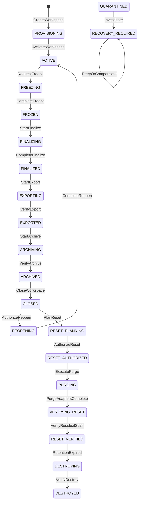

# АСД-КОНТУР — Lifecycle & Retention Specification v0.1

- **Статус документа:** `Accepted architecture baseline`; решения
  `RD-01…RD-05` — `Accepted`
- **Дата:** 2026-08-21
- **Принято:** 2026-08-22 ведущим архитектором Codex по явным
  архитектурным полномочиям владельца продукта; exact retention periods и
  Basis Registry values не приняты без evidence
- **Владелец продукта:** Олег Щербаков
- **Область:** объектно-независимый жизненный цикл workspace ОКС для режимов
  `Tender`, `Support`, `Audit`, `Restoration`
- **Нормативные статусы:** `Invariant`, `Proposed`,
  `Owner Decision Required`, `Accepted`, `Rejected`, `Superseded`
- **Основание принятых RD:** сообщение владельца продукта Олега Щербакова
  от 2026-08-21 в текущем диалоге, начинающееся словами: «Я, Олег
  Щербаков, владелец продукта АСД-КОНТУР, 21.08.2026 принимаю
  retention-решения RD-01…RD-05»

## 0. Назначение и нормативная сила

Документ является единственным нормативным местом АСД-КОНТУР для решений
`RD-01…RD-05`. Он формально определяет состояния workspace, команды закрытия,
архивирования и удаления, классы хранения, протокол доказанной очистки,
обработку отказов и полномочия на опасные операции.

Документ развивает, но не подменяет:

- `DOMAIN_AND_KNOWLEDGE_MODEL_v0.1.md` — сущности, hard isolation,
  EvidencePack, Rule Registry и Promotion Gate;
- `KNOWLEDGE_AND_MEMORY_ARCHITECTURE_v0.1.md` — разделение platform/workspace
  memory и производный характер retrieval/graph plane;
- `ARCHITECTURE_BLUEPRINT_v0.1.md` — границы комплекса и порядок артефактов;
- ADR-0005 — Accepted-решение о платформе знаний и изоляции workspace.

**Синхронизация IA-OD 2026-08-22.** По IA-OD-02/C workspace является
lifecycle boundary одного engagement и может содержать несколько governed
ModeExecution; прежние поля/формулировки `workspace.mode` читаются как legacy
shorthand для первого ModeExecution. По IA-OD-03/B archive import всегда
создаёт новый workspace и новые scoped versions/lineage; прямое оживление
архива или cross-workspace read запрещены. Organization overlay и каждый
tenant/workspace имеют независимый profile/deletion evidence. Device/schema/
signature claim не становится фактом: confirmation и signature verification
evidence следуют своим data-class profiles.

### 0.1. Статусы положений

- **`Invariant`** — обязательное свойство целевой архитектуры. Его реализация
  может меняться, но нарушение требует архитектурного решения.
- **`Proposed`** — проектное решение этой редакции, ещё не принято владельцем.
- **`Owner Decision Required`** — выбор зарезервирован за Олегом Щербаковым.
- **`Accepted`** — решение имеет все реквизиты из §19.7 и явное подтверждение
  владельца.
- **`Rejected`** — рассмотренный вариант явно отклонён владельцем.
- **`Superseded`** — положение заменено более поздней принятой редакцией со
  ссылкой на замену.

Вывод Codex, тест, техническая рекомендация, исторический код и высокий
confidence модели не меняют статус RD на `Accepted`.

### 0.2. Что означает принятие документа

Принятие текста спецификации подтверждает state machine, протоколы,
инварианты и форму решений. Оно **не означает автоматического принятия**
`RD-01…RD-05`: каждый RD принимается отдельно с реквизитами §19.7.
На 2026-08-21 все пять RD приняты владельцем продукта; нормативные записи
находятся в §19.1–§19.5.

Принятие RD закрывает неопределённость retention-архитектуры, но само по себе
не разрешает реализацию персистентности. ORM-модели, миграции,
PostgreSQL/RLS, content-addressed storage, archive/reset/purge и расширение
прикладного кода под персистентность допускаются только после следующих
архитектурных артефактов Blueprint §11, трассировки acceptance tests в
Implementation Plan и отдельного начала реализации. Это `Invariant`.

### 0.3. Граница юридических утверждений

Эта редакция не назначает календарные сроки хранения и не объявляет примеры
правовых оснований действующими. Их задают версионированные
`RetentionProfile` и Basis Registry с provenance, периодом действия и явным
утверждением. Свободное место SSD, удобство реализации или содержание старого
кода таким источником не являются.

### 0.4. Принятые HV-зависимости retention

`HV-04/B` и `HV-06/B` приняты владельцем продукта Олегом Щербаковым
2026-08-21; подтверждение — сообщение владельца, начинающееся словами «Я,
Олег Щербаков, владелец продукта АСД‑КОНТУР, 21.08.2026 принимаю решения
HV‑01…HV‑08». Полные карточки находятся в Harness Specification §28.

Lifecycle-нормы следуют из этих решений:

- external provider finite retention разрешён только versioned policy для
  allowlisted non-sensitive class; provider copy учитывается как residue до
  подтверждённого expiry/deletion;
- изменение provider terms приостанавливает qualification и новые egress;
- raw request/response/prompt/render — отдельные encrypted workspace data
  classes с role-scoped access и обязательным storage adapter;
- `no_raw_storage` запрещает materialization raw artifact;
- reset/purge удаляет raw artifacts; после reset остаются только разрешённые
  identifiers/digests в content-free audit, не raw content;
- provider residue, неизвестный или недоступный для проверки, запрещает
  ложное `destroyed/verified` утверждение и отражается в attestation.

## 1. Термины

| Термин | Однозначное определение |
|---|---|
| **workspace** | Изолированная область одного цикла обработки одного ОКС в одном режиме, идентифицированная `workspace_id`; владеет всеми проектными данными и не владеет platform memory. |
| **workspace lifecycle** | Версионированный автомат состояний и команд от создания workspace до доказанного прекращения проектного состояния. |
| **open** | Свойство состояний, в которых разрешены новые project-scoped записи. Не самостоятельный синоним `active`. |
| **active** | Состояние продуктивной обработки: приём источников, кандидатов, фактов, решений и результатов с версионированием. |
| **freeze** | Команда и переход, запрещающие новые проектные изменения и фиксирующие ревизию данных для финализации. |
| **finalize** | Детерминированная проверка и фиксация состава результатов, правил, источников, uncertainties и незакрытых обязательств. Не экспорт и не удаление. |
| **export** | Формирование переносимого выходного пакета по логическому контракту §11. Экспорт создаёт копию и не меняет владение исходными данными. |
| **archive** | Создание и проверка долговременного, read-only представления workspace, пригодного для установленной политики хранения и, если разрешено, повторного импорта. |
| **close** | Административное завершение активной работы после финализации и обязательных экспортно-архивных действий. Данные при close не уничтожаются. |
| **reset** | Составная операция освобождения операционного контура: зафиксированный deletion plan, purge всех предназначенных к удалению активных копий, очистка производных носителей, residual scan и attestation. Reset не равен физическому уничтожению допустимых архивных/backup-копий. |
| **purge** | Идемпотентное физическое или криптографическое удаление объектов, перечисленных конкретной версией deletion plan, из конкретных storage adapters. |
| **destroy** | Необратимое прекращение хранения всех данных workspace, срок которых истёк и которые не находятся под legal hold, включая архивы и доступные к удалению backup/snapshot-копии. |
| **reopen** | Управляемое создание новой рабочей ревизии из закрытого, но не очищенного workspace. После необратимого purge/destroy reopen запрещён; возможен только новый workspace через проверенный import. |
| **legal hold** | Приостановка purge/destroy по зафиксированному основанию. Hold не разрешает изменять замороженные данные и не отменяет инвентаризацию. |
| **quarantine** | Изолированная зона для повреждённых, неизвестно принадлежащих или подозрительных объектов; данные недоступны обычному retrieval и не считаются удалёнными. |
| **residual data** | Любой проектный идентификатор, содержимое или производная, найденные после ожидаемого удаления либо сохранённые в допустимой backup/snapshot/archive-копии. |
| **retention clock** | Вычисляемый интервал от однозначного retention trigger до разрешённой даты purge/destroy. |
| **retention trigger** | Версионированное событие, запускающее срок хранения: например, close, утверждённый экспорт, прекращение договора или иное основание, принятое по RD. |
| **RetentionProfile** | Утверждённая версионированная политика, на которую обязан ссылаться промышленный workspace; для каждого класса данных задаёт retention trigger, срок, archive policy, purge policy, backup/snapshot policy, provenance и период действия. Отсутствие применимого значения блокирует finalize, purge и destroy. |
| **deletion plan** | Неизменяемая, хешируемая опись adapters, объектов, ожидаемых количеств, разрешённых исключений, порядка удаления и проверок для одного `workspace_id`. |
| **destruction attestation** | Машиночитаемый результат выполнения deletion plan и проверок; не содержит уничтоженное проектное содержимое и имеет итог `verified`, `failed` или `incomplete`. |

`archive`, `reset`, `purge` и `destroy` не взаимозаменяемы: archive сохраняет,
purge удаляет перечисленные копии, reset доказывает очистку операционного
контура, destroy прекращает все разрешённые остатки хранения.

## 2. Нормативные инварианты жизненного цикла

1. **`Invariant`:** один workspace в каждый момент имеет ровно одно основное
   состояние и, при необходимости, один overlay `LEGAL_HOLD`.
2. **`Invariant`:** переходы выполняются только командами transition service
   с optimistic lock по `lifecycle_version`; прямой `UPDATE state` запрещён.
3. **`Invariant`:** freeze и любая мутация одного workspace взаимоисключаемы
   логической блокировкой; очередь не может записать результат старой задачи
   после freeze.
4. **`Invariant`:** опасные переходы fail-closed. Неизвестный adapter,
   отсутствующий audit, неполный архив или ошибка удаления не дают успех.
5. **`Invariant`:** reset без residual scan и `DestructionAttestation=verified`
   невозможен.
6. **`Invariant`:** `verified` означает доказанную очистку операционного
   контура и точное соответствие разрешённым residues; это не ложное заявление,
   что байты исчезли из недоступного backup/snapshot.
7. **`Invariant`:** platform memory не входит в deletion plan workspace.
8. **`Invariant`:** любой retry использует тот же operation id и ту же
   неизменяемую версию входного плана либо создаёт новую явно superseding
   операцию.

## 3. Формальная state machine

### 3.1. Основные состояния



`LEGAL_HOLD` — overlay, а не потеря исходного состояния: он может быть
установлен в `FROZEN…DESTROYING`, сохраняет `suspended_state` и блокирует
purge/destroy. Сбой любого перехода после начала побочных эффектов переводит
workspace в `RECOVERY_REQUIRED`; обнаружение чужих данных или нарушение
целостности — в `QUARANTINED`.

### 3.2. Смысл и ограничения состояний

| Состояние | Назначение и необходимые данные | Разрешено | Запрещено | Входной → выходной инвариант |
|---|---|---|---|---|
| `PROVISIONING` | Создать identity, режим, организацию, owner, policy refs и storage inventory. Промышленный workspace обязан ссылаться на полный утверждённый `RetentionProfile`. | Настройка доступа, регистрация начальных источников, явных gaps. | Доменные результаты, export, purge. | `workspace_id` уникален → профиль и минимальные источники/uncertainties зафиксированы. |
| `ACTIVE` | Приём источников, подтверждённых фактов, кандидатов, решений и результатов. | Все версионируемые проектные операции и rebuild производных индексов. | Final export, archive, purge. | Все записи имеют `workspace_id` и provenance → нет незавершённой транзакции freeze. |
| `FREEZING` | Остановить writers и создать согласованную ревизию. | Дождаться/отменить очереди, снять inventory, закрыть leases. | Новая загрузка, новый факт, публикация результата. | Запрет новых writes установлен → все pre-freeze операции завершены или явно отменены. |
| `FROZEN` | Неизменяемая входная ревизия для финализации. | Чтение, проверки, создание финализационных отчётов без изменения канона workspace. | Любая доменная мутация. | Freeze manifest целостен → hash ревизии фиксирован. |
| `FINALIZING` | Проверить комплектность, conflicts, uncertainties, rules, PromotionCandidate и полноту применимого `RetentionProfile`. | Детерминированные проверки, формирование finalization report. | Изменение frozen-входов; успех при отсутствующем policy value любого класса. | Один finalization operation → либо полный отчёт, либо `RECOVERY_REQUIRED`. |
| `FINALIZED` | Зафиксировать immutable result set и разрешённые gaps. | Запуск export; чтение. | Новый факт, замена результата in-place. | Result manifest и rule/source versions неизменяемы. |
| `EXPORTING` | Собрать пакет §11 во временной staging-зоне. | Копирование, хеширование, manifest generation. | Close, archive success, purge. | Staging не считается результатом → только проверенный пакет становится export. |
| `EXPORTED` | Имеется хотя бы один проверенный output package. | Повторный идемпотентный export, archive. | Purge до обязательного archive/close. | Manifest, hashes и verification report сохранены. |
| `ARCHIVING` | Создать portable logical archive по принятому RD-02; recovery backup ведётся отдельным контуром. | Копирование, sealing, restore/readability drill. | Close/purge при неполной проверке; подмена архива backup/PITR. | Archive receipt существует → integrity и заявленная восстанавливаемость доказаны. |
| `ARCHIVED` | Read-only архив проверен; оперативные данные ещё на месте. | Регламентированное чтение, close, повторная проверка. | Проектная мутация, purge без close/plan. | Archive locator и policy refs зафиксированы. |
| `CLOSED` | Административно закрытый workspace, read-only. | Reopen до purge; dry-run reset; legal hold. | Запись, purge без authorization. | Все обязательные результаты/архивы учтены. |
| `REOPENING` | Создать новую ревизию работы без переписывания истории. | Проверка archive/active data, новая lifecycle revision. | Reopen после purge/destroy. | Причина и authority → новый active revision с lineage. |
| `RESET_PLANNING` | Построить immutable deletion plan и residual expectations. | Inventory, dry-run, owner review. | Любое удаление. | Plan покрывает каждый обязательный adapter и имеет hash/version. |
| `RESET_AUTHORIZED` | Зафиксировать код из versioned Basis Registry, evidence, legal-hold check и независимые полномочия запроса/подтверждения. | Только routine automation ровно указанного плана. | Мутация плана; запуск при hold; подтверждение LLM, очередью, фоновым процессом или инициатором запроса. | Двухстадийное подтверждение и свежий inventory совпадают с plan. |
| `PURGING` | Удалить запланированные operational copies и производные данные. | Идемпотентные adapter operations, GC только по безопасным ссылкам. | Общий success при частичной ошибке; создание новых задач. | Каждый adapter дал evidence результата либо состояние `RECOVERY_REQUIRED`. |
| `VERIFYING_RESET` | Выполнить residual и leak scans. | Read-only проверки по id/hash/known fragment; reconcile backups. | Новое удаление вне плана, объявление успеха до полного скана. | Все adapters проверены и residues соответствуют allowlist. |
| `RESET_VERIFIED` | Терминальное состояние операционного workspace; следующий ОКС не видит его данные. | Чтение минимального post-reset audit/attestation; retention control архивов. | Reopen этого workspace; retrieval project content. | Attestation `verified`; операционные проектные данные отсутствуют. |
| `DESTROYING` | По истечении retention и hold удалить разрешённые архивные/backup residues. | Версионированный destroy plan и adapter operations. | Изменение platform memory; успех при недоступном adapter. | Остатки либо удалены, либо явно `incomplete/failed`. |
| `DESTROYED` | Терминальное доказанное прекращение хранения project content. | Только минимальный допустимый audit/attestation по RD-03/RD-05. | Reopen, import из уничтоженного workspace. | Destroy attestation `verified`. |
| `RECOVERY_REQUIRED` | Fail-closed состояние после частичного эффекта/ошибки. | Диагностика, retry той же операции, компенсация, новый superseding plan. | Следующий штатный переход. | Причина, checkpoint и affected adapters зафиксированы. |
| `QUARANTINED` | Изолировать cross-workspace residue, неизвестное владение или повреждение platform artifact. | Forensic read по отдельному полномочию, восстановление из канона. | Retrieval, promotion, purge как «обычного» workspace-объекта. | Владение/целостность доказаны или требуется human incident decision. |

### 3.3. Инициаторы, полномочия, audit, retry и судьба данных

| Группа состояний | Инициатор/полномочие | Обязательный audit | Сбой и retry | Судьба workspace-данных |
|---|---|---|---|---|
| `PROVISIONING`, `ACTIVE` | Workspace Administrator; доменные подтверждения — профильные роли. | Command id, actor, role, source/rule versions, result. | Транзакционный rollback; идемпотентный повтор по operation id. | Создаются и версионируются. |
| `FREEZING…FINALIZED` | Finalization Operator; подтверждение результата — Product/Project Authority. | Lock token, queue drain, freeze manifest, gaps, finalization report. | `RECOVERY_REQUIRED`; исходная frozen revision не мутирует. | Сохраняются read-only. |
| `EXPORTING…CLOSED` | Export/Archive Operator; close — Lifecycle Authority. | Package/manifest hashes, archive receipt, verification report. | Staging quarantined; retry не заменяет проверенный пакет. | Копируются, но не удаляются. |
| `RESET_PLANNING…RESET_VERIFIED` | Plan — Lifecycle Operator; authorization — Destruction Authorizer; execution — сервисная роль с минимальными правами; attestation — независимый Verifier. | Plan hash, basis, approvals, adapter receipts, scans, attestation. | Fail-closed в `RECOVERY_REQUIRED`; retry по adapter checkpoint. | Удаляются только указанные планом operational copies; допустимые residues отражаются. |
| `DESTROYING…DESTROYED` | Destruction Authorizer + независимый Verifier. | Destroy plan, retention/hold evidence, receipts, attestation. | `RECOVERY_REQUIRED`; недоступная копия = `incomplete`. | Удаляются все подлежащие уничтожению project copies. |
| `LEGAL_HOLD`, `QUARANTINED` | Hold Authority / Security-Lifecycle Authority. | Основание, scope, start/end, actor, affected operations. | Любая сомнительная операция останавливается. | Сохраняются без обычного доступа до решения. |

Терминальны `RESET_VERIFIED` для операционного использования workspace и
`DESTROYED` для полного retention-жизненного цикла. `CLOSED` не терминален,
поскольку допускает reopen или reset. Идемпотентны повторные export, archive
verification, purge одного и того же plan item, residual scan и attestation
rebuild; не идемпотентны без нового решения freeze новой ревизии, reopen и
изменение принятого deletion plan.

### 3.4. Управление каждым состоянием

| State | Допустимые выходы | Инициатор / authority | Audit | Сбой / повторяемость / судьба данных |
|---|---|---|---|---|
| `PROVISIONING` | `ACTIVE` | Workspace Administrator | Workspace identity, policy/source profile и минимум один configured ModeExecution | Rollback до создания либо повтор по operation id; созданные данные workspace-scoped |
| `ACTIVE` | `FREEZING` | Finalization Operator при наличии права freeze | Версия workspace, open tasks/writers | Ошибка freeze не закрывает workspace молча; project data остаются active |
| `FREEZING` | `FROZEN`, `RECOVERY_REQUIRED` | Finalization Operator | Lock/lease/queue drain receipts | Resume по checkpoint; данные не изменяются после установленного fence |
| `FROZEN` | `FINALIZING`, hold overlay | Finalization Operator | Freeze manifest/hash | Повтор validation безопасен; frozen revision неизменна; неполный `RetentionProfile` блокирует завершение finalize |
| `FINALIZING` | `FINALIZED`, `RECOVERY_REQUIRED` | Finalization Operator + профильные reviewers | Rules/sources/gaps/result report | Deterministic retry; никакой rewrite входов |
| `FINALIZED` | `EXPORTING`, hold overlay | Export Operator | Result manifest id/hash | Start export повторяется только новым operation id; results immutable |
| `EXPORTING` | `EXPORTED`, `RECOVERY_REQUIRED` | Export Operator | Staging/package operations | Retry/compensation чистит или quarantine staging; canonical results сохраняются |
| `EXPORTED` | `ARCHIVING`, повторный `EXPORTING` | Archive/Export Operator | Export receipts | Export idempotent по package id; copies добавляются, source не удаляется |
| `ARCHIVING` | `ARCHIVED`, `RECOVERY_REQUIRED` | Archive Operator | Copy/fixity/restore receipts | Retry missing items; operational source сохраняется |
| `ARCHIVED` | `CLOSED`, hold overlay | Lifecycle Authority | Archive locator/policy/verification | Guard retry; archive read-only, operational data ещё существуют |
| `CLOSED` | `REOPENING`, `RESET_PLANNING`, hold overlay | Lifecycle Authority / Lifecycle Operator | Close reason, unresolved items | Read-only; повтор close возвращает existing receipt, не новое событие |
| `REOPENING` | `ACTIVE`, `RECOVERY_REQUIRED` | Lifecycle Authority | Reason, lineage, new baseline | Resume/abort before writes; старые версии не переписываются |
| `RESET_PLANNING` | `RESET_AUTHORIZED`, новый superseding plan, `CLOSED` | Lifecycle Operator; approve — Destruction Authorizer | Inventory, dry-run, plan hash | Planning idempotent only for identical inventory; ничего не удаляется |
| `RESET_AUTHORIZED` | `PURGING`, expiry back to planning, hold overlay | Destruction Authorizer(s) | Basis/evidence/approvals/plan hash | Любое расхождение аннулирует authorization; data read-only |
| `PURGING` | `VERIFYING_RESET`, `RECOVERY_REQUIRED`, hold overlay at safe checkpoint | RestrictedDeletionService | Per-item receipt | Идемпотентный retry; частично удалённые данные остаются явно учтёнными |
| `VERIFYING_RESET` | `RESET_VERIFIED`, `RECOVERY_REQUIRED`, `QUARANTINED` | Independent Destruction Verifier | Scan methods/results/residues | Scan repeatable; найденное не удаляется вне corrective plan |
| `RESET_VERIFIED` | `DESTROYING` после retention/hold guard | Retention Controller + Destruction Authorizer | Attestation and residue ledger | Операционные project data отсутствуют; retained copies недоступны normal workflow |
| `DESTROYING` | `DESTROYED`, `RECOVERY_REQUIRED`, hold overlay | RestrictedDeletionService + Verifier | Destroy receipts/scans | Adapter checkpoint retry; known retained data уменьшаются по plan |
| `DESTROYED` | Нет | Independent Destruction Verifier | Final attestation/integrity | Повтор verification допустим; project content не восстанавливается |
| `RECOVERY_REQUIRED` | Resume исходной операции, compensate, `QUARANTINED` | Recovery Operator с authority исходной операции | Error, checkpoint, adapter effects | Только явный resume/compensation; data остаются fenced |
| `QUARANTINED` | `RECOVERY_REQUIRED` после incident decision | Security/Lifecycle Authority | Finding, chain of custody, access | Не retry обычного purge; данные изолированы до доказанного ownership/integrity |

Overlay `LEGAL_HOLD` устанавливает/снимает только Hold Authority. Audit хранит
hold id, scope, basis evidence, `suspended_state`, timestamps и release
authority. Retry destructive operation после release требует повторного
hold-check и новой/валидированной authorization.

## 4. Каталог переходов

| From | Command | Guard | Side effects | Audit | Failure state | Retry semantics | To |
|---|---|---|---|---|---|---|---|
| — | `CreateWorkspace` | Identity и profiles валидны; нет reuse `workspace_id`. Mode создаётся отдельной командой `CreateModeExecution`. | Workspace row, policy refs. | `WorkspaceCreated`. | Нет workspace/rollback. | Тот же operation id возвращает тот же workspace. | `PROVISIONING` |
| `PROVISIONING` | `ActivateWorkspace` | Минимальные source types либо явные uncertainties. | Закрепить rule set. | `WorkspaceActivated`. | `PROVISIONING`. | После исправления guard. | `ACTIVE` |
| `ACTIVE` | `RequestFreeze` | Нет другого lifecycle command; lock получен. | Запрет writes, остановка новых queue tasks. | `FreezeRequested`. | `RECOVERY_REQUIRED`, если lock частичен. | Resume по lock token. | `FREEZING` |
| `FREEZING` | `CompleteFreeze` | Writers=0; leases закрыты; queue inventory согласован. | Freeze manifest и revision hash. | `WorkspaceFrozen`. | `RECOVERY_REQUIRED`. | Повторяет проверки, не меняет hash. | `FROZEN` |
| `FROZEN` | `StartFinalize` | Freeze manifest валиден; промышленный `RetentionProfile` утверждён и применим. | Finalization operation. | `FinalizeStarted`. | `FROZEN`. | После назначения полного профиля. | `FINALIZING` |
| `FINALIZING` | `CompleteFinalize` | Результаты, conflicts, gaps и candidates классифицированы; для каждого data class есть trigger/period/archive/purge/backup-snapshot policy. | Immutable result manifest. | `WorkspaceFinalized`. | `RECOVERY_REQUIRED`. | Resume с checkpoint. | `FINALIZED` |
| `FINALIZED` | `StartExport` | Result manifest валиден. | Isolated staging. | `ExportStarted`. | `RECOVERY_REQUIRED`. | Старый staging очищается/карантинируется по плану. | `EXPORTING` |
| `EXPORTING` | `VerifyExport` | Все обязательные entries присутствуют; hashes сходятся. | Seal package, verification report. | `ExportVerified`. | `RECOVERY_REQUIRED`. | Повторная проверка безопасна. | `EXPORTED` |
| `EXPORTED` | `StartArchive` | Применимый `RetentionProfile`; logical archive policy по принятому RD-02. | Portable archive staging, отдельное от recovery backup. | `ArchiveStarted`. | `RECOVERY_REQUIRED`. | По checkpoint. | `ARCHIVING` |
| `ARCHIVING` | `VerifyArchive` | Integrity + readability/restore criteria пройдены. | Seal archive, receipt. | `ArchiveVerified`. | `RECOVERY_REQUIRED`. | Проверка повторяема. | `ARCHIVED` |
| `ARCHIVED` | `CloseWorkspace` | Обязательные exports/archives учтены; hold не мешает close. | Read-only close marker. | `WorkspaceClosed`. | `ARCHIVED`. | После устранения guard. | `CLOSED` |
| `CLOSED` | `AuthorizeReopen` | Нет purge; archive/active rows целы; роль и причина. | Новая lifecycle revision. | `ReopenAuthorized`. | `CLOSED`. | Новая authorization при изменении причины. | `REOPENING` |
| `REOPENING` | `CompleteReopen` | Lineage и новая rule/source baseline зафиксированы. | Разрешить writes новой ревизии. | `WorkspaceReopened`. | `RECOVERY_REQUIRED`. | Resume. | `ACTIVE` |
| `CLOSED` | `PlanReset` | Inventory доступен; нет активной записи. | Dry-run deletion plan без удаления. | `ResetPlanned`. | `CLOSED`. | Новый inventory создаёт новую plan version. | `RESET_PLANNING` |
| `RESET_PLANNING` | `AuthorizeReset` | Plan свеж и перечисляет все adapters; basis взят из versioned registry; evidence достаточно; hold отсутствует; PromotionCandidate разрешены по §10; requester и confirmer независимы. | Неизменяемая authorization запись, связанная с plan hash. | `ResetAuthorized`. | `RESET_PLANNING`. | Истёкшая authorization не переиспользуется. | `RESET_AUTHORIZED` |
| `RESET_AUTHORIZED` | `ExecutePurge` | Plan hash совпадает; adapters готовы; очереди fenced. | Идемпотентное удаление по plan items. | Per-adapter receipts. | `RECOVERY_REQUIRED`. | Только тот же plan/checkpoint. | `PURGING` |
| `PURGING` | `PurgeAdaptersComplete` | Каждый обязательный item имеет success/not-found receipt. | Закрыть deletion execution. | `PurgeCompleted`. | `RECOVERY_REQUIRED`. | Повтор item безопасен. | `VERIFYING_RESET` |
| `VERIFYING_RESET` | `VerifyResidualScan` | Все adapters проверены; чужие данные не найдены; residues разрешены. | Подписать attestation. | `ResetVerified`. | `QUARANTINED` при чужих данных, иначе `RECOVERY_REQUIRED`. | Новый scan run, прежние результаты сохраняются. | `RESET_VERIFIED` |
| `RESET_VERIFIED` | `StartDestroy` | Retention trigger+period доказаны; hold отсутствует; destroy plan принят. | Заблокировать archive access. | `DestroyStarted`. | `RECOVERY_REQUIRED`. | По plan/checkpoint. | `DESTROYING` |
| `DESTROYING` | `VerifyDestroy` | Все due adapters проверены; нет незаявленных residues. | Destroy attestation. | `WorkspaceDestroyed`. | `RECOVERY_REQUIRED`/`QUARANTINED`. | Повтор scan; missing adapter не обходится. | `DESTROYED` |
| `FROZEN…DESTROYING` | `PlaceLegalHold` | Авторизованное основание и scope. | Приостановить destructive operation на safe checkpoint. | `LegalHoldPlaced`. | Текущее состояние fail-closed. | Идемпотентно по hold id. | То же состояние + overlay |
| любое нетерминальное | `EnterRecovery` | Зафиксирован частичный эффект/ошибка. | Fence writers/workers. | `RecoveryRequired`. | — | Только resume/compensate/supersede. | `RECOVERY_REQUIRED` |

Ни одна частичная ошибка не агрегируется в `success`; общий результат успешен
только при успехе всех обязательных дочерних операций.

## 5. Карта всех мест хранения

`Storage Adapter Registry` — обязательная платформенная опись. Adapter,
которого нет в registry или который недоступен при проверке, запрещает
`verified`. Сведения ниже — логические классы; физические пути и продукты
задаются Technical Architecture. Для каждого промышленного workspace
обязателен полный утверждённый `RetentionProfile`; отсутствие значения хотя
бы для одного найденного класса данных блокирует finalize, purge и destroy.

| Носитель | Scope / owner / system of record | Копии и остатки | Trigger и срок | Purge / residual risk / verification | RD |
|---|---|---|---|---|---|
| PostgreSQL canonical workspace rows | workspace; Workspace service; SoR проектных фактов/решений | WAL, replicas, dumps, backups | Close/retention trigger; срок по policy | Transactional delete/partition disposal по plan; MVCC/WAL residue; per-table count + RLS bypass verifier | 01,03,04 |
| PostgreSQL platform rows | platform; Knowledge governance; SoR НТД/правил | WAL/backups | Platform policy, не workspace reset | Никогда не удалять workspace plan; count/hash regression | — |
| Workspace schemas/tables | workspace; Persistence owner | catalog/statistics | Reset authorization | Удаление строк/partition, не ручной список; schema inventory + zero rows | 03,04 |
| Content-addressed blobs | platform или scoped ownership refs; Blob service; SoR байтов | caches, archive, backup, snapshots | Последняя разрешённая ссылка + RD policy | Scoped ref delete, verified GC/crypto-erase; refcount corruption; reference reconciliation + hash scan | 01,02,03,04 |
| Исходные документы ПД/РД/договор/регламент | workspace; Source Ledger; blob SoR + metadata | export/archive, user copies | Class-specific trigger | Blob/reference purge; copies вне контроля перечислить; manifest/hash lookup | 01–04 |
| Извлечённый текст/chunks | workspace; Extraction service; PostgreSQL SoR | FTS, prompts, caches | Reset/destroy policy | Delete canonical derived rows and indexes; exact fragment scan | 01,03,04 |
| Изображения страниц/рендеры | workspace; Extraction service; blob/temp store | temp, model request cache | После подтверждённого extraction либо policy | Secure unlink/crypto-erase where supported; filename/hash scan | 01,03,04 |
| OCR/VLM/AI candidates и raw request/response/prompt/render | workspace; AI boundary; encrypted PostgreSQL/blob per payload size | workspace cache/temp only; audit has digests | `RetentionProfile`; `no_raw_storage` forbids raw materialization; reset always purges | Delete by workspace across mandatory adapters, scrub observability, candidate/text/digest scan; no cross-workspace reuse | 01,03,04; HV-06/B |
| `WorkspaceFact` как класс типизированных фактов | workspace; Domain services; PostgreSQL SoR | reports, graph, indexes | Policy per fact class | Delete through ownership graph; zero rows + known value scan | 01,03,04 |
| `DerivedCandidate` как lifecycle-паттерн | workspace; producing service | queue, prompt, index | Rejected/expired/reset | Delete all typed candidate tables; state inventory | 01,03,04 |
| `Uncertainty` / `StudyUncertainty` | workspace; Domain core | reports/audit | Resolution or reset | Delete content; after reset only content-free aggregate deletion count in audit | 01,03,04 |
| Runtime `EvidencePack` | workspace context or platform-only; Gateway | request cache, model logs | Request completion/cache TTL/reset | Cache eviction plus log scrub; pack id/hash search | 01,03,04 |
| Итоговые результаты | workspace; Result service; result manifest SoR | exports, archive, user copies | Close/contract policy | Operational purge; archive/delivery copy governed separately | 01–04 |
| Export package | externalized workspace copy; Export owner | removable media, Ubuntu/ONLYOFFICE/user locations | Delivery/accepted retention event | System can revoke/delete controlled copy only; external custody receipt required | 01,02,04 |
| External VLM provider copy/residue | external processor; Integration owner | provider storage/subprocessors/region | versioned provider policy retention period; no-retention preferred | provider deletion mechanism/receipt where available; residue ledger until expiry; unknown terms or status = deny/incomplete | 01,03,04; HV-04/B |
| Portable logical archive | retained workspace copy; Archive owner; доказательный и переносимый archive SoR | mirrored archive, offline media | `RetentionProfile` trigger/period | Manifest/hash/integrity verification; destroy plan + inventory; inaccessible media = incomplete | 01,02,04 |
| PostgreSQL FTS | derivative; Retrieval owner | table/index pages, WAL | Canonical row delete/reset | Drop/rebuild scoped index/partition; exact text search | 01,03,04 |
| pgvector embeddings/HNSW | derivative; Retrieval owner | index pages, embedding cache, backup | Reset or index supersession | Delete scoped vectors/drop index version; semantic known-fragment negative test | 01,03,04 |
| Sparse index | derivative; Retrieval owner | files/cache | Reset/index supersession | Delete namespace; list/search by workspace/hash | 01,03,04 |
| Reranker cache | derivative; Runtime owner | memory/disk cache | Request TTL/reset | Namespace eviction; cache-key inventory | 01,03,04 |
| Typed graph rows/projections | canonical edges in PostgreSQL or derivative projection; Graph owner | projection files/materialized views | Reset/rebuild | Delete workspace edges and projections; graph traversal leak test | 01,03,04 |
| Queues, retries, dead letters | workspace; Queue owner | Redis persistence/AOF/RDB, worker memory | Freeze fence/reset | Cancel and tombstone by workspace; inspect ready/delayed/in-flight/DLQ and persistence | 01,03,04 |
| Workspace audit | workspace content with special governance; Audit owner | WAL/backups/log export | Operational purge по `RetentionProfile` | Уничтожить payload; сохранить только content-free post-reset audit и attestation; query by id/hash/text fragment | 01,03,05 |
| Platform audit | platform; Audit owner | WAL/backups | Platform policy | Not workspace-purged; ensure it contains no project payload | 03,05 |
| Application logs | mixed risk; Observability owner | rotated files, collectors, support bundle | Log rotation + reset | Structured redaction/delete controlled logs; known fragment scan | 01,03,04 |
| Traces/metrics | mixed; Observability owner | local TSDB/export | Aggregation window/reset | Delete labels/spans carrying project payload; cardinality and fragment scan | 01,03,04 |
| Temporary files/staging | workspace; executing service | `/tmp`, private temp, export staging | Operation end/failure/reset | Finally cleanup + startup scavenger; prefix/hash scan | 01,03,04 |
| Application/model result caches | workspace or platform model weights; Cache owner | RAM, SSD, serialized caches | TTL/reset | Namespace eviction; ensure model cache contains weights only, not prompts/KV snapshots | 01,03,04 |
| Model caches/weights | platform runtime; Runtime owner | MLX/HF caches | Platform capacity policy | Not workspace reset; scan separately for request artifacts | — |
| PostgreSQL WAL | recovery derivative; DBA | archive WAL, replica slots | `RetentionProfile.backup_snapshot_policy` | Считается residue до expiry; нельзя обещать немедленное byte erase; retention ledger + recovery horizon evidence | 01,04 |
| DB dumps/backups | recovery copy, не product archive; Backup owner | local/remote/offline | `RetentionProfile.backup_snapshot_policy` | Считается residue до expiry; expiry/delete/crypto-erase; catalog and restore inventory | 01,02,04 |
| APFS snapshots | system recovery copy; Device owner | local snapshots | `RetentionProfile.backup_snapshot_policy` | Считается residue до expiry; delete when permitted; `tmutil`/APFS inventory evidence | 01,04 |
| Time Machine/системные копии | system recovery copy; Device owner | local/network backup media | `RetentionProfile.backup_snapshot_policy` | Считается residue до expiry; unavailable media is declared residue | 01,04 |
| Recovery directories/checkpoints | workspace; Recovery owner | temp/staging | Operation completion/recovery close | Explicit cleanup; directory and fragment scan | 01,03,04 |
| External export copies | external custody; recipient | arbitrary | Delivery agreement | Не считать уничтоженными без receipt; attestation lists out-of-control residue | 01,02,04 |
| Quarantine | mixed, isolated; Security/Lifecycle owner | forensic copies | Incident resolution/hold | Separate destroy authorization; inventory and access test | 01,03,04 |
| Secrets/tokens/temporary credentials | platform or operation scoped; Secret owner | process env, keychain, logs | Rotation/job completion | Revoke/rotate; never store in archive/attestation; secret scan | — |

Удаление PostgreSQL-строки не означает уничтожение WAL, backup, snapshot,
лога, export или внешней копии. Они являются отдельными plan items либо
явно разрешёнными residues.

### 5.1. Distributed Storage Adapter Registry по ADR-0008

Для каждого workspace deletion plan фиксирует не абстрактный «локальный» или
«облачный» store, а точный adapter identity, node identity, scope, schema,
expected inventory и способ проверки. Минимальный промышленный registry
обязан охватывать, когда соответствующий класс используется:

- MBP canonical PostgreSQL, включая workspace rows, links, audit metadata,
  WAL и локальные recovery representations;
- MBP local object/cache/temp/render/raw/recovery storage;
- VPS ready/delayed/in-flight/retry/DLQ queues и checkpoints;
- VPS encrypted ingress staging, multipart/temp representations и receipts;
- VPS application/access/audit logs и content-minimal telemetry;
- S3 active platform/workspace objects и все object versions/delete markers;
- S3 incomplete multipart uploads и replicated/residual copies;
- S3 exports и portable logical archives как самостоятельные классы;
- S3 encrypted backups/recovery objects, PostgreSQL WAL archives и snapshots;
- external-provider residues и применимые deletion/expiry evidence.

Отсутствующий, недоступный, неаутентифицированный или неподдерживающий exact
scope adapter даёт `not_checked`/`incomplete`, а не нулевой результат. S3
logical delete не закрывает versions/multipart/replica residue; опустевшая VPS
очередь не доказывает очистку staging/logs; локальная очистка MBP не доказывает
удаление S3/provider copies.

`DestructionAttestation=verified` запрещён, если любой обязательный
MBP/VPS/S3/external adapter не проверен либо его receipt не связан с exact
deletion plan, workspace, object/envelope versions и authorization. Archive,
backup, reset и destroy остаются разными командами, policy classes и
доказательствами независимо от физического размещения в одном S3 service.

## 6. Retention Matrix

Календарные сроки не зашиваются в доменную модель. Значение
`RetentionProfile` означает обязательную блокирующую ссылку на утверждённую
версию policy с provenance и периодом действия, а не скрытый default.
Бессрочное хранение не является значением по умолчанию.

| Data class / entity | Scope / SoR / derivatives | Sensitivity / creation | Trigger / period | Archive / purge / verification | Close | Reset | Recovery | Hold | RD / unresolved |
|---|---|---|---|---|---:|---:|---:|---|---|
| Первоисточник `SourceVersion` + blob | workspace; Ledger+blob; chunks/indexes | Высокая; ingest | `RetentionProfile` class trigger/period | Portable logical archive; operational purge после verified archive/hold/auth; scoped delete; hash/inventory scan | да | только archive/declared residue | да, пока recovery policy действует | сохранять | 01,02,04: profile value required |
| Platform НТД `NormativeEdition` | platform; PostgreSQL+blob; indexes | Доказательная; curated ingest | Platform supersession policy | Version archive; не workspace purge | да | да | да | не затрагивается | — |
| `KnowledgeAssertion` | platform; PostgreSQL; retrieval/graph | Доказательная; publish | Platform policy | Version retirement, не workspace purge | да | да | да | не затрагивается | — |
| Утверждённые `RuleVersion` | platform; Rule Registry; execution traces | Критическая; approval | Supersession/platform policy | Immutable version; не workspace purge | да | да | да | не затрагивается | — |
| Типизированные project facts | workspace; PostgreSQL; outputs/indexes | Высокая; confirm | `RetentionProfile` class trigger/period | Portable archive по profile; operational purge; counts+fragment scan | да | нет в operational plane | только заявленный recovery residue | сохранять | 01–04: profile value required |
| AI/OCR/VLM candidates и raw artifacts | workspace; encrypted PostgreSQL/blob; cache/temp | Высокая/неподтверждённая; inference | `RetentionProfile`; `no_raw_storage` для запрещённых classes | Только если profile разрешает; purge всех adapters + content scan; audit digests only | да, если policy | нет | только заявленный recovery residue | сохранять | 01–04; HV-06/B |
| External provider processing copy | external processor; provider policy profile | Высокая; authorized egress | declared finite provider retention; no-retention preferred | deletion mechanism/receipt; residue ledger/expiry; unavailable evidence = incomplete | по exact policy | внешний residue до expiry | нет как platform recovery SoR | legal hold/workspace approval по policy | 01,03,04; HV-04/B |
| Rejected candidates | workspace; typed stores | Средняя/высокая; rejection | `RetentionProfile` class trigger/period | Не продвигаются; project payload purge; остаётся только content-free outcome audit | да | нет | только заявленный recovery residue | сохранять | 01–04 |
| Uncertainties/conflicts | workspace; PostgreSQL; reports | Критическая; gap detection | Close/reset policy | В final/export как сведения о неполноте; purge content | да | нет | policy residue | сохранять | 01–04 |
| FTS/vector/sparse indexes | workspace derivative | Производная; indexing | Reset / до канона не дольше | Не архивировать как обязательный канон; drop/rebuild; leak tests | возможно | нет | перестраиваются | purge suspended | 01,03,04 |
| Graph projections | workspace derivative; canonical edges отдельно | Производная; projection build | Reset | Не обязательны в archive; delete/rebuild; traversal scan | возможно | нет | перестраиваются | purge suspended | 01,03,04 |
| Queue/retry/DLQ | workspace; broker | Операционная; commands | Freeze/reset | Не archive как факт, но command receipts входят в audit; fence+delete | только закрытые | нет | checkpoint по policy | suspended | 01,03,04 |
| Workspace audit payload | workspace audit store | Высокая; every material action | `RetentionProfile` class trigger/period | Content purge; после reset только принятый content-free allowlist §8 | да | только content-free audit | да только в этом минимуме | сохранять | 03,05 |
| Platform audit | platform | Governance; platform actions | Platform policy | Append-only; workspace content запрещён | да | да | да | сохранять | 03,05 |
| User results | workspace; result manifest+blob | Высокая; finalize | `RetentionProfile` class trigger/period | Export/portable archive; operational purge; manifest verify | да | только archive/external residue | по profile | сохранять | 01,02,04 |
| Portable logical archive | retained workspace copy | Высокая; archive | `RetentionProfile` class trigger/period | Immutable/sealed; destroy по plan; restore/readability verify | да | да, как заявленный residue | не зависит от recovery backup | сохранять | 01,02,04 |
| Backups/WAL/snapshots | recovery derivative, не product archive | Высокая; operations | `RetentionProfile.backup_snapshot_policy` | Residue до expiry; expiry/crypto erase; catalog+restore horizon | да | допустимый заявленный residue | да | сохранять | 01,02,04: profile value required |
| `PromotionCandidate` unresolved | platform workflow с origin workspace | Высокая; proposal | Обязательное решение до purge | Не может остаться unresolved или с project payload после reset; §10 | да | нет | recovery только до purge | hold blocks | 03,05 |
| `PromotionCandidate` rejected | workspace source + content-free platform audit outcome | Governance; rejection | До purge; далее platform audit policy | Candidate/source payload purge; только outcome/authority/time без project details | да | только content-free outcome audit | да в разрешённом минимуме | сохранять | 03,05 |
| `PromotionDecision` approved + Evidence Capsule | platform; Promotion Gate | Governance; approval | Platform policy | Строгий allowlist §10.2; no live project link, source payload или project embedding | да | да | да | сохранять | 05 |
| External export | external custody | Высокая; delivery | Agreement/policy | Receipt; purge only where controlled | да | вне operational reset | зависит от custody | уведомить/hold | 01,02,04 |
| Destruction Attestation | platform audit, content-free | Governance; reset/destroy | Platform audit policy | Сохранять integrity data без project payload | да | да | да | сохранять | 03,05 |

## 7. Hard isolation и content-addressed storage

### 7.1. Ownership model

`SourceArtifact.sha256` проверяет байты, но не является глобальной identity и
**не даёт право доступа**.
Доступ существует только через scoped `ArtifactReference`:

```text
ArtifactReference {
  source_artifact_id: uuid
  scope: platform | workspace
  workspace_id: uuid | null
  integrity_sha256: sha256
  source_version_id
  retention_profile_id
  state
}
```

Для workspace-reference обязательны составные уникальные/FK-ключи с
`workspace_id`; blob lookup сначала авторизует reference, затем читает bytes.
API вида `GET /blob/{sha256}` без workspace context запрещён. Знание hash не
является capability.

### 7.2. Shared physical blob — следствие принятых RD-01/RD-03

RD-03, вариант A, запрещает сохранять project content в операционном контуре
после verified reset; RD-01 требует независимо управлять сроком каждой
workspace-копии. Поэтому физическая cross-workspace дедупликация project blobs
в промышленном v0.1 запрещена: удаление ссылки workspace A не доказывает
уничтожение его физической копии, если те же байты продолжают храниться как
общий blob для workspace B.

- platform artifacts могут иметь собственный общий blob-контур и никогда не
  удаляются workspace deletion plan;
- project blob каждого workspace хранится в отдельном scope с отдельным
  ownership и, при шифровании, отдельным ключом доступа;
- одинаковый plaintext в двух workspace не даёт общей authorization или
  общей физической единицы удаления;
- portable archive и recovery backup считаются отдельными заявленными копиями
  с собственными policy entries, а не общей operational reference;
- изменить этот запрет можно только новым owner decision, которое явно
  заменит последствия RD-01/RD-03 и задаст доказуемую семантику уничтожения.

### 7.3. GC и повреждённый refcount

Refcount — кэш, не источник истины. GC обязан:

1. построить authoritative set ссылок из platform/workspace/archive ledgers;
2. сравнить его с refcount и quarantine расхождения;
3. исключить platform artifact и legal hold;
4. удалить blob только при нуле разрешённых ссылок;
5. повторно проверить отсутствие ссылок в той же serializable/advisory-lock
   секции;
6. записать receipt и выполнить hash/path residual scan.

Повреждённый refcount запрещает удаление. Cross-workspace leak test проверяет:
workspace B не читает blob A по hash, удаление A не нарушает B, а удаление
последней ссылки делает blob недоступным и обнаружимо удалённым.

## 8. Audit против удаления

Append-only означает запрет несанкционированного переписывания истории, но не
право бессрочно хранить project payload в platform memory. Workspace audit
сначала является workspace-scoped и подчиняется reset; по принятому RD-03
после reset сохраняются только отдельный content-free audit и
`DestructionAttestation`.

### 8.1. Минимальный post-reset audit — `Accepted` allowlist

| Поле | Нормативная судьба | Почему |
|---|---|---|
| `workspace_id` | Сохранить UUID | Обязательная корреляция attestation; это техническая identity без имени/описания ОКС. |
| Имя/псевдоним ОКС | Уничтожить | Даже подробный псевдоним запрещён RD-03. |
| Имена файлов | Уничтожить | Project content/metadata; для доказательства достаточно counters. |
| Hashes проектных файлов/фрагментов | Уничтожить | Известный hash может раскрывать факт наличия документа; integrity доказывается hash deletion plan/receipts/attestation, а не hash уничтоженного content. |
| Пользователь/actor | Сохранить platform user id или псевдоним согласно governance | Доказательство полномочий, без проектного текста. |
| Причина/basis | Сохранить код versioned Basis Registry и content-free evidence reference | Доказательство правомерности операции без свободного project text. |
| Счётчики удаления | Сохранить по adapter/data class | Доказывает объём без содержимого. |
| Residual scan | Сохранить методы, итоги и counts; не fragments | Доказательство проверки. |
| Backup residue | Сохранить тип, `RetentionProfile` ref, expiry/status; без payload | Не создавать ложное заявление об уничтожении. |
| Attestation id/hash | Сохранить | Integrity и проверяемость. |

Свободные `input_data`/`output_data`, prompts, quotes, paths и fragments из
historical audit уничтожаются вместе с workspace. Отдельный минимальный audit
строится до purge по строгой схеме; он не является копией исходного журнала.

## 9. Протокол завершения workspace

Последовательность уточнена: authorization помещена **после** проверенных
export/archive и immutable deletion plan, но непосредственно перед purge;
archive и export разведены; promotion resolution выполняется до destructive
authorization.

```text
freeze → inventory/finalize → export → verify export → archive → verify archive
→ close → resolve PromotionCandidate → dry-run deletion plan → hold/basis check
→ authorization → purge operational stores → cleanup derivatives/queues/temp
→ safe GC → residual & cross-workspace scans → destruction attestation
→ RESET_VERIFIED → (после retention) destroy retained copies → destroy attestation
```

| Шаг | Preconditions | Output / audit | Retry / compensation | Failure | Authority / done criterion |
|---|---|---|---|---|---|
| Freeze | `ACTIVE`, lock available | Freeze manifest; queue/writer inventory | Resume drain; cancel stale jobs | `RECOVERY_REQUIRED` | Finalization Operator; writers=0 |
| Inventory/finalize | Frozen revision valid | Data/storage inventory, gaps, result manifest | Deterministic rerun | `RECOVERY_REQUIRED` | Finalization Operator; all classes classified |
| Export | Finalized result | Export package + manifest | New staging, same source revision | `RECOVERY_REQUIRED` | Export Operator; integrity verified |
| Archive | Verified export; archive policy | Archive receipt + restore/readability report | Idempotent copy/verify | `RECOVERY_REQUIRED` | Archive Operator; RD-02 contract met |
| Close | Archive/export complete | `WorkspaceClosed` | Guard re-evaluation | Remain `ARCHIVED` | Lifecycle Authority |
| Promotion resolution | Closed/Frozen provenance available | Approved+published, rejected or explicit withdrawn/expired decisions | Review continues without data mutation | Blocks purge | Promotion Authority; no unresolved candidate with live project dependency |
| Dry-run plan | Closed, complete adapter registry | Versioned deletion plan, expected counts/residues | New plan supersedes old | Remain `CLOSED` | Lifecycle Operator; 100% adapters mapped |
| Hold/basis check | Fresh plan | Basis evidence, hold snapshot | Recheck immediately before purge | Remain planned | Destruction Authorizer |
| Authorization | RD accepted, SoD satisfied | Signed authorization bound to plan hash | Expiry requires new authorization | Remain planned | Two human authorities per §14 |
| Purge | Valid authorization | Per-item receipts | Idempotent item retry | `RECOVERY_REQUIRED` | Restricted service role; all items success/not-found |
| Derivative cleanup | Canonical operational purge checkpoint | Index/graph/queue/cache/temp receipts | Rebuild inventory then retry | `RECOVERY_REQUIRED` | Adapter owners |
| GC | Authoritative references reconciled | GC receipt | Quarantine mismatch | `QUARANTINED` | Blob owner; zero safe refs |
| Residual scans | All purge receipts present | Scan report by id/hash/fragment plus cross-workspace tests | Repeat after corrective plan | `RECOVERY_REQUIRED` or `QUARANTINED` | Independent Verifier; no unallowed residue |
| Attestation | All required adapters checked | Signed machine-readable attestation | Rebuild from immutable receipts | `incomplete/failed` | Independent Verifier; only `verified` permits `RESET_VERIFIED` |
| Destroy retained copies | Retention expired, no hold | Destroy receipts + attestation | Adapter checkpoint retry | `RECOVERY_REQUIRED` | Destruction Authorizer/Verifier |

## 10. Promotion Gate при завершении ОКС

### 10.1. Правила завершения

- После начала freeze новые `PromotionCandidate` запрещены. Последний
  допустимый candidate должен входить во freeze manifest.
- `FINALIZED`, `ARCHIVED` и `CLOSED` допустимы при unresolved candidates,
  если это явно отражено как blocker будущего purge. Это не позволяет
  бесконечно держать workspace активным.
- `AuthorizeReset` запрещён, пока каждый candidate не перешёл в один из
  исходов: `approved + published`, `rejected`, либо состояние
  `withdrawn/expired` с явным `PromotionDecision`. Последний исход требует
  согласования модели Gate, но не является автоматическим одобрением.
- Rejected/withdrawn/expired candidate не переносит project payload в platform
  memory. После reset может сохраниться только content-free audit исхода,
  полномочия и времени; это не Evidence Capsule.
- Approved candidate переносит только принятый allowlist Evidence Capsule
  §10.2. ПД/РД, проектная память, имя ОКС, участники, filenames, quotes,
  prompts/responses, project embeddings и обратимая псевдонимизация запрещены.
- Если достаточное основание существует только внутри удаляемого workspace,
  candidate не может быть approved: до purge должен быть сформирован и
  утверждён разрешённый Promotion Evidence Capsule по принятому RD-05.
- Promotion Gate не продлевает retention исходного workspace и не создаёт
  обходной архив. Его output — минимальная platform entity, не копия project
  evidence.

### 10.2. Promotion Evidence Capsule (`Accepted`, RD-05 вариант B)

Evidence Capsule сохраняет только необходимую доказательную основу:

- обезличенное утверждение;
- тип и версию источника;
- точный locator либо разрешённый доказательный digest;
- область применимости;
- сведения об обезличивании;
- результаты проверки;
- regression tests;
- `PromotionDecision`;
- идентичность и полномочия утвердившего;
- дату и период действия.

Evidence Capsule не содержит полный проектный документ, проектную память,
live-link на удалённый workspace, project embeddings, нерешённые
AI-кандидаты или данные, позволяющие восстановить содержание ОКС сверх
необходимого provenance. Capsule не продлевает retention исходного workspace
и не является средством reopen.

## 11. Export/Archive Package

### 11.1. Обязательный логический контракт

Независимо от контейнера пакет содержит:

- `manifest_version`, `schema_version`, package id/type;
- `workspace_id`, непрозрачный `oks_ref`, mode, lifecycle revision;
- created/exported/archived timestamps и actor/authority;
- перечень `SourceVersion` и payload entries с SHA-256/size/media type;
- перечень результатов и их версии;
- provenance: source locators, extraction methods, rule/rule-set versions;
- явные incompleteness, gaps, conflicts и uncertainties;
- package tree, hashes, aggregate Merkle root или эквивалент integrity data;
- verification procedure/tool contract и verification result;
- policy refs, legal hold marker и external custody receipt при передаче;
- import compatibility declaration: `not_importable`, `read_only_import` или
  `reopen_seed` согласно RD-02 и schema compatibility.

Повторный import никогда не возвращает уничтоженный workspace к жизни in-place:
он создаёт новый `workspace_id`, lineage на package id и повторно применяет
актуальные access/policy/rule checks.

### 11.2. Варианты физического контейнера

| Контейнер | Плюсы | Минусы/риски | Статус |
|---|---|---|---|
| Deterministic ZIP/TAR + JSON/JSONL + payload tree | Переносимость, простая offline-проверка, открытые форматы | Нужны canonical serialization, защита от path traversal, внешняя подпись/seal | Вариант RD-02 |
| BagIt/OCFL-подобная directory package | Хорошая инвентаризация, fixity и версионность больших архивов | Больше файлов/метаданных, требуется согласованный profile/tooling | Вариант RD-02 |
| PostgreSQL physical backup/PITR + blob snapshot | Быстрое полное восстановление той же системы | Привязка к runtime/schema, плохо читается человеком, не заменяет export manifest | Принято только как recovery-копия, не product archive |

По принятому RD-02 используется hybrid: portable logical package —
обязательный доказательный и переносимый product archive, независимый
physical backup/PITR — только recovery-контур. Уничтожение одного не означает
уничтожения другого. Конкретный portable container выбирается Technical
Architecture, не изменяя логический контракт §11.1.

## 12. Destruction Attestation

### 12.1. Машиночитаемый контракт

```json
{
  "attestation_id": "uuid",
  "workspace_id": "uuid",
  "deletion_plan": {"id": "uuid", "version": 1, "sha256": "..."},
  "lifecycle": {"initial": "CLOSED", "final": "RESET_VERIFIED"},
  "storage_adapters": [
    {
      "adapter_id": "postgres-workspace",
      "required": true,
      "expected_objects": 0,
      "found_before": 0,
      "operations": [],
      "found_after": 0,
      "verification": "verified|failed|not_checked"
    }
  ],
  "residual_records": [],
  "recovery_residue": {
    "wal": [], "backups": [], "snapshots": [], "s3_versions": [],
    "s3_multipart": [], "vps_queues_staging_logs": [],
    "external_exports": [], "external_provider_copies": []
  },
  "legal_hold": {"active": false, "hold_ids": []},
  "garbage_collection": {"run_id": "uuid", "status": "verified"},
  "cross_workspace_leak_tests": [],
  "result": "verified|failed|incomplete",
  "started_at": "iso8601",
  "completed_at": "iso8601",
  "actor": {"id": "platform-user-id", "authority": "destruction-verifier"},
  "integrity": {"algorithm": "sha256", "content_hash": "...", "signature_ref": "..."}
}
```

`expected_objects` — ожидаемое число до операции для delete steps либо ноль
для pure verification adapter; точный смысл фиксируется adapter schema.
Attestation перечисляет методы и counts, но не filenames, raw hashes,
fragments, prompts или уничтоженное содержимое. `verified` запрещён, если:

- хотя бы один `required=true` adapter отсутствует или `not_checked`;
- хотя бы один применимый MBP/VPS/S3 adapter не дал scoped verification
  receipt, связанный с текущей deletion plan version;
- есть unallowed residual;
- backup/WAL/snapshot status неизвестен и не обозначен как разрешённый residue;
- external provider copy/retention/deletion status неизвестен и не обозначен
  как разрешённый residue по применимой HV-04/B policy;
- cross-workspace test не выполнен;
- audit/plan integrity не сходится;
- legal hold активен для удалённого scope.

## 13. Каталог отказов и восстановление

| Отказ | Fail-closed состояние | Retry/компенсация и audit | Запрещённый переход / условие восстановления |
|---|---|---|---|
| Archive неполон | `RECOVERY_REQUIRED`, operational data сохраняются | Удалить/карантинировать staging, повторить export отсутствующих entries; записать manifest diff | Нельзя `ARCHIVED/CLOSED`; все entries+hashes валидны |
| Integrity verification не прошла | `RECOVERY_REQUIRED` | Новый package id либо исправленный superseding manifest; старый сохраняется как failed evidence | Нельзя seal/archive success; повторная полная verification |
| Purge прервался | `RECOVERY_REQUIRED`, writers fenced | Retry remaining idempotent plan items; receipt каждого item | Нельзя residual success/close; все items terminal success/not-found |
| PostgreSQL очищен, blobs остались | `RECOVERY_REQUIRED` | Reconcile authoritative refs, purge/retain по policy | Нельзя `RESET_VERIFIED`; blob scan clean/allowed |
| Blobs удалены, indexes остались | `RECOVERY_REQUIRED` | Drop/rebuild scoped indexes и scan | Нельзя `RESET_VERIFIED`; no retrieval hit |
| Queue повторно создала задачу | `RECOVERY_REQUIRED`; task fenced by lifecycle version | Tombstone/cancel delayed/in-flight/DLQ; audit task id | Нельзя writes/reset success; queue inventory empty |
| Backup недоступен | `incomplete`, не «clean» | Зафиксировать owner/location/last evidence и применимый `RetentionProfile`; повторить при доступе | Нельзя `DESTROYED`; для reset допускается только явно учтённый residue до policy expiry |
| Snapshot продолжает хранить данные | `incomplete` либо разрешённый residue | Inventory snapshot id/expiry; delete when allowed | Нельзя утверждать physical destruction |
| Deletion plan устарел | Возврат в `RESET_PLANNING` | Новый inventory и superseding plan; новая authorization | Старый plan исполнять запрещено |
| Legal hold появился в процессе | Safe checkpoint + hold overlay | Остановить новые deletes, сохранить already-done receipts, уведомить authority | Нельзя продолжать purge/destroy до release и reauthorization |
| Promotion Gate не завершён | `CLOSED`/`RESET_PLANNING` | Решить/reject/withdraw candidate по §10 | Нельзя authorize purge |
| Audit не записался | Исходная операция не считается завершённой | Transactional outbox/rollback где возможно; recovery record вне failed subsystem | Нельзя следующий transition; audit receipt существует |
| Residual scan нашёл project data | `RECOVERY_REQUIRED` | Corrective deletion plan, новый scan | Нельзя `verified`; zero/unambiguously allowed residues |
| Residual scan нашёл данные другого workspace | `QUARANTINED`, incident | Остановить GC, изолировать finding, доказать ownership, проверить B | Нельзя удалять находку как A и нельзя новый workspace; incident resolved |
| GC повредил platform artifact | `QUARANTINED`; platform retrieval fail-closed | Restore from canonical source/backup, rebuild indexes, regression | Нельзя продолжать GC; platform artifact hash/ref integrity restored |

Recovery controller хранит operation id, plan version, last durable checkpoint,
completed/failed adapters и compensation status. Он не «продолжает с места»
по догадке: каждый adapter обязан подтвердить идемпотентное состояние.

## 14. Минимальные роли и полномочия

Это не полная RBAC, а обязательные separation-of-duties capabilities.

| Действие | Минимальное полномочие | Ограничение |
|---|---|---|
| Create workspace | `WorkspaceAdministrator` | Не даёт purge/promotion права. |
| Freeze | `FinalizationOperator` | Не может единолично изменить frozen revision. |
| Finalize | `FinalizationOperator` + профильные подтверждения | LLM может подготовить отчёт, не подтвердить. |
| Export | `ExportOperator` | Доступ только к одному workspace; audit обязателен. |
| Archive | `ArchiveOperator` | Не равен Destruction Authorizer. |
| Dry-run reset | `LifecycleOperator` | Никаких delete privileges. |
| Purge authorization | Инициатор запроса + независимый `DestructionAuthorizer` | Двухстадийное human confirmation; нельзя совмещать полномочия между стадиями или с service account-исполнителем. |
| Purge execution | `RestrictedDeletionService` | Только plan items; нет write к platform schema. |
| Legal hold/release | `HoldAuthority` | Release требует audit и reauthorization destructive command. |
| Reopen | `LifecycleAuthority` | Только до purge; создаёт revision/lineage. |
| PromotionDecision | `KnowledgePromotionAuthority` | Не LLM, OCR/VLM, очередь или proposer. |
| Attestation confirmation | `IndependentDestructionVerifier` | Не исполнитель purge; видит receipts/scans, не обязательно content. |

LLM, OCR/VLM, фоновая очередь и автоматический агент не могут единолично
разрешить необратимое удаление или продвижение знания.

Development-профиль с синтетическими данными может иметь отдельную упрощённую
политику, но её выполнение никогда не формирует промышленный
`DestructionAttestation=verified`. Routine automation допустима только внутри
уже подтверждённого deletion plan; она не создаёт и не подтверждает plan.

## 15. Проверяемые инварианты

| Инвариант | Будущий механизм |
|---|---|
| Каждая workspace-сущность имеет `workspace_id` | Schema constraint + inventory test |
| A недоступен B | RLS default-deny + composite FK + repository guard + integration test |
| Active workspace нельзя purge | Service transition guard + DB capability separation |
| Frozen workspace нельзя изменять | Lifecycle-version guard + writer fence + integration test |
| Purge только по deletion plan | Plan hash-bound authorization + restricted adapter API |
| Reset не завершается без residual scan | State transition guard + attestation schema |
| Очистка охватывает canon, indexes, graph, queues, caches, temp | Adapter Registry completeness test + residual scan |
| Platform memory не удаляется reset | Separate schema/role + platform hash regression test |
| `permanent_platform_core` не попадает в workspace deletion plan | Lifecycle adapter registry excludes the class structurally; only whole-platform decommission with a separate owner decision may authorize deletion |
| Practice source и intelligence восстанавливаются побитово и семантически | Backup manifest pins SourceVersion/object SHA-256/canonical versions/ContextAssemblyPolicy; restore verifies byte and semantic fingerprints before projection rebuild |
| AI candidate не переживает reset вне Promotion Gate | FK/scope constraints + promotion/reset integration test |
| Архив невалиден без manifest+integrity | Archive service guard + restore/readability test |
| Adapter failure не маскируется | Typed aggregate result without catch-all success + fault injection test |
| Повторный purge идемпотентен | Operation/item idempotency keys + recovery test |
| Retention clock имеет один trigger | Policy schema constraint + deterministic calculator test |
| Backup residue есть в attestation | Required recovery adapters + attestation validation |
| Поиск после reset по id/hash/fragment не раскрывает project data | Exact/FTS/vector/graph/cache/log negative tests |
| Shared blob не раскрывается по известному hash | Capability/scoped reference guard + cross-workspace test |
| Чужой residual не удаляется plan другого workspace | Composite ownership + quarantine path + fault test |
| `verified` невозможен при unchecked adapter | Attestation JSON/schema validator + transition guard |

## 16. Acceptance Test Catalogue

| ID | Будущий тест | Критерий |
|---|---|---|
| LR-AT-01 | Полный happy path | Последовательность до `RESET_VERIFIED`, manifests/attestation валидны |
| LR-AT-02 | Все запрещённые переходы | Fail before side effect; audit отказа |
| LR-AT-03 | Повтор idempotent operations | Те же receipts/result, без новых удалений |
| LR-AT-04 | Crash recovery на каждом transition checkpoint | Resume/compensation без ложного success |
| LR-AT-05 | Partial deletion каждого adapter | `RECOVERY_REQUIRED`, не `RESET_VERIFIED` |
| LR-AT-06 | Cross-workspace leakage A→B | B не читает A через SQL/blob/index/graph/cache/log |
| LR-AT-07 | Shared blob с двумя owners | Purge A сохраняет доступ B и запрещает A |
| LR-AT-08 | Удаление последней blob reference | GC удаляет/crypto-erases blob после reconciliation |
| LR-AT-09 | FTS/vector/sparse/graph cleanup | Ноль exact/semantic/multi-hop hits |
| LR-AT-10 | Delayed/in-flight/DLQ task | Не записывает после freeze/reset; queue clean |
| LR-AT-11 | Backup/WAL/snapshot residue | Явно в attestation; destroy не verified до resolution |
| LR-AT-12 | Legal hold до и во время purge | Destructive operation блокируется/останавливается safely |
| LR-AT-13 | Unresolved PromotionCandidate | Close возможен, purge authorization невозможен |
| LR-AT-14 | Повреждённый archive manifest | Archive/final transition fail-closed |
| LR-AT-15 | Reopen после purge/destroy | Запрещён; import создаёт новый workspace |
| LR-AT-16 | Post-reset query по `workspace_id` | Ноль operational results во всех adapters |
| LR-AT-17 | Post-reset query по известному SHA-256 | Нет доступа/metadata leak; permitted archive отдельно access-controlled |
| LR-AT-18 | Semantic search по известному fragment | Ноль workspace hits в FTS/vector/reranker/cache/model logs |
| LR-AT-19 | Corrupt refcount | GC fail-closed, blob quarantined |
| LR-AT-20 | GC attempts platform artifact | Операция запрещена; platform regression hash unchanged |
| LR-AT-21 | Missing adapter in registry/scan | Attestation `incomplete`, transition blocked |
| LR-AT-22 | Audit write failure | Domain/destructive transition не коммитится либо recovery required |
| LR-AT-23 | Stale deletion plan | Execution rejected, new plan+authorization required |
| LR-AT-24 | Secret/project text scan | Archive/audit/attestation obey allowlists; no key leakage |
| LR-AT-25 | MBP cleaned, VPS queue/staging/log residue remains | Attestation `failed/incomplete`; no `RESET_VERIFIED` |
| LR-AT-26 | S3 delete leaves object version or multipart remnant | Residue reported; destroy/reset not verified |
| LR-AT-27 | One mandatory MBP/VPS/S3 adapter unavailable | `not_checked` and fail-closed; zero count cannot be inferred |
| LR-AT-28 | Reset/destroy workspace A при общей practice memory | SourceVersion и canonical Practice Intelligence fingerprints не изменены; B видит те же platform versions без доступа к A |
| LR-AT-29 | Delete exact/FTS/vector/graph practice projections | Canonical units не меняются; projections rebuild to the pinned semantic fingerprint |
| LR-AT-30 | Backup/restore permanent practice memory | Object SHA-256, source edition identities, canonical versions, policy and semantic fingerprints exact |

`permanent_platform_core` is not a long workspace retention period. It is a
separate platform ownership class for the practice-guide source and canonical
ID Practice Intelligence. Reset, archive, purge and destroy of an OKS
workspace cannot enumerate this class. Raw prompts/responses/renders keep
their own processing retention and are not promoted into permanent storage by
default. Removal of the permanent class is allowed only during decommission of
the whole platform under a separate explicit owner decision.

## 17. MBP M5 Max и capacity governance

Профиль: MacBook Pro M5 Max, 128 GB unified memory, SSD 2 TB, локальные
PostgreSQL/pgvector, embeddings/reranker, Qwen3.8-27B и локальные индексы.
Это operational profile, не доменная зависимость: adapter contracts не
именуют Apple, MLX или конкретную модель.

`Proposed` capacity policy:

- отдельно наблюдать PostgreSQL heap/index/TOAST, blob store, extracted text,
  OCR images, embeddings, graph projections, queues, temp/staging, WAL,
  backups, APFS/Time Machine snapshots и model caches;
- предупреждения задавать как configurable absolute+percentage thresholds;
  численные значения утверждаются capacity plan после замера, не этим
  документом;
- резервировать headroom для одного полного archive/export, index rebuild,
  WAL burst и restore drill; невозможность разместить эти операции блокирует
  ingest/finalization до освобождения ёмкости;
- model weights/cache учитывать отдельно от workspace retention: их размер не
  оправдывает раннее удаление доказательств, а свободный SSD не оправдывает
  бессрочное хранение;
- capacity report прикладывать к readiness review каждого нового data class.

## 18. Миграционная карта опыта `mac_asd`

Все пути ниже относительны корню `/Users/oleg/mac_asd`; это подтверждённые
файлами наблюдения, а не заявленная целевая архитектура.

| Идея/реализация | Реальный файл | Подтверждённое поведение | Риск | Решение АСД-КОНТУР | Вердикт / причина |
|---|---|---|---|---|---|
| Явное завершение | `src/core/lifecycle/completion.py` | `active→completed→archived→reset_ready`, write guard, one-way transitions | Автомат неполон для export/failure/hold; status update не version-locked | Полный автомат §3 | Сохранить принцип, модернизировать |
| Reset с тремя замками | `src/core/lifecycle/reset.py` | Требует `armed`, `reset_ready`, роль `asd_reset`; таблицы берёт из `information_schema` | Очищает всю `object_data`, а не один workspace; после TRUNCATE нет residual verification | Scoped plan+authorization+adapter scan | Сохранить fail-closed замки, модернизировать scope |
| Dry-run + подтверждение | `src/core/project_lifecycle.py` | `confirmed=False` строит оценку, archive предшествует очистке | Одна функция смешивает archive/delete и продолжает после частичных ошибок | Раздельные состояния/команды и immutable plan | Сохранить принцип, отвергнуть orchestration |
| Ручное поколоночное удаление | `src/core/project_lifecycle.py` | Явные DELETE в FK-порядке для фиксированного списка таблиц | Новая таблица легко пропускается; нет completeness inventory | Adapter registry + ownership constraints + residual scan | Отвергнуть |
| Подавление ошибок cleanup | `src/core/project_lifecycle.py` | `_clear_registry`, `_clear_consumption`, graph/web/file cleanup ловят `Exception`; иногда возвращают нули/вложенную error и общий workflow продолжается | Частичная очистка выглядит успехом | Typed failure aggregate, `RECOVERY_REQUIRED`, no success | Отвергнуть |
| Глобальный AuditLog | `src/db/models.py`; `alembic/versions/v16_1_three_data_layers.py` | `audit_logs` не имеет `project_id`; помещён в `experience`, переживает reset; `input_data/output_data` JSON | Project payload переходит в следующий цикл | Workspace audit + минимальный post-reset attestation | Модернизировать |
| Global Lessons Learned | `src/db/models.py`; `src/core/lessons_service.py` | Нет workspace ownership; `lot_context`; после двух confirmations `auto_rule=True` и генерируется rule text | Автоматическое глобальное правило и project context переживают reset | Promotion Gate + regression + human approval | Отвергнуть auto-promotion, сохранить проверяемый опыт |
| Global DomainTrap | `src/db/models.py`; `src/scripts/ingest_blc_telegram.py` | Global table без project scope; источники включают Telegram/experience | Непроверенное наблюдение становится общим контекстом | Canonical platform entity только через Promotion Gate/EvidenceLink | Модернизировать |
| DocumentChunk/NormativeClause | `src/db/models.py` | `Vector(1024)` без model/index version; NormativeClause смешивает структуру/семантику, unique по `(doc_code, clause_ref)` | Нельзя параллельно сменить embedding; редакции смешиваются | StructuralUnit+Assertion+versioned index | Модернизировать |
| Точное+семантическое НТД | `src/core/knowledge/normative_clause_service.py` | Exact cite/FTS и pgvector разделены, hybrid dedupe | Semantic fallback возвращает пусто при embedding failure; нет EvidencePack/gaps | Gateway + typed error/gaps + versioned retrieval | Сохранить принцип, модернизировать контракт |
| EvidenceGraph NetworkX/GML | `src/core/evidence_graph.py` | Глобальный `nx.DiGraph`, GML — persistent state; load/save ловят ошибки и могут начать fresh | Потеря канона/смешение ОКС может выглядеть пустым графом | Граф — rebuildable typed projection из канона | Отвергнуть роль SoR, сохранить типизацию |
| `remove_project_nodes` | `src/core/evidence_graph.py` | Ищет Document по строковому `project_id`, WorkUnit — через ограниченный набор edge types | Эвристика не доказывает полноту; сравнение edge values/имен также хрупко | Structural workspace ownership + graph residual scan | Отвергнуть |
| Отдельный rule graph | `src/core/knowledge/construction_rules_graph.py` | Второй NetworkX graph, pickle persistence; принцип «LLM не хранит правила» | Нет общей identity/version/provenance/workspace model | Deterministic Rule Registry | Сохранить принцип, отвергнуть storage |
| Neo4j GraphRAG | `src/core/knowledge/graph_rag_service.py` | Третий graph runtime; graceful empty results при недоступности | Несвязанные истины; outage может выглядеть «нет знаний» | Единая typed projection; explicit error | Отвергнуть до измеренной необходимости |
| Typed knowledge tools | `src/mcp/knowledge_server.py` | 8 FastMCP tools, lazy init, source tagging, logging | Нет `workspace_id`; exceptions часто превращаются в empty result; `memory_search` подменяет episodic memory Lessons | Knowledge Tool Gateway/EvidencePack с scope и explicit errors | Сохранить структуру, модернизировать |
| Архивный manifest/restore | `src/core/archive/manifest.py`, `export.py`, `layout.py` | Hash/manifest/restore-record проверки реализованы, но модули явно помечены отменёнными координатором | Нельзя считать действующей реализацией; старый layout был допущением | Перенести только логические fixity/restore принципы в §11 | Сохранить идеи, не код/формат |
| Итог отдельно от архива | `src/core/lifecycle/result.py` | Человеческий результат отличён от машинного архива | Специфичен прежней модели и содержит нормативное утверждение вне этой задачи | Separate Result/Export/Archive contracts | Сохранить принцип |
| Local object store | `src/core/objects/local_store.py` | Prefix `project-{id}`, atom SHA-256, sidecar рядом | Hash+path не равны authorization; нет shared-ref/GC proof | Scoped reference и capability check §7 | Модернизировать |
| Схемы и reset role | `alembic/versions/v16_1_three_data_layers.py`, `v16_1_reset_role_guard.py` | `object_data` отделена; reset-role writable только там | `experience` переживает с project context; whole-schema reset не multi-workspace | `platform/workspace`, RLS, composite FK, restricted deletion role | Сохранить physical boundary, модернизировать |
| Backup service | `src/core/backup.py`, `scripts/backup_cron.sh` | pg_dump+graphs+artifacts; 24 hourly/7 daily/4 weekly; partial status | Backup retention отделена от project retention; backups не входят в reset | Recovery Adapter, residue ledger, owner-approved policy | Сохранить backup/partial reporting, модернизировать governance |
| File cache | `src/core/document_store.py` | `data/cache`, общий `clear_cache(section)` без workspace contract | Cross-workspace residue/over-delete | Workspace namespace + adapter purge/scan | Модернизировать |
| Temporary VLM dirs | `src/core/vlm_classifier.py` | `mkdtemp(asd_vlm_)`; JPEG удаляются, каталог явно не удаляется | Остаточные каталоги/metadata | Managed temp registry + finally/startup scavenger | Модернизировать |
| Run logs | `src/core/run_log.py` | Rotating files в `logs`, фиксируют пути прогона | Path/project content может пережить reset; нет workspace lifecycle | Structured scoped logs + redaction/retention adapter | Модернизировать |

Ручное удаление недостаточно, потому что список не расширяется автоматически и
не покрывает blobs/indexes/queues/backups. `except Exception` недопустим,
потому что меняет отказ на ложный success. Графовый обход не доказывает reset,
потому что неизвестный тип узла/ребра остаётся. Lessons/Traps полезны только
как candidates Promotion Gate. Полезны и сохраняются принципы dry-run,
отдельного человеческого подтверждения, archive-before-purge, fixity manifest
и restore/readability verification.

## 19. Decision Cards RD-01…RD-05

### 19.1. RD-01 — срок хранения workspace-источников

**Исходная формулировка (сохранена):** «Минимальный срок хранения
`SourceArtifact`/`SourceVersion` workspace-области после “Сброс рабочей
области” — юридический вопрос (договорная/налоговая/строительная документация
имеет разные установленные законом сроки), не архитектурный».

**Дефект формулировки:** она смешивает reset операционного контура с
retention архива и не называет retention trigger, data classes, юрисдикцию и
источник срока. Фраза о разных законных сроках — документированное указание на
необходимость проверки, но не доказанный в этой задаче перечень сроков.

**Уточнённый вопрос (разрешён принятым решением):** какая owner-approved таблица
`data class → trigger → minimum/maximum period → authority → verified source`
управляет operational purge и последующим destroy каждой workspace-копии?

**Почему блокирует:** без неё нельзя определить deletion plan, `not_before`,
backup expiry, archive destroy и истинность attestation.

**Связанные сущности/хранилища:** все `SourceVersion`, blobs, facts, results,
audit payload, WAL, backups, snapshots, exports; сильная зависимость RD-02/04.

| Вариант | Последствия и риски | Доказательность/изоляция/reopen | SSD, WAL, backups / Promotion Gate |
|---|---|---|---|
| **A. Operational-zero:** после verified archive операционные копии purge сразу; retained copies живут по отдельно заданным срокам | Минимум active residue, но критическая зависимость от качества архива | Сильная isolation; reopen только из package в новый workspace | SSD экономится; WAL/backup всё равно сохраняют residue; Gate должен завершиться до purge |
| **B. Policy matrix без default:** для каждого класса и trigger владелец утверждает срок и источник; неизвестный класс fail-closed сохраняется | Больше governance, зато нет ложного универсального срока | Reopen и evidence соответствуют классу; isolation обеспечивается снятием operational access даже при retained archive | Capacity планируем; WAL/backups имеют отдельные строки policy; Gate не продлевает срок |
| **C. Бессрочно до ручного решения:** все archive/source copies сохраняются | Просто операционно, высокий privacy/capacity риск, destroy практически отсутствует | Reopen проще; строгая очистка ограничивается logical reset | Неконтролируемый рост SSD/backups; project evidence может фактически стать вечным |

**Рекомендация архитектора:** B, с A как стандартным поведением именно для
operational copies после verified archive. Основание — разные классы нельзя
свести к догадочному сроку, а workspace isolation требует раннего удаления из
активных путей независимо от архивного срока.

**Необратимые последствия:** слишком короткий срок уничтожит доказательства;
бессрочный — закрепит долгосрочный риск раскрытия и capacity debt.

**Acceptance tests:** clock trigger determinism; unknown policy blocks purge;
archive remains inaccessible to new workspace; backup residue/expiry visible;
legal hold suspends clock; destroy at policy boundary is idempotent.

**Зависимости:** RD-02, RD-04; влияет на RD-03/05.

**Выбранный вариант:** B.

**Точная нормативная формулировка:** каждый промышленный workspace обязан
ссылаться на полный утверждённый `RetentionProfile`. Профиль определяет
retention trigger, срок, archive policy, purge policy и backup/snapshot policy
для каждого класса данных. Отсутствие применимого значения запрещает
финализацию, purge и destroy. Operational workspace copies удаляются после
проверенного export/archive, integrity verification, legal-hold check и
разрешения на purge. WAL, backups и snapshots считаются остаточными копиями до
истечения срока из применимого профиля. Бессрочное хранение не является
значением по умолчанию. Календарные сроки не зашиваются в доменную модель: они
задаются версионированной политикой с provenance и периодом действия.

**Принятые последствия:** любое отсутствующее policy value блокирует опасный
переход; retention clock вычисляется по версии профиля; operational purge не
уничтожает portable archive или recovery residue; capacity и уничтожение WAL,
backup/snapshot управляются явно, а не свободным местом SSD.

**Статус:** `Accepted`.
**Владелец решения:** Олег Щербаков.
**Дата решения:** 2026-08-21.
**Явное подтверждение:** сообщение владельца продукта в текущем диалоге от
2026-08-21, раздел «RD-01 — вариант B», начинающееся словами «Я, Олег
Щербаков, владелец продукта АСД-КОНТУР, 21.08.2026 принимаю
retention-решения RD-01…RD-05».

### 19.2. RD-02 — формат и объём архивного снимка

**Исходная формулировка (сохранена):** «Формат и объём “архивного снимка”
workspace на этапе “Архив/хранение” — полная копия БД-строк, экспортный файл
(какой формат), или ссылка на point-in-time snapshot хранилища».

**Дефект формулировки:** физический контейнер смешан с логическим составом;
PITR snapshot ошибочно может быть принят за пользовательский export или
доказательный archive.

**Уточнённый вопрос (разрешён принятым решением):** какой обязательный логический контракт из
§11 и какой контейнер образуют product archive; допускается ли import/reopen,
и является ли recovery backup только дополнительным слоем?

**Почему блокирует:** archive verification — guard close/reset; без состава
нельзя доказать восстанавливаемость и безопасно purge operational data.

**Связанные сущности/хранилища:** manifests, sources, results, provenance,
rules, uncertainties, blobs, DB rows, external copies, backups.

| Вариант | Последствия и риски | Доказательность/изоляция/reopen | SSD, WAL, backups / Promotion Gate |
|---|---|---|---|
| **A. Только portable logical package** | Независим от PostgreSQL, проверяем offline; сложнее сохранить все отношения | Хорошая доказательность при полном manifest; import создаёт новый workspace | Дублирует blobs на SSD; WAL не нужен для чтения; PromotionDecision включается минимально |
| **B. Только physical backup/PITR** | Быстрое disaster recovery, но runtime/schema-bound и нечитаемо без системы | Слабый product evidence; риск cross-workspace restore; reopen только full environment | Эффективнее создание, но WAL/backups растут; Gate provenance трудно отделить |
| **C. Hybrid: portable logical package + independent recovery backup** | Два проверяемых контура и больше operations | Сильная доказательность и disaster recovery; explicit new-workspace import | Больше SSD/capacity; зато WAL/backups честно отделены от archive; Gate capsule отдельна |

**Рекомендация:** C. Portable package — обязательный product archive; physical
backup — recovery derivative, не замена. Контейнер: deterministic ZIP/TAR либо
BagIt/OCFL profile выбирается Technical Architecture после prototype, но
логический контракт §11 неизменен.

**Необратимые последствия:** purge после неполного package может сделать
workspace невосстановимым; reliance на physical-only фиксирует технологическую
зависимость.

**Acceptance tests:** missing/tampered/extra entry; restore/readability drill;
schema-version compatibility; path traversal; new workspace id on import;
backup loss не делает logical package невалидным и наоборот.

**Зависимости:** RD-01, RD-04, RD-05.

**Выбранный вариант:** C.

**Точная нормативная формулировка:** принимается hybrid archive. Portable
logical archive является доказательным и переносимым архивом ОКС.
Physical backup/PITR служит только для аварийного восстановления среды и не
заменяет portable archive. Архив содержит manifest, hashes, schema version,
provenance, rule versions, uncertainties и результаты integrity verification.
Уничтожение backup не означает уничтожения portable archive, и наоборот.

**Принятые последствия:** product evidence и disaster recovery имеют разные
контракты, проверки, retention entries и операции уничтожения; physical-only
restore не удовлетворяет guard архивирования; конкретный portable container
может быть выбран позднее без изменения логического контракта.

**Статус:** `Accepted`.
**Владелец решения:** Олег Щербаков.
**Дата решения:** 2026-08-21.
**Явное подтверждение:** сообщение владельца продукта в текущем диалоге от
2026-08-21, раздел «RD-02 — вариант C».

### 19.3. RD-03 — анонимизация вместо полного удаления

**Исходная формулировка (сохранена):** «Допустима ли частичная анонимизация
вместо полного удаления на этапе “Сброс рабочей области” (например,
обезличенные факты остаются для агрегированной статистики, но теряют связь с
конкретным ОКС/участниками) — и если да, то какие поля подлежат анонимизации».

**Дефект формулировки:** «теряют связь» не задаёт тест необратимости;
псевдонимизация, квазиидентификаторы, hashes и свободный текст могут позволить
re-identification. Не определено, проходит ли сохранённый агрегат Promotion
Gate.

**Уточнённый вопрос (разрешён принятым решением):** разрешён ли после reset какой-либо
project-derived dataset помимо строгого post-reset audit/attestation; если да,
каков allowlist, метод доказанной деидентификации и путь Promotion Gate?

**Почему блокирует:** определяет строки, исключения residual scan,
shared-blob ownership, audit schema и границу platform memory.

**Связанные сущности/хранилища:** facts, candidates, uncertainties, audit,
metrics, logs, hashes, PromotionCandidate, analytics stores.

| Вариант | Последствия и риски | Доказательность/изоляция/reopen | SSD, WAL, backups / Promotion Gate |
|---|---|---|---|
| **A. Full project-content purge; только минимальный content-free audit/attestation** | Самая простая проверяемая граница; меньше аналитики | Максимальная isolation; reopen только из retained archive | Минимум SSD; residues всё равно отражаются; агрегаты возможны только как отдельный PromotionCandidate |
| **B. Allowlisted irreversible aggregates через Promotion Gate** | Полезная статистика, но нужны k-anonymity/threshold и re-identification tests, не заданные сейчас | Isolation зависит от качества деидентификации; reopen из агрегата невозможен | Небольшой SSD; WAL/backups старых данных отдельно; Gate обязателен |
| **C. Pseudonymized detailed facts остаются** | Сохраняет аналитику/reopen potential, но фактически продолжает хранение project memory | Высокий leak/re-identification риск; противоречит цели clean contour | Значимый SSD/backups; Gate легко превращается в обход retention |

**Рекомендация:** A для v0.1. B можно принять позднее отдельным profile после
доказанного anonymization benchmark. C отвергнуть.

**Необратимые последствия:** A лишает будущей проектной аналитики без заранее
промотированных агрегатов; B/C создают долгосрочную поверхность раскрытия.

**Acceptance tests:** known-name/hash/text/quasi-identifier search;
re-identification attack; post-reset analytics schema allowlist; no join back
to workspace; no project payload in platform audit.

**Зависимости:** RD-01, RD-05; вариант A определяет запрет cross-workspace
shared project blob для промышленного v0.1 (§7.2).

**Выбранный вариант:** A.

**Точная нормативная формулировка:** после подтверждённого reset разрешено
сохранять только content-free audit и `DestructionAttestation`. Запрещено
сохранять проектные документы и их фрагменты, `WorkspaceFact`,
`DerivedCandidate`, uncertainties, prompts/responses, проектные embeddings,
проектные графовые рёбра, имена файлов и текстовые фрагменты, подробные
псевдонимизированные факты ОКС. Обобщённое знание может сохраниться только
через завершённый Promotion Gate до purge.

**Принятые последствия:** detailed/pseudonymized analytics не переживает
reset; post-reset allowlist ограничен §8.1; unresolved/rejected project payload
уничтожается; cross-workspace shared project blob запрещён для промышленного
v0.1; reopen возможен только новым workspace из допустимого portable archive.

**Статус:** `Accepted`.
**Владелец решения:** Олег Щербаков.
**Дата решения:** 2026-08-21.
**Явное подтверждение:** сообщение владельца продукта в текущем диалоге от
2026-08-21, раздел «RD-03 — вариант A».

### 19.4. RD-04 — правовое/договорное основание удаления

**Исходная формулировка (сохранена):** «Правовое основание удаления
(согласие, истечение договорного срока, требование заказчика) — обязательное
поле `deletion_basis` на команде `InitiateWorkspaceReset`, но сам перечень
допустимых оснований — продуктовое/юридическое решение».

**Дефект формулировки:** примеры не являются подтверждёнными основаниями;
смешаны request, доказательство его применимости и authority. Не определены
legal hold и separation of duties.

**Уточнённый вопрос (разрешён принятым решением):** какой закрытый versioned Basis Registry
задаёт код основания, применимость, обязательные evidence references,
retention prerequisites, authorizer и hold-check для reset/destroy?

**Почему блокирует:** destructive command без допустимого basis должна быть
структурно невозможна; свободная строка не обеспечивает auditability.

**Связанные сущности/хранилища:** deletion plan, authorization, retention
clock, legal hold, audit, external custody receipts, all adapters.

| Вариант | Последствия и риски | Доказательность/изоляция/reopen | SSD, WAL, backups / Promotion Gate |
|---|---|---|---|
| **A. Свободный текст + один администратор** | Быстро, но непроверяемо и легко ошибиться | Слабая доказательность; риск преждевременного purge | Capacity освобождается ценой governance риска; Gate может быть пропущен |
| **B. Закрытый registry + один Lifecycle Authority** | Воспроизводимо, но single-person error остаётся | Хорошая traceability; reopen зависит от basis | WAL/backups привязаны к policy; Gate guard автоматизируем |
| **C. Закрытый registry + evidence + two-person authorization + hold recheck** | Больше процедуры, fail-closed | Максимальная доказательность и защита от ошибки | Освобождение SSD позже, но residue status точен; Gate нельзя обойти |

**Рекомендация:** C. Конкретные basis codes и их источники должен утвердить
владелец после отдельной юридической/договорной верификации; эта спецификация
не легализует примеры из исходной формулировки.

**Необратимые последствия:** ошибочное основание ведёт к необратимой утрате;
чрезмерно узкий registry блокирует легитимную очистку, но fail-closed безопаснее.

**Acceptance tests:** unknown/expired/missing evidence basis; wrong authority;
hold race; authorization expiry; plan hash mismatch; audit failure.

**Зависимости:** RD-01 и RD-02; блокирует все destructive transitions.

**Выбранный вариант:** C.

**Точная нормативная формулировка:** основание удаления выбирается из
версионированного реестра, а не вводится свободным текстом. Deletion plan
содержит evidence и полный перечень storage adapters; legal-hold check
обязателен. Запрос и подтверждение необратимого PURGE/DESTROY выполняются
независимыми полномочиями. LLM, очередь или фоновый процесс не могут
подтвердить удаление. Для development-профиля с синтетическими данными может
существовать отдельная упрощённая политика, но она не может сформировать
промышленный `DestructionAttestation=verified`. Routine automation разрешена
только внутри уже подтверждённого deletion plan. Частичный сбой всегда даёт
`failed` или `incomplete`, но не `verified`.

**Принятые последствия:** destructive command без registry code, evidence,
полной adapter inventory, свежего hold-check или независимого подтверждения
fail-closed; service account исполняет, но не разрешает plan; recovery после
частичного удаления продолжается только по зафиксированным receipts/plan.

**Статус:** `Accepted`.
**Владелец решения:** Олег Щербаков.
**Дата решения:** 2026-08-21.
**Явное подтверждение:** сообщение владельца продукта в текущем диалоге от
2026-08-21, раздел «RD-04 — вариант C».

### 19.5. RD-05 — судьба project-origin provenance после reset

**Исходная формулировка (сохранена):** «Что происходит с
`EvidenceLink`/`CrossReference`, ведущими ИЗ платформенной сущности (например,
промотированного правила) НА workspace-сущность, которая будет удалена при
сбросе — правило становится “осиротевшим” с точки зрения этой конкретной
ссылки. Решение: сохранять ли сам факт “правило было промотировано на основании
наблюдения в workspace X” без содержимого workspace X, или реплицировать
необходимый минимум в `PromotionDecision` до сброса (раздел 3.5 фиксирует
последнее как рабочую гипотезу, не как принятое решение)».

**Устранённый дефект/конфликт:** до решения владельца
`DOMAIN_AND_KNOWLEDGE_MODEL_v0.1.md` §10.2 называл сохраняемый
`PromotionDecision` «прямым разрешением» RD-05, тогда как §4.3 и §11 оставляли
RD-05 открытым. Решением от 2026-08-21 принят вариант B; Domain Model теперь
ссылается на нормативный Evidence Capsule этой спецификации и не сохраняет
live workspace links.

**Уточнённый вопрос (разрешён принятым решением):** какой минимальный, необратимо
обезличенный Promotion Evidence Capsule может пережить reset и заменить live
FK на workspace, не сохраняя project content и не ослабляя доказательность
platform rule?

**Почему блокирует:** без выбора либо platform rule теряет provenance, либо
Promotion Gate становится каналом утечки project memory.

**Связанные сущности/хранилища:** PromotionCandidate/Decision,
EvidenceLink/CrossReference, RuleEvidence, platform audit, workspace sources,
archives/backups.

| Вариант | Последствия и риски | Доказательность/изоляция/reopen | SSD, WAL, backups / Promotion Gate |
|---|---|---|---|
| **A. Tombstone only:** сохранить decision id, origin workspace pseudonym и факт решения без evidence content | Минимум leakage, но слабее доказательство основания | Сильная isolation; rule trace заканчивается governance receipt | Малый SSD; old backup residue отдельно; Gate годен только при platform evidence |
| **B. Минимальный Promotion Evidence Capsule §10.2, live workspace links severed** | Баланс provenance/isolation; нужен строгий allowlist и review | Rule остаётся объяснимым, reopen не поддерживается capsule | Умеренный минимум; WAL/backups не заменяются capsule; Gate полноценен |
| **C. Сохранить full project evidence/live link** | Максимальная трассировка и возможный reopen | Нарушает reset/hard isolation и создаёт cross-workspace memory | Значительный SSD/backups; Gate становится обходом retention |

**Рекомендация:** B; если platform evidence недостаточно и capsule нельзя
обезличить, candidate должен быть rejected, а не сохранён вариантом C.

**Необратимые последствия:** слишком малый capsule может сделать platform
rule необосновываемым; слишком богатый — навсегда перенести project content.

**Acceptance tests:** severed FK after reset; capsule schema allowlist;
name/hash/fragment and linkage attacks; trace rule without workspace access;
rejected/unresolved candidates; platform rule regression after source destroy.

**Зависимости:** RD-02/03/01; тесно связан с Promotion Gate.

**Выбранный вариант:** B.

**Точная нормативная формулировка:** для promoted knowledge сохраняется
минимальный Evidence Capsule, содержащий только обезличенное утверждение; тип
и версию источника; точный locator либо разрешённый доказательный digest;
область применимости; сведения об обезличивании; результаты проверки;
regression tests; `PromotionDecision`; идентичность и полномочия утвердившего;
дату и период действия. Evidence Capsule не содержит полный проектный
документ, проектную память, live-link на удалённый workspace, проектные
embeddings, нерешённые AI-кандидаты или данные, позволяющие восстановить
содержание ОКС сверх необходимого provenance.

**Принятые последствия:** до purge candidate должен быть завершён; live FK и
project payload уничтожаются; published platform knowledge остаётся
доказуемым только через минимальный capsule; если достаточный capsule нельзя
обезличить, candidate не может быть approved; capsule не служит reopen или
обходом retention.

**Статус:** `Accepted`.
**Владелец решения:** Олег Щербаков.
**Дата решения:** 2026-08-21.
**Явное подтверждение:** сообщение владельца продукта в текущем диалоге от
2026-08-21, раздел «RD-05 — вариант B».

### 19.6. Owner Decision Packet

| RD | Вопрос | Варианты | Рекомендация | Главное последствие | Текущий статус | Решение владельца |
|---|---|---|---|---|---|---|
| RD-01 | Какая matrix сроков и triggers управляет каждым data class? | A operational-zero; B class-specific policy; C indefinite | **B**, A для operational copies | Полный versioned `RetentionProfile`; отсутствие значения блокирует finalize/purge/destroy | `Accepted` | B; Олег Щербаков; 2026-08-21; сообщение владельца, раздел RD-01 |
| RD-02 | Что является проверенным архивом и контейнером? | A logical; B physical-only; C hybrid | **C** | Portable logical archive отделён от recovery backup/PITR | `Accepted` | C; Олег Щербаков; 2026-08-21; сообщение владельца, раздел RD-02 |
| RD-03 | Что из project-derived данных переживает reset? | A только minimal audit; B allowlisted aggregates via Gate; C detailed pseudonymized facts | **A** для v0.1 | После reset только content-free audit и attestation; project content уничтожен | `Accepted` | A; Олег Щербаков; 2026-08-21; сообщение владельца, раздел RD-03 |
| RD-04 | Какое основание и кто разрешает delete? | A free text/one admin; B registry/one authority; C registry+evidence+two-person+hold | **C** | Versioned registry, evidence, all adapters, hold-check, независимые полномочия | `Accepted` | C; Олег Щербаков; 2026-08-21; сообщение владельца, раздел RD-04 |
| RD-05 | Как сохранить provenance promoted knowledge после удаления origin? | A tombstone; B minimal capsule; C full evidence/live link | **B** | Минимальный Evidence Capsule без live link и project memory | `Accepted` | B; Олег Щербаков; 2026-08-21; сообщение владельца, раздел RD-05 |

### 19.7. Формат принятия каждого RD

RD получает `Accepted` только при заполненной записи:

```text
RD: RD-0X
Selected option: A | B | C | сформулированный владельцем вариант
Exact decision text: ...
Consequences accepted: ...
Decision owner: Олег Щербаков
Decision date: YYYY-MM-DD
Explicit confirmation reference: точная ссылка/идентификатор/цитата подтверждения
Status: Accepted
```

Отсутствие любого поля сохраняет `Owner Decision Required`.

## 20. Architecture gate

### 20.1. Состояние на дату документа

- Lifecycle & Retention Specification v0.1: **`Accepted architecture baseline`**;
  её `RD-01…RD-05` — **все `Accepted` владельцем продукта**.
- Domain Model, Knowledge & Memory Architecture, ADR-0005 и Blueprint
  синхронизированы с принятыми RD; их общие статусы не повышены этим решением.
- Blueprint §13: **закрыт 2026-08-21 после междокументной проверки**.
- Архитектурных retention-блокировок перед подготовкой
  `Process/Event Specification v0.1` нет.
- Persistence implementation: **не разрешена** этим закрытием.

### 20.2. Результат проверки gate

1. Все RD-01…RD-05 имеют записи §19.7 со статусом `Accepted` — выполнено.
2. Domain Model и ADR-0005 согласованы с выбранными RD — выполнено; конфликт
   рабочей гипотезы RD-05 устранён.
3. Retention Matrix ссылается на обязательный `RetentionProfile` — выполнено.
   Конкретные календарные значения являются policy data с provenance, а не
   условием полноты доменной архитектуры; без них промышленный workspace не
   может finalize/purge/destroy.
4. Knowledge & Memory Architecture не допускает project memory минуя
   Promotion Gate — выполнено; Evidence Capsule ограничен §10.2.
5. Blueprint §13 явно обновлён на основании решения владельца — выполнено.

Следующий допустимый архитектурный шаг — `Process/Event Specification v0.1`.
Он не начат по прямому указанию владельца. ORM, миграции, RLS, CAS и
archive/reset/purge implementation остаются запрещены до завершения
последующих артефактов Blueprint §11, трассировки acceptance tests в
Implementation Plan и отдельного разрешения начать реализацию.
