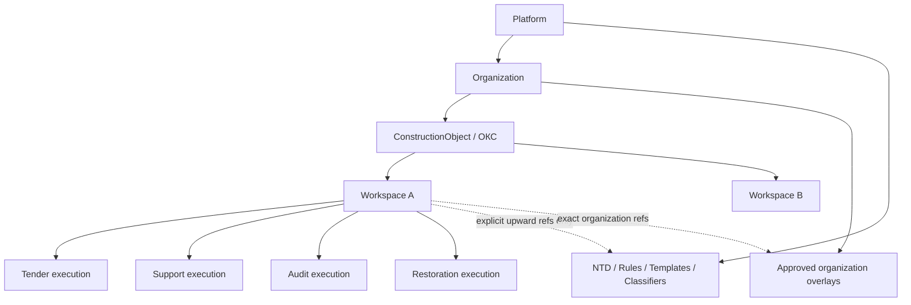
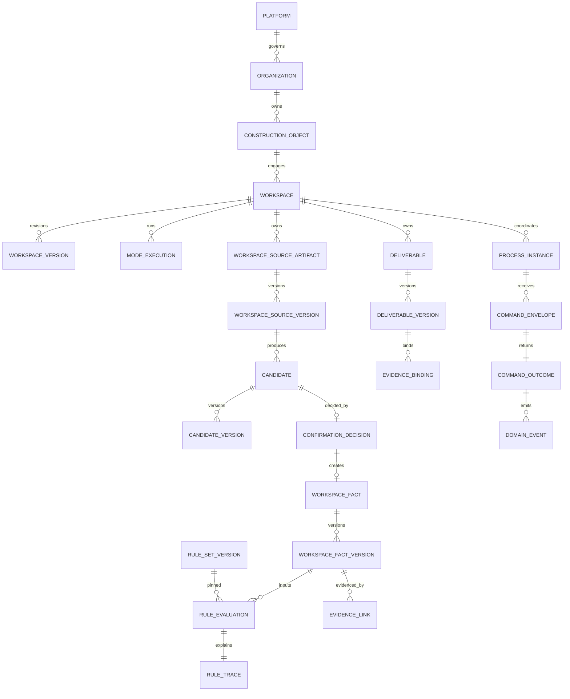
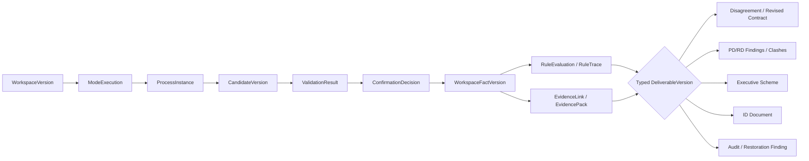
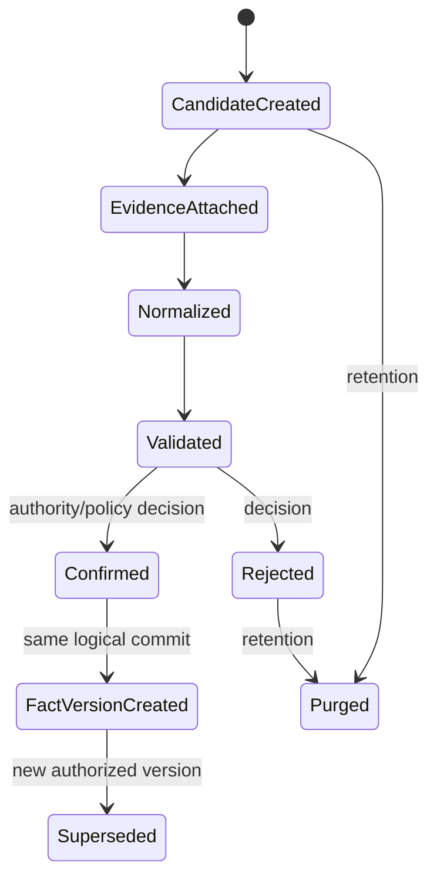
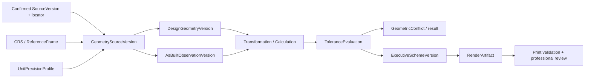
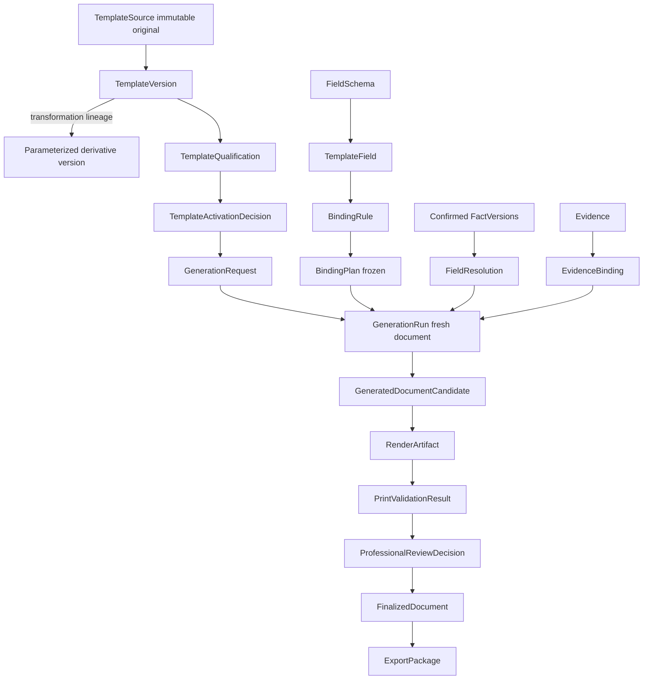
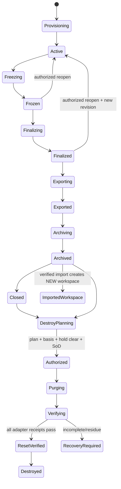
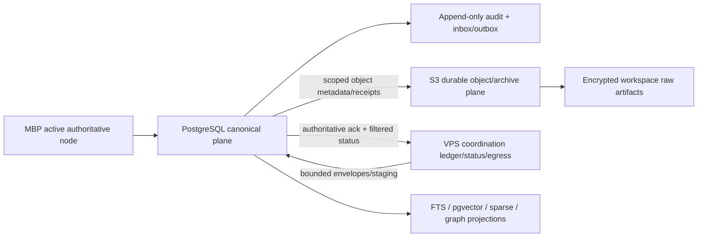

# АСД-КОНТУР — Logical Data Model v0.1

- **Статус:** `Accepted architecture baseline`
- **Gate:** `G-01 Logical Data Model — PASS`
- **Дата принятия:** 2026-08-22
- **Владелец:** Олег Щербаков
- **Принято:** ведущим архитектором Codex в пределах явного делегирования
  обычных архитектурных решений в задании от 2026-08-22
- **Область:** единая объектно-независимая логическая модель для `Tender`,
  `Support`, `Audit`, `Restoration` и результатов R-1…R-3
- **Не является:** ORM, DDL, миграцией, persistence implementation,
  deployment profile или разрешением начать реализацию

## 0. Нормативная роль и границы

Эта модель превращает принятые Domain, Knowledge, Lifecycle, Process,
Authorization, Rules, Harness, Information и Technical Architecture в
формальный логический контракт данных. Будущие PostgreSQL schema, ORM, DDL и
миграции обязаны реализовать этот контракт без повторного изобретения
основных сущностей, ownership и scope.

Нормативные основания: `README.md`, `PRODUCT_SCOPE.md`,
`FUNCTIONAL_MODEL_v0.1.md`, `ARCHITECTURE_BLUEPRINT_v0.1.md`,
`IMPLEMENTATION_PLAN_v0.1.md`, `IMPLEMENTATION_BASELINE.md`,
`INFORMATION_ARCHITECTURE_v0.1.md`, `TECHNICAL_ARCHITECTURE_v0.3.md`,
`DOMAIN_AND_KNOWLEDGE_MODEL_v0.1.md`,
`KNOWLEDGE_AND_MEMORY_ARCHITECTURE_v0.1.md`,
`LIFECYCLE_AND_RETENTION_SPECIFICATION_v0.1.md`,
`PROCESS_AND_EVENT_SPECIFICATION_v0.1.md`,
`AUTHORIZATION_AND_AUDIT_MODEL_v0.1.md`,
`DETERMINISTIC_RULES_CATALOGUE_v0.1.md`, Harness Specification,
ID Generation Specification, legacy inventory и ADR-0001…ADR-0010.

`Invariant`: четыре режима являются overlays над одним ядром, а не четырьмя
базами. ТМ-35, Левашово, Игнатьево и любой иной ОКС — только workspace/test
instances; их имена, пути и значения не входят в идентичности модели.

`Invariant`: AI/OCR/VLM создаёт только `ProviderExecutionResult`, `Candidate`
или draft. Ни confidence, ни валидный JSON, ни совпадение моделей не создают
`WorkspaceFact`, не подтверждают правило, геометрию, подписанта или результат.

### 0.1. Что сознательно не определяется

- физические типы PostgreSQL, имена таблиц/колонок и partitioning;
- ORM inheritance strategy и repository interfaces;
- SQL/RLS/DDL/migrations;
- численные retention, budgets, floors, tolerances и cost limits;
- конкретные provider, S3, KMS, IAM, queue или workflow products;
- содержимое НТД, официальный статус формы и qualification конкретного лица;
- прикладные команды, UI и runtime configuration.

Неизвестные evidence-dependent значения являются versioned policy data и до
утверждения действуют fail-closed.

## 1. Принятые решения LDM

| ID | Решение | Основание и последствие |
|---|---|---|
| LDM-01 | Scope hierarchy: `platform → organization → ConstructionObject → Workspace → ModeExecution`. | ОКС — стабильная business identity, workspace — изолированная engagement/lifecycle boundary, ModeExecution — повторяемый process scope. |
| LDM-02 | Platform и workspace сущности не хранятся через одну nullable `scope_id`. | Логические abstract supertypes имеют disjoint concrete ownership families; platform→workspace FK запрещён. |
| LDM-03 | `PhysicalObject` отделён от `SourceArtifact` и `SourceVersion`. | Digest доказывает равенство bytes, но не identity, ownership или access. Project bytes физически не дедуплицируются между workspaces. |
| LDM-04 | Candidate/Fact/Deliverable — total/disjoint typed families, не untyped property bags. | Общий lifecycle возможен без polymorphic `subject_type + subject_id`; material payload живёт в typed subtype. |
| LDM-05 | Canonical state — current records + immutable versions; события не являются SoR. | Recovery читает канон и checkpoints; global replay и exactly-once не обещаются. |
| LDM-06 | Customer regulation — workspace `SourceArtifact` и `CustomerRegulationVersion`; organization overlay создаётся отдельным approved процессом. | Регламент не НТД и не меняет её; конфликт материализуется. |
| LDM-07 | Post-reset attestation и content-minimal audit принадлежат organization governance ledger без FK/live-link к уничтоженному workspace. | Сохраняется доказательство операции, но не reconstructive project content. |
| LDM-08 | Archive import всегда создаёт новый `Workspace`, новые scoped identities и explicit lineage. | Старый workspace не оживает; direct archive/cross-workspace read запрещён. |
| LDM-09 | Filled project document не является `TemplateVersion`. | Promotion создаёт новую sanitized platform identity через gate; scope существующей сущности не меняется. |
| LDM-10 | UUIDv7 — default stable identity; UUIDv5 только через registered typed namespace/canonicalization; SHA-256 — digest/fingerprint. | Время/путь/filename не являются business key; hash не capability. |

Все решения `LDM-01…10` имеют статус `Accepted`, owner Олег Щербаков, дата
2026-08-22; основание — делегирование архитектурных решений текущим заданием.
Новый ADR не нужен: решения детализируют уже принятые ADR-0003, 0005, 0008,
0009 и 0010 и не меняют cross-cutting topology или product boundary.

## 2. Scope model

### 2.1. Иерархия и правила



| Scope | Data owner / stable identity | Children | Lifecycle / retention | Read/write boundary | Archive/import/reset |
|---|---|---|---|---|---|
| `platform` | Product owner/governance; `platform_id` is installation-independent logical UUID | organizations, platform knowledge/policies/templates | Long-lived, versioned; no workspace reset | Platform stewards write; scoped services/workspaces read only published versions | Platform backup/restore independent from workspace archive; workspace reset cannot delete platform rows |
| `organization` | Legal/operating organization; `organization_id` | ConstructionObjects, overlays, grants, governance attestations | Active/suspended/closed; policy-defined retention | Every owned reference includes organization; shared deployment checks tenant boundary even if dedicated | Organization export is not workspace archive; no organization reset by project command |
| `ОКС` | Organization; `construction_object_id`; external cadastral/project codes are alternate IDs, never sole PK | many Workspaces | Stable business identity; contains no project document bytes/facts | Organization members with capability; writes to identity/aliases only | Not purged with one workspace; cannot be used as data container or cross-workspace join escape |
| `workspace` | Organization/engagement; `workspace_id` | ModeExecutions and all project memory | Full Lifecycle Specification + pinned RetentionProfile | Mandatory `(organization_id, workspace_id)` on every project relation; workspace A cannot read/write B | Freeze/finalize/export/archive/purge/reset/destroy; import creates a new workspace |
| `ModeExecution` | Workspace process authority; `mode_execution_id` | Processes/jobs/deliverable intents | created/running/waiting/blocked/completed/failed/cancelled/superseded | Cannot own data outside parent workspace; concurrent writes require aggregate/version guards | Included in workspace archive; destroyed with workspace; never imported with original ID as current |

### 2.2. Разрешённые ссылки между scopes

1. `workspace → same workspace` — только composite FK containing
   `(organization_id, workspace_id, target_id[/version_id])`.
2. `workspace → parent ConstructionObject/Organization` — точный upward FK;
   organization and construction-object components must match Workspace.
3. `workspace → platform` — only allowlisted immutable published version
   references: RuleSetVersion, NormativeEdition, classifier, TemplateVersion,
   schema/profile/policy. Mutable alias such as `latest` запрещён.
4. `workspace → organization overlay` — exact version with matching
   `organization_id`; overlay cannot point back to workspace evidence.
5. `platform → workspace` — запрещено. Promotion stores only a sanitized
   capsule and lineage digest without workspace ID/FK/access locator.
6. `workspace A → workspace B` — запрещено, включая evidence, object, graph,
   index, job, audit, archive and generated-document references.
7. `organization A → organization B` — запрещено, кроме отдельной
   integration/export contract; обычный FK никогда не пересекает tenant.

`Pseudo-constraint`:

```text
FK workspace_child(org_id, workspace_id, parent_id)
  -> workspace_parent(org_id, workspace_id, parent_id)

CHECK exactly_one_scope(platform_owner, organization_owner, workspace_owner)
-- реализуется раздельными concrete relations, не nullable scope columns.
```

## 3. Identity, versioning and relationship rules

### 3.1. Logical keys

- Stable aggregate/entity IDs: UUIDv7 unless a registered deterministic
  identity rule exists.
- Immutable version IDs: independent UUIDv7. Human version labels are
  alternate identifiers and not FK targets.
- Typed UUIDv5: `(namespace_id, canonicalization_version, canonical_key)`;
  used, for example, by stable `WorkType`. Namespace registration is canon.
- Object/version digests: SHA-256 of exact bytes/canonical serialization;
  equality check only, not PK, locator, authorization or dedup permission.
- External identifiers live in versioned alias/identifier records with
  issuer, namespace, validity and provenance; they never overwrite stable ID.

### 3.2. Version pattern

Each material aggregate follows one of four declared patterns:

| Pattern | Meaning | Examples |
|---|---|---|
| Stable header + immutable versions | identity persists, content revisions append | SourceArtifact/SourceVersion, Candidate/CandidateVersion, WorkspaceFact/WorkspaceFactVersion, Deliverable/DeliverableVersion |
| Immutable version entity | identity itself denotes frozen manifest/version | RuleVersion, RuleSetVersion, TemplateVersion, GenerationRun |
| Append-only record | never changed; correction links a new record | DomainEvent, AuditRecord, AcquisitionRecord, ValidationResult |
| Rebuildable projection | may be deleted/rebuilt; generation/version identifies build | FTS, EmbeddingIndexVersion, GraphProjectionVersion, caches |

All mutable aggregate heads carry logical `revision` for optimistic
concurrency. A command supplies `expected_revision`; mismatch is
`ConcurrencyConflict`, never last-write-wins. Effective intervals use an
explicit boundary convention, normally `[effective_from, effective_to)`, and
overlap constraints are declared per subject/policy. Recorded time and
effective time are different.

### 3.3. Associations, idempotency and deletion

- Versioned many-to-many relations use association entities with their own
  ID/version/effective interval, e.g. `RuleSetMembership`,
  `RuleEvidence`, `EvidenceBinding`, `WorkDependency`.
- A material command is unique by `(scope, handler, idempotency_key)` plus
  semantic payload digest. Same key/different digest is a conflict.
- Domain ordering exists only per `(workspace, aggregate, aggregate_version)`.
  `correlation_id` groups a process; `causation_id` points to the immediate
  initiating command/event/attempt.
- Dangerous cascading deletion is forbidden across aggregate roots, platform
  references, archive or audit. Destruction executes an immutable
  `DeletionPlan` through enumerated adapters and verified receipts.
- Child values wholly owned by a version may be removed with that version
  only inside the authorized workspace destruction protocol. Business
  correction otherwise appends/supersedes.

## 4. Overall logical domain



Logical supertypes in diagrams are contracts. Physical Contract Pack may
choose shared headers plus typed extension relations or separate concrete
relations, but must preserve total/disjoint typing and composite scope FKs.

## 5. Entity passports — tenancy and lifecycle

Unless a row explicitly says otherwise: identifiers are UUIDv7; provenance
includes creator/decision, timestamps and correlation; canonical records are
read on MBP; readers require scoped authorization; freeze makes material
workspace content read-only; archive includes exact versions; reset destroys
workspace data; Promotion is denied.

Every passport row also inherits: stable ID and separate immutable version ID
where the name says “+ version”; `revision` on mutable aggregate heads;
created/recorded/effective timestamps; classification and policy refs where
applicable; no natural key unless an alternate key is explicitly named;
writers are the owning aggregate handler or named governance authority, never
a model/storage/event; readers are same-scope authorized services/humans plus
explicit upward-reference consumers. This convention supplies the complete
passport fields without repeating them in every cell.

| Entity | Purpose; scope; identity/version | Mandatory attributes and lifecycle | Relations/cardinality; ownership/access | Uniqueness, provenance, mutability, retention/fate/status |
|---|---|---|---|---|
| `Organization` | Tenant/authority boundary; organization; `organization_id`, immutable identity revisions | legal/display identity, status, assurance/policy refs | Platform 1→N organizations; org admins write, scoped members read | External codes unique per issuer+interval; append revisions; canonical; survives workspace reset |
| `OrganizationReferenceOverlay` + version | Approved reusable org reference, never project fact; organization | kind, source, sanitized content ref, effective interval, steward/reviewer/approval | Organization 1→N; workspace may pin exact version; no workspace back-reference | Unique `(organization, overlay_key, version)`; immutable approved version; canonical; no automatic Promotion from regulation |
| `ConstructionObject` | Stable identity of ОКС, not data container; organization | object class, canonical name/aliases, external IDs, status | Organization 1→N; Workspace N→1 | External IDs alternate; project details forbidden; canonical; survives one workspace destruction |
| `Workspace` | Isolation and engagement aggregate; workspace | organization/ОКС, state, current revision, pinned RuleSet/Profile refs, classification | ОКС 1→N workspaces; 1→N versions/modes/all project roots | Unique workspace ID plus `(org, id)`; optimistic revision; canonical; lifecycle-controlled |
| `WorkspaceVersion` | Immutable lifecycle/config snapshot; workspace | state, revision, reason, exact policy/ruleset/profile pins, inventory fingerprint | Workspace 1→N, one current | Unique `(workspace, revision)` and version ID; append-only; archive/import lineage; destroyed with workspace except content-free attestation |
| `ModeExecution` | One run of Tender/Support/Audit/Restoration; workspace | mode enum, purpose, input snapshot, state, readiness outcome, revision | Workspace 1→N; owns ProcessInstances/deliverable intents | Unique scoped ID; repeated modes allowed; versioned canonical; cannot outlive workspace |
| `RetentionProfile` + version | Complete policy by data class; platform template or organization-owned approved profile | every applicable data class, trigger, action, archive/export/provider residue semantics, effective interval, authority | Workspace pins exact applicable org/platform version; legal hold can suspend action | Missing field invalid/fail-closed; immutable approved version; canonical policy; not numerical-defaulted by LDM |
| `LegalHold` + version | Overlay blocking destructive retention; workspace/org governance | subject scope, basis registry ref/evidence, authority, interval, state | Workspace 0→N; DeletionPlan must reference current check | Append/supersede, no silent release; canonical; archived and content-minimal survival per applicable law/policy |
| `ArchivePackage` + version | Portable logical evidence package; workspace/archive plane | schema/profile, manifest digest, object versions, rules/templates, integrity status | Workspace 0→N; package 1→N receipts; Import N→1 source package | Immutable after sealed; exact version unique; canonical archive metadata + S3 bytes; no direct current-state use |
| `ArchiveImport` | Import attempt and lineage; target workspace | source package, verifier, compatibility, outcome, new target workspace | ArchivePackage 1→N imports; each successful import creates exactly 1 new Workspace | Append-only; original IDs remain aliases/provenance only; never reopens source workspace |
| `DeletionPlan` + version | Exact destructive inventory; workspace | basis/evidence, adapters/objects/classes, legal-hold result, requester/confirmer requirements, digest | Workspace 0→N; 1→N receipts | Immutable after authorization; exact plan only; canonical until destroy; no wildcard/glob target |
| `StorageAdapterReceipt` | Per-adapter side-effect proof; workspace | adapter identity, plan version, operation/effect id, outcome, residual counts, integrity | Plan 1→N; all required receipts needed | Append-only/idempotent; failure/incomplete never success; content-bearing detail destroyed after attestation |
| `DestructionAttestation` | Verified content-free proof; organization governance | former opaque workspace ID, plan/decision codes, adapter outcome counts, residual scan, verifier/authority, integrity | Derived only after all receipts verified; no FK to destroyed content | Append-only canonical governance evidence; survives reset; reconstructive names/hashes/text forbidden |

## 6. Entity passports — sources and evidence

### 6.1. Source/object specialization

`SourceArtifact`, `SourceVersion`, `SourceLocator` and `PhysicalObject` are
logical interfaces with two disjoint concrete families:

- `PlatformSourceArtifact/Version/Locator` and `PlatformPhysicalObjectVersion`;
- `WorkspaceSourceArtifact/Version/Locator` and
  `WorkspacePhysicalObjectVersion(org_id, workspace_id, ...)`.

There is no relation whose row may be either platform or workspace through a
nullable discriminator. A workspace source can reference published platform
knowledge through explicit semantic associations; it cannot reuse platform
object ownership for project bytes.

| Entity/family | Purpose; identity/version | Mandatory attributes/state | Relations, constraints, access, retention/status |
|---|---|---|---|
| `SourceArtifact` concrete family | Logical source independent from files; stable source ID | source kind/classification/title/issuer/owning scope/status | 1→N SourceVersion; workspace source always composite scoped; canonical; platform source survives, workspace source purged |
| `SourceVersion` concrete family | Immutable published/admitted state | source ID, version ID, effective/recorded intervals, admission status, media/semantic metadata, content object ref | Exactly one same-scope PhysicalObjectVersion; N locators/acquisitions/extractions; no `is_current` ambiguity—current resolved by non-overlap/status policy |
| `SourceLocator` concrete family | Exact address in one SourceVersion | locator kind/schema, page/unit/region/cell/clause/coordinate space, digest if fragment | FK includes owning scope + source version; immutable; no free text-only locator for material evidence |
| `PhysicalObject` concrete family | Identity of exact stored bytes and scoped access | object version ID, digest, size, MIME, encryption/classification, storage receipt refs, state | One owner scope; digest alternate key only within permitted scope; platform/workspace namespaces separate; canonical object ledger metadata |
| `AcquisitionRecord` | How/when bytes/metadata were obtained | source/version, actor/channel/provider, external locator, timestamps, request/receipt digest/outcome | Append-only; many acquisitions may prove same SourceVersion; failure retained by policy; no authority upgrade |
| `ExtractionAttempt` | One parser/OCR/VLM/native attempt | method/profile/schema/input version/locator, attempt state, parent/idempotency/correlation | 1 SourceVersion→N attempts; workspace for project, platform governance for NTD intake; append-only |
| `ExtractionRecord` | Immutable typed output of attempt, before Candidate mapping | attempt, output schema/digest, gaps/failures/terminal outcome | Provider result/native parse not a Fact; 0→N Candidates; content follows source scope; canonical execution evidence |
| `EvidenceLink` | Typed link from exact subject version to exact source locator | evidence role, subject version, SourceVersion/Locator, method/decision, validity | Same workspace for project subject/evidence; platform subject only platform evidence; many-to-many association; canonical |
| `EvidencePack` + version | Query/process bundle of exact evidence, conflicts and gaps | purpose/scope/query, source/locator versions, applicability, gaps, digest | Workspace or platform concrete family; immutable response; no authority; canonical process artifact, not source content copy |
| `EvidenceCapsule` | Minimal sanitized platform evidence after Promotion | capsule ID/version, approved proposition class, non-reconstructive evidence summary, anonymization/regression/decision refs | Created as new platform entity; no workspace ID/live locator/source hash; immutable canonical platform memory |

Digest equality permits integrity comparison but cannot grant read, form a FK
to another workspace or authorize shared physical storage. Cross-workspace
project-blob deduplication is forbidden even when digests match.

## 7. Platform knowledge, НТД and rules


### 7.1. НТД passports

| Entity | Purpose/scope/identity | Mandatory attributes/lifecycle | Relations, integrity, provenance, retention/status |
|---|---|---|---|
| `NormativeDocument` | Stable official document identity; platform | designation namespace, title, issuer/jurisdiction, document class | 1→N editions; designation alternate key includes issuer/jurisdiction; canonical permanent memory |
| `NormativeEdition` | Immutable edition/revision identity; platform | label, status, effective interval/boundaries, publication/admission decisions, exact SourceVersion, supersedes/amends | N→1 document; edition chain acyclic; intervals may overlap only with explicit transition/conflict; cancelled retained, never auto-applied |
| `StructuralUnit` + version | Addressable clause/table/appendix/definition scope | edition, structural path/type/order, exact locator, content digest | Belongs to one edition; tree parent same edition; canonical text/object remains source-backed; immutable per edition |
| `Definition` | Typed defined term/assertion specialization | term, meaning assertion version, scope/qualifiers | N→1 structural unit; versioned with assertion; canonical |
| `Requirement` | Typed normative obligation specialization | subject/action/condition/outcome/applicability ref | Evidence-backed; cannot be inferred from filename; canonical assertion subtype |
| `Exception` | Typed exception/condition specialization | affected requirement, predicate, boundaries | Same edition/assertion evidence; never global free-text override; canonical |
| `CrossReference` | Typed canonical relation between units/assertions | source/target exact versions, relation type, effective context | Platform only; canonical edge source for rebuildable graph; no dangling target |
| `KnowledgeAssertion` + version | Stable proposition with immutable revisions | assertion type, normalized proposition, status, applicability context, reviewer/approval, supersedes | 1→N AssertionEvidence; published revisions immutable; canonical; AI draft remains PromotionCandidate |
| `AssertionEvidence` | Assertion-version↔source-unit evidence | exact SourceVersion/StructuralUnit/locator, extraction/review, fragment digest | Association entity; platform only; no source-text duplication; canonical |
| `ApplicabilityContext` + version | Typed dimensions for assertion/rule applicability | jurisdiction, object/work/material/stage/date/source authority and declared unknown semantics | Referenced by assertion/rule; versioned canonical; three-valued evaluation |
| `NormativeConflict` + version | Conflicting editions/assertions/sources | subject, participants, conflict type/group, policy attempted, state, blocker impact | Platform governance conflict; resolved only by policy/authority; history retained |

Customer regulation is deliberately absent from this table. It is a
`WorkspaceSourceArtifact` plus `CustomerRegulationVersion`, may participate in
a workspace `Conflict`, and cannot update `NormativeEdition`,
`KnowledgeAssertion` or `RuleVersion`.

### 7.2. Deterministic rule passports

| Entity | Purpose/scope/identity | Mandatory attributes/lifecycle | Relations, constraints, retention/status |
|---|---|---|---|
| `Rule` | Stable rule meaning; platform or strictly workspace concrete family | namespaced key, class, purpose, owning scope | 1→N RuleVersion; platform/workspace Rule relations disjoint; canonical |
| `RuleVersion` | Immutable typed rule contract | predicate/inputs/outputs, three-valued applicability, effective interval, evidence/tests/implementation binding, status, author/reviewer/approver | Only approved+active+RuleSet member executes; changes create version; workspace variant has composite scope and is destroyed |
| `RuleEvidence` | RuleVersion↔Assertion/Source evidence | exact assertion/unit/source locator, authority layer, applicability basis, digests | Same scope or workspace→published platform evidence; association; canonical |
| `RuleSetVersion` | Immutable reproducible manifest | stable set key/version, membership/policy/schema/unit/calculation digests, compatibility, approval | Platform identity; Workspace pins exact version; no rolling alias; canonical |
| `RuleSetMembership` | Versioned many-to-many manifest member | ruleset, exact RuleVersion, order/role, integrity digest | Unique `(ruleset_version, rule_version, role)`; all dependencies included; immutable |
| `ConflictGroup` + version | Named subject-specific conflict class | subject/domain, participant types, effective interval | 1→N policies; no universal numeric source rank; canonical |
| `ConflictPolicy` + version | Deterministic resolution policy | conflict group, typed predicate/outcome, authority/evidence/tests | Exact version in RuleSet; missing/indeterminate blocks; canonical |
| `RuleEvaluation` | One scoped evaluation over frozen inputs | workspace/platform scope, rule/ruleset versions, input snapshot refs, applicability/result, engine binding, correlation | Workspace evaluations cannot read Candidates as material facts; append-only canonical result |
| `RuleTrace` | Reproducible explanation | exact RuleVersion + RuleSetVersion, typed values/versions, evidence/locators, units/CRS, steps/boundaries/policy/output/fingerprint | Exactly one primary trace per evaluation; immutable; canonical evidence, not event |
| `WorkspaceRuleVersion` | Strict workspace specialization of RuleVersion | mandatory org/workspace, authority/evidence/tests/effective interval | Only same workspace and pinned manifest; cannot override mandatory authority silently; destroyed unless separately promoted |
| `ControlledRuleSetUpgrade` + version | Crash-safe workspace pin change | source/target manifests, impact/compatibility, affected evaluations/results, approval/state/delta verification | Old pin remains until atomic verified adoption; terminal workspace denied; canonical workspace process entity |

## 8. Candidates, facts, uncertainties and decisions

### 8.1. Workspace, facts, processes and deliverables





`Candidate` and `WorkspaceFact` are abstract logical headers whose subtype is
mandatory and immutable. Allowed subtype registries are versioned; arbitrary
JSON/property bags and polymorphic references are not canonical facts.

| Entity | Passport |
|---|---|
| `Candidate` | Workspace stable identity; required `candidate_kind`, producer class, source/extraction lineage and current revision. Owns N immutable CandidateVersions. Only candidate/validation services write. Unique `(workspace, candidate_id)`; canonical workspace memory; archive/purge by profile; Promotion only via PromotionCandidate. |
| `CandidateVersion` | Immutable typed proposal: schema/version, value subtype, field evidence/locators, distinct quality dimensions, state and parent/supersedes. Same-scope FK to Candidate/SourceVersion/Attempt. Never a Fact, even `validated`. |
| `ValidationResult` | Append-only execution of exact validator/profile over CandidateVersion or other typed subject version; outcome, failures, skipped checks and fingerprint. Same scope; canonical decision evidence, not human confirmation. |
| `ValidationFailure` | Child/association with stable failure ID, code vocabulary version, target field, severity, evidence, repairability/blocking. Immutable; required failure cannot be deleted to make a pass. |
| `ConfirmationDecision` | Explicit allow/reject/supersede decision on exact CandidateVersion; policy/RuleTrace, actor/active authority, evidence set and reason. Model identity cannot be deciding principal. A positive decision and first WorkspaceFactVersion share one logical commit boundary. |
| `WorkspaceFact` | Stable typed fact aggregate owned by one workspace; kind/subject and current version. No generic project-free fact. Writers are authorized domain handlers only; readers scoped services/modes. Canonical, versioned, destroyed with workspace. |
| `WorkspaceFactVersion` | Immutable confirmed/corrected state, effective/recorded intervals, value subtype, authority, evidence and supersession reason. Composite same-workspace refs. Correction appends; history never UPDATE-overwritten. |
| `Uncertainty` + version | Typed unknown/gap/indeterminate state with exact subject version, required inputs, blocker impact and lifecycle. Not false/not_applicable. Resolved only by evidence/rule/authorized decision; workspace canonical; destroyed. |
| `Conflict` + version | Typed incompatible claims/sources/rules/geometry/values with all participants, policy attempt and scope of block. No last-write-wins. Workspace canonical; separate `NormativeConflict` for platform governance. |
| `HumanScopedDecision` + version | Qualified human fallback for exact subject/domain/workspace/effective interval with evidence and grant. Not a global rule; no cross-workspace reuse; may become promotion input but is destroyed with workspace. |

`Invariant`: no confidence threshold participates in the transition to
`WorkspaceFact`. Confidence may route review or form an uncertainty only.

## 9. Construction domain model

The common kernel supports the chain:

```text
WorkType → WorkInstance/WorkVolume → MaterialRequirement/MaterialBatch
→ ControlOperation → Evidence/Measurement → DocumentRequirement
→ IDPackage/PresentedVolume → KsDocument/KsLine → PaymentClaim/PaymentRecord
```

| Entity/family | Purpose, scope and key fields | Relations/lifecycle/provenance/status |
|---|---|---|
| `ConstructionStructureVersion` | Workspace snapshot of zones/levels/axes/sections and element membership | One workspace, immutable revision; source/fact evidence required; canonical workspace state |
| `ConstructionZone` | Stable workspace location identity inside structure | Parent/child same workspace, effective membership versions; no name-only cross-workspace identity |
| `ProjectDocumentVersion` | Typed workspace semantic specialization for exact ПД/РД SourceVersion | Design section/stage/status/approval/effective basis and structural locators; immutable; project approval does not imply NTD applicability |
| `ContractVersion` + `ContractClause` | Typed workspace contract source and addressable clauses | Parties/scope/effective interval/status/authority and exact SourceLocator; changes append versions; legal effect requires qualified decision |
| `CustomerRegulationVersion` + clause | Typed workspace regulation of the customer | Issuer/authority/scope/effective interval/incorporation evidence and exact locators; cannot become OrganizationReferenceOverlay or override NTD automatically |
| `WorkType` + taxonomy version | Platform canonical class, registered UUIDv5 key/aliases | Used by all modes; rules/evidence determine classification; legacy 292 keys only aliases/candidates |
| `WorkInstance` + version | Planned/performed work occurrence in workspace | Links exact WorkType, element/zone, dates/state/responsible roles/evidence; lifecycle append/supersede |
| `WorkDependency` + version | Work-to-work prerequisite/sequence association | Same workspace composite FKs; typed dependency, rule/evidence/effective interval; cycles/conflicts blocked |
| `ConstructionElement` + version | Workspace physical/functional element | Same structure/zone; design/fact versions and source lineage; not inferred from pilot folder |
| `Material` + version | Platform material/product class identity, not a project batch | Taxonomy/specification attributes with evidence; project-specific requirement is separate |
| `MaterialRequirement` + version | Workspace required material/MTR for work/element | Rule/project/contract evidence, quantity/unit/spec, state/gap; same scope |
| `MaterialBatch` + version | Workspace traceable received batch | supplier/lot/marking/certificates, custody, admission/use state; 0→N applications to work; confirmed evidence required |
| `MaterialApplication` | Batch↔WorkInstance association | same workspace, quantity/unit/location/time/evidence; rejected batch cannot be applied |
| `WorkVolume` + version | Typed planned/factual/confirmed quantity | kind, Decimal/rational value, unit/precision/formula/source, work/zone; presented state separate; canonical fact subtype/reference |
| `ControlOperation` + version | Required/performed control checkpoint | work/material/stage, method, criteria, authority, state; evidence/measurements/results N; negative result preserved |
| `Measurement` + version | Confirmed or candidate observation with unit/method/instrument/calibration/accuracy | Workspace; Candidate path separate from confirmed FactVersion; geometry measurement references frame/CRS |
| `RequiredDocumentType` + version | Platform stable ID document/form class | Purpose/class/applicability RuleVersion refs; does not name active TemplateVersion directly |
| `DocumentRequirement` + version | Workspace evaluated mandatory/conditional document need | exact Work/Control/RuleEvaluation/RequiredDocumentType, applicability `required/conditional/not/unresolved`; gaps explicit |
| `SignerRequirement` + version | Workspace requirement for roles/authority at event date | RequiredDocumentType/DocumentRequirement, role classes, effective interval, RuleTrace; does not assign a human |
| `IDPackage` + version | Workspace completeness aggregate for a work/period/presentation | required vs actual documents/evidence, gaps/blockers, state; FinalizedDocument membership through association |
| `DocumentCoverage` | DocumentRequirement↔candidate/finalized document association | Same workspace; coverage status/evidence; one file cannot silently satisfy incompatible requirements |
| `PresentedVolume` + version | Workspace volume claimed for acceptance | Links exact WorkVolumeVersion, evidence/ID package and contract context; never inferred from KS total alone |
| `KsDocument` + version | Typed КС source/generated/final record, not generic document | KS type/period/contract/source/finalized-document refs; workspace canonical metadata |
| `KsLine` + version | PresentedVolume↔KS line association | Exact quantity/unit/rate/amount/calculation trace, same workspace; totals reproducible |
| `PaymentClaim` + version | Workspace claim/entitlement state | Contract conditions, KS versions, blockers/authority; legal/financial decision not AI-confirmable |
| `PaymentRecord` + version | Confirmed payment observation | exact external evidence, amount/currency/date/status; does not prove entitlement by itself |

All numeric quantities declare unit registry/version, precision, rounding and
boundary semantics. Binary float is not a logical type for money, critical
quantity, tolerance or coordinate.

## 10. Geometry model



| Entity | Purpose/scope/identity and required attributes | Relations, authority, retention/status |
|---|---|---|
| `GeometrySource` + `GeometrySourceVersion` | Workspace stable source role and immutable version; source/fact/locator, acquisition/measurement method, coordinate lineage, status | Must resolve to same-workspace confirmed SourceVersion/FactVersion or Measurement; VLM output/model confidence prohibited; canonical |
| `CrsDefinition` + version | Platform registered coordinate reference definition | Authority, axes, datum/projection, units, validity; immutable published version; platform canonical |
| `ReferenceFrame` + version | Workspace/project local frame tied to CRS or explicit engineering baseline | Origin/axes/orientation/scale, transformation evidence; confirmed authority required; workspace canonical |
| `UnitPrecisionProfile` + version | Platform/org approved units, exact numeric representation, precision/rounding/uncertainty semantics | Exact version pinned by geometry/calculation; missing profile blocks; canonical policy |
| `DesignGeometryVersion` | Immutable workspace design geometry | Geometry source, RD locator, CRS/frame, units/precision, representation/object ref, confirmation state | N→1 element/zone; only confirmed design input for scheme; canonical workspace fact subtype |
| `AsBuiltObservationVersion` | Immutable actual geometry observation | measurement set, method/instrument/calibration/accuracy, actor authority, CRS/frame/units/evidence | Must be confirmed; AI candidate remains CandidateVersion; canonical workspace fact subtype |
| `GeometryTransformation` | Versioned deterministic transform contract/application | source/target frame, algorithm/version, parameters/evidence, input/output digests | No implicit transform; exact inputs; canonical calculation record |
| `GeometryCalculation` | Deterministic derived geometry/quantity | formula/binding, operands/versions, unit conversions, exact intermediate values, fingerprint | Canonical calculation evidence; result may feed fact only through policy/authority |
| `ToleranceEvaluation` | Exact boundary comparison | applicable RuleVersion, geometry inputs, tolerance/unit/precision/boundary, outcome/trace | `indeterminate` on missing input; canonical RuleEvaluation specialization |
| `GeometricConflict` | Typed design/as-built/source/transformation inconsistency | participant versions, conflict type, magnitude/unit, policy/decision, blocker | Workspace Conflict specialization; unresolved blocks scheme/finalization |
| `ExecutiveSchemeVersion` | Typed deliverable semantic model before/with rendered forms | confirmed design/as-built refs, transformations, tolerance results, drawing entities/layers, revision | Workspace deliverable subtype; no confirmed geometry → no candidate/final; DXF structured artifact, SVG/PDF derived renders |

## 11. ID Generation & Template Platform



### 11.1. Platform template passports

| Entity | Purpose/identity/version | Attributes/lifecycle/relations/access/retention/status |
|---|---|---|
| `TemplateSource` | Platform immutable source identity for original bytes | Exact PlatformSourceVersion/PhysicalObjectVersion, format, provenance, authority/rights, form identity. `discovered/quarantined/candidate/qualified`; source bytes never mutate; canonical platform memory. |
| `TemplateVersion` | Exact source or parameterized derivative version | Parent source/derivative lineage, format, edition/effective interval, FieldSchema/Renderer/Validation refs, status `candidate/qualified/active/superseded/withdrawn/rejected`. Only active exact version selectable; immutable canonical. |
| `TemplateTransformation` | Source→derivative lineage association | Tool/profile/input/output digests, transformation purpose, author/reviewer. Derivative bytes have distinct object/version ID; append-only. |
| `TemplateQualification` | Bounded evidence that exact template/profile is usable | Authority/rights, security, field/binding coverage, renderer/viewer/golden results, supported features, decision scope. Qualification is exact tuple and does not imply activation. |
| `TemplateActivationDecision` | Authorized activation/withdrawal for exact context | Candidate TemplateVersion, qualification, applicability/effective interval, actor/grant/reason. Append-only canonical governance. |
| `FieldSchema` + version | Stable semantic field catalogue | Field keys/types/cardinality/units/materiality/classification/missing/formatting policy; immutable approved platform version. |
| `TemplateField` | FieldSchema↔format target association | Semantic key plus DOCX control/bookmark/token, XLSX cell/range, PDF field/rectangle or drawing target; target coordinate space/profile. Unique within template version; canonical mapping metadata. |
| `BindingRule` + version | Deterministic resolution from semantic field to typed fact/evidence and format target | Input kinds, resolver/rule versions, normalization/display transformation, missing/conflict policy, tests. Platform approved rule; no SQL/path/model authority. |
| `RendererProfile` + version | Qualified format/toolchain contract | Adapter/tool/library/font/locale/viewer versions, deterministic options, supported features and environment constraints. Platform canonical; provider/OS replaceable by new version. |
| `ValidationProfile` + version | Required validation plan | Validators/order/severity/blocking/tolerances/goldens/format compatibility. Unknown/missing validator blocks. Platform canonical. |

### 11.2. Workspace generation passports

| Entity | Purpose/identity/version | Attributes/lifecycle/relations/access/retention/status |
|---|---|---|
| `GenerationRequest` | Authorized request for one required output | Workspace/mode/purpose/RequiredDocumentType/exact requirement/requested format/idempotency/authority. 1→N runs; canonical workspace command intent. |
| `BindingPlan` | Frozen run-specific resolution plan | Exact TemplateVersion/FieldSchema/BindingRule and ordered TemplateFields, source fact types and target mapping digest. Workspace snapshot; immutable; no mutable registry alias. |
| `GenerationRun` | One stateless fresh-document execution | Request, run/attempt lineage, exact template/rule/profile versions, frozen input fingerprint, state/outcome/effect IDs. Exactly one fresh document instance per run; retry semantics declared; canonical workspace execution. |
| `FieldResolution` | One semantic field/row/group resolution | Field key, typed normalized/display value, state `confirmed/candidate/conflict/missing/not_applicable/redacted`, exact FactVersion/rule/transform refs. Only confirmed or proven N/A can finalize. |
| `EvidenceBinding` | Material field/geometry↔exact evidence | Same-workspace field resolution, FactVersion, SourceVersion/Locator, ConfirmationDecision, resolver/RuleTrace; lists bind each row or defined group. Composite FKs; immutable. |
| `GeneratedDocumentCandidate` | Immutable successful candidate bytes, not final | Run, workspace PhysicalObjectVersion, semantic fingerprint, validation set, state. Created only after pre-candidate blockers clear; never platform memory. |
| `RenderArtifact` | Derived canonical visual/print representation | Purpose `extraction` or `document`, source candidate/version, RendererProfile, pages/dimensions/transforms/fonts/toolchain and digest. Rebuildable workspace object; exact artifact pinned for review. |
| `PrintValidationResult` | Exact layout/render verification | Candidate/render/profile, page/print-area/fonts/clipping/pagination/formulas/merges/golden outcomes and failures. Pass required but not finalization; append-only. |
| `ProfessionalReviewDecision` | Qualified human decision on immutable candidate+render+validation set | Reviewer identity/active role/grant/qualification, exact digests, decision/reason/time/SoD checks. Bytes/evidence change invalidates decision; model/service denied. |
| `FinalizedDocument` + version | Immutable professionally accepted workspace result | Candidate, review decision, exact bytes/canonical print representation, finalization status, export eligibility. Canonical deliverable subtype; no UPDATE of finalized bytes. |
| `ExportPackage` + version | Exact deliverable/output bundle | Finalized versions, exact objects, manifest/digests, validation/finalization evidence, classification, export authority/receipts. Workspace/archive canonical; partial package is not exported success. |

DOCX, XLSX, fillable PDF, non-fillable PDF and DXF/SVG/PDF geometry use
separate adapter profiles. One generic renderer may expose a common port but
cannot erase format-specific fields, layout constraints or qualification.
`file exists`, ZIP integrity or viewer openability are structural signals only.

### 11.3. Template promotion

A project-filled document is never a TemplateSource. A proposed universal
template derived from project material follows:

```text
workspace artifact → PromotionCandidate → anonymization/leakage checks
→ sanitized derivative bytes → applicability/rights/qualification evidence
→ PromotionDecision → new PlatformSourceArtifact + TemplateSource/Version
```

The new platform identity stores no workspace ID, live locator, organization,
person, contract, coordinates, signatures or reconstructive project hash.

## 12. Processes, commands, events and distributed work

| Entity | Purpose/scope/key fields | Lifecycle, relations, SoR/retention |
|---|---|---|
| `ProcessInstance` + version | Workspace coordination for versioned process definition; mode, subjects, state, current step, blockers, correlation | Canonical current state + immutable revisions; does not own facts; archive/purge with workspace |
| `CommandEnvelope` | Immutable requested semantic action | command/schema, actor, exact scope/resource/version, capability/purpose/policies, idempotency/correlation/causation, payload digest | Inbox admission object; append-only workspace/platform concrete family; rejected command may have audit but no event |
| `CommandOutcome` | Durable result of exact command | accepted/duplicate/rejected/pending/failed, result refs/reasons, committed revision | 1:1 logical command outcome; idempotent duplicates return original; canonical coordination evidence |
| `DomainEvent` | Minimal immutable fact that a committed domain transition occurred | event/schema, aggregate/version, scope, correlation/causation, minimal payload refs | Not SoR; aggregate-local order only; content-bearing workspace event purged/reset |
| `IntegrationEvent` | Allowlisted/redacted consumer contract | source domain event, destination/purpose/schema/classification/policy | Separate projection, never raw automatic publication; at-least-once; workspace retention |
| `OutboxRecord` | Durable publication intent in canonical commit boundary | event/version/destination state/attempts | Canonical delivery ledger on MBP; same event ID retried; workspace/platform concrete scope |
| `InboxReceipt` | Consumer dedup/admission result | consumer, message/event/command ID, payload digest, outcome | Unique `(consumer, message_id)` within scope; VPS copy is coordination ledger, not domain acceptance |
| `Job` + attempt | Operational execution of exact work | job kind/profile/input digest/state/lease/fencing/attempt/error/effect | Job success is not fact; canonical job metadata on MBP, VPS status projection only; purge by scope |
| `Checkpoint` | Process/job resumable position | exact definition/version/input/current canonical revision/digest | Append/supersede; resume rechecks lifecycle; no full event replay |
| `ReconciliationRecord` | Resolve unknown/duplicate/partial external result | attempts/receipts/authoritative outcome/decision/state | Immutable revisions; unknown blocks dependent material operation |
| `QuarantineRecord` | Isolate integrity/scope/contract risk | subject exact version, reason/evidence, affected scope, authority/state | Canonical blocker; no auto-release; content follows subject scope |

At-least-once-safe delivery is required. Exactly-once, global ordering and
fire-and-forget authoritative success are not promises.

## 13. Authorization, identity and audit

| Entity/family | Purpose and required data | Scope/relations/lifecycle/status |
|---|---|---|
| `Principal` + typed subtypes | Stable identity header; total/disjoint `HumanIdentity`, `ServiceIdentity`, `IntegrationIdentity`, `DeviceIdentity`, `NodeIdentity`; status/assurance/organization | Platform/organization canonical. `ModelIdentity` is execution provenance, not actor. Shared human accounts forbidden. |
| `RoleDefinition` + version | Named bundle vocabulary, not authority by itself | Platform/org policy; capabilities still require scoped grants. |
| `CapabilityDefinition` + version | Atomic action code and resource/purpose constraints | Platform canonical vocabulary; no wildcard service capability. |
| `Grant` + version | Principal active-role/capability assignment | Organization/workspace/platform exact scope, validity, issuer/evidence/status; revocation affects new actions; canonical. |
| `AuthorityQualification` + version | Evidence-backed professional/class authority | Human, domain/field/document/rule class, jurisdiction/interval, issuer/evidence. No unevidenced person assignment; canonical policy data. |
| `AuthorizationDecision` | Immutable PDP allow/deny for closed tuple | Actor/active role/capability/org/workspace-or-platform/resource version/purpose/classification/policies/outcome/reasons. Fail-closed; append-only. |
| `AuthorizationEnvelope` | Frozen exact side-effect boundary | Decision plus pages/regions/provider/destination/budget/object/command identity. Any expansion requires new decision. |
| `WorkspaceEgressPolicy` + version | Workspace exact data-class×purpose/provider/profile allowlist | Organization-approved workspace policy with effective interval; missing/expired/ambiguous = deny. |
| `IntegrationIdentity` | Principal subtype for exact external system/provider boundary | No human authority, SQL or broad storage. Versioned credential reference only; secret never stored here/audit. |
| `ModelIdentity` + `ModelRevision` | Provider-neutral model family and immutable weights/provider revision provenance | Platform execution registry; no actor/authority. Same marketing name may map to distinct revisions/providers. |
| `ConfirmationPolicy` + version | Risk/field-class matrix deciding required authority and allowed deterministic auto-confirm | Platform/org approved policy; no confidence threshold; professional/legal classes require human. |
| `CostEnvelope` + version | Bounded spending authority | Workspace+purpose+provider/profile/currency, validity, reservation/commit/release. Numerical values evidence-dependent; canonical policy/ledger. |
| `AuditRecord` | Append-only content-minimal action/decision/access/execution evidence | Separate platform/workspace concrete families. Workspace content audit purged; post-reset organization audit contains only RD-03 allowlist. Event/telemetry/source content are distinct. |

Authorization writer/reader boundaries are capability-specific. A failed
mandatory audit write blocks external, finalization and destructive side
effects. Audit correction appends a record; it never mutates history.

## 14. AI/VLM execution and verification

| Entity | Purpose/identity | Required relations/lifecycle/retention/status |
|---|---|---|
| `ExecutionProvider` + version | Platform provider/local service identity and capabilities | Endpoint/processing/retention terms refs, supported media/features; availability is not qualification; canonical profile registry |
| `ExecutionProfile` + version | Exact provider+endpoint+model revision/format+prompt/schema+preprocess/render/verification tuple | Immutable; change creates new version/qualification identity; platform canonical |
| `QualificationProfile` + version | Qualified purposes/schemas/strata and lifecycle | Golden/regression reports, critical floors/blockers, reviewers/status `draft…qualified/suspended/rejected`; numerical values require evidence |
| `ExecutionAttempt` | One immutable provider/native/OCR attempt | Workspace/source/locators/purpose/profile/auth/budget/idempotency/parent/route/correlation/state; append-only workspace canonical metadata |
| `ProviderExecutionResult` | Transport-level returned result | Attempt/provider identity/status/raw artifact ref/digests/usage/cost/retention receipt; exactly one accepted result per reconciled attempt; not Candidate |
| `RepairCycle` | Targeted attempt lineage from exact ValidationFailures | Parent CandidateVersion/failure fingerprint/minimal fields/regions/budget/progress/outcome; no self-reflection or scope expansion |
| `ExecutionBudget` + version | Purpose×profile×failure limits and exhaustion outcomes | Platform/org policy pinned by request; missing numerical policy blocks qualification/execution |
| `FallbackDecision` | Fresh route/authorization decision | Failed primary attempt, ordered allowed target, data class/purpose/new authorization/reason; append-only; no inherited egress |
| `RawArtifactReference` | Scoped reference to encrypted request/response/prompt/render bytes | Workspace object only or explicit `no_raw_storage`; role scoped; purged/reset; no full content in platform/VPS logs |
| `TerminalOutcome` | Exact Harness disposition | `validated_candidate/unresolved_uncertainty/rejected_extraction/provider_model_failure`, validation refs and gaps; validated Candidate still not Fact |

## 15. Retrieval, sparse/vector and graph projections

| Entity | Purpose and key | Source and rebuild/retention semantics |
|---|---|---|
| `LexicalIndexVersion` | Versioned PostgreSQL FTS/lexical projection for exact scope/corpus | Build manifest references canonical versions; deletable/rebuildable; empty/degraded index never means no knowledge |
| `EmbeddingIndexVersion` | Dense vector projection for exact model/chunker/schema/scope | No fixed embedding dimension in canon; workspace and platform indexes separate; rebuildable/purgeable |
| `SparseIndexVersion` | Sparse/learned lexical projection | Exact encoder/profile/corpus; derived, replaceable, no applicability authority |
| `GraphProjectionVersion` | Typed graph build manifest | Built from canonical CrossReference/typed workspace edges; platform/workspace graphs separate; fully rebuildable |
| `TypedProjectionEdge` | Derived typed edge in one projection | Both endpoints belong to same declared scope/corpus; confidence is projection metadata, not fact; deleted with projection |
| `IndexingJob` / `IndexCheckpoint` | Build/rebuild progress and resumability | Workspace or platform exact scope, input manifest/revision; operational/derived; loss never loses canonical knowledge |

FTS, pgvector, sparse index, graph, reranker state and caches may all be
deleted and reconstructed from canonical records and immutable source/object
versions. They never become evidence by themselves.

## 16. Promotion Gate

| Entity | Purpose/scope | Required contract and fate |
|---|---|---|
| `PromotionCandidate` + version | Workspace proposal to create reusable assertion/rule/template/fixture/classifier | Exact subject, intended platform kind, evidence/applicability claim, state. Must resolve before purge; rejected/unresolved destroyed. |
| `AnonymizationResult` | Workspace gate output and leakage analysis | Transformation/version, prohibited-field scan, residual risk, sanitized object digest. A pass is necessary, not sufficient. |
| `ApplicabilityDefinition` + version | Proposed bounded reuse scope | Typed dimensions/unknown behavior/effective interval/conflict group. Platform candidate, reviewed independently. |
| `RegressionEvidence` | Immutable synthetic/sanitized test manifest/results | Positive/negative/boundary/leakage tests and exact profile versions; no project source/live-link. |
| `PromotionDecision` | Authorized approve/reject on exact candidate set | Human authority/SoD/evidence/reason/time; model/repetition/confidence denied; append-only governance. |
| Published entity | New platform `KnowledgeAssertionVersion`, `RuleVersion`, `TemplateSource/Version`, classifier or fixture identity | Publication copies only approved sanitized content. Existing workspace entity retains scope and is later destroyed. |

The platform entity may keep a content-free promotion lineage digest and
EvidenceCapsule ID, but never `workspace_id`, live object locator or a value
that reconstructs project content.

## 17. Product deliverables

`Deliverable` is a typed aggregate family, not a table named `documents` with
arbitrary `kind` and payload. Every subtype has its own required relations and
validation/finalization contract.

| Typed deliverable | Required canonical inputs/outputs | Modes/results and blockers |
|---|---|---|
| `DisagreementProtocol` | ContractVersion/clauses, exact NTD/project evidence, risk findings, ConflictPolicy/decisions | Tender/Support; R-1; legal authority required |
| `RevisedContract` | Clause-by-clause source/proposal/accepted decision provenance | Tender/Support; R-1; model text remains draft until authority |
| `PdRdAnalysisReport` | Scoped source inventory, RuleEvaluations, coverage/gaps/conflicts and evidence index | All modes; R-2; no completeness claim outside scope |
| `MissingWorkMaterialFinding` | Required-vs-present Work/Material/Volume evidence and rule trace | Tender/Audit/Restoration; R-2 |
| `ConstructiveClash` | Exact design/source/element versions and rule/engineering conflict | Tender/Support/Audit; R-2 |
| `GeometricClash` | Confirmed geometry versions, CRS/frame/units/transforms/tolerance trace | All applicable modes; R-2/R-3; missing geometry blocks |
| `ExecutiveScheme` | ExecutiveSchemeVersion + confirmed geometry + qualified DXF/SVG/PDF render/review | Support/Audit/Restoration; R-3 |
| `IdDocument` | DocumentRequirement, active TemplateVersion, EvidenceBindings, GeneratedDocumentCandidate, print validation and finalization | All modes by mode semantics; ID capability |
| `AuditFinding` | scoped actual-vs-required evidence, severity/rule/uncertainty | Audit; R-1/R-2/R-3 verification |
| `RestorationFinding` | gap, lawful available evidence, restorable/unrecoverable outcome | Restoration; never fabricates missing fact |
| `ExportManifest` | exact finalized deliverables/objects/digests/policies/receipts | All modes; export evidence |
| `ArchiveManifest` | exact package schema/versions/objects/rules/templates/integrity | All modes; archive/import/reset evidence |

Each subtype uses a stable `Deliverable` header and immutable
`DeliverableVersion`, but its typed extension has mandatory subtype-specific
FKs. A finalized version is immutable; correction creates a successor.

### 17.1. Four-mode readiness

`ModeReadinessAssessment` references one representative E2E execution, exact
inputs, applicable RuleSet, deliverables, unresolved blockers, authority and
test evidence. `ProductReadinessAssessment` is canonical platform governance
and may be `ready` only when all four mode assessments are terminal-pass and
common isolation/lifecycle/recovery/security gates pass. Infrastructure health
or one pilot cannot populate a passing missing cell.

## 18. Lifecycle, archive, reset and destruction



`LegalHold` is an overlay that blocks plan authorization/execution without
changing content into a different lifecycle state. Freeze captures exact
WorkspaceVersion/inventory and denies late material writes. Archive sealing
does not authorize purge. A storage `delete` response does not verify
destruction; all logical rows, object versions/delete markers/multipart data,
indexes, jobs, caches, logs, backups within applicable scope and provider
residues must be checked.

### 18.1. Scope/retention matrix

| Data class | Scope | Freeze/finalize/archive | Import | Reset/destroy | Promotion |
|---|---|---|---|---|---|
| Official NTD/source/editions/assertions | platform | Continue governed versioning; exact refs captured | Referenced by version, not copied as workspace canon | Never deleted by workspace action | Not applicable; already platform |
| Approved Rule/RuleSet/templates/classifiers/profiles | platform | Exact versions pinned in workspace/package | New workspace pins compatible exact versions | Never deleted by workspace action | Normal governance or new platform entity only |
| Organization overlays/grants/policies | organization | Exact applicable versions recorded | Re-evaluated for target workspace/organization | Not deleted by workspace reset | Separate org/platform approval, never automatic |
| ПД/РД, contract, customer regulation, project sources/facts | workspace | Frozen; included per ArchiveProfile | New Source/Fact identities in new workspace with import lineage | Purged across all adapters per RetentionProfile | Only minimal sanitized candidate through gate |
| Candidates/uncertainties/process/jobs/model raw artifacts | workspace | Frozen/diagnostic archive only if profile allows | Recreated/imported as non-authoritative versions where allowed | Purged; no event/audit replay restoration | Candidate may seed PromotionCandidate before purge |
| Generated candidates/renders/finalized/export packages | workspace/archive | Exact bytes/versions/manifests | New workspace copies get new identities; finalized historical package remains archive evidence | Purged when retention basis permits; archive lifecycle separate | Filled project values never promoted |
| Workspace audit/events | workspace | Content-minimized archive under profile | No direct old audit as current authority | Content-bearing records removed | No |
| DestructionAttestation/post-reset audit | organization governance | Not applicable | Not imported as project content | Survives as RD-03 allowlist only | No |
| FTS/vector/sparse/graph/caches | platform or workspace projection | Rebuild/freeze manifest where needed | Rebuild from imported canon | Workspace projection deleted completely | Never directly |

## 19. System-of-record and access matrices

### 19.1. System-of-record matrix

| Information | Logical SoR | Durable bytes/secondary plane | Explicitly not SoR |
|---|---|---|---|
| Organization/ОКС/workspace/current facts/process state | Canonical PostgreSQL on active authoritative MBP | Verified backups/recovery candidates | VPS ledger, S3, events, caches, UI status |
| NTD/assertions/rules/RuleSets/template registry/policies | Platform canonical PostgreSQL on MBP | Exact platform object versions in S3 + verified backup | FTS/pgvector/graph, prompts, model output |
| Project source/generated/final bytes | Scoped object ledger metadata in MBP PostgreSQL | Workspace namespace in S3; permitted local encrypted cache | Digest, filesystem path, VPS staging, archive report text |
| Archive package | Sealed ArchivePackage/manifest metadata + exact S3 object versions | S3 durable archive plane and authorized export copy | Backup/PITR, old active workspace |
| Domain command/current outcome | MBP canonical state and command/outcome ledger | Backup | VPS `received/staged`, event stream |
| Coordination ingress/status | VPS coordination ledger/projection | Bounded encrypted staging/S3 receipt when authorized | Domain acceptance/fact/finalization |
| Audit | Append-only scoped audit store on MBP; organization RD-03 ledger after reset | Integrity-protected backup subject to retention | Domain event, telemetry, full source copy |
| Retrieval/graph | None; derived build metadata only | Rebuildable indexes | Canonical knowledge/fact/Rule applicability |

### 19.2. Ownership/read/write matrix

| Family | Owner | Writers | Readers | Forbidden |
|---|---|---|---|---|
| Platform knowledge/rules/templates | Product governance + qualified stewards | Curators plus independent reviewers/approvers by exact capability | Authorized workspaces/Gateway by published version | Workspace/model/provider direct mutation |
| Organization reference/policy/identity | Organization | Org authority/stewards | Matching-organization workspaces/principals | Other organization, implicit regulation promotion |
| Workspace sources/facts/construction/geometry | Workspace/organization engagement | Authorized domain handlers/humans; fact transition only via policy/authority | Same workspace modes/services | Other workspace, model confirmation, direct VPS mutation |
| Generation/deliverables | Workspace | Orchestrator writes candidates; qualified human finalizes; exporter packages exact final | Same workspace/authorized archive users | Template registry as writer, AI/service professional approval |
| Commands/process/jobs/events | Exact platform/workspace process | Trusted handlers/runners/publisher | Scoped operators/consumers | Event as fact; queue as authority |
| Audit | Governing scope | Dedicated append-only audit writer | Separate scoped audit capability | Application UPDATE/DELETE, full project payload after reset |
| Projections | Projection owner scope | Index/build services | Scoped Gateway/search/readers | Direct canonical mutation or cross-scope index |
| Destruction governance | Workspace until verification; then organization content-free ledger | Independent request/confirm/execution/verifier roles | Scoped lifecycle/audit roles | LLM/queue/single actor self-confirmation |

### 19.3. Canonical versus derived matrix

| Canonical/authoritative | Derived/rebuildable | Why separation is enforceable |
|---|---|---|
| SourceArtifact/Version/Locator + object ledger | thumbnails, OCR text cache, page renders | Rebuild from exact source object/profile; derived loss does not erase identity |
| NormativeEdition/StructuralUnit/Assertion | FTS/vector/sparse/graph/reranker | Build manifest pins canon versions; applicability never read from score |
| RuleVersion/RuleSetVersion/RuleEvaluation/Trace | compiled rules/cache/explanation render | Compiler/profile may change without changing approved rule |
| WorkspaceFactVersion/confirmed geometry | graph edges, dashboards, aggregates | Projection endpoints reference exact scoped versions; deletion leaves facts |
| CandidateVersion/validation/decision | review queues/status views | Queue loss does not confirm/reject or erase candidate |
| ProcessInstance/current aggregate state | UI status/VPS coordination projection | Events/status can be stale; MBP acknowledgement authoritative |
| GeneratedDocumentCandidate/FinalizedDocument metadata+exact bytes | previews, thumbnails, print cache | Finalization pins exact candidate/render validation; preview is not final |
| AuditRecord/Attestation | telemetry/log/metrics dashboard | Telemetry loss does not change decision proof; audit is content-minimal |

## 20. Machine-testable logical invariants

The IDs below are normative future test targets. `Unit` validates pure
contracts; `Integration` validates transaction/FK/index behavior; `RLS`
validates negative access; `Retention` validates all adapters/residues; `E2E`
validates product processes.

| ID | Logical invariant | Future tests |
|---|---|---|
| LDM-I-001 | Every workspace relation contains matching `organization_id, workspace_id`; a query/command for A returns zero B rows. | Unit + composite-FK Integration + RLS A/B + E2E |
| LDM-I-002 | Workspace evidence/source/object/locator/field binding cannot reference another workspace even with matching digest. | FK + RLS + object capability + hostile Contract |
| LDM-I-003 | Platform rows cannot FK/live-link to workspace rows; organization rows cannot contain project content. | Schema-contract + leakage + retention |
| LDM-I-004 | Candidate confirmation requires exact ConfirmationDecision/Policy/authority; model/confidence alone cannot create FactVersion. | Unit + authorization Integration + E2E |
| LDM-I-005 | `validated_candidate` and ProviderExecutionResult are not WorkspaceFact. | Contract + type/state tests |
| LDM-I-006 | RuleVersion must be approved, active, exact RuleSet member and not suspended/retired for new evaluation. | Unit + Integration |
| LDM-I-007 | Each workspace material evaluation pins one RuleSetVersion; publication/upgrade cannot mix rolling versions. | FK/manifest + concurrency + E2E upgrade |
| LDM-I-008 | Applicability has three values; missing/ambiguous input yields indeterminate/block, never false/pass. | Unit/property/boundary |
| LDM-I-009 | CustomerRegulationVersion cannot update/replace NormativeEdition/Assertion/Rule; conflict preserves both versions. | Contract + authorization + E2E conflict |
| LDM-I-010 | Cancelled/superseded NTD edition remains in provenance but is not automatically applicable outside its effective basis. | Temporal unit/integration |
| LDM-I-011 | FTS/embedding/sparse/graph/cache can be deleted and rebuilt to equivalent scoped projections without canonical loss. | Rebuild integration + checksums + RLS |
| LDM-I-012 | Post-reset audit/attestation contains no filename, text, prompt/response, project fact, source hash, locator or live object/workspace FK. | Retention allowlist + fragment/leak scans |
| LDM-I-013 | A material field of GeneratedDocumentCandidate has exact confirmed EvidenceBinding or an explicit blocker; missing/candidate/conflict cannot finalize. | Unit + generation Integration + E2E |
| LDM-I-014 | Successful file write/open/ZIP cannot set print-ready; exact qualified render and layout/print validation must pass. | Format adapter + golden/page regression + E2E |
| LDM-I-015 | Professional review applies only to exact candidate/render/validation digests; any change invalidates it. | Digest/optimistic concurrency |
| LDM-I-016 | Renderer starts from a fresh document for every GenerationRun; no state or prior output can leak. | Unit sequence + cumulative-AOSR negative golden |
| LDM-I-017 | ExecutiveScheme cannot be candidate/final without confirmed design and as-built geometry, CRS/frame, units/precision and transformations. | Geometry unit/property + E2E |
| LDM-I-018 | VLM/model confidence cannot be GeometrySource, Measurement or tolerance input. | Contract/authorization/type tests |
| LDM-I-019 | ProductReady requires passed Tender+Support+Audit+Restoration assessments and common gates. | E2E readiness conjunction |
| LDM-I-020 | Promotion creates a new platform identity, does not mutate scope and retains no reconstructive workspace linkage. | Promotion Integration + leakage + retention |
| LDM-I-021 | Archive import creates a new workspace/new scoped identities; no direct activation/read of old workspace. | Import E2E + FK/RLS |
| LDM-I-022 | Destructive process cannot reach verified/destroyed without complete authorized plan, hold clearance, independent authorities, all receipts and residual scan. | Lifecycle unit + adapter failure + retention E2E |
| LDM-I-023 | Digest knowledge alone cannot read/list/reference object and does not authorize cross-scope dedup. | Object capability/RLS tests |
| LDM-I-024 | Duplicate same key+payload returns original outcome; different payload conflicts; lost ack reconciles, no blind side-effect retry. | Command/inbox/outbox Integration |
| LDM-I-025 | Domain events cannot create/restore current state by global replay; aggregate state/version is authoritative. | Recovery/ordering tests |
| LDM-I-026 | Workspace freeze rejects late job results and generation publication against stale WorkspaceVersion. | Concurrency/lifecycle E2E |
| LDM-I-027 | Every material deliverable claim traces to exact Fact/Source/Rule/Decision versions and scoped evidence. | Provenance graph query + E2E R-1/R-2/R-3 |
| LDM-I-028 | Numeric quantities, money, coordinates and tolerances declare units/precision/rounding/boundaries and do not use implicit binary-float semantics. | Property/boundary/cross-runtime |

## 21. Mapping to future physical architecture

This is logical placement, not DDL or deployment configuration.



| Logical family | Future placement | Boundary |
|---|---|---|
| Canonical platform/workspace metadata, facts, rules, process state, decisions | PostgreSQL on authoritative MBP | Single domain primary; no VPS replica authority |
| Platform objects | Separate platform object namespace, durable in S3 and managed local cache | Never mixed with workspace object prefix/capability |
| Workspace objects/raw/renders/generated/export | Per-workspace object namespace, encryption/classification/retention, S3 durable version | No cross-workspace physical dedup; exact scoped receipts |
| Portable archives | S3 archive class/namespace with immutable manifest/object versions | Separate from backup/PITR and active workspace |
| VPS commands/status | Coordination ledger, bounded encrypted staging, projections | `received/staged` not accepted/confirmed/finalized |
| Audit/inbox/outbox | MBP transactional/canonical ledger; content-minimal external projection where required | At-least-once-safe, workspace purge/RD-03 enforced |
| FTS/pgvector/sparse/graph | Rebuildable PostgreSQL or replaceable projection stores | Versioned builds; no canon or applicability authority |
| Backups/recovery | Encrypted physical recovery plane, including PostgreSQL/object metadata/object versions | Restore is candidate; manual fencing, verification and activation |

MBP is the authoritative primary; VPS coordinates and controls egress; S3 is
the durable object/archive plane. Automatic promotion/failover, active-active
domain state, last-write-wins and split brain are forbidden. The model is
independent from macOS, MLX, Qwen, Polza.ai and any S3 vendor.

## 22. Migration mapping — current `src/asd_kontur`

Code is evidence only and is not changed by this task.

| Current class/contract | Target entity/family | Decision | Conflict/gap and later action |
|---|---|---|---|
| `domain.identifiers.WorkTypeId`, `work_type_id_for` | `WorkType` typed deterministic identity | Preserve principle, extend | Register UUIDv5 namespace/canonicalization/version/aliases; migrate UUIDv4 event IDs to UUIDv7 policy |
| `StudyOfConstructionObject` | `ModeExecution` + ProcessInstance/input snapshot | Replace as aggregate, preserve scenario intent | `construction_object_ref` is unscoped string; no organization/workspace/version/lifecycle |
| `ExtractedCandidate` | `Candidate` + `CandidateVersion` typed subtype | Extend/replace | Immutable boundary useful; missing attempt/profile/validator/state/scope; direct required-document/control values originate from pilot mapping |
| `CONFIDENCE_THRESHOLD=0.8` and `WorkTypeEntryStatus.CONFIRMED` | ConfirmationPolicy + ValidationResult + ConfirmationDecision | Reject as confirmation authority | Current high confidence auto-confirms WorkType and can yield confirmed matrix. Keep only as explicitly versioned routing/review metric until removed later |
| `WorkTypeEntry` | Workspace classification FactVersion referencing platform WorkType | Replace/normalize | Mixes taxonomy identity, candidate/confirmed status and one RuleTrace; no authority/scope/version persistence |
| `RequirementApplicability` | RuleEvaluation + RuleTrace + DocumentRequirement | Extend/replace | Good explicit disputed state; contract/list dimensions are unknown and applicability shortcuts object/technology to true |
| `RequiredDocumentMatrixEntry` | DocumentRequirement + coverage/completeness associations | Replace/extend | UUIDv4, required/control values from Candidate, no RuleEvidence/RequiredDocumentType/workspace composite FK |
| `RuleTrace` | Full `RuleTrace` | Preserve and extend | Current `rule_version` actually carries whole RuleSet string; missing exact RuleVersion, RuleSet, evidence IDs, units/CRS, policies, authority and deterministic fingerprint |
| `SourceDocument`, `SourceVersion`, `SourceLocator` | Scoped SourceArtifact/Version/Locator + PhysicalObject | Preserve split, replace shape | Embedded document, hash as content ref, boolean `is_current`, no acquisition/object receipt/workspace/provenance/typed locator |
| `NtdEditionLookup` | Knowledge Gateway/applicability port | Preserve port principle, narrow side effects | Current method may perform network/fetch during applicability and returns boolean, not exact edition/evidence/three-valued result |
| `ntd.NormativeDocument/Edition` | Platform NTD canon | Preserve and extend | Good document/edition/supersedes split; in-memory, simplified status/interval, embedded document, no StructuralUnit/assertion/source-version/admission authority |
| `OfficialSource`, `RetrievalAttempt`, `LocalNtdFetcher` | Platform SourceArtifact/AcquisitionRecord/PhysicalObject receipt/Job | Modernize | Useful success/failure manifest and digest; local path/JSON manifest/network side effect are not canonical persistence/audit; downloaded bytes do not prove applicability |
| `NtdRegistry/Resolver/MinstroyCatalogueClient` | Official source intake + edition resolver | Preserve fail-closed ideas, replace storage | Hard-coded starter metadata and `is_current` cannot be approved knowledge; exact reviewed provenance needed |
| `CorpusManifest/Entry/Locator/Scanner` | Acquisition inventory + Source admission Candidates | Preserve algorithm, recognize temporary | Deterministic SHA/relative paths/issues useful; pilot filesystem manifest has no workspace/object/authority and directory scoring is not domain evidence |
| `SectionCandidateSelector` | Candidate selection/advisory process | Temporary, later remove from core | Pilot category scoring and folder evidence cannot define product entities/readiness |
| `candidate_mode` schemas | CandidateVersion subtype / OutputSchemaVersion | Modernize | Typed failures/quotes useful; single scalar confidence/model path insufficient; no full profile identity/authority |
| `mlx_vlm_adapter` and runners | ExecutionProvider/Profile/Attempt/ProviderResult/Batch Job | Modernize adapter boundary | Native/session/batch mechanics and typed failures useful; MLX/path/Metal/pilot timeout is profile data; no PDP, costs, qualification, full render lineage/reconciliation |
| `text_layer.TextLayerProbe` | deterministic ExtractionAttempt/Record | Preserve mechanism, version policy | Native-first is correct; fixed heuristic thresholds require qualified versioned profile, not domain constants |
| `bridge.build`, mapping, extraction outcome | ExtractionRecord→Candidate mapper | Modernize/replace pilot specifics | Deterministic IDs, explicit issues and locators useful; filename/path mappings, last-record-wins, packed provenance and pilot required-doc/control values are noncanonical |
| Bridge isolation tests | Batch-item failure isolation | Preserve tests, rename scope meaning | They prove one broken page does not abort batch, not workspace isolation/RLS |
| Current tests overall | Future synthetic fixtures | Preserve relevant deterministic/fail-closed cases | No persistence, authority, workspace A/B, retention, geometry, RuleSet lifecycle, ID generation/print-ready E2E |
| Missing persistence/workspace/repositories | G-04 future foundation | Intentionally absent | Do not implement before G-02/G-03 and explicit authority |

Additional conflicts found: local defaults contain pilot-specific filesystem
paths; `run_study` treats customer regulation as universally mandatory for its
slice rather than a versioned process/profile requirement; source
applicability and retrieval side effects are coupled; no durable Candidate
lifecycle, organization/workspace isolation, authorization, retention,
archive/import, Promotion Gate or typed geometry exists. These are migration
gaps, not defects to fix in this task.

## 23. Migration mapping — `mac_asd` and remote legacy evidence

The completed inventory is authoritative evidence for this mapping. No remote
scan or legacy execution was repeated.

| Legacy asset/pattern | Target | Verdict | Reason/boundary |
|---|---|---|---|
| PostgreSQL + pgvector + FTS models | Canonical PostgreSQL plane + versioned projections | **Modernize** | Preserve relational/hybrid idea; reject fixed embedding dimension, weak/global scope, default credentials and vector as canon |
| `NormativeClause` / KAG | NormativeDocument/Edition/StructuralUnit/Assertion + EvidencePack | **Modernize** | Exact-before-semantic useful; `(doc_code, clause)` loses edition/provenance; semantic result not applicability |
| Evidence Graph/NetworkX/GML/Neo4j experiments | GraphProjectionVersion/TypedProjectionEdge | **Modernize idea, reject SoR** | Preserve typed forensic queries; reject global graph, heuristic cleanup and silent empty/load failure |
| Temporal normative registry/rules | NormativeEdition chain/RuleVersion/ConflictPolicy | **Preserve algorithms, modernize authority** | Date/supersession/conflict tests useful; YAML/manual status without official evidence not canon |
| Lessons/DomainTrap/automatic `auto_rule` | PromotionCandidate/Gate | **Reject direct globalization** | Repeated observation/confidence cannot create platform rule; preserve only sanitized candidate/test idea |
| Lifecycle/reset/archive modules | Workspace lifecycle/DeletionPlan/receipts/attestation/archive | **Preserve safety concepts, modernize** | Dry-run/write guard/manifests useful; reject whole-schema truncate, best-effort success and archive=backup |
| `ISGenerator` DXF/PDF/parsers/calculations | GeometrySource/Calculation/ExecutiveScheme/format adapter | **Preserve algorithms, modernize** | Require confirmed geometry, CRS/units/evidence, stateless runs and render validation; missing YAML blocks exact templates |
| DOCX `docxtpl` and `python-docx` paths | DOCX adapter/TemplateVersion | **Modernize** | Parameterized fill works; generic reconstruction cannot replace authoritative form; state accumulation rejected |
| XLSX `openpyxl`/`id-track` mechanics | XLSX adapter, BindingRule, validators | **Preserve mechanics, modernize** | Cell/style/print/repair patterns useful; mappings/evidence/toolchain qualification absent |
| PDF overlay/AcroForm paths | Separate fillable/non-fillable PDF adapters | **Modernize** | No AcroForms found in remote corpus; path remains required but not legacy-ready |
| 25 YAML and historical 86/92 reports | Quarantined TemplateSource candidates/recovery evidence | **Preserve exact 25, reject readiness claim** | Do not invent missing 67 assets; report/test count is not bytes/authority/qualification |
| 149 DOCX+82 XLSX `king25`; 119 XLSX+1 PDF unique `ms-7e26` | Template intake quarantine | **Preserve later under controlled staging** | Blank/openable layouts, no bindings/fields/formulas/AcroForms and authority unknown; never active automatically |
| 153 forms, 113 mappings, schema/catalog YAML | RequiredDocumentType/FieldSchema/BindingRule candidates | **Modernize** | Discovery metadata useful; filenames/normative labels drift and lack approval/evidence/versioning |
| `ISUID` staging/promotion | Template lifecycle/qualification/activation | **Preserve concepts, replace storage/SQL** | Useful separation, not renderer or target schema |
| Qwen ID schemas/ProjectASD | Candidate schemas/extraction purpose | **Preserve schema ideas, reject generic renderer/authority** | LLM JSON and generic DOCX are drafts without evidence/layout/authority |
| Generated AOSR/KS/DXF and named golden outputs | Defect/isolated regression evidence | **Preserve tiny sanitized negatives; reject goldens/finals** | Cumulative acts, malformed date, zero totals, missing requisites, no governed print suite |
| Object-specific corpora/archives | Workspace evidence only | **Reject from platform memory** | May prove mechanism/defect; privacy, scope and reconstructive content prohibit promotion |
| Legacy filename/report/test count/file opens | No canonical entity | **Reject as authority/readiness** | Only source evidence after exact provenance and qualification |

Legacy migration begins only after G-02/G-03 contracts and a later authorized
staging/qualification task. No binary/archive is admitted by this LDM.

## 24. Traceability and completeness

| Required product boundary | LDM realization |
|---|---|
| Object-independent sequential ОКС processing | ConstructionObject identity + isolated Workspace lifecycle + new-workspace import/reset |
| Permanent platform memory | Platform Source/NTD/assertions/rules/classifiers/templates/profiles |
| Disposable workspace memory | Composite-scoped sources/facts/processes/geometry/deliverables/raw/indexes/jobs |
| Customer regulation does not override NTD | CustomerRegulationVersion workspace source + Conflict/Policy, no mutation path to NTD |
| Four modes one core | ModeExecution over same facts/rules/process/deliverable families; ProductReady conjunction |
| R-1 | Typed DisagreementProtocol/RevisedContract with clause/rule/evidence/authority |
| R-2 | Typed PD/RD reports/findings/clashes with coverage/provenance |
| R-3 | Confirmed geometry chain + ExecutiveSchemeVersion/render/review |
| ID Generation capability | Separate source/version/schema/binding/run/candidate/render/print/review/final/export entities |
| Candidate-only AI | ProviderResult→Candidate→validation→authority/policy→Fact, all distinct |
| Canon vs projections | Explicit SoR and canonical/derived matrices |
| Archive/reset/destruction | ArchivePackage/import-new-workspace + plan/receipts/residual/attestation |

### 24.1. Significant deviations from input catalogue

1. `SourceArtifact`, `SourceVersion`, `SourceLocator` and `PhysicalObject` are
   abstract logical names with separate platform/workspace concrete families.
   This is stricter than one mixed table and prevents nullable-scope leakage.
2. `Candidate`, `WorkspaceFact` and `Deliverable` are typed supertypes only;
   every instance requires a registered total/disjoint subtype. This retains
   common lifecycle without a shapeless documents/facts table.
3. `EvidenceCapsule` is the published platform entity; a draft before
   promotion remains workspace gate data and is destroyed. This prevents a
   capsule from becoming a bridge back to the project.
4. `ConstructionObject` stores stable identity only. Structure, documents,
   people, geometry and facts belong to Workspace so repeated engagements do
   not leak through the ОКС row.
5. `DestructionAttestation` moves to organization governance after verified
   reset and loses referential links to workspace content. This satisfies the
   required survival of proof and RD-03 minimization simultaneously.

## 25. Architecture gate

`LOGICAL_DATA_MODEL_v0.1.md` is accepted as the normative logical baseline.
`G-01 Logical Data Model = PASS` on 2026-08-22. Owner: Олег Щербаков;
acceptance basis: explicit delegation in the current task and consistency with
all accepted owner decisions RD-01…RD-05, DR-01…DR-04, HV-01…HV-08,
IA-OD/TA-TD and ADR-0001…ADR-0010.

No contradiction requiring a new ADR was found. Earlier wording that called
this document “future/next/not created” is stale status wording, not a conflict
of decisions, and is synchronized narrowly in the baseline/plan/Blueprint/IA.

Implementation remains closed. G-02 is closed by
`DEPLOYMENT_AND_POLICY_PROFILES_v0.1.md` as a complete fail-closed profile
contract, but concrete production instances remain blocked; `G-03 Contract
Pack` закрыт принятым registry/schema/fixture baseline. ORM, DDL, migrations,
persistence repositories,
PostgreSQL/S3 deployment, runtime configuration, NTD loading, legacy template
migration, model/API calls and application implementation are not authorized.

Следующий gate critical path — **G-04 Persistence Foundation**, но его
implementation остаётся blocked до отдельной authority; G-03 PASS её не даёт.
