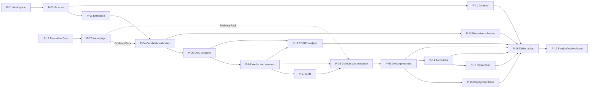
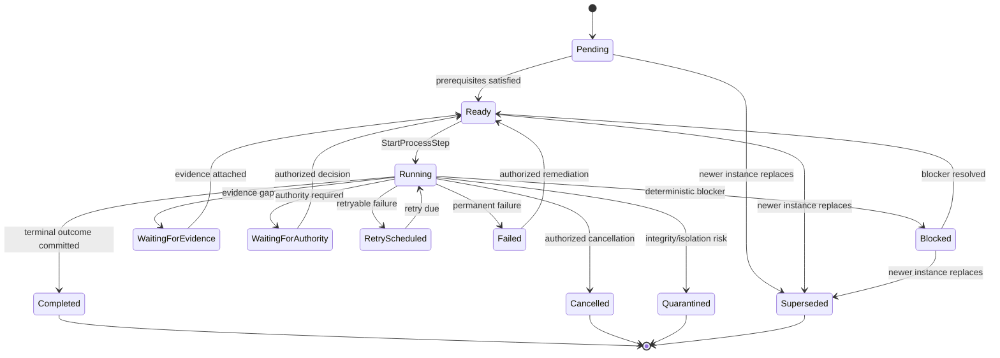
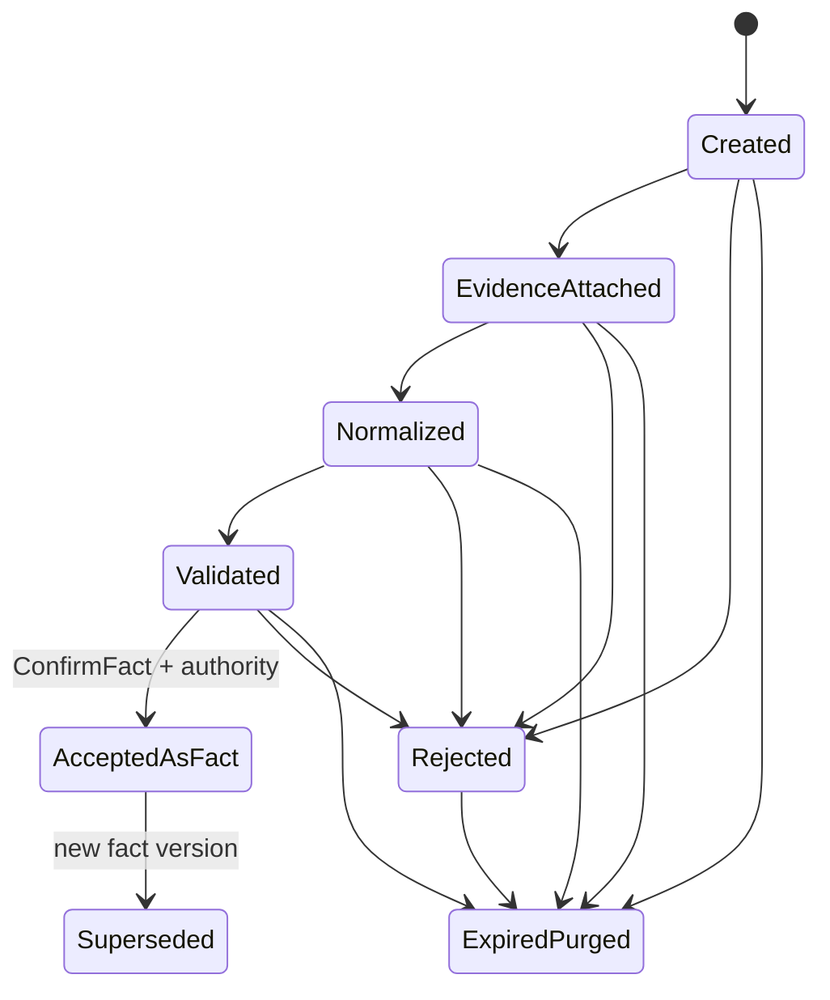
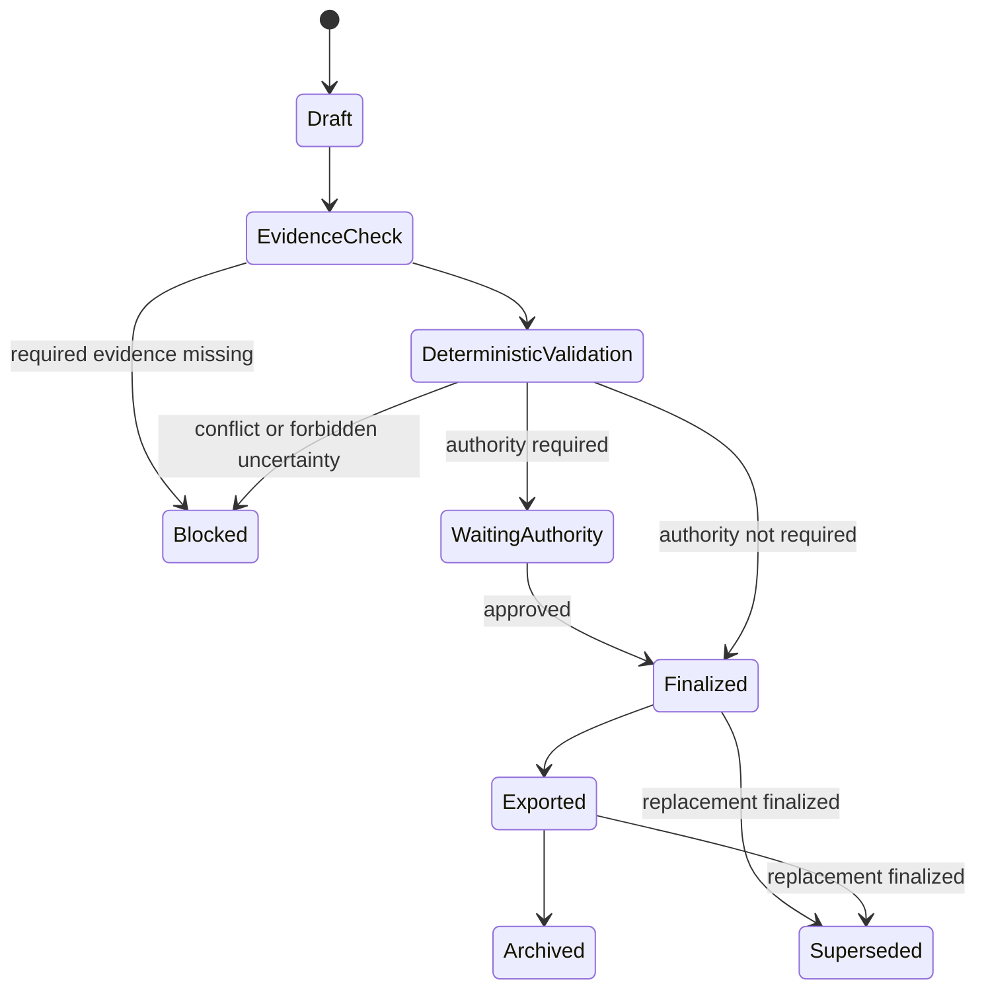

# АСД-КОНТУР — Process & Event Specification v0.1

**Статус:** `Accepted architecture baseline`

**Дата:** 2026-08-21

**Принято:** 2026-08-22 ведущим архитектором Codex по явным архитектурным
полномочиям владельца продукта; процессные контракты не реализованы этим
принятием.

**Владелец продукта:** Олег Щербаков

**Область:** объектно-независимый local-first доказательный комплекс
АСД-КОНТУР с policy-controlled provider-neutral external VLM execution; все
четыре режима `Tender`, `Support`, `Audit`, `Restoration`.

## 0. Нормативная роль и статус положений

Этот документ формально определяет сквозные процессы, команды, доменные и
интеграционные события, состояния process instance, границы оркестрации,
ошибки, повторы, конкуренцию, восстановление и связь процессов с жизненным
циклом workspace ОКС. Он является третьим артефактом очереди
`ARCHITECTURE_BLUEPRINT_v0.1.md` §11.

Документ конкретизирует, но не заменяет:

- `DOMAIN_AND_KNOWLEDGE_MODEL_v0.1.md` — канонические сущности, границы
  platform/workspace, EvidencePack, Rule Registry и Promotion Gate;
- `LIFECYCLE_AND_RETENTION_SPECIFICATION_v0.1.md` — lifecycle workspace,
  RD-01…RD-05, archive/reset/purge/destroy и Destruction Attestation;
- `KNOWLEDGE_AND_MEMORY_ARCHITECTURE_v0.1.md` — каноническое знание,
  retrieval/index plane и Knowledge Tool Gateway;
- `DOMAIN_CORE_SPEC_v0.1.md` — уже названные агрегаты, команды, события и
  инварианты общего доменного ядра;
- `TECHNICAL_ARCHITECTURE_v0.2.md` — принятое AD-02: версионированные
  канонические записи и append-only audit вместо полного event sourcing;
  его прежний VPS-primary placement superseded ADR-0008;
- `AUTHORIZATION_AND_AUDIT_MODEL_v0.1.md` — identities, atomic capabilities,
  egress authorization и audit external VLM;
- ADR-0001…ADR-0008 — ранее зафиксированные границы продукта, знаний,
  local-first hybrid VLM execution, четырёхрежимной готовности и
  MBP-primary distributed topology.

**Синхронизация IA-OD 2026-08-22.** `ProvisionWorkspace` создаёт lifecycle
boundary без единственного поля mode; каждый `CreateModeExecution`/
`ConfigureModeExecution` закрепляет mode, ProcessDefinitionVersion,
RuleSetVersion, authorities, inputs, outputs и concurrency guard. Несколько
ModeExecution одного workspace разделяют только явно разрешённые confirmed
facts. Archive import — отдельный процесс в новый workspace. Organization
overlay, field confirmation matrix и external signature verification входят
как versioned policy references; signing command в v0.1 отсутствует.

Уровни нормативной силы:

| Метка | Значение |
|---|---|
| `Invariant` | Обязательное архитектурное ограничение. Реализация, нарушающая его, недопустима. |
| `Proposed` | Проектное решение этой редакции; требует архитектурного review, но не является скрытым продуктовым выбором. |
| `Owner Decision Required` | Историческая метка; с 2026-08-22 Codex может закрыть архитектурный вариант в делегированных границах, но не evidence-dependent policy value или professional decision. |
| `Accepted` | Явно принятое владельцем решение с идентификатором, датой и подтверждением. |
| `Rejected` | Явно отвергнутый вариант. |
| `Superseded` | Историческое решение, заменённое более новым. |

Все положения о разделении command/event/audit/job/candidate, канонической
модели истины, workspace isolation, provenance, fail-closed блокировках и
границе ИИ имеют статус `Invariant`. Логический runtime-контракт принят как
architecture baseline; он не выбирает broker, workflow engine, ORM или
физическую схему.

### 0.1. Явный запрет возврата event sourcing

`Invariant`:

1. Каноническое текущее состояние читается непосредственно из доменных
   сущностей и их текущих версий; оно не вычисляется полным replay событий.
2. Значимое изменение создаёт новую доменную версию по правилам Domain Model.
3. `DomainEvent` фиксирует уже совершившийся и зафиксированный доменный факт,
   но не является единственным system of record.
4. `AuditRecord` фиксирует попытку, решение, доступ или результат контроля;
   он не является event store.
5. `Command`, `DomainEvent`, `IntegrationEvent`, `AuditRecord`, `JobStatus` и
   `Candidate` — разные типы записей с разной семантикой и retention.
6. Восстановление после сбоя использует каноническое состояние, process
   checkpoint, idempotency/deduplication records и side-effect ledger, а не
   полный replay истории событий.
7. «Детерминированный повтор» в этом документе означает повтор одного шага с
   зафиксированными typed inputs и версиями правил, а не event sourcing.

Историческое AD-02 из `TECHNICAL_ARCHITECTURE_v0.1.md`, предлагавшее
append-only event store как источник истины, имеет статус `Superseded` решением
AD-02 в `TECHNICAL_ARCHITECTURE_v0.2.md`.

### 0.2. За пределами документа

Не определяются: физические таблицы PostgreSQL, ORM, миграции, outbox/inbox
таблицы, конкретный broker, Temporal/Celery/LangGraph, транспорт API,
deployment topology, полный RBAC, календарные SLA и retention periods,
содержимое конкретных детерминированных правил и UI. ТМ-35 не определяет ни
один процесс, тип события или переход.

### 0.3. Принятое решение о границе готовности

`Accepted` — решение владельца продукта Олега Щербакова от 2026-08-21,
подтверждённое сообщением, начинающимся словами «Зафиксируй решение
владельца продукта Олега Щербакова от 2026‑08‑21» (ADR-0007):

> АСД-КОНТУР считается готовым только при сквозной готовности всех четырёх
> режимов: `Tender`, `Support`, `Audit`, `Restoration`. Поэтапная внутренняя
> разработка разрешена, но Support, ТМ-35 или любой другой отдельный режим
> не является границей MVP или готовности продукта.

Для каждого режима обязательны входы, сквозной процесс через общее ядро,
применимый `RuleSetVersion`, выходы, uncertainties/blockers, полномочия,
E2E acceptance tests и terminal condition промышленной готовности.
Следствие: успешный terminal outcome одного mode process instance не равен
готовности режима, а готовность одного режима не равна готовности продукта.

## 1. Термины

| Термин | Нормативное определение |
|---|---|
| Command | Адресованное намерение выполнить одно доменное действие. Может быть принято, отклонено до исполнения или завершиться ошибкой; само по себе не доказывает факт. |
| Domain event | Неизменяемая запись о значимом факте, уже зафиксированном успешным переходом канонического домена. Не является источником текущего состояния. |
| Integration event | Минимальное, allowlist-представление совершившегося факта для другого bounded context или внешнего адаптера. Может быть производным от domain event, но не обязано повторять его payload. |
| Audit record | Append-only доказательство попытки, доступа, решения, проверки и результата, включая отклонённые команды и чтения. Не тождественно domain event и может существовать без него. |
| Lifecycle transition | Проверяемый переход workspace или доменной сущности из одного разрешённого состояния в другое. |
| Process | Версионированная схема координации шагов для достижения доменного результата. |
| Process instance | Workspace-scoped исполнение конкретной версии process definition с собственным ID, состоянием и checkpoint. |
| Process step | Минимальная координируемая единица с preconditions, typed inputs, outcome и retry semantics. |
| Process manager / orchestrator | Координатор команд и ожиданий. Не владеет доменной истиной и не вправе обходить aggregate/rule/lifecycle guards. |
| Deterministic rule evaluation | Вычисление по типизированным входам, точным версиям правил и evidence; одинаковые входы дают одинаковый логический результат. |
| Job | Техническая попытка выполнить step/adapter operation. Job status не является статусом доменного объекта. |
| Task | Назначаемая человеку или сервису единица работы, возникающая из процесса; может требовать authority и evidence. |
| Retry attempt | Повтор того же логического действия с тем же idempotency scope после retryable failure. Не создаёт новый доменный факт без нового успешного transition. |
| Candidate | Неподтверждённое предложение OCR/VLM/LLM/parser/import/rule inference. Не является фактом. |
| Fact | Каноническая workspace-сущность, принятая разрешённой командой после evidence, rule и authority checks. |
| Decision | Версионированное действие субъекта с полномочием, основанием и последствиями. |
| Uncertainty | Явная запись о недостатке, конфликте или неопределённости данных, блокирующая только обозначенные результаты/переходы. |
| Checkpoint | Зафиксированная техническая позиция process instance после согласованного шага; не заменяет доменное состояние. |
| Failure | Неуспех исполнения после принятия команды либо отказ инфраструктуры/side effect. Отличается от command rejection. |
| Evidence / provenance | Проверяемая связь результата с SourceVersion, locator, extraction/calculation method, rule version и actor/decision. |
| Deliverable | Версионированный пользовательский результат, проходящий draft, validation, finalization и export/archive. |
| Side effect | Воздействие вне атомарного доменного transition: файл, экспорт, уведомление, индекс, внешний вызов или публикация integration event. |

## 2. Модель истины и разделение записей

| Запись | Что утверждает | Создаётся когда | Может менять домен | Источник истины | Типичный retention |
|---|---|---|---|---|---|
| Command | «Запрошено действие» | до handler | только через handler | нет | workspace/platform по scope |
| DomainEvent | «Факт уже произошёл» | после атомарного domain transition | нет | нет; отражает канон | workspace, если относится к ОКС |
| IntegrationEvent | «Разрешённый факт опубликован потребителю» | после commit и allowlist projection | нет | нет | по контракту и RD |
| AuditRecord | «Кто, что, почему и с каким outcome сделал» | для попыток, решений, чтений и переходов | нет | system of record для аудита, не домена | RD-03 allowlist после reset |
| JobStatus | «Техническая попытка в состоянии X» | при планировании/исполнении | нет | system of record только для job | operational workspace data |
| Candidate | «Механизм предложил значение» | после extraction/inference/import | нет | system of record кандидата, не факта | workspace data |
| Fact/version | «Подтверждённое каноническое состояние» | после guards и authority | это и есть домен | да | Domain/RetentionProfile |

`Invariant`: отклонённая команда создаёт `AuditRecord(CommandRejected)`, но
не создаёт domain event. Успешный материальный transition создаёт новую
каноническую версию и domain event в одной логической commit boundary;
соответствующие audit records могут быть несколькими (authorization,
rule evaluation, transition), поэтому равенство «одно событие = одна строка
audit» запрещено.

## 3. Карта процессов верхнего уровня

| ID | Процесс | Вход | Канонический выход | Общий/overlay | Связь с результатом продукта |
|---|---|---|---|---|---|
| P-01 | Workspace Provisioning | identity, режим, RetentionProfile, authority | изолированный configured workspace | общий | все |
| P-02 | Source Admission and Versioning | файл/запись/ссылка | Source + immutable SourceVersion + ledger | общий | все |
| P-03 | Source Classification and Extraction | admitted SourceVersion | candidates + extraction provenance/issues | общий | все |
| P-04 | Candidate Validation | candidate + evidence + policy | accepted fact / rejected candidate / uncertainty | общий | все |
| P-05 | ОКС Structure Formation | подтверждённые проектные факты | versioned ОКС structure | общий | 2, 3 |
| P-06 | Work Type and Volume Determination | structure, ПД/РД, confirmed facts | WorkTypeRegister + quantities/uncertainties | общий | 2, 3 |
| P-07 | Material/MTR Determination | works, specifications, facts | MTR requirements/batches/gaps | общий | 2, 3 |
| P-08 | Control and Required Evidence Determination | works, MTR, НТД, contract/customer rules | controls + evidence requirements | общий | все |
| P-09 | ID Requirement and Completeness Analysis | matrix + actual evidence | completeness/deficits/blockers | общий | 2, 3 |
| P-10 | Presented Volume/КС/Payment Trace | confirmed works/evidence/ID/KS/payment facts | traceable status and discrepancies | Support/Audit | 1, 2 |
| P-11 | Contract Risk and Disagreement Protocol | contract, ПД/РД, НТД, facts | protocol + revised contract draft | Tender/Support | 1 |
| P-12 | PD/RD Error and Collision Analysis | verified geometry/specifications/rules | collision/error/risk findings | Tender/Support/Audit | 2 |
| P-13 | Executive Scheme Formation | confirmed project and actual geometry | evidence-backed executive scheme | Support/Restoration | 3 |
| P-14 | Audit Delta Formation | required matrix + reconciled physical/logical corpus + applicable causal and package/signing/handover chains | Document Delta + Causal Readiness Delta + Package/Signing/Handover Readiness + audit findings | Audit | 1, 2, 3 |
| P-15 | Restoration of Missing Evidence | delta + lawful available evidence | restored draft or explicit unrecoverable gap | Restoration | 2, 3 |
| P-16 | Deliverable Formation and Finalization | confirmed facts/findings/uncertainties | finalized deliverable version | общий + overlay templates | все |
| P-17 | Knowledge Retrieval | typed query + scope | EvidencePack with gaps/provenance | общий | все |
| P-18 | Promotion Gate | workspace observation + evidence | published platform knowledge or rejection | общий/platform | качество всех будущих ОКС |
| P-19 | Workspace Finalization/Archive/Reset | completed processes/results + policy | archive/export, purge outcome, attestation | общий | завершение всех |

Зависимости образуют не жёсткий линейный pipeline, а доказательную сеть:



## 4. Reusable process kernel одного ОКС

Общий kernel используется всеми режимами; overlay выбирает процессы и
terminal condition, но не меняет их инварианты.

| Шаг | Вход и command | Успешный domain event | Guard/правило | Provenance/uncertainty | Side effect и failure | Lifecycle guard |
|---|---|---|---|---|---|---|
| K-01 Provision | identity, `ProvisionWorkspace` | `WorkspaceProvisioned` | уникальность workspace, authority, полный RetentionProfile | profile/version/actor | создание scoped storage может быть job; partial → quarantine | только из отсутствующего workspace |
| K-02 Configure | sources/workspace profiles, затем mode contract через `CreateModeExecution`/`ConfigureModeExecution` | `WorkspaceConfigured`, `ModeExecutionCreated/Configured` | применимые policies; supported mode, ProcessDefinitionVersion, RuleSetVersion, authority, concurrency | workspace и mode configuration versions | нет внешнего эффекта | `INITIALIZING/CONFIGURING`; несколько ModeExecution только по guard |
| K-03 Admit source | bytes/reference, `AdmitSourceVersion` | `SourceVersionAdmitted` или rejection audit | hash, type, malware/format, ownership | SourceVersion, acquisition method | blob persist/index scheduling; fail-closed | до freeze; после reopen — новая revision |
| K-04 Extract | SourceVersion, `RequestExtraction` | `ExtractionCompleted` либо `ExtractionFailed` | native text first; routing policy; immutable source; external egress только после authorization | provider/model/profile, prompt/schema/preprocessing/rendering/verification versions, field locators, validation, uncertainty | local job либо external side effect с reconciliation; failure не удаляет source | writable workspace |
| K-05 Validate candidate | candidate, `ValidateCandidate` | `CandidateValidated`, `CandidateRejected`, `UncertaintyOpened` | deterministic validation; human authority where required | evidence refs, checks, gaps | no direct external effect | writable workspace |
| K-06 Confirm fact | validated candidate, `ConfirmFact` | `FactConfirmed` | evidence, authority, expected_version | FactVersion + decision | projections scheduled after commit | writable; not frozen |
| K-07 Derive structure | confirmed facts, `BuildOksStructure` | `OksStructureVersionProduced` | completeness and conflict rules | RuleTrace + uncertainties | index refresh only | writable |
| K-08 Determine works/MTR | structure/sources, `DetermineWorksAndMtr` | `WorkRegisterProduced`, `MtrRequirementProduced` | Rule Registry, quantities, applicability | exact inputs and rule versions | job may split by bounded item | writable |
| K-09 Determine controls | works/MTR/knowledge, `DetermineRequiredEvidence` | `RequiredDocumentsDetermined` | applicable rules and exact EvidencePack | RuleTrace, source locators, gaps | retrieval telemetry only | writable |
| K-10 Evaluate mode | kernel facts, overlay command | overlay result events | mode-specific deterministic guards | findings and uncertainties | optional adapter jobs | writable |
| K-11 Form deliverable | facts/findings, `DraftDeliverable` | `DeliverableDrafted` | allowed template/version | complete provenance graph | file rendering retryable | writable |
| K-12 Validate/finalize | draft, `FinalizeDeliverable` | `DeliverableFinalized` | completeness, uncertainty policy, authority | validation report + decision | export not implied | active/frozen per lifecycle protocol |
| K-13 Freeze/finalize workspace | inventory, `FreezeWorkspace`/`FinalizeWorkspace` | lifecycle events | Lifecycle Specification | inventory/deletion-plan basis | no purge | exact lifecycle states |
| K-14 Export/archive | finalized set, `ExportWorkspace`/`ArchiveWorkspace` | integrity events | manifest and integrity verification | archive manifest/hashes | container/storage adapter; retryable | frozen/finalized only |
| K-15 Purge/reset | authorized plan, lifecycle commands | purge/reset events | RD-01…RD-04; two authorities | DestructionAttestation | destructive adapters fail-closed | exact lifecycle machine only |

### 4.1. Process invariants

1. Каждый process instance, command, workspace event, job, candidate, fact,
   task, uncertainty и checkpoint содержит обязательный `workspace_id`.
2. Process manager передаёт command aggregate handler; он не пишет aggregate
   state, candidate/fact tables или deliverable status напрямую.
3. ИИ может инициировать только candidate/job proposal. Команды подтверждения,
   финализации, PromotionDecision и destructive authorization требуют явно
   разрешённого actor/authority.
4. Process completion означает достижение terminal condition и наличие
   обязательных evidence/audit records, а не пустую очередь.
5. `blocked`, `waiting_for_evidence` и `waiting_for_authority` не являются
   `completed` или `failed`.
6. Workspace freeze запрещает новые material commands; разрешены только
   lifecycle-defined проверки, экспорт, архив, authority decisions и
   компенсации, не меняющие frozen inventory.
7. Side effect никогда не меняет канонический факт молча. Его outcome
   связывается с command/process/aggregate version.

### 4.2. P-03 hybrid VLM routing и verification

P-03 не является командой «отправить документ модели». Он координирует
проверяемую последовательность:

```text
native text assessment
→ document/page classification
→ extraction purpose
→ deterministic page/region selection
→ provider routing proposal
→ authorization decision
→ local or external execution
→ schema/field/cross-field/cross-page validation
→ bounded targeted repair when exact validator failures exist
→ validated Candidate | Uncertainty | RejectedExtraction | ProviderModelFailure
```

Router учитывает data classification, `WorkspaceEgressPolicy`, document type,
text-layer fitness, page volume, complexity, latency, cost, model qualification,
provider availability и verification profile. Локальный `Qwen3.8-27B` —
основной маршрут для сложных, конфиденциальных, юридических, интерактивных и
связанных с исполнительными схемами задач. Policy-разрешённый внешний provider
может обрабатывать массовые растровые PDF через `VlmExecutionProvider`.

External invocation — отдельный side effect с integration identity,
capability `vlm.external.invoke`, неизменяемым authorization envelope и
reconciliation ID. Cross-workspace batch запрещён. Fallback требует нового
authorization decision и не расширяет data egress. Provider не получает SQL,
workspace storage, human authority или tools. Prompt injection внутри source
не меняет provider, pages, purpose, classification, destination или policy.

По принятым `HV-01/B…HV-08/B` external execution дополнительно требует exact
`data class × purpose` allowlist, действующие provider terms/qualification,
числовой execution/repair budget и reservation в cost envelope. Fallback
выбирается только ordered pre-authorized matrix. Missing/ambiguous/expired
classification, policy, budget, qualification или envelope означает deny/
fail-closed до side effect. Repair останавливается по limit, repeated failure
fingerprint, no-progress, time/cost exhaustion или non-repairable blocker.

Local и external results имеют один логический contract, но разные provider/
model/execution provenance. Одинаковое model name не означает эквивалентность.
Согласие прогонов не подтверждает факт. Геометрия, координаты, размеры, объёмы
и юридические факты переходят в домен только после применимого
validation/confirmation process; исполнительная схема использует только
подтверждённые project/actual geometry.

## 5. Mode overlays

### 5.1. Сводная матрица

| Overlay | Цель | Обязательные источники | Добавляет/акцентирует | Может пропустить | Terminal success | Результаты продукта |
|---|---|---|---|---|---|---|
| Tender | Решить условия участия и защитить подрядчика до договора | tender docs, contract draft, ПД/РД доступной полноты, customer rules, НТД | P-11, ранние P-06…P-09/P-12, P-16 | полевые факты, KS/payment, executive scheme | финализированы evidence-backed risk/disagreement outputs; gaps явны | 1, частично 2 |
| Support | Вести доказательную цепочку исполнения | полный рабочий корпус, договор, customer rules, НТД, field evidence | P-05…P-13, P-16 | ничего из применимого kernel | требуемые deliverables сформированы; blockers/uncertainties разрешены либо явно допустимы | 1, 2, 3 |
| Audit | Установить document/evidence delta, causal impact и физическую package/signing/handover readiness существующего корпуса | фактический corpus manifest, ПД/РД, contract/customer rules, НТД, MTR/work/control/ID/KS/payment и package versions по scope | P-09, P-10, P-12, P-14, P-16 | создание operational work execution, восстановление/подмена отсутствующего evidence | финализированы три независимые delta с evidence/scope/limitations | 1, 2, 3 по scope |
| Restoration | Законно восстановить недостающее из существующих доказательств | audit delta, available archives/facts, ПД/РД, НТД | P-15, P-13, P-16 | prospective tender analysis, live construction control | восстановленный пакет или доказанный список невосстановимого; ничего не выдумано | 2, 3 |

### 5.1.1. Контракт промышленной готовности по режимам

Каждый workspace использует pinned `RuleSetVersion` по DR-01/B. Набор обязан
содержать approved/active общие правила и применимые правила конкретного
mode/profile; controlled upgrade не переписывает прежние результаты.
Отсутствие применимого правила, authority или входа даёт явный blocker/
uncertainty, а не упрощённый режим.

| Mode | Обязательные входы | Процесс общего ядра и overlay | Применимый RuleSetVersion | Выходные документы/результаты | Uncertainties и blocking conditions | Полномочия | E2E acceptance | Terminal condition режима |
|---|---|---|---|---|---|---|---|---|
| `Tender` | tender package; contract draft; доступные версии ПД/РД; customer regulations; applicable НТД; workspace/policy/authority context | K-01…K-09 + P-11/P-12/P-16 в tender scope | pinned manifest с common source/applicability/conflict rules и approved Tender contract-risk/deliverable rules | evidence-backed протокол разногласий; переработанный договор; risk/gap register; scoped PD/RD findings | missing/ambiguous terms, editions, authority or PD/RD; unresolved legal conflict; incomplete scope; всё материальное блокирует соответствующий вывод | authorized tender/legal/technical reviewers и finalizer по class/scope; model/service не утверждает | `AT-PE-41` плюс общие isolation/rule/authorization tests | все обязательные Tender outputs финализированы по утверждённому scope; blockers отсутствуют; допустимые gaps перечислены; provenance/authority/RuleTrace полны |
| `Support` | рабочий корпус ПД/РД; contract/customer rules; applicable НТД; structure/work plan; confirmed field/MTR/control/geometry evidence | K-01…K-10 + P-05…P-13/P-16 | pinned manifest с common rules и approved Support work/MTR/control/ID/KS/geometry rules | agreement/contract findings по применимости; PD/RD findings; evidence/ID packages; executive schemes; presented-volume/KS/payment trace | missing source/evidence, unsafe sequence, unapproved MTR, geometry/authority conflict, unresolved rule conflict; material blockers fail-closed | authorized engineering, PTO, control, geodesy, contract and deliverable roles by action; SoD enforced | `AT-PE-42` плюс общие suites | полный заявленный Support scope прошёл E2E от sources/facts до обязательных outputs; ни один material blocker не скрыт; schemes use confirmed geometry only |
| `Audit` | fixed audit scope; reconciled physical/logical corpus; applicable ПД/РД, contract, customer regulations and НТД; MTR/work/control/ID/KS/payment/package versions in scope | K-01…K-09 + P-09/P-10/P-12/P-14/P-16 | pinned manifest с common rules и approved Audit completeness/delta/collision/trace rules | audit report; Document Delta; Causal Readiness Delta; Package/Signing/Handover Readiness; PD/RD/volume/payment findings; Customer/PTO projections; coverage and limitation statement | unavailable/partial/mixed artifacts, sampling boundary, disputed identity/authenticity/timeliness/applicability, unresolved conflict; no claim outside scope | independent authorized auditor/reviewers and finalizer; source owners cannot self-resolve required SoD decisions | `AT-PE-43` плюс общие suites | audit scope/corpus reconciliation зафиксированы; all three deltas traced with separate denominators; downstream impact/coverage/limitations explicit; blockers resolved or terminally reported as blocking outcome; Audit не выполняет Restoration |
| `Restoration` | approved restoration scope; confirmed audit delta; lawful archives/facts/measurements; applicable ПД/РД and НТД; authority context | K-01…K-09 + P-15/P-13/P-16 | pinned manifest с common rules и approved Restoration/evidence sufficiency/geometry/document rules | evidence-backed restored drafts/schemes; provenance package; explicit unrecoverable-gap register | missing lawful evidence, unverifiable date/signature/measurement, conflicting sources, insufficient geometry; guessing prohibited | authorized restoration specialists, evidence confirmers and finalizer with required independence; model/service cannot create fact | `AT-PE-44` плюс общие suites | каждый scoped gap закрыт подтверждённым результатом либо declared unrecoverable with evidence; no fabricated fact; all outputs traced and authorized |

`ProductReady` может быть установлен только будущим отдельным authority-
controlled решением после положительного `AT-PE-45`: terminal conditions всех
четырёх режимов и общеплатформенные lifecycle/isolation/security/retention
условия выполнены. Пилотный corpus или один успешный mode run не удовлетворяет
этому guard.

### 5.2. Tender

Основные команды: `AssessTenderCorpus`, `DetermineTenderRequirements`,
`AnalyzeContractRisk`, `DraftDisagreementProtocol`, `DraftRevisedContract`,
`FinalizeTenderDeliverable`. Ключевые события: `TenderScopeEstablished`,
`ContractRiskFindingConfirmed`, `DisagreementProtocolDrafted`,
`TenderDeliverableFinalized`. Неопределённости: отсутствующая ПД/РД,
неопределённая применимость НТД, неполный contract package, неизвестные
объёмы. Неполнота не превращается в `NO_RISK`.

### 5.3. Support

Основные команды: `ConfirmWorkFact`, `RegisterMaterialBatch`,
`RecordControlEvent`, `AttachEvidence`, `EvaluateVolumeReadiness`,
`FormExecutiveScheme`, `TracePresentedVolume`. Ключевые события:
`WorkFactConfirmed`, `MaterialBatchAccepted`, `ControlEventRecorded`,
`EvidenceVerified`, `VolumeReadinessEvaluated`, `ExecutiveSchemeFinalized`.
Terminal condition зависит от выбранного deliverable scope и не равна
«очередь документов пуста».

### 5.4. Audit

Основные команды: `EstablishAuditScope`, `ReconcileAuditCorpus`,
`CompareRequiredAndActualEvidence`, `EvaluateCausalReadiness`,
`EvaluatePackageReadiness`, `CreateActionRequest`, `PerformActionRequest`,
`VerifyActionRequestClosure`, `ReclassifyDocument`, `ConfirmAuditFinding`,
`FormAuditDelta`, `FinalizeAuditReport`. Ключевые
события: `AuditScopeEstablished`, `AuditCorpusReconciled`,
`EvidenceGapDetected`, `CausalReadinessImpactEvaluated`,
`PackageReadinessEvaluated`, `ActionRequested`, `ActionPerformed`,
`ActionRequestClosed`, `DocumentReclassified`, `AuditFindingConfirmed`,
`AuditDeltaFinalized`.

`ReconcileAuditCorpus` различает physical object/file occurrence, semantic
source/version, logical-document boundary, exact page/region, render и
processing attempt. Partial/failed/unknown pages не исчезают при aggregate
status; overlapping, mixed и out-of-range boundaries блокируют accepted
inventory. Duplicate bytes не означают одинаковую identity, authority или
coverage.

`CompareRequiredAndActualEvidence` формирует `Document Delta`:
requirement ↔ found object ↔ logical source/locator ↔ extraction coverage ↔
classification ↔ integrity/version ↔ confirmed attributes ↔ applicability ↔
signer/authority. `EvaluateCausalReadiness` формирует `Causal Readiness Delta`
по exact versions: MTR/batch → incoming control → admission → work/application
→ control/evidence → ID/signing → PresentedVolume → KS → payment readiness.
Applicability остаётся three-valued; каждый разрыв содержит RuleTrace,
affected downstream entities и typed gap/conflict/blocker/uncertainty.

`EvaluatePackageReadiness` сохраняет отдельный denominator и проверяет exact
Package/Volume/Book versions, ordered memberships, registers/attachments,
required copies, professional review, signer authority/signatures, handover,
return/re-presentation и acceptance. `found`, `classified`, `included`,
`ready_for_signature`, `signed`, `handed_over` и `accepted` не являются
синонимами. Physical folder completeness не доказывает Causal Readiness; три
delta не усредняются в один показатель.

Stop-code создаёт immutable typed `ActionRequest`: инициатор, исполнитель,
affected version, action/evidence/deadline/impact и policy-qualified verifier.
Исполнение не равно закрытию; closure требует evidence и отдельную authority
decision, если policy требует инициатора/независимого verifier. Queue removal,
повторная classification и process counter не закрывают blocker. Overdue,
cancel и supersession сохраняют lineage.

`ReclassifyDocument` создаёт новую classification version, запускает validators
target type и формирует missing attributes/targeted repair/ActionRequest. Оно
не изменяет прежнюю version и не делает latest upload authoritative. Explicit
supersession, authority, effective interval и conflict reconciliation
обязательны; confidence никогда не создаёт Fact, signature или coverage.

Uncertainty сохраняет границу выборки, недоступный источник, неразрешённую
терминологию и непроверенную применимость. Audit report не объявляет полноту
вне scope, не считает file count evidence coverage, не подменяет professional
decision и не выполняет Restoration. Dashboard Customer/PTO — rebuildable
projection; исправление выполняется typed command с новой version и audit.

### 5.5. Restoration

Основные команды: `EstablishRestorationScope`, `LinkExistingEvidence`,
`ProposeRestoredArtifact`, `ValidateRestoredArtifact`,
`DeclareUnrecoverableGap`, `FinalizeRestorationResult`. Ключевые события:
`RestorationScopeEstablished`, `ExistingEvidenceLinked`,
`RestoredArtifactValidated`, `UnrecoverableGapDeclared`,
`RestorationResultFinalized`. Запрещено генерировать дату, подпись,
измерение, испытание или факт присутствия без evidence.

## 6. Command Contract

### 6.1. Envelope

```json
{
  "command_id": "cmd_01...",
  "command_type": "ConfirmFact",
  "schema_version": "1.0",
  "workspace_id": "ws_01...",
  "aggregate_type": "WorkspaceFact",
  "aggregate_id": "fact_01...",
  "expected_version": 3,
  "actor": {"subject_id": "usr_01...", "kind": "human"},
  "authority": {"role": "Engineer", "grant_id": "grant_01..."},
  "issued_at": "2026-08-21T10:00:00Z",
  "idempotency_key": "ws_01:ConfirmFact:source-candidate-77",
  "correlation_id": "proc_01...",
  "causation_id": "evt_or_cmd_01...",
  "payload": {"candidate_id": "cand_77", "decision": "confirm"},
  "evidence_refs": ["evref_01..."],
  "requested_side_effects": []
}
```

Для platform command вместо `workspace_id` обязательно
`"platform_scope": "knowledge"`; одновременно задавать оба scope нельзя.

### 6.2. Обработка команды

Порядок проверок: schema → scope/isolation → identity → authorization →
lifecycle guard → idempotency → aggregate existence/version → evidence →
deterministic rules → domain transition → durable publication intent → audit.
Порядок не означает технологию хранения, но смысловые проверки до transition
обязательны.

Outcome команды:

| Outcome | Значение | Domain event | Audit |
|---|---|---|---|
| `accepted_completed` | transition зафиксирован | да, если факт материальный | обязательно |
| `duplicate_completed` | тот же idempotency key и тот же payload уже завершён | нет нового события; возвращается прежний outcome | обязательно/ссылка на исходный audit |
| `rejected` | schema/authority/lifecycle/evidence/version guard не пройден до исполнения | нет | обязательно |
| `accepted_failed` | команда была допустима, но execution/adapter упал | только события явно зафиксированных доменных фактов; не «успех» | обязательно |
| `accepted_pending` | доменная часть принята, ожидается job/authority/evidence | событие только о реально созданной сущности/ожидании | обязательно |

`Invariant`: разные payload под одним idempotency key дают
`IdempotencyConflict`, а не дедупликацию. Неверный `expected_version` даёт
`ConcurrencyConflict`; handler не перечитывает и не повторяет изменение
автоматически. Частичный успех запрещено возвращать как общий success.

## 7. Event Envelope и публикация

```json
{
  "event_id": "evt_01...",
  "event_type": "FactConfirmed",
  "schema_version": "1.0",
  "workspace_id": "ws_01...",
  "aggregate_type": "WorkspaceFact",
  "aggregate_id": "fact_01...",
  "aggregate_version": 4,
  "occurred_at": "2026-08-21T10:00:01Z",
  "recorded_at": "2026-08-21T10:00:01Z",
  "actor": {"subject_id": "usr_01...", "kind": "human"},
  "correlation_id": "proc_01...",
  "causation_id": "cmd_01...",
  "command_id": "cmd_01...",
  "payload": {"fact_kind": "work_volume", "fact_version_id": "fv_04"},
  "provenance_refs": ["trace_01..."],
  "rule_version_refs": ["R-VOL-03@2.1"],
  "uncertainty_refs": [],
  "classification": "workspace_restricted",
  "retention_class": "workspace_domain_event"
}
```

### 7.1. Инварианты событий

1. Event immutable; correction создаёт новое событие и новую canonical version.
2. Ordering гарантируется только по `(workspace_id, aggregate_type,
   aggregate_id, aggregate_version)`. Глобального порядка нет.
3. Domain event записывается только для успешно committed факта. Rejected
   command, tool lookup и model attempt не маскируются domain event.
4. Схема события версионируется. Consumer объявляет поддерживаемые версии;
   producer не меняет смысл существующего поля задним числом.
5. Payload содержит идентификаторы и минимальный результат, но не полный
   документ, длинный текст источника, prompt/response или неограниченный model
   output. Содержимое остаётся в канонической workspace-сущности.
6. Workspace event всегда содержит `workspace_id`; platform event — только
   `platform_scope` и не содержит project evidence.
7. Integration event создаётся по отдельной allowlist projection. Redaction,
   destination и purpose входят в audit; raw domain event наружу не уходит.
8. Workspace events подчинены RetentionProfile и RD-03. После verified reset
   их content-bearing payload не сохраняется.

### 7.2. Логическая гарантия publication

Canonical transition и durable publication intent образуют одну логическую
commit boundary. Если commit состоялся, а публикация consumer-ам не успела,
process видит `publication_pending` и повторяет публикацию с тем же `event_id`.
Consumer обязан дедуплицировать. Это логический контракт будущего outbox/inbox
или эквивалента, но не решение реализовать конкретные таблицы сейчас.

## 8. Каталог событий

Во всех строках workspace scope обязателен; payload указан минимально.

### 8.1. Workspace, sources и extraction

| Event | Trigger/preconditions | Producer → consumers | Minimal payload/provenance | Retention / side effects |
|---|---|---|---|---|
| `WorkspaceProvisioned` | успешный `ProvisionWorkspace`, profile complete | Workspace aggregate → access/storage coordinators | workspace revision, organization/ОКС refs, RetentionProfile ref; actor | workspace event; создать scoped adapters; mode появится только в `ModeExecutionCreated` |
| `WorkspaceFrozen` | lifecycle inventory locked | Workspace aggregate → all process managers | freeze revision, inventory ref | workspace event; остановить material commands |
| `WorkspaceFinalized` | Lifecycle guards пройдены | Workspace aggregate → export/archive | finalized inventory ref | workspace event; разрешить export/archive |
| `WorkspaceArchived` | archive integrity verified | Lifecycle → retention scheduler | archive package ID, verification ID | workspace event; не означает purge |
| `WorkspaceResetVerified` | все adapters checked, attestation verified | Lifecycle → platform operations | attestation ID, content-free counts | allowlisted post-reset audit; никаких content refs |
| `WorkspaceDestroyed` | RD-04 authority и destroy verification | Lifecycle → platform operations | attestation ID, former workspace ID | content-free only |
| `SourceRegistered` | identity создана | Source aggregate → admission | source ID/type | workspace event |
| `SourceVersionAdmitted` | hash/type/ownership checks | Source aggregate → extraction/index jobs | version ID, hash ref, acquisition trace | schedule extraction/index; hash retention по profile |
| `SourceVersionRejected` | admission rule не пройден | Source admission → process manager | candidate/source ref, reason code | domain event только если rejection — состояние admission entity; иначе audit |
| `ExtractionRequested` | admitted immutable version; routing proposal built | Extraction process → job runner/provider boundary | source version, purpose, permitted locators, method/provider policy refs | operational; authorization required before external side effect |
| `ExtractionCompleted` | artifact persisted and schema-validated | Extraction process → candidate validation | artifact ID, provider/model/profile refs, prompt/schema/preprocess/render/verification versions, locator count, validation status | workspace; создать candidates отдельной командой |
| `ExtractionFailed` | permanent/terminal local/external attempt | Extraction process → operator/process manager | source version, provider/model profile ref, failure class, attempt/reconciliation IDs | workspace; открыть uncertainty/quarantine при необходимости |

### 8.2. Candidates, facts и rules

| Event | Trigger/preconditions | Producer → consumers | Minimal payload/provenance | Retention / side effects |
|---|---|---|---|---|
| `CandidateProduced` | parser/model/import output schema valid | Candidate service → validation | candidate ID/kind, extraction ref, confidence dimensions | workspace; не факт |
| `CandidateAccepted` | `ConfirmFact` committed candidate decision и FactVersion в одной логической boundary | Candidate/Fact aggregates → dependent processes | candidate ID, decision ID, fact version ID, evidence refs | workspace; не может существовать без `FactConfirmed` того же command |
| `CandidateRejected` | deterministic/human rejection | Candidate aggregate → process manager | candidate ID, reason code, decision ref | workspace |
| `FactConfirmed` | canonical fact version committed | Fact aggregate → dependent rule processes | fact/version IDs, kind, trace refs | workspace; refresh projections |
| `FactSuperseded` | replacement version committed | Fact aggregate → dependents | old/new version IDs, reason | workspace; stale dependent outputs marked |
| `UncertaintyOpened` | insufficient/conflicting data | owning aggregate/process → tasks/deliverables | uncertainty ID, subject, blocker scope, required inputs | workspace; create task if policy requires |
| `UncertaintyResolved` | evidence/decision resolves exact uncertainty | owning aggregate → blocked processes | uncertainty ID, resolution ref | workspace; resume exact waiters |
| `RuleEvaluationCompleted` | applicable RuleVersion evaluated | Rule engine → aggregate handler/process | RuleTrace ID, outcome code, rule refs | workspace/platform per inputs; no source text payload |
| `RuleEvaluationBlocked` | missing evidence/applicability | Rule engine → uncertainty handler | rule/version, missing inputs | workspace; open uncertainty |
| `RuleConflictDetected` | multiple applicable results conflict | Rule engine → authority/process | conflict ID, rule refs, subject | workspace; fail-closed for material output |
| `RuleConflictResolved` | `DR-03/B` ConflictPolicy либо qualified human fallback committed | conflict authority → blocked process | conflict/policy/decision versions, authority, evidence digest | scoped decision; no free-form/global precedence |
| `RuleSetUpgradePlanned` | approved target, impact preview and compatibility checks committed | workspace ruleset process → authority | source/target manifests, affected evaluation/deliverable refs | workspace; old pin remains active |
| `RuleSetUpgradeCompleted` | all new result versions and integrity/delta checks committed | workspace ruleset process → dependents | old/new pin, new result refs, verification ref | atomically adopt target pin; preserve old traces/results |
| `RuleSetUpgradeBlocked` | incompatibility, conflict, missing data or terminal workspace | workspace ruleset process → authority | source/target refs, typed blockers | old pin remains; no partial adoption |
| `RequiredDocumentsDetermined` | confirmed work types + applicability | matrix aggregate → modes | matrix revision, coverage/uncertainty refs | workspace; no document text |

### 8.3. Deliverables, promotion и lifecycle destruction

| Event | Trigger/preconditions | Producer → consumers | Minimal payload/provenance | Retention / side effects |
|---|---|---|---|---|
| `DeliverableDrafted` | allowed inputs and template | Deliverable aggregate → validation | deliverable/version IDs, kind, input snapshot ref | workspace; render job allowed |
| `DeliverableFinalized` | deterministic checks + authority | Deliverable aggregate → export | deliverable/version, validation/decision refs | workspace; immutable finalized version |
| `DeliverableSuperseded` | new finalized version | Deliverable aggregate → export/index | old/new IDs, reason | workspace |
| `PromotionSubmitted` | eligible observation before purge | Promotion aggregate → anonymization | candidate ID, applicability claim | workspace + controlled gate |
| `PromotionAnonymized` | anonymization checks complete | Promotion gate → evidence verification | capsule draft ID, redaction report | controlled gate |
| `PromotionEvidenceVerified` | Evidence Capsule sufficient | Promotion gate → regression | capsule ID, verification refs | platform candidate, no live workspace link |
| `PromotionApproved` | authorized human decision | Promotion aggregate → publish | decision ID, capsule ID | platform; never automatic |
| `PromotionRejected` | authorized decision or failed gate | Promotion aggregate → lifecycle | candidate ID, reason | workspace until purge; content-free decision may remain only per policy |
| `PromotionPublished` | approved capsule + applicability + tests | Platform knowledge → Knowledge Gateway | platform knowledge/version IDs | platform event; no project content |
| `ArchiveIntegrityVerified` | manifest/content checks all pass | archive verifier → lifecycle | package ID, manifest hash, verifier | workspace/archive policy; may advance lifecycle |
| `ArchiveIntegrityFailed` | any mandatory check fails | verifier → lifecycle/operator | package ID, failure codes | workspace; blocks purge |
| `PurgePlanned` | immutable deletion plan built | lifecycle → authorities | plan ID/version, adapter inventory digest | content-free audit reference; no content listing after reset |
| `PurgeAuthorized` | two independent authorities + legal hold clear | lifecycle → job runner | plan/version, authorization refs | content-free audit; allows plan execution only |
| `PurgeStarted` | exact authorized plan | lifecycle → adapters | execution ID, plan version | workspace until attestation |
| `PurgeAdapterFailed` | adapter incomplete/failed | adapter coordinator → lifecycle | adapter ID, failure class, residual count | content-free audit; state failed/incomplete |
| `ResetVerified` | all adapters/residual/leak checks pass | lifecycle verifier → terminal transition | DestructionAttestation ID | RD-03 allowlist only |

`IntegrationEvent` не включается автоматически в этот каталог. Для каждого
потребителя создаётся отдельный allowlist mapping из domain event с purpose,
destination, redaction и compatibility policy.

`ResetVerified` — outcome протокола очистки и проверки, создающий
`DestructionAttestation=verified`; `WorkspaceResetVerified` — последующий
переход lifecycle aggregate в состояние подтверждённого reset. Второе событие
невозможно без первого, но они не сливаются: проверка storage adapters и
изменение lifecycle имеют разные guards и audit.

### 8.4. Inter-node synchronization and recovery events по ADR-0008

Эти события описывают доставку и recovery, но не становятся event-sourced
current state. Каноническое принятие команды существует только после commit
authoritative MBP domain state; VPS `received/staged` имеет иной статус.

| Event | Trigger/preconditions | Producer → consumers | Minimal payload/provenance | Effect and failure semantics |
|---|---|---|---|---|
| `RemoteCommandReceived` | VPS authenticated exact IngressEnvelope | VPS ingress → delivery/reconciliation | envelope/version, actor+node, workspace, command schema, idempotency, digest, authorization ref, correlation | only `received`; no domain acceptance; bounded retry |
| `IngressObjectStaged` | permitted encrypted staging write verified | VPS/object adapter → MBP intake | object/version, workspace, digest/size, encryption+retention refs, transfer receipt | only `staged`; S3/VPS object is not SourceVersion admitted |
| `SynchronizationRequested` | exact source/target versions and capability authorized | source node → sync coordinator | sync attempt, direction, envelope/object refs, schema, policy | creates immutable attempt; unknown outcome retained |
| `AuthoritativeCommandAccepted` | MBP validates envelope and commits one material effect/current state | MBP aggregate → VPS/client/process | envelope/command, canonical revision, authoritative node identity, decision/audit refs | authoritative acknowledgement; duplicate returns same result |
| `AuthoritativeCommandRejected` | guard/type/version/auth/policy check fails on MBP | MBP aggregate → VPS/client | envelope/command, rejection code, expected/current version, decision ref | terminal for exact request or requires a new version; no side effect |
| `ObjectTransferVerified` | destination receipt and digest/schema/encryption checks pass | destination adapter → object ledger/process | transfer manifest/version, exact object version, receipt and verification | enables dependent guard only; does not confirm domain fact |
| `ObjectTransferFailed` | mismatch, missing receipt, access/retention failure | adapter → reconciliation/owner | transfer/attempt, failure fingerprint, residual/unknown marker | dependent material process blocked; retry linked |
| `AcknowledgementLost` | delivery outcome cannot be proven to caller | sender/transport → reconciliation | referenced command/transfer/attempt, last known state, timestamps | status `unknown`; no blind new semantic operation |
| `ReconciliationRequired` | unknown outcome, divergent receipt/version or reconnect | any node → reconciliation process | exact attempts/acks/object versions, workspace, conflict class | blocks dependent operation; no last-write-wins |
| `ReconciliationCompleted` | authoritative comparison and all required evidence resolved | reconciliation authority → requester/process | record/version, authoritative outcome, duplicate/compensation refs | resumes exact waiters; unresolved stays blocked |
| `RestoreProposed` | recovery set assembled as RestoreCandidate | recovery service → verifier | candidate, recovery point, source versions/digests, target node | never activates production state |
| `RestoreVerified` | integrity, compatibility, scope and leak checks pass | independent restore verifier → activation authority | candidate+verification IDs, adapter outcomes, fencing evidence | eligibility only; not primary activation |
| `PrimaryActivationApproved` | verified restore and independent authorized decision | qualified human authority → node control/audit | activation decision, old/new NodeIdentity, epoch/interval, fencing proof | one new primary interval; exact technical mechanism deferred |
| `PrimaryActivationRejected` | verification/authority/fencing incomplete | activation authority → recovery process | candidate, typed blockers, decision/audit refs | remains non-production `RECOVERY_REQUIRED`/`QUARANTINED` |

Transport guarantees are at-least-once-safe through scoped idempotency,
acknowledgements and reconciliation. Global ordering and exactly-once are not
promised. Fire-and-forget delivery cannot emit an event named `Accepted`,
`Verified` or `Completed`.

## 9. Process State Model

Состояние process instance не подменяет lifecycle workspace или агрегата.



| State | Назначение и допустимые действия | Запрещено | Retry/timeout/cancellation | Audit и lifecycle effect |
|---|---|---|---|---|
| `pending` | instance создан, prerequisites ещё не проверены | выполнять step | timeout не идёт до определённого trigger | create audit; lifecycle без изменения |
| `ready` | prerequisites и guards удовлетворены | считать outcome достигнутым | безопасный cancel до side effects | readiness decision audit |
| `running` | одна логическая попытка владеет lease/fencing token | конкурентный handler без expected version | heartbeat/lease только технические | start/finish attempts audit |
| `blocked` | известный deterministic blocker | blind retry | resume только после изменившегося input/rule/decision | `UncertaintyOpened` или blocker audit |
| `waiting_for_evidence` | нужен точный список evidence | гадать/подтверждать candidate | deadline создаёт escalation, не false result | evidence request audit |
| `waiting_for_authority` | решение должно принять уполномоченное лицо | агентское auto-approval | timeout → escalation/cancel по policy | authority request/decision audit |
| `retry_scheduled` | transient failure, рассчитана следующая попытка | немедленный бесконечный loop | bounded attempts/backoff/jitter из policy | attempt/failure telemetry + audit material failures |
| `completed` | terminal outcome committed и required side-effect class reconciled | повторно менять тот же outcome | duplicate command returns original outcome | domain event + audit |
| `failed` | non-retryable либо retries exhausted | считать процесс завершённым успешно | remediation создаёт новую attempt/revision | failure audit; deliverable блокируется по scope |
| `cancelled` | разрешённая отмена до/с compensation | стирать committed facts | новая instance при возобновлении | cancellation reason/authority audit |
| `quarantined` | integrity/isolation/unknown-state risk | автоматический resume/publish | только расследование и authorized recovery | critical audit; freeze affected scope |
| `superseded` | новая process revision заменила старую | выполнять новые side effects | не retry; читается для истории | link to successor; workspace retention |

### 9.1. Переходный контракт

Каждый переход задаёт command/event trigger, guard, expected state/version,
checkpoint, audit outcome и допустимую компенсацию. Deadline не превращает
`waiting_for_evidence` в `completed`; он может создать escalation task или
`failed` по явной policy. Cancellation не отменяет уже подтверждённый факт:
она прекращает дальнейшую координацию, а исправление факта выполняется новой
версией и `FactSuperseded`.

Process instance получает `workspace_id`, `process_instance_id`,
`process_definition_id/version`, `mode`, `subject_refs`, `state`,
`current_step`, `checkpoint_version`, `correlation_id`, timestamps и
`blocking_refs`. Произвольный `intermediate_data` без схемы не является
допустимым промышленным контрактом.

### 9.2. Каталог переходов process instance

| From → to | Command/event trigger | Guard | Retry/deadline | Cancellation/compensation | Audit и lifecycle |
|---|---|---|---|---|---|
| `pending → ready` | `EvaluateProcessPrerequisites` / prerequisite events | definition/version и все mandatory refs доступны | reevaluate только при новом input; deadline не завершает | cancel без compensation | readiness trace; lifecycle unchanged |
| `ready → running` | `StartProcessStep` | workspace writable/разрешённое lifecycle state, lease/fencing acquired | duplicate start возвращает active attempt | cancel до side effect | attempt start audit |
| `running → completed` | committed terminal domain event | outcome + mandatory reconciliation/checkpoint | duplicate completion идемпотентен | committed facts не компенсируются стиранием | completion audit; может открыть lifecycle guard |
| `running → blocked` | blocker/rule conflict event | exact blocker persisted | retry только после changed input | cancel allowed; no hidden resolution | blocker audit; workspace остаётся незавершённым |
| `running → waiting_for_evidence` | `UncertaintyOpened` | required evidence list non-empty | deadline → escalation, не success | cancel request task; preserve uncertainty | evidence request audit |
| `running → waiting_for_authority` | authority task created | exact authority type/grant policy | deadline → escalation | requester не может self-approve | mandatory authority audit |
| `running → retry_scheduled` | retryable job/adapter failure | retry class и attempt budget позволяют | policy backoff/jitter | cancel stops future attempt; reconcile effects | attempt failure telemetry/audit as material |
| `running → failed` | permanent failure / retry exhausted | failure classified and persisted | no automatic retry | new remediation command/process revision | terminal failure audit; deliverable guard closed |
| `running → quarantined` | integrity/isolation violation | risk scope and evidence persisted | no automatic retry/deadline override | only authorized isolation response | critical audit; affected workspace operations frozen |
| `running → cancelled` | `CancelProcess` | actor authorized; running effects reconciled or marked unknown | no retry; restart is new instance/revision | explicit compensations recorded | cancellation audit; lifecycle unchanged unless policy says otherwise |
| wait/blocked → `ready` | evidence/authority/blocker resolution event | referenced blocker exactly resolved; versions current | resume is idempotent | cancellation remains possible | resolution audit; lifecycle rechecked |
| `retry_scheduled → running` | retry timer/operator command | attempt budget, same input/effect digest, lifecycle valid | next bounded attempt | cancel before dispatch | retry start audit/telemetry |
| nonterminal → `superseded` | `SupersedeProcessInstance` | successor ID/version and reason | no retry | reconcile active effects first | supersession audit; history retained per RD |

Любой resume повторно применяет workspace lifecycle guard: process, ожидавший
evidence до freeze, не получает право продолжить material mutation после
freeze только потому, что evidence появилось позже.

## 10. Candidate Lifecycle

### 10.1. Источники кандидатов

Кандидат может создать OCR, VLM, LLM, deterministic parser, external import
или rule inference. `producer_kind` не определяет истинность. Для каждого
candidate обязательны `workspace_id`, `candidate_id`, `candidate_kind`,
`source_version_id`, exact locator, method/version, typed proposed value,
created_at и отдельные измерения качества.



| Candidate state | Условие входа | Разрешено | Запрещено |
|---|---|---|---|
| `created` | output schema syntactically valid | attach evidence, reject | использовать как факт |
| `evidence_attached` | locator/source/method exist | normalize, open uncertainty | агрегировать confidence в «истину» |
| `normalized` | canonical types/units/IDs mapped | deterministic validation | публиковать без validation |
| `validated` | checks complete; conflicts explicit | request authorized confirmation | считать human decision совершённым |
| `accepted_as_fact` | `ConfirmFact` committed canonical FactVersion | trigger dependent rules | менять fact через candidate mutation |
| `rejected` | reason/decision recorded | retain until profile trigger | повторно использовать без new revision |
| `superseded` | accepted fact has newer version | provenance read | стать current |
| `expired/purged` | RetentionProfile/lifecycle action | content-free count in attestation | восстановление из event/audit |

### 10.2. Confidence и uncertainty

Нельзя сводить к одному числу:

- `parsing_confidence` — корректность синтаксического разбора;
- `source_quality` — качество/полнота исходного носителя;
- `model_confidence` — самооценка или калиброванная метрика модели;
- `rule_certainty` — детерминированный outcome `certain/blocked/conflict`;
- `unresolved_uncertainty` — отдельные типизированные gaps.

Высокий model confidence не заменяет evidence, rule certainty или authority.
Повторение наблюдения не переводит candidate в platform rule; это возможно
только через P-18 Promotion Gate.

## 11. Deterministic Rule Evaluation Process

| Шаг | Требование | Outcome |
|---|---|---|
| R-01 Resolve applicability | выбрать RuleVersion только из pinned RuleSet по scope/workspace, effective period, mode и subject | точный набор либо `RuleEvaluationBlocked` |
| R-02 Resolve typed inputs | загрузить канонические FactVersion/SourceVersion, не candidate | immutable input snapshot refs |
| R-03 Resolve evidence | exact locator и EvidencePack; gaps не скрывать | evidence set + gaps |
| R-04 Evaluate | чистое versioned вычисление | preliminary result |
| R-05 Detect conflicts | сравнить применимые правила/источники и exact conflict group | conflict record либо none |
| R-06 Apply ConflictPolicy | только versioned subject-specific policy `DR-03/B`; иначе qualified human fallback | resolved trace либо conflict/indeterminate + block |
| R-07 Check boundaries | units, tolerances, geometry, dates, completeness | pass/block/uncertainty |
| R-08 Persist trace/result | RuleTrace + result entity/version в logical commit | canonical version |
| R-09 Emit outcome | минимальный domain event после commit | completed/blocked/conflict event |

`RuleTrace` минимум содержит rule ID/version, applicability basis,
typed input version refs, source/evidence locators, normalized units,
boundary values, result, uncertainties, computed_at и engine version. LLM не
разрешает rule conflict и не выбирает precedence. Human fallback создаёт
отдельное typed scoped decision с evidence, applicability, effective interval
и audit; оно не становится platform rule без Promotion Gate.

### 11.1. Controlled RuleSet upgrade (`DR-01/B`)

Команда `UpgradeWorkspaceRuleSet` допустима только для неархивированного,
не-reset и не-destroyed workspace. Процесс фиксирует approved target,
source/target manifests, impact preview, schema/implementation compatibility,
затрагиваемые RuleEvaluation/deliverables и authority approval. Re-evaluation
создаёт новые result versions и сохраняет прежние RuleTrace/results. До
успешной проверки всех новых результатов и атомарного commit нового pin
действует прежний RuleSetVersion. Incompatibility, unresolved conflict,
недостаточность данных или crash дают `RuleSetUpgradeBlocked`/recovery с
прежним pin; rolling adoption и частичное смешение RuleSet запрещены.

Workspace RuleVersion по `DR-04/B` участвует в evaluation только при exact
`workspace_id`, active status и включении в pinned manifest этого workspace.
Cross-workspace access, free-form override, отмена обязательной нормы более
высокой применимой authority и создание/approval моделью запрещены.

## 12. Knowledge Tool Process

```text
typed tool request
→ scope/authority validation
→ canonical exact/graph/retrieval query
→ EvidencePack assembly
→ provenance + gaps + applicability
→ optional local-model reasoning
→ Candidate
→ Candidate Validation / deterministic rule / authority
→ Fact or explicit uncertainty
```

Инварианты:

1. Модель не получает прямой SQL и не обращается к storage adapter напрямую.
2. Knowledge Tool Gateway возвращает typed `EvidencePack`, а не неразмеченный
   набор похожих фрагментов.
3. Exact/FTS/vector/sparse/reranker/graph retrieval не меняет canonical
   knowledge и не является domain transition.
4. Каждый EvidencePack содержит source versions, locators, methods,
   applicability, conflicts, gaps и query scope.
5. Ответ модели всегда Candidate/ExplanationDraft, даже если EvidencePack
   полон.
6. Tool-call telemetry, latency/cache-hit и model usage — telemetry, не domain
   events. Material access/decision может требовать AuditRecord по будущей
   Authorization & Audit Model.
7. Замена Qwen, embedding или reranker не меняет process state machine и
   canonical outcomes при тех же детерминированных правилах.

## 13. Deliverable Process



| Deliverable | Обязательные проверки до `finalized` | Особое ограничение |
|---|---|---|
| Протокол разногласий | contract/source versions, risk findings, exact clauses, authority | LLM draft не является юридическим решением |
| Переработанный договор | clause-by-clause provenance, conflicts, accepted decisions | только уполномоченная финализация |
| Анализ ПД/РД | scope coverage, rule traces, geometry/material evidence, uncertainties | отсутствие находки не означает полноту вне scope |
| Исполнительная схема | confirmed project geometry + confirmed actual geometry + coordinate/unit trace | ни одна координата не выводится из визуальной правдоподобности |
| Audit delta | required matrix revision, actual corpus inventory, scope and gaps | sampling limits remain visible |
| Restoration result | existing lawful evidence, missing/unrecoverable list | запрещено выдумывать факт, дату, подпись, измерение |

`exported` означает созданную и проверенную копию конкретной finalized version;
`archived` — включение в portable archive по RD-02. Ни то, ни другое не
удаляет operational data. `superseded` не уничтожает историю до lifecycle
retention trigger.

## 14. Idempotency, concurrency и delivery semantics

### 14.1. Базовая модель

- Доставка команд, jobs и integration events проектируется как
  **at-least-once**. `Exactly-once` не обещается: сетевой ответ может быть
  потерян после commit, а consumer может упасть после side effect.
- Идемпотентность обеспечивается `(scope, handler, idempotency_key)` и digest
  semantic payload. Результат первого завершённого исполнения возвращается
  повторно.
- Aggregate transition требует `expected_version`; конфликт не сливается
  автоматически.
- Event consumer хранит deduplication по `(consumer, event_id)` и проверяет
  aggregate version. Дубликат подтверждается без повторного side effect.
- Out-of-order event не переписывает канон. Consumer откладывает его, читает
  текущий канон либо запрашивает missing predecessor в пределах aggregate;
  глобальный replay запрещён.
- Stale candidate не подтверждается, если source/fact/rule versions изменились;
  требуется revalidation или новая candidate revision.

### 14.2. Повтор side effect

Каждый side effect получает устойчивый `effect_id`, destination, input digest,
state (`planned/running/succeeded/failed/unknown`), attempt history и result
reference. При `unknown` нельзя безусловно повторять необратимое действие:
сначала reconciliation через adapter. Export может безопасно записать новый
versioned artifact; destructive adapter исполняется только внутри exact
authorized deletion plan и обязан быть идемпотентен.

### 14.3. Crash boundaries

| Crash point | Восстановление |
|---|---|
| до domain commit | command может быть повторена с тем же key; факта нет |
| после commit, до response | dedup возвращает сохранённый outcome |
| после commit, до event delivery | publisher повторяет тот же event ID из publication intent |
| после event receipt, до consumer completion | consumer dedup + checkpoint; side-effect reconciliation |
| во время external side effect | state `unknown`; adapter probe/compensation, не blind retry |
| после checkpoint, до next command | process manager читает canonical state + checkpoint и продолжает |

## 15. Каталог ошибок

| Класс | Retry | Fail policy / process state | Event, audit, operator | Effect на deliverable |
|---|---|---|---|---|
| Validation error | нет | fail-closed, command `rejected` | audit; без domain event | не меняется |
| Authorization error | нет | fail-closed, `rejected` | mandatory security audit | не меняется |
| Lifecycle guard violation | нет | fail-closed, `rejected/blocked` | audit | блокирует запрещённый переход |
| Concurrency conflict | после reread/new command, не blind retry | `blocked` или клиентский retry | audit conflict | stale result не финализируется |
| Evidence missing | не до появления evidence | `waiting_for_evidence` | `UncertaintyOpened` + audit | material result blocked |
| Uncertainty blocking | не blind retry | `blocked` | domain event if uncertainty entity created | policy-defined block |
| Rule conflict | не автоматически | fail-closed, `blocked` | `RuleConflictDetected`, authority task | блокирует affected claims |
| Extraction failure | transient по adapter policy | retry_scheduled; permanent → failed/quarantine | terminal `ExtractionFailed`, attempts telemetry | source remains admitted; gaps visible |
| Model failure | transient bounded; fallback only approved method | retry/failed, never fact | telemetry; domain event only terminal material failure | candidate absent, uncertainty explicit |
| External system failure | bounded/reconcile | waiting/retry/failed | audit if material side effect | export/integration pending |
| Transient infrastructure failure | bounded | retry_scheduled | telemetry; audit if transition affected | no false completion |
| Permanent failure | нет | failed | terminal failure audit/event where domain-relevant | blocked or partial with explicit scope |
| Data integrity failure | только после remediation | quarantine, fail-closed | critical audit/operator | all dependent outputs blocked |
| Isolation violation | нет automatic | quarantine workspace/adapter | critical security audit | all publication blocked |
| Retention violation | нет automatic | lifecycle blocked/quarantine | mandatory audit/owner notification policy | finalize/purge/destroy blocked |
| Partial side-effect failure | reconcile/compensate | incomplete/failed | per-effect audit | no aggregate overall success |

Сбой handler-а, audit writer-а или mandatory event publication intent нельзя
превратить в success. Если audit является precondition опасной операции,
невозможность записать audit блокирует операцию. Technical telemetry может
fail-open только там, где её потеря не влияет на доказательность, безопасность,
изоляцию или retention.

## 16. Compensation и recovery

| Ситуация | Допустимый механизм | Запрещено | Условие восстановления |
|---|---|---|---|
| transient pure calculation | retry того же step | менять inputs/rule version под тем же attempt | same input digest, bounded policy |
| process restart | resume from checkpoint + canonical state | full event replay | checkpoint valid, versions reconciled |
| reversible external create | compensating delete/void command | скрывать original effect | compensation outcome recorded |
| committed incorrect fact | superseding FactVersion | UPDATE/history deletion | authority + reason + provenance |
| cancelled process | stop future commands; compensate planned effects | «отменить» подтверждённую историю | no running leases/effects unknown |
| corrupt candidate/artifact | quarantine | publish/confirm | integrity repair or authorized discard |
| stale process definition | supersede instance and migrate via explicit command | silently reinterpret checkpoints | versioned migration decision |
| destructive partial purge | retry exact adapter plan; residual scan | rollback fiction, verified status | all adapters checked, attestation verified |
| duplicate event | consumer dedup | repeat side effect | prior outcome located |
| unknown side effect | reconciliation probe, manual authority if irreversible | blind retry | destination state proven |

Полный restart шага допустим только когда step declared deterministic and
side-effect-free либо все side effects имеют reconciliation. Compensation —
новое действие, а не стирание audit/domain history.

## 17. Audit и event retention

1. Workspace domain/integration events, commands, process instances, jobs,
   checkpoints и candidates относятся к workspace memory и подчиняются
   принятому RetentionProfile (RD-01/B).
2. Portable logical archive и physical backup/PITR независимы (RD-02/C).
   Backup не является event archive и не заменяет deliverable archive.
3. После verified reset сохраняются только RD-03/A content-free audit и
   DestructionAttestation. Запрещено сохранять event payload с именами файлов,
   текстом, фактами, candidates, prompts/responses, embeddings или graph edges.
4. RD-04/C применяется к `PurgePlanned`, `PurgeAuthorized`, adapter execution
   и attestation. LLM/job/queue не подтверждают destructive command.
5. Platform event не содержит project evidence. Перенос знания возможен
   только как RD-05/B minimal Evidence Capsule через completed Promotion Gate.
6. Event payload не дублирует SourceVersion content; он ссылается на canonical
   entity и provenance refs. Это уменьшает residues, но не освобождает event
   store от residual scan.
7. Telemetry не является audit; audit не является event store; archive не
   является backup. Retention и verification применяются к каждому носителю
   отдельно по Lifecycle Specification.

Для external VLM audit дополнительно фиксирует без копирования документа:
source version, разрешённые page/region locators, integration/provider identity,
model/execution profile, purpose/classification, authorization и policy
versions, prompt/schema/preprocessing/rendering/verification versions,
request/response digests, timestamps, cost/usage, outcome, validation status,
retry/repair count и correlation/causation IDs. API keys, credentials, полный
document/prompt/response и данные другого workspace запрещены. Content-bearing
request/response artifacts остаются workspace memory и удаляются по
RetentionProfile; после reset они не переходят в platform audit.

Минимальный content-free post-reset audit может содержать workspace UUID,
operation/decision codes, actor IDs/authority, timestamps, aggregate counts,
adapter statuses, residual scan result и DestructionAttestation ID. Он не
содержит subject IDs, source hashes или human-readable project content, если
это не разрешено точным RetentionProfile; RD-03 по умолчанию запрещает такие
детали.

## 18. Минимальные роли и полномочия процесса

| Действие | Минимальный тип authority | Запрещённый единоличный субъект |
|---|---|---|
| создать/configure workspace | workspace administrator + applicable policy | LLM/queue |
| принять source version | authorized intake service/user; deterministic admission | модель без handler guards |
| принять/отклонить candidate | domain-qualified human или явно утверждённое deterministic auto-accept rule | OCR/VLM/LLM |
| подтвердить engineering/legal fact | профильный уполномоченный человек; auto только для явно разрешённого non-professional rule outcome | LLM/agent |
| подтвердить геометрию | уполномоченный инженер + evidence | VLM/генератор схем |
| finalize deliverable | назначенная роль по виду deliverable | генератор/renderer |
| review RuleVersion | independent human reviewer, не author | model/service/author |
| approve RuleVersion | другой class-qualified human approver с действующей authority | model/service/queue/reviewer без approver grant |
| разрешить controlled RuleSet upgrade | scoped authority после impact/compatibility preview | model/service/queue; terminal workspace |
| разрешить неформализуемый RuleConflict | human actor с требуемой subject/domain authority | LLM/универсальный default |
| PromotionDecision | независимый authorized reviewer | model, repeated observation, workspace process |
| freeze/finalize workspace | lifecycle authority | background job |
| export/archive | authorized operator/service внутри утверждённой policy | model |
| purge/destroy | RD-04 независимые requester и confirmer | LLM, queue, один actor в двух ролях |

Точные identity types, atomic capabilities, segregation-of-duties matrix,
external VLM egress guards и access-control audit определены проектной
редакцией `AUTHORIZATION_AND_AUDIT_MODEL_v0.1.md`. Физическое enforcement
остаётся предметом последующей Technical Architecture и реализации.

## 19. Логическое исполнение без выбора runtime

| Компонент | Ответственность | Не вправе |
|---|---|---|
| Command handler | envelope validation, guards, aggregate invocation, outcome | обходить aggregate/authority/lifecycle |
| Domain service | детерминированные инварианты и transition decision | выполнять произвольный external side effect |
| Process manager | координация commands/waits/checkpoints/compensation | владеть каноническими facts |
| Rule engine | versioned applicability/evaluation/RuleTrace | принимать professional decision |
| Knowledge Gateway | typed EvidencePack | direct domain mutation/SQL для модели |
| Job runner | технические attempts, leases, resource gating | превращать job success в domain fact |
| Event publisher | доставлять committed event/intention at-least-once | создавать факт без commit |
| Audit writer | append-only audit records | служить event store/domain state |
| External adapter / `VlmExecutionProvider` | typed minimized side effect + authorization binding + reconciliation | читать workspace storage/SQL, расширять egress, скрывать partial/unknown outcome |

Спецификация не выбирает Kafka, RabbitMQ, Temporal, Celery, LangGraph,
конкретный message broker/workflow engine или PostgreSQL-таблицы.
`TECHNICAL_ARCHITECTURE_v0.3.md` выбирает application HTTPS pull/push,
authoritative PostgreSQL transactional inbox/outbox, отдельный VPS
coordination ledger, manual offline primary activation и explicit
reconciliation. Физические таблицы и implementation остаются следующими
артефактами и не меняют этот логический контракт.

## 20. Сопоставление с текущим кодом `asd-kontur`

Ниже «реализовано» означает наблюдаемое поведение кода, а не утверждение
целевой архитектуры.

| Текущий файл | Подтверждённое поведение | Соответствие | Архитектурный пробел / действие позже |
|---|---|---|---|
| `src/asd_kontur/domain/service.py` | `run_study` выполняет детерминированные правила, создаёт matrix/uncertainties или типизированно блокирует весь запуск | сохранить принцип fail-closed и RuleTrace | это функция одного среза без workspace/process/command/event contract |
| `src/asd_kontur/domain/trace.py` | immutable `RuleTrace` с rule/version/inputs/locators/result | сохранить и расширить typed applicability/boundaries | нет workspace ID, actor/authority и durable persistence |
| `src/asd_kontur/domain/exceptions.py` | точные `StudyBlockedError` subclasses вместо общего `except Exception` | сохранить | сопоставить с общим error catalogue и audit outcome |
| `src/asd_kontur/domain/study.py` | `ExtractedCandidate` не имеет методов изменения домена | сохранить как Candidate boundary | нет lifecycle state и acceptance decision entity |
| `src/asd_kontur/domain/work_types.py`, `matrix.py`, `requirements.py` | явные candidate/confirmed/rejected/blocked statuses | сохранить семантику, не считать dataclass persistence model | текущий service автоматически ставит `CONFIRMED` по confidence/rules; промышленная authority policy ещё не определена |
| `src/asd_kontur/bridge/build.py` | чистое детерминированное построение candidates; issues вместо guess; устойчивые IDs | сохранить как extraction-to-candidate adapter | bridge не является process manager; `IssueStage` ещё не общая uncertainty taxonomy |
| `src/asd_kontur/bridge/extraction_outcome.py` | malformed record изолируется как load issue; success/failure различены | сохранить bounded failure isolation | batch success нельзя переносить на workspace completion |
| `src/asd_kontur/corpus/scanner.py` | manifest/hash и scan issues создаются детерминированно | сохранить Source Admission input | filesystem scan пока не workspace-scoped repository |
| `src/asd_kontur/ntd/fetcher.py` | success/network/http attempts записываются в manifest; одинаковые bytes идемпотентны | модернизировать в Job/Attempt + SourceVersion contract | локальный manifest не заменяет audit, command или RetentionProfile |
| `src/asd_kontur/ntd/resolver.py`, `lookup.py` | конфликт/отсутствие редакции дают точные ошибки; домен использует port | сохранить port и fail-closed applicability | Knowledge Gateway/EvidencePack ещё не реализованы |
| `tools/run_tm35_bridge.py` | CLI вручную связывает manifest → bridge → `run_study`, печатает issues/uncertainties | признать временной orchestration fixture | не переносить TM-35 paths, CLI flow или exit codes в архитектуру |
| `tests/domain/test_study_of_construction_object.py` | тестирует deterministic IDs, provenance, missing source, conflicts, uncertainty | использовать как будущие kernel fixtures | нет command/event/idempotency/workspace tests |
| `tests/bridge/test_determinism.py`, `test_isolation.py`, `test_provenance.py` | подтверждают repeatability одного шага, изоляцию повреждённой страницы и locators | сохранить | «isolation» здесь batch item isolation, не hard workspace isolation |

Зафиксированный пробел: `WorkTypeEntryStatus.CONFIRMED` сейчас может возникнуть
в `run_study` только из confidence threshold и rule outcome. Целевая модель
различает `rule_validated` и профессионально `confirmed`; автоматическое
подтверждение допустимо лишь после явной policy/authority классификации в
Deterministic Rules Catalogue и Authorization Model. Прикладной код сейчас не
изменяется.

## 21. Опыт `mac_asd`: сохранить, модернизировать, отвергнуть

`mac_asd` использован как источник накопленного опыта, не как шаблон.

| Идея/реализация | Реальный файл | Подтверждённое поведение | Риск | Решение АСД-КОНТУР | Вердикт |
|---|---|---|---|---|---|
| Четыре workflow modes и mode-specific stages | `src/agents/state_v3.py`, `src/agents/workflow_router.py` | TypedDict объединяет общий state и overlay data; router выбирает agents/stages и иногда fallback mode | монолитный mutable state, silent fallback может сменить смысл задачи | общий kernel + четыре overlays; неизвестный mode отклоняется | модернизировать |
| Последовательный PM orchestration loop | `src/agents/workflow_v15.py` | PM выбирает один документ, агент исполняет, PM оценивает и mutates state | агент/PM прямо меняют state; empty/blocked queue местами трактуется как completion; множество broad catches | process manager только координирует typed commands; terminal condition доменная | модернизировать |
| Явные step statuses и retry count | `src/agents/state_v3.py` | `PENDING/RUNNING/COMPLETED/FAILED/SKIPPED/BLOCKED`, queue item retry fields | task/job/domain statuses смешаны; arbitrary `intermediate_data` хранит retry | раздельные ProcessState, JobStatus, domain state; schema checkpoints | сохранить принцип, модернизировать модель |
| Retry после agent error | `src/agents/workflow_v15.py` | до трёх попыток, non-retryable marker, после лимита doc помечается processed | «processed failed» и завершение могут скрыть незакрытый результат; retry key не устойчивый | typed error class, bounded policy, failed не completed, idempotency/effect ledger | модернизировать |
| In-memory pub/sub | `src/core/event_bus.py` | async singleton; handlers concurrent; exceptions logged and caller continues | недолговечность, untyped payload, no workspace, subscriber failure скрыт, нет delivery/dedup | committed domain event + durable publication intent; integration allowlist and consumer dedup | отвергнуть реализацию, сохранить decoupling |
| In-memory event store/JSONL | `src/core/event_sourcing.py` | `AgentStateEvent` append в singleton, optional overwrite JSONL | фактический event sourcing без durability/workspace/concurrency; не канонический state | AD-02: canonical versions + audit + non-authoritative events | отвергнуть |
| Priority model queue | `src/core/model_queue.py` | per-model semaphore, bounded queue, priority/FIFO, RAM gate, metrics | in-memory loss after crash, no workspace/dedup/durable attempt, LLM resource status смешан с process | сохранить resource gating как job-runner concern; domain process не зависит от модели | модернизировать |
| Одностороннее завершение и write guard | `src/core/lifecycle/completion.py` | `active→completed→archived→reset_ready`; `assert_writable` fail-closed | lifecycle неполон, no reopen/error/recovery; ручной SQL status | сохранить guard/явные переходы; использовать принятую Lifecycle Specification | сохранить принцип, модернизировать |
| Dry-run и armed reset | `src/core/lifecycle/reset.py` | plan до delete, state guard, отдельная DB role; сбрасывает whole schema | whole-layer truncate не workspace independent; нет residual scan/attestation | exact deletion plan, per-workspace adapters, two authorities, residual verification | сохранить safety principles, отвергнуть whole-schema reset |
| Best-effort project cleanup | `src/core/project_lifecycle.py` | archive, registry, tracker, graph, DB, FS, web очищаются последовательно; exceptions превращаются в counts/error fields; lessons/traps сохраняются | partial cleanup может выглядеть завершённым; global knowledge переживает project без gate | fail-closed adapter coordinator + `failed/incomplete`; Promotion Gate only | отвергнуть best-effort success, сохранить inventory/dry-run |
| NetworkX/GML Evidence Graph | `src/core/evidence_graph.py` | global `nx.DiGraph`, GML save; load/save exceptions start fresh/log only; `remove_project_nodes` эвристически идёт от Document к WorkUnit | потеря/остатки незаметны, нет mandatory workspace on every node/edge, heuristic reset | graph — rebuildable projection; typed scoped nodes/edges; adapter residual scan | отвергнуть как SoR/cleanup, сохранить graph projection idea |
| Unified knowledge MCP tools | `src/mcp/knowledge_server.py` | exact/semantic/graph/lessons tools; service errors возвращают empty/error dict; tool signatures не имеют workspace scope | модель может принять degraded empty result за «ничего нет»; cross-project retrieval; tool telemetry only | typed Knowledge Gateway, mandatory scope, EvidencePack/gaps, no SQL | модернизировать |
| Global AuditLog | `src/db/models.py` | `AuditLog` содержит agent/action/input/output, без project/workspace ID | проектное содержимое остаётся глобально и нарушает reset | scoped audit; RD-03 content-free allowlist post-reset | отвергнуть schema, сохранить append-only purpose |
| Global DomainTrap/LessonLearned | `src/db/models.py` | full descriptions/context/embeddings без workspace; `LessonLearned` может быть global | project content переносится в следующую ОКС | workspace observation только до completed Promotion Gate; Evidence Capsule | отвергнуть прямую глобализацию |
| Automatic lesson mutation | `src/core/lessons_service.py` | после threshold `verification_count` lesson получает `auto_rule=True` и generated text | повторяемость/LLM text становится глобальным auto-rule без applicability/regression/approval | P-18 Promotion Gate; explicit human PromotionDecision | отвергнуть |
| Self-describing archive manifest | `src/core/archive/manifest.py` | manifest/hashes/restore records реализованы, но модуль прямо помечен отменённым координатором | копирование отменённой object layout восстановит неверную архитектуру | сохранить логические manifest/hash/integrity principles из RD-02, не код/layout | сохранить принцип, отвергнуть реализацию |
| Mode transition by copying selected fields | `src/agents/mode_transition.py` | allowlist transitions, carry-over, очистка mode fields, direct dict mutation | режимы становятся последовательными project phases, history/state may leak | overlays могут сосуществовать над одним workspace corpus; запуск нового process instance явной командой | модернизировать |

### 21.1. Главные выводы миграции

- Полезны: явные режимы, priority/resource gating, bounded retry, dry-run,
  write guard, archive manifest/hashes, typed MCP tool boundary и видимые
  blockers.
- Модернизируются: монолитный AgentState, orchestration loop, очередь,
  lifecycle, knowledge gateway и mode transitions.
- Отвергаются: event sourcing, fire-and-forget success, broad `except
  Exception` вокруг material operations, heuristic graph cleanup, global
  project-containing memory, automatic lesson-to-rule mutation и прямое
  изменение канонического state агентом.

## 22. Архитектурные решения и открытые вопросы

### 22.1. Достаточность AD-02

AD-02 в `TECHNICAL_ARCHITECTURE_v0.2.md` достаточно отвечает на главный
вопрос модели истины: полный event sourcing отменён, current state читается из
версионированных записей, audit append-only. `TECHNICAL_ARCHITECTURE_v0.2.md`
§6.2 синхронизирован с обязательным разделением этого документа: event и audit
связаны correlation/causation, но не имеют отношения 1:1; rejected command и
access audit не порождают domain event, а один transition может требовать
нескольких audit records.

### 22.2. Новые решения владельца

На уровне Process/Event Specification нет новой продуктовой развилки,
блокирующей следующий архитектурный артефакт. Следующие параметры намеренно
остаются policy data или предметом последующих документов:

`DR-01/B…DR-04/B` приняты владельцем 2026-08-21. Поэтому process contract
использует controlled RuleSet upgrade, class-qualified approval с independent
review, subject-specific ConflictPolicy с typed human fallback и строго scoped
Workspace RuleVersion как нормативные входы, а не как открытые defaults.

`HV-01/B…HV-08/B` приняты владельцем Олегом Щербаковым 2026-08-21;
подтверждение — сообщение владельца, начинающееся словами «Я, Олег Щербаков,
владелец продукта АСД‑КОНТУР, 21.08.2026 принимаю решения HV‑01…HV‑08».
Process contract использует versioned allowlist/budgets/qualification/
provider-retention/ConfirmationPolicy/fallback/cost-envelope как нормативные
входы. Точные numerical values и policy instances создаются позднее с
authority approval и не следуют из факта принятия HV.

| ID | Статус | Вопрос | Где решается / рекомендация |
|---|---|---|---|
| PE-01 | `Resolved`; HV-01/B, HV-04/B, HV-07/B приняты; exact policy instances обязательны | integration destinations; exact data class×purpose, WorkspaceEgressPolicy, provider/endpoint/model/profile, provider processing/retention и ordered fallback | Authorization Model §7 и Harness §28; missing/expired value = deny |
| PE-02 | `Proposed`, не owner-blocking | deadlines, retry limits, backoff по process/job | Operations/SLO policy; не hard-code в доменную модель |
| PE-03 | `Proposed`, не owner-blocking | точный organization-specific mapping людей на roles/grants; архитектурные identity/capability/SoD constraints уже определены | `AUTHORIZATION_AND_AUDIT_MODEL_v0.1.md`; mapping остаётся policy data |
| PE-04 | `Resolved in proposed Technical Architecture v0.3`, не owner-blocking | физический механизм atomic publication intent | authoritative PostgreSQL transactional outbox + idempotent consumer; physical schema remains Logical Data Model/implementation |

Local-first hybrid VLM execution уже принято владельцем продукта и не требует
нового owner decision; архитектурные Harness policies также приняты.
Конкретный внешний egress всё равно требует утверждённых classification,
policy, numerical budget/floors, qualification, fallback и cost-envelope
instances. Новая продуктовая развилка возникает
только при попытке ослабить default deny, human confirmation, workspace
isolation или retention, а не при заполнении разрешённых policy data.

## 23. Acceptance Test Catalogue

Код сейчас не пишется. Будущая реализация должна трассировать минимум:

| ID | Сценарий | Проверяемый инвариант |
|---|---|---|
| AT-PE-01 | duplicate command, тот же payload/key | возвращён исходный outcome; нет новой версии/event/side effect |
| AT-PE-02 | same idempotency key, другой payload | `IdempotencyConflict`, домен неизменён |
| AT-PE-03 | duplicate domain/integration event | consumer dedup; side effect один |
| AT-PE-04 | stale `expected_version` | command rejected с concurrency conflict |
| AT-PE-05 | out-of-order aggregate events | current state не откатывается; no global replay |
| AT-PE-06 | transient adapter failure | bounded retry с тем же effect ID |
| AT-PE-07 | permanent extraction failure | source остаётся, terminal failure/uncertainty видимы |
| AT-PE-08 | high-confidence AI candidate | не появляется FactVersion без rules/authority |
| AT-PE-09 | missing evidence | process `waiting_for_evidence`; deliverable не final |
| AT-PE-10 | conflicting applicable rules | `RuleConflictDetected`, fail-closed |
| AT-PE-11 | workspace A command references B aggregate | isolation rejection + critical audit |
| AT-PE-12 | workspace A event delivered to B consumer | rejected/quarantined; no projection mutation |
| AT-PE-13 | command after freeze | lifecycle rejection, no event/fact |
| AT-PE-14 | deliverable has allowed nonblocking uncertainty | final output lists exact uncertainty/scope |
| AT-PE-15 | deliverable has blocking uncertainty | finalization rejected |
| AT-PE-16 | executive scheme lacks confirmed actual geometry | finalization rejected; no inferred coordinate |
| AT-PE-17 | crash after domain commit before response | duplicate returns committed result |
| AT-PE-18 | crash after commit before event publication | same event ID delivered later |
| AT-PE-19 | crash during external side effect | `unknown` then reconciliation; no blind duplicate |
| AT-PE-20 | queue empty while blockers exist | process not completed |
| AT-PE-21 | model/embedding replacement | canonical deterministic workflow and outcomes unchanged for same inputs/rules |
| AT-PE-22 | workspace reset | content-bearing commands/events/jobs/checkpoints/candidates absent on every adapter |
| AT-PE-23 | post-reset query by workspace/event/source text/hash | no project content; only allowed content-free audit/attestation |
| AT-PE-24 | platform event after promotion | contains only approved Evidence Capsule refs, no workspace live-link/content |
| AT-PE-25 | PromotionCandidate repeats across workspaces | no auto-promotion; explicit gate/decision required |
| AT-PE-26 | audit writer unavailable before purge authorization | purge blocked fail-closed |
| AT-PE-27 | one purge adapter fails | overall outcome `failed/incomplete`, never verified |
| AT-PE-28 | retry exact authorized deletion plan | idempotent; attestation counts reconcile |
| AT-PE-29 | process resume after crash | canonical state + checkpoint used; no full event replay |
| AT-PE-30 | cancelled process with committed fact | fact remains; correction only by superseding version |
| AT-PE-31 | unauthorized human/agent finalizes deliverable | authorization rejection + audit |
| AT-PE-32 | unknown mode | command rejected, no silent fallback |
| AT-PE-33 | external VLM без WorkspaceEgressPolicy | deny до network side effect |
| AT-PE-34 | cross-workspace VLM batch | deny + critical audit; provider не вызван |
| AT-PE-35 | prompt injection меняет provider/pages/tools | immutable authorization envelope сохраняется; instruction не исполняется |
| AT-PE-36 | local provider failure вызывает external fallback | новая authorization evaluation; egress scope не расширен |
| AT-PE-37 | одинаковое model name у local/external | разные execution provenance и qualification profile |
| AT-PE-38 | VLM repair без exact validator failure или сверх лимита | repair rejected; terminal uncertainty/failure |
| AT-PE-39 | два VLM дали одинаковый ответ | остаётся Candidate до независимой validation/confirmation |
| AT-PE-40 | external VLM audit inspected | digests/versions присутствуют; credentials/full document/prompt/response отсутствуют |
| AT-PE-41 | Tender E2E на репрезентативном qualification corpus | обязательные входы и pinned RuleSet определены; protocol/revised-contract/risk outputs traced; gaps не превращены в `NO_RISK`; authority/finalization guards пройдены |
| AT-PE-42 | Support E2E через sources → works/MTR/control → evidence/ID → presented volumes/KS/payment | все применимые outputs и RuleTrace воспроизводимы; blocker останавливает material transition; executive geometry только confirmed |
| AT-PE-43 | Audit E2E: reconciled corpus → Document Delta + MTR/incoming-control/admission/work/evidence/ID/KS/payment Causal Readiness Delta + Package/Signing/Handover Readiness | physical/logical/page inventory, partial outcomes and scope явны; file count/recognition/generated candidate/confidence не означают Fact/completeness/signing; package/book/section distinct, ordered many-to-many memberships/copies/review/signer/handover/acceptance checked; ActionRequest closure requires evidence/authority; reclassification appends version/validators; no last-write-wins; each delta has its own denominator and exact version/locator/evidence/rule/authority/fingerprint; false 100% projection rejected; dashboard rebuild preserves canonical package/action state; вывод вне scope и Restoration action запрещены |
| AT-PE-44 | Restoration E2E с восстановимыми и невосстановимыми gaps | подтверждённые данные дают versioned draft; отсутствие evidence даёт unrecoverable/uncertainty, но не сгенерированный факт |
| AT-PE-45 | product readiness при трёх готовых режимах и одном failing/not-qualified | `ProductReady` отклонён; готовность возможна только при terminal readiness Tender + Support + Audit + Restoration и общих platform gates |
| AT-PE-46 | external request без exact data-class×purpose allowlist либо со stale classification | deny до side effect |
| AT-PE-47 | production profile без numerical budget/floors | не qualified; process blocked |
| AT-PE-48 | zero-tolerance qualification failure | route suspended/rejected независимо от average score |
| AT-PE-49 | provider terms changed | qualification suspended; new requests denied pending review |
| AT-PE-50 | professional-impact Candidate пытается auto-confirm | blocked; создаётся authority task по ConfirmationPolicy |
| AT-PE-51 | raw artifact reset | encrypted workspace artifact purged; audit retains only allowlisted identifiers/digests |
| AT-PE-52 | local-only profile unavailable | allowed local fallback or provider failure/unresolved; no external expansion |
| AT-PE-53 | cost envelope insufficient | no new item; controlled stop and reconciliation |

## 24. Архитектурный gate

Эта редакция принята как часть G-00 и не разрешает реализацию.
Authorization/Audit, Rules, Harness, Information Architecture, Technical
Architecture v0.3 и Implementation Plan приняты и синхронизированы. G-01,
архитектурная часть G-02 и G-03 Contract Pack закрыты; gate к persistence
implementation остаётся закрытым до отдельной authority. Production deployment
и external egress дополнительно требуют evidence-backed policy instances.

До этого запрещено создавать ORM, миграции, PostgreSQL schema/RLS,
outbox/inbox, broker/queue/workflow runtime и изменять прикладной код под эту
спецификацию.
