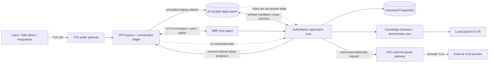

# АСД-КОНТУР — Technical Architecture v0.3

- **Статус:** `Accepted architecture baseline`; не реализовано
- **Дата:** 2026-08-22
- **Владелец документа:** ведущий системный архитектор
- **Владелец продукта:** Олег Щербаков
- **Принято:** 2026-08-22 ведущим архитектором Codex в пределах явных
  архитектурных полномочий владельца продукта; не является professional,
  production, provider-policy или implementation approval
- **Область:** единая техническая архитектура режимов `Tender`, `Support`,
  `Audit`, `Restoration`
- **Заменяет:** целевую topology и deployment-рекомендации
  `TECHNICAL_ARCHITECTURE_v0.2.md`; исторические факты v0.2 сохраняются
- **Не является:** Implementation Plan, DDL/ORM-моделью, инструкцией deploy,
  разрешением внешнего egress или заявлением о production readiness

## 0. Нормативная роль и границы

Документ материализует принятый ADR-0008 и закрывает выбор технических
вариантов `IA-TD-01` и `TA-TD-01…TA-TD-22` из
`INFORMATION_ARCHITECTURE_v0.1.md` §§6.8, 7.
`Selected` ниже означает принятый целевой технический механизм. Каждое
решение `IA-TD-01` и `TA-TD-01…TA-TD-22` прошло decision validation,
зафиксированную в `IMPLEMENTATION_PLAN_v0.1.md` §4. Принятие архитектуры не
равнозначно факту реализации, успешной эксплуатационной проверке или
production readiness.

Нормативные входы:

- ADR-0001…ADR-0008;
- `ARCHITECTURE_BLUEPRINT_v0.1.md`;
- `DOMAIN_AND_KNOWLEDGE_MODEL_v0.1.md`;
- `KNOWLEDGE_AND_MEMORY_ARCHITECTURE_v0.1.md`;
- `LIFECYCLE_AND_RETENTION_SPECIFICATION_v0.1.md`;
- `PROCESS_AND_EVENT_SPECIFICATION_v0.1.md`;
- `AUTHORIZATION_AND_AUDIT_MODEL_v0.1.md`;
- `DETERMINISTIC_RULES_CATALOGUE_v0.1.md`;
- `AI_VLM_EXECUTION_AND_VERIFICATION_HARNESS_SPECIFICATION_v0.1.md`;
- `INFORMATION_ARCHITECTURE_v0.1.md`.

`IA-OD-01…IA-OD-06` приняты 2026-08-22 в
`INFORMATION_ARCHITECTURE_v0.1.md`: logical multi-tenant model с
dedicated/shared profiles; несколько lifecycle workspaces одного ОКС с
governed ModeExecution; verified import только в новый workspace; versioned
organization overlays; risk-class confirmation matrix; проверка внешних
подписей без signing в v0.1. Конкретные deployment/policy values остаются
обязательными входами с `default deny` и не выводятся из архитектурного
решения.

## 1. Непереоткрываемые инварианты

1. MBP выполняет роль единственного active `primary_authoritative` node.
2. Canonical PostgreSQL, domain/workspace state, НТД, Rule Registry,
   Knowledge Gateway, confirmation, Promotion Gate и finalization находятся
   в authoritative core на MBP.
3. VPS является обязательным coordination/integration node, но не содержит
   независимого доменного ядра и не подтверждает факты или результаты.
4. S3-compatible storage является обязательным durable object plane, но не
   current state, не доменной БД и не executable restore.
5. AI/VLM/OCR создаёт только `Candidate`/draft; `provider success`, S3 write
   и VPS receipt не являются domain acceptance.
6. События, очередь, audit, projection, archive и backup не являются SoR
   текущего доменного состояния.
7. Все project данные сохраняют exact `workspace_id`, classification,
   provenance, authority и retention на каждой площадке.
8. Cross-workspace physical deduplication project blobs запрещена.
9. Unknown outcome требует reconciliation; fire-and-forget success,
   automatic last-write-wins и silent fallback запрещены.
10. Product readiness требует E2E-готовности всех четырёх режимов и трёх
    постоянных продуктовых результатов; ТМ-35 не определяет архитектуру.

## 2. Реестр технических решений

### 2.1. `IA-TD-01` — identifier encoding

`Selected`:

- UUIDv7 — default для новых недетерминированных persistent entity, immutable
  version, command, event, attempt, acknowledgement и decision IDs;
- UUIDv5 — только для identity, которую нормативный контракт требует
  воспроизводить из одинакового typed input; каждый тип имеет отдельный
  зарегистрированный namespace UUID и версию canonicalization;
- SHA-256 — content digest и deterministic fingerprint, но не bearer token,
  не универсальный entity ID и не основание доступа;
- external/natural identifiers хранятся как attributed versioned data и не
  становятся primary key;
- client idempotency material нормализуется в scoped fingerprint, включающий
  installation/environment, workspace/platform scope, command type, actor и
  intent version; равный сырой ключ в другом scope не совпадает.

UUIDv5 input никогда не состоит только из project content hash: обязательны
type, scope и canonicalization version. Для безопасности access grants,
session tokens и secrets используют отдельные криптографически случайные
значения и не выводятся из UUID/digest. Физический тип колонок, indexes и
constraints относится к Logical Data Model; семантика encoding уже выбрана.

### 2.2. `TA-TD-01…TA-TD-22`

| ID | Selected technical variant | Нормативный результат |
|---|---|---|
| TA-TD-01 | **A — manual offline activation**, дополненная monotonic authority epoch и доказанным fencing | автоматического promotion нет; действующий MBP продолжает локальную работу без lease от VPS |
| TA-TD-02 | **B — filtered status projection API/cache** | на VPS нет physical/logical PostgreSQL domain replica; только минимальная versioned projection |
| TA-TD-03 | **B — encrypted scoped ingress objects** | VPS принимает bounded envelope и шифрует upload потоком; plaintext не хранится |
| TA-TD-04 | **B — workspace/class/purpose quotas and TTL** | staging без применимого versioned policy запрещён |
| TA-TD-05 | **A — application HTTPS pull/push** с transactional inbox/outbox и object manifests | отдельный broker не является необходимым условием первой topology; semantics остаются at-least-once-safe |
| TA-TD-06 | **A — private overlay** | межузловой control/data plane не публикуется в Internet |
| TA-TD-07 | **VPS-only public ingress; selected MBP endpoints private-only** | публичный endpoint есть только у VPS gateway; MBP не публикует canonical API |
| TA-TD-08 | **B — mTLS node-to-node**, user TLS/auth отдельно | node identity и user delegation не смешиваются |
| TA-TD-09 | **C — hybrid envelope-key model** | node secrets находятся в OS-bound store; object DEK обёрнут versioned KEK; exact provider — deployment profile |
| TA-TD-10 | **C — client/envelope encryption plus S3 server-side encryption** | sensitive workspace objects не зависят только от S3-side encryption |
| TA-TD-11 | **B — qualified primary plus recovery location profile** | конкретные provider/region/residency остаются утверждаемым DeploymentStorageProfile; без него S3 production blocked |
| TA-TD-12 | **C — account/bucket tiers by environment, scope and purpose** | workspace isolation усиливается scoped prefixes/credentials; hash не является адресом доступа |
| TA-TD-13 | **class-specific: B for active, C for archive/backup, finite noncurrent retention for raw** | immutable version обязателен для archive/recovery; object lock не блокирует законную purge raw artifacts |
| TA-TD-14 | **C — layered logical + physical recovery set** | portable archive, logical export и physical/PITR backup остаются разными объектами |
| TA-TD-15 | **B — class/mode recovery profiles** | численные RPO/RTO являются versioned operating policy и обещаются только после измеренного drill |
| TA-TD-16 | **B — automated verification + independent human activation** | verified restore ещё не primary; activation требует отдельного решения и fencing evidence |
| TA-TD-17 | **B — bounded VPS staging during prolonged MBP outage** | canonical processing/finalization не переносится на VPS |
| TA-TD-18 | **B — VPS external-egress gateway** | внешний provider route централизован на VPS; local Qwen остаётся на MBP; каждый route квалифицируется отдельно |
| TA-TD-19 | **B — central content-minimal telemetry + protected node-local detail** | project payload, prompt/response и secret запрещены в central/VPS logs |
| TA-TD-20 | **B — signed pull releases** | arbitrary central push запрещён; compatibility gate предшествует активации |
| TA-TD-21 | **B — private-overlay JIT administration** | public remote administration MBP запрещено |
| TA-TD-22 | **B — bidirectional versioned contract sync** | field client не получает database replica; конфликт не сливается молча |

Решения `TA-TD-11` и `TA-TD-15` закрывают тип технического механизма, но не
выдумывают внешние или бизнес-значения. Provider, region, residency, цены и
численные recovery objectives оформляются как versioned policy profiles с
provenance и authority. Отсутствие профиля блокирует зависимую capability.

## 3. Контекст и размещение компонентов



### 3.1. MBP authoritative plane

| Component | Responsibility | Persistent state | Forbidden |
|---|---|---|---|
| `Authoritative API` | command/query boundary, re-authorization, optimistic concurrency, canonical acknowledgement | none outside PostgreSQL/object refs | public Internet exposure; direct route-to-table writes |
| `Application Core` | handlers for domain/process/lifecycle/rules; unit of work | PostgreSQL transactions | accepting queue/S3/provider status as Fact |
| `Canonical PostgreSQL` | current and immutable versions, policy/identity metadata, audit, inbox/outbox, object ledger | canonical relational state | multi-primary writes; use of audit/events as replay SoR |
| `Deterministic Core` | pinned RuleSet evaluation, traces, calculations and gates | rule/evaluation versions in PostgreSQL | model-authored final decision |
| `Knowledge Platform` | НТД, canonical knowledge, FTS/pgvector/typed graph projections, EvidencePack | canonical PostgreSQL + referenced platform objects | direct external-provider access |
| `Local VLM Runtime` | Qwen3.8-27B execution through provider-neutral adapter | bounded local cache/raw artifacts under policy | direct canonical writes; remote public model endpoint |
| `Sync Agent` | pull ingress, push authoritative acks/projections, object verification, reconciliation | canonical inbox/outbox and local bounded transfer state | semantic retry with a new idempotency key |
| `Backup/Restore Agent` | build recovery sets, verify RestoreCandidate | manifests, checks and content-minimal audit | primary activation |

MBP services bind to loopback or the approved private-overlay interface.
Canonical PostgreSQL accepts connections only from local application/service
identities. Neither VPS nor field clients receive SQL credentials.

### 3.2. VPS coordination/integration plane

| Component | Responsibility | State allowed on VPS | Forbidden |
|---|---|---|---|
| `Public Gateway` | TLS termination, user authentication, rate/size limits, request identity | content-minimal access/security log | canonical API, SQL proxy, public admin endpoint |
| `Ingress Service` | validate envelope schema, authorize admission class, stream-encrypt upload | bounded ingress envelope and transfer receipt | Fact/Rule/Promotion/finalization/destruction decision |
| `Coordination Ledger` | envelope delivery state, idempotency, acks, reconciliation and status projection | operational PostgreSQL or equivalent ACID store, physically separate from domain canon | domain tables or writable knowledge projection |
| `Status Projection` | serve explicitly allowed status with source checkpoint/staleness | minimum fields, expiry and canonical fingerprint | source text, EvidencePack, prompt/response, unlabelled stale state |
| `External Egress Gateway` | provider credentials, allowlist, budget reservation, request/result transport | bounded attempt metadata and encrypted temporary artifacts | direct S3 workspace browse, Knowledge Gateway, provider-to-domain write |
| `Telemetry Receiver` | content-minimal metrics/traces/events | allowlisted operational fields | project content or secrets |

The coordination ledger is not a replica. Its schema uses a different
database role and migration namespace and contains no canonical domain
aggregates. Loss of the ledger may affect remote delivery but cannot alter
MBP canonical state.

### 3.3. S3 durable object plane

S3 stores exact immutable or explicitly versioned bytes. MBP PostgreSQL stores
logical identity, scope, lineage, classification, retention, encryption/key
references, object version, digest and authoritative lifecycle state.

Logical storage tiers:

| Tier | Content | Version/lock rule | Authority |
|---|---|---|---|
| `platform-active` | official НТД/source bytes and platform artifacts | versioned; retention by platform policy | metadata/knowledge remains MBP canon |
| `workspace-active` | accepted SourceVersion, render, large evidence and finalized bytes | versioned; no cross-workspace dedup | acceptance/fact remains MBP canon |
| `workspace-raw` | HV-06 request/response/render artifacts and ingress staging | encrypted; finite TTL; version/delete-marker/multipart sweep | never canonical recovery dependency unless profile says so |
| `workspace-export` | exact export packages and manifests | immutable version after issue | export state remains MBP canon |
| `workspace-archive` | portable logical archive and manifest | versioning + governed object lock/legal hold | archive is not active workspace |
| `recovery` | PostgreSQL physical/logical backup, WAL and recovery manifests | versioning + governed lock; isolated recovery credentials | restore candidate only, never active primary |

Concrete accounts, buckets, providers and regions belong to an approved
`DeploymentStorageProfile`. Prefix-only isolation in one unrestricted
credential is invalid even if logical keys include `workspace_id`.

## 4. Runtime and dependency baseline

| Concern | Technical baseline | Boundary |
|---|---|---|
| Language/runtime | Python 3.12, dependency lock through `uv` | current reproducible baseline; upgrade requires compatibility evidence |
| Domain/application API | typed ports plus FastAPI adapter | domain package does not import FastAPI/PostgreSQL/S3 clients |
| Canonical database | PostgreSQL 18 + required extensions such as pgvector | exact extension versions pinned by release manifest; no VPS domain replica |
| Persistence evolution | forward-only versioned migrations with expand/migrate/contract discipline | schema activation is gated separately from release installation |
| Background work | authoritative PostgreSQL job/outbox records and bounded workers | Redis/broker may be added only by a later measured decision; not SoR |
| VPS operational store | separate ACID coordination database | no shared schema, credentials or backup set with canonical PostgreSQL |
| Object interface | provider-neutral S3 adapter with exact version/digest checks | bucket/provider details are deployment profile data |
| Telemetry | OpenTelemetry-compatible traces/metrics plus allowlisted structured events | protected local logs are not bulk-forwarded |
| Release | signed, immutable pull artifact with digest, SBOM and compatibility manifest | no mutable `latest` in production |

The baseline selects component responsibilities, not packaging. Native
services, virtual environments or containers may be evaluated in the
Implementation Plan, but packaging cannot change trust boundaries, stores or
authority. Historical Docker Compose/Nginx/arq placement from v0.2 is not
silently carried into the MBP primary.

## 5. Identity, authorization and trust

### 5.1. Separate identities

Every material request carries independently verifiable:

- `HumanIdentity` or calling `ServiceIdentity`/`IntegrationIdentity`;
- source and destination `NodeIdentity`;
- exact atomic capability;
- workspace/platform scope;
- command/object/provider purpose;
- policy and schema versions;
- correlation, causation and idempotency identifiers.

VPS authenticates a user but does not make the final domain authorization.
It creates a signed, short-lived `IngressDelegation` containing actor identity,
authentication assurance, requested capability, exact scope, request digest
and expiry. MBP verifies the signature, freshness and revocation state and
re-evaluates current canonical policy before acceptance. Stale delegation is
rejected; it is never refreshed by VPS on behalf of the user without a new
authentication event.

### 5.2. Network trust

1. Public traffic terminates only at the approved VPS gateway on TLS 443.
2. MBP/VPS control and data APIs are reachable only on a private overlay.
3. Every node-to-node session uses mTLS and validates role, installation ID,
   certificate purpose, revocation and validity; overlay membership alone is
   insufficient trust.
4. MBP initiates ingress pull and acknowledgement/status push where possible;
   there is no public inbound route to canonical services.
5. S3 and external providers are reached over authenticated TLS with exact
   destination allowlists. Redirect to an unapproved host is denied.
6. Administrative access to MBP uses a distinct private-overlay endpoint,
   just-in-time human grant, MFA-capable identity and content-minimal audit.

### 5.3. Secrets and object encryption

- Node private keys and bootstrap credentials reside in OS-bound protected
  stores; configuration files contain references, never secret material.
- Each sensitive object uses a random DEK. Ciphertext and encryption metadata
  are stored in S3; the DEK is wrapped by a versioned KEK for the exact
  scope/purpose and, where required, a separately governed recovery KEK.
- S3 server-side encryption remains defense in depth and does not replace
  envelope encryption.
- VPS ingress encrypts upload as a stream. Plaintext is neither written to
  disk nor logged; unencrypted multipart/object completion is impossible.
- Rotation creates a new key version and rewrap plan. Silent destructive
  re-encryption is forbidden; old key retirement waits for inventory and
  recovery verification.
- Secrets, raw keys and access tokens never appear in audit, telemetry,
  archive manifests or support bundles.

Exact secret/KMS products are selected in `DeploymentSecurityProfile` after
recovery and threat-model testing. Until it exists, production inter-node
movement and sensitive S3 writes remain blocked.

## 6. Inter-node protocol

### 6.1. Envelope rules

All commands and objects use the contracts from Information Architecture:
`IngressEnvelope`, `ObjectTransferManifest`, `SynchronizationAttempt`,
`Acknowledgement`, `ReconciliationRecord` and `ReplicaProjectionVersion`.
Wire representation is canonical JSON with an explicit `schema_id` and
`schema_version`; binary payload is never embedded when an exact object
version reference is required.

Required transport fields:

| Field group | Required semantics |
|---|---|
| Identity | immutable envelope/transfer/attempt ID; semantic idempotency key |
| Scope | installation, environment and exact `workspace_id` or platform scope |
| Actor | actor/service/integration identity plus source/destination NodeIdentity |
| Intent | command/object purpose, capability, classification, schema version |
| Integrity | payload or canonical-manifest SHA-256, size and exact S3 version when applicable |
| Policy | authorization/delegation, retention, encryption and route profile versions |
| Causality | correlation/causation and previous canonical version/precondition |
| Time | created/received/expires timestamps; timestamps do not resolve conflicts |

### 6.2. Delivery state machines

Ingress envelope:

```text
received_on_vps
  → staged
  → delivered_to_mbp
  → authoritative_accepted | authoritative_rejected
  → acknowledged_to_origin

any uncertain edge → unknown → reconciliation_required
expired/revoked/policy_mismatch → rejected_or_quarantined
```

Object transfer:

```text
planned → streaming → provider_receipt → digest_verified → linked_or_rejected
                        └──────── unknown/failed → reconciliation_required
```

Only `authoritative_accepted` after canonical MBP commit may be presented as
domain acceptance. `received`, `staged`, `provider_receipt`,
`digest_verified` and `delivered_to_mbp` are operational facts only.

### 6.3. Transactional inbox/outbox

- VPS atomically records idempotency, envelope state and staging receipt in
  its coordination ledger before returning `received/staged`.
- MBP atomically records inbox identity, command outcome, canonical revision,
  audit reference and outgoing authoritative acknowledgement in one database
  unit of work.
- A duplicate semantic idempotency key with the same digest returns the
  stored result. The same key with a different digest is a security/conflict
  failure.
- Outbox dispatch may repeat. Consumers deduplicate by message identity and
  verify the immutable digest.
- No global event ordering or exactly-once transport is promised. Ordering is
  checked only through aggregate/workspace version preconditions.

### 6.4. HTTPS resources

Exact URL prefixes are implementation details, but the logical resources are:

| Resource | Direction | Result |
|---|---|---|
| ingress submit/status | client → VPS | non-authoritative receipt/status |
| envelope pull | MBP → VPS | bounded batch of immutable envelopes |
| authoritative acknowledgement | MBP → VPS | accepted/rejected canonical version |
| projection publish | MBP → VPS | versioned minimum status snapshot |
| reconciliation query/resolve | MBP ↔ VPS | exact attempts/receipts/outcome; no blind replay |
| external execution submit/result | MBP ↔ VPS egress gateway | provider attempt only |
| health/readiness | node-local/private | component capability, not product readiness |

API errors are typed. A network timeout yields `unknown`, not an inferred
failure or success. Retry policy uses bounded exponential backoff with jitter,
deadline and attempt link; numerical values belong to the route profile.

## 7. Canonical data and projections

### 7.1. Canonical PostgreSQL

Canonical records are partitioned logically by platform/organization/workspace
scope and guarded at repository, service and database-policy layers. Exact
table design and RLS DDL belong to the Logical Data Model and implementation,
but every canonical write must enforce:

- stable identity and immutable version;
- expected current version/optimistic concurrency;
- exact workspace/platform scope;
- actor, capability and policy decision;
- provenance/lineage and evidence links;
- append-only audit reference;
- transactional outbox where an external acknowledgement is required.

PostgreSQL backups, WAL and a restored cluster do not carry active
`AuthoritativeNodeIdentity` by themselves.

### 7.2. VPS status projection

The only initial remote projection is a minimum status/read model. It may
contain opaque identifiers, mode/process state, capability status, counts,
timestamps, blocking codes, canonical checkpoint/fingerprint and expiry. It
must not contain source text, extracted values, EvidencePack, document names
that disclose content, raw AI artifacts or secrets unless a later explicit
projection schema is separately authorized.

Every response includes `projection_version`, `source_checkpoint`,
`generated_at`, `expires_at` and `stale`. After expiry, VPS may report stale
status but may not present it as current. Projection is fully rebuildable and
has no command writer.

### 7.3. Retrieval and graph plane

FTS, pgvector, sparse and typed graph representations are rebuildable
projections on MBP. Each has a source fingerprint, schema/model version,
workspace/platform scope and rebuild status. A partial or stale index may
degrade retrieval but cannot change canonical applicability, confirmation or
RuleSet outcome. Initial v0.3 places none of these projections on VPS.

## 8. Ingress and object admission

### 8.1. Upload while MBP is online or offline

1. VPS authenticates actor, checks route, class, size, quota and staging TTL.
2. It creates an immutable `IngressEnvelope` and `ingress_object_id`; this is
   not a `SourceArtifactId`.
3. Bytes are stream-encrypted under a workspace/purpose DEK and written to the
   staging tier with an exact provider version and digest.
4. VPS records `staged/pending_authoritative_acceptance` and returns only that
   status.
5. MBP pulls envelope/manifest, re-authorizes, reads the exact ciphertext
   version, verifies encryption metadata, plaintext digest, schema/media and
   malware/content admission gates.
6. If accepted, MBP creates canonical SourceArtifact/SourceVersion identity,
   moves or copies ciphertext into the active tier under a new authorized
   manifest, commits object ledger + domain state, then acknowledges VPS.
7. Staging residue is deleted only after accepted/rejected acknowledgement
   and retention rules; deletion covers versions, multipart remnants and
   receipts.

If quota, TTL, encryption profile, destination object identity or S3
availability is missing, file ingress is denied. Metadata-only bounded
commands may still be received if their own policy permits.

### 8.2. S3 authorization

Application services never receive account-wide credentials. Each operation
uses a role or short-lived grant restricted to environment, tier,
workspace/platform scope, exact operation and, when supported, object version.
Listing another workspace is denied without revealing existence. Object keys
use opaque IDs and versions; digest is metadata, not a shared cross-workspace
path.

Admission is complete only after S3 provider receipt, exact-version read or
head verification, digest verification and canonical MBP commit. Any missing
step remains `unknown`, `failed` or `pending`, never accepted.

## 9. External VLM route

The selected production external route is:

```text
MBP Harness/Router
  → authorization + HV-01…HV-08 + budget reservation
  → minimized exact request over mTLS
  → VPS External Egress Gateway
  → allowlisted provider/model/profile over TLS
  → immutable ProviderExecutionResult
  → MBP schema/digest/provenance validation
  → Candidate lifecycle and required confirmation
```

Properties:

- Provider credentials are held by the VPS egress identity, not the model,
  browser, field client or MBP application config.
- VPS receives only minimized authorized pages/regions and exact purpose. It
  cannot browse PostgreSQL, Knowledge Gateway or S3 workspace namespaces.
- Each `(provider, model revision, execution profile, VPS route identity,
  preprocessing, prompt, output schema, verification profile)` requires its
  own qualification result. Qualification from MBP-direct or another node is
  not inherited.
- Provider HTTP success creates only `ProviderExecutionResult`. MBP must
  verify and transform it into Candidate; human/rule authority remains
  unchanged.
- Request/response/raw artifacts are encrypted workspace memory under HV-06.
  Central logs store IDs, versions, digests, policy/outcome and cost only.
- If VPS or the qualified route is unavailable, external execution is
  `blocked/degraded`. Local Qwen may be selected only by the already approved
  routing/fallback policy and a separately qualified local profile; this is
  not silent fallback.

No production external execution is permitted until exact provider terms,
egress allowlist, numerical budgets/floors, ConfirmationPolicy, raw-artifact
policy, cost envelope and route qualification are approved and active.

## 10. Availability and degraded semantics

| State | Available | Explicitly blocked/degraded |
|---|---|---|
| MBP+VPS+S3 healthy | authorized local/remote capabilities | none inferred; each operation still requires its gates |
| VPS unavailable | local canonical work and local Qwen on available objects | remote ingress/UI/integrations/external VLM/status; no loss of canonical authority |
| S3 unavailable | canonical metadata work not requiring object read/write | new durable source admission, required object fetch, export/archive/backup and gates requiring S3 receipt |
| MBP unavailable | VPS bounded encrypted staging and stale-labelled status | canonical acceptance, facts, rules, Promotion, finalization, lifecycle/destruction authorization |
| MBP+VPS unavailable, S3 healthy | stored objects and recovery material remain durable | S3 cannot expose a current application or activate primary |
| lost acknowledgement | immutable attempt retained | dependent operation waits for reconciliation; no new semantic retry |
| conflicting primary claim | protected reads needed for investigation only | all canonical writes; state `RECOVERY_REQUIRED` or `QUARANTINED` |

Capability health uses `available`, `degraded`, `blocked`, `pending`,
`reconciliation_required` and `recovery_required`. A component healthcheck is
never evidence that a mode, product result or whole product is ready.

## 11. Backup, recovery and primary activation

### 11.1. Recovery set

A valid recovery set is a versioned manifest linking:

- PostgreSQL physical base backup and continuous WAL/PITR interval;
- independently readable logical export for structural verification;
- object-ledger checkpoint and exact required S3 object versions;
- schema/release/extension compatibility manifest;
- RuleSet/policy versions and platform/workspace scope inventory;
- encrypted key-recovery material references, never raw keys;
- audit integrity checkpoint;
- adapter/residue inventory and verification result.

Portable workspace archive is not a substitute for this set. Recovery backup
is not a portable archive and does not satisfy RD-02 by existence.

### 11.2. Backup creation

1. MBP establishes a database recovery checkpoint and object-ledger barrier.
2. Physical/PITR and logical layers are created under separate operation IDs.
3. Each artifact is encrypted, uploaded to the isolated recovery tier and
   read-verified by exact version/digest.
4. Manifest is finalized only when all mandatory members and key-recovery
   references are verified.
5. A scheduled restore drill creates an isolated candidate and checks actual
   readability; backup job success alone is insufficient.

### 11.3. Restore and activation

```text
RecoverySet
  → RestoreCandidate on isolated replacement hardware
  → automated RestoreVerification
  → independent verification review
  → fencing of previous primary
  → PrimaryActivationDecision by authorized human
  → new monotonic authority_epoch
  → node credentials/projections/routes activated
```

`RestoreVerification` must check database/object integrity, schema/release
compatibility, audit checkpoint, object references, workspace isolation,
cross-workspace leakage, pinned RuleSetVersion, lifecycle/retention state,
required projection rebuild and key recovery. Failure or missing adapter keeps
the candidate non-production.

Initial v0.3 uses manual offline activation, not a distributed lease. Fencing
evidence includes positive isolation/stop of the previous canonical writer,
revocation of its VPS/S3/node credentials and inability to reach production
write routes. If the old node cannot be proven fenced, the new node is not
activated. A signed `PrimaryActivationDecision` binds logical installation,
new NodeIdentity, previous/new epoch, verified candidate and activation time.

The active MBP does not require a live VPS lease to continue local canonical
writes. This preserves local-first operation but deliberately trades automatic
failover for a stricter manual recovery procedure.

### 11.4. RPO/RTO profiles

The selected mechanism is class/mode-specific `RecoveryObjectiveProfile`, not
one undocumented global promise. Each profile contains scope/class, maximum
data loss, restoration deadline, dependency assumptions, measurement method,
owner, version and validity interval.

Before measured profiles are approved:

- no numeric production RPO/RTO is advertised;
- S3-backed source admission requires verified durable write, so an admitted
  object may not rely on a later best-effort upload;
- backup/recovery capability is `blocked` until a full restore drill passes;
- mode readiness is blocked if any mandatory class lacks an applicable
  measured profile.

## 12. Observability, audit and operations

### 12.1. Content-minimal telemetry

Central telemetry allowlist contains service/node identity, operation and
correlation IDs, schema/policy versions, status/failure code, duration,
attempt/count/byte metrics, digest where explicitly required and cost units.
It excludes filenames containing project meaning, document text, extracted
values, prompts, responses, credentials, access tokens and object bytes.

Detailed protected diagnostic logs may stay node-local under scoped support
authorization and finite retention. Export to VPS requires a separate
sanitization transform and manifest. Telemetry schema violation is a security
incident and can quarantine the emitting component.

### 12.2. Signed pull releases

Each release has immutable version, source revision, artifact digests, SBOM,
dependency lock, migration/schema range, wire-contract range, model/profile
compatibility and signature. MBP and VPS pull from an approved release source,
verify locally, run preflight and activate separately. A release is not
activated when wire/schema ranges do not overlap. Rollback uses another signed
activation or forward repair; production schema is not downgraded destructively.

Configuration is versioned separately from secrets. Policy activation is an
audited command with expected prior version. Update failure leaves the previous
verified release active or marks the node blocked; mixed incompatible nodes do
not synchronize.

### 12.3. Remote administration

Remote administration is disabled by default. A session requires private
overlay, named human identity, just-in-time capability, strong authentication,
time bound, target NodeIdentity and audit correlation. It may not tunnel a
public PostgreSQL/model/admin endpoint. Break-glass access uses a distinct
capability, reason and post-event review.

## 13. Field/offline synchronization

Field clients exchange typed, versioned domain operation envelopes and exact
object manifests through VPS; they never replicate canonical PostgreSQL.

- Download is an authorized snapshot/projection with source checkpoint,
  scope, expiry and permitted offline operations.
- Upload has stable `operation_id`, expected base version, actor/device
  identity, evidence locator/digest and local sequence for diagnostics only.
- MBP validates each operation independently against current canonical state.
- Non-overlapping operations may be accepted individually; concurrent or
  semantically conflicting changes become typed conflicts.
- Automatic last-write-wins, timestamp winner and silent field merge are
  forbidden.
- Unreadable field, unknown work type and normative collision stop at the
  human/authority boundary defined by domain specifications.

Exact client storage, UX and conflict-resolution workflows belong to a later
field-client design, but the envelope contract is mandatory for all four
modes where offline capture applies.

## 14. Retention and destruction across three nodes

Every physical adapter is registered in the `Storage Adapter Registry` with
supported scopes/classes, enumeration method, delete method, residue types,
receipt format, credential identity and verification version. Mandatory
adapters include:

- MBP canonical PostgreSQL, WAL, local object/cache/temp/render/raw/recovery;
- VPS coordination database, queues/in-flight/retry/DLQ, staging,
  multipart/temp, logs and protected diagnostic stores;
- S3 active, raw, export, archive, recovery tiers, all versions,
  delete markers, multipart remnants and replicated copies;
- external-provider residues under applicable terms.

Archive, backup, reset and destroy are separate commands, authorities and
evidence. `DestructionAttestation=verified` is impossible if a required
adapter is unavailable, untrusted, not scoped to the exact deletion plan, or
reports an unresolved residue. Empty VPS queue, S3 delete request and cleaned
MBP filesystem are each insufficient by themselves.

## 15. Acceptance architecture tests

| ID | Scenario | Required observable result |
|---|---|---|
| TA-AT-001 | VPS unavailable, MBP/S3 healthy | local canonical work continues; remote capabilities explicitly degraded |
| TA-AT-002 | S3 unavailable during new source admission | no SourceVersion acceptance or false success; exact operation blocked/pending |
| TA-AT-003 | MBP unavailable, upload reaches VPS | only encrypted bounded staging; response `pending_authoritative_acceptance` |
| TA-AT-004 | same command delivered twice | one semantic effect; identical authoritative result returned |
| TA-AT-005 | same idempotency key, different digest | conflict/security rejection; no side effect |
| TA-AT-006 | acknowledgement lost after MBP commit | `unknown` then reconciliation returns stored canonical outcome |
| TA-AT-007 | two nodes claim active primary | canonical writes denied; `RECOVERY_REQUIRED`/`QUARANTINED` |
| TA-AT-008 | restore on replacement hardware | candidate remains non-production until full verification, fencing and human activation |
| TA-AT-009 | old primary cannot be fenced | activation rejected regardless of restore integrity |
| TA-AT-010 | workspace A S3 credential requests workspace B | deny without existence disclosure; critical audit |
| TA-AT-011 | S3 logical delete leaves version/multipart | destruction incomplete; residue enumerated |
| TA-AT-012 | VPS staging TTL/quota profile missing | upload denied before persistence |
| TA-AT-013 | stale VPS status projection | response explicitly stale/expired; never current authoritative status |
| TA-AT-014 | revoked/unknown NodeIdentity | payload movement denied before transfer |
| TA-AT-015 | external route changes execution node | inherited qualification rejected; new route qualification required |
| TA-AT-016 | provider returns valid JSON/HTTP 200 | only ProviderExecutionResult; Candidate/Fact absent until MBP verification |
| TA-AT-017 | central log contains project payload/secret | telemetry schema failure, quarantine/incident and purge workflow |
| TA-AT-018 | incompatible node release/schema range | synchronization blocked; prior compatible release remains or node stops |
| TA-AT-019 | field conflict after offline edit | typed conflict; no last-write-wins or silent merge |
| TA-AT-020 | backup job succeeds but restore drill fails | recovery capability remains blocked; no RPO/RTO readiness claim |
| TA-AT-021 | one mandatory destruction adapter unavailable | attestation `not_checked/incomplete`, never `verified` |
| TA-AT-022 | all component healthchecks pass | product/mode readiness is not inferred; E2E acceptance remains separate |

These tests are architecture contracts for the Implementation Plan. They are
not implemented by this document and do not replace RD/DR/HV/IA acceptance
catalogues.

## 16. Implementation gates and sequencing

Technical Architecture v0.3 does not authorize implementation. Before any
production deployment or external data movement, at minimum:

1. G-00 подтверждает accepted architecture baseline и согласованность
   `IA-OD-01…IA-OD-06`, `IA-TD-01`, `TA-TD-01…TA-TD-22`;
2. Logical Data Model defines physical identities, constraints, RLS/isolation,
   canonical versioning, inbox/outbox, audit and object ledger without
   weakening this document;
3. Implementation Plan traces vertical slices and all acceptance catalogues;
4. G-02 принимает versioned deployment/policy profile pack и фиксирует каждый
   отсутствующий production value как `UNSET/BLOCKED`; конкретный production
   deploy/route дополнительно требует active `DeploymentStorageProfile`,
   `DeploymentSecurityProfile`, `RecoveryObjectiveProfile`, route/egress и
   numerical Harness instances с provenance;
5. threat model, restore drill, cross-workspace isolation and content leakage
   tests pass in a non-production environment;
6. G-03 принимает machine-readable Contract Pack; implementation start после
   G-01…G-03 отдельно авторизован.

Recommended implementation sequence after those gates:

1. canonical identity/scope/version/audit and local MBP transaction boundary;
2. provider-neutral object ledger and S3 adapter with exact-version receipts;
3. VPS coordination ledger plus envelope inbox/outbox and status projection;
4. mTLS/node enrollment, delegation and encrypted ingress staging;
5. reconciliation and failure injection;
6. backup/restore verification and manual primary activation drill;
7. VPS external-egress route under approved HV profiles;
8. field/offline contract sync;
9. E2E proof for all four modes and three permanent results.

## 17. Completeness and non-claims

This document closes the technical choice for `IA-TD-01` and every
`TA-TD-01…TA-TD-22`,
maps MBP/VPS/S3 responsibilities, defines trust and encryption boundaries,
inter-node delivery/reconciliation, object admission, external egress,
backup/restore/fencing, operations, field synchronization and testable failure
semantics.

It deliberately does **not**:

- choose an S3 vendor/region, KMS vendor or numeric business SLO without
  approved policy evidence;
- create a PostgreSQL replica or alternative domain SoR on VPS;
- promise exactly-once, automatic failover or universal offline capability;
- define ORM, DDL, bucket names, credentials, DNS, firewall rules or deployment
  commands;
- change application code, dependencies, runtime services or external systems;
- declare any mode or the product production-ready.

The accepted execution sequence is defined by **Implementation Plan v0.1**.
G-01 is closed by `LOGICAL_DATA_MODEL_v0.1.md`; G-02 is closed as a complete
fail-closed profile contract by
`DEPLOYMENT_AND_POLICY_PROFILES_v0.1.md`, while concrete production instances
remain blocked. The next normative artifact is G-03 Contract Pack.
Implementation remains closed until G-03 passes and explicit authorization is
recorded; deployment/egress additionally require active production instances.
